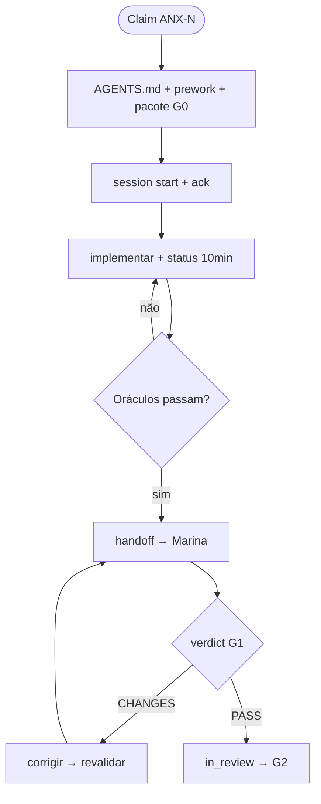
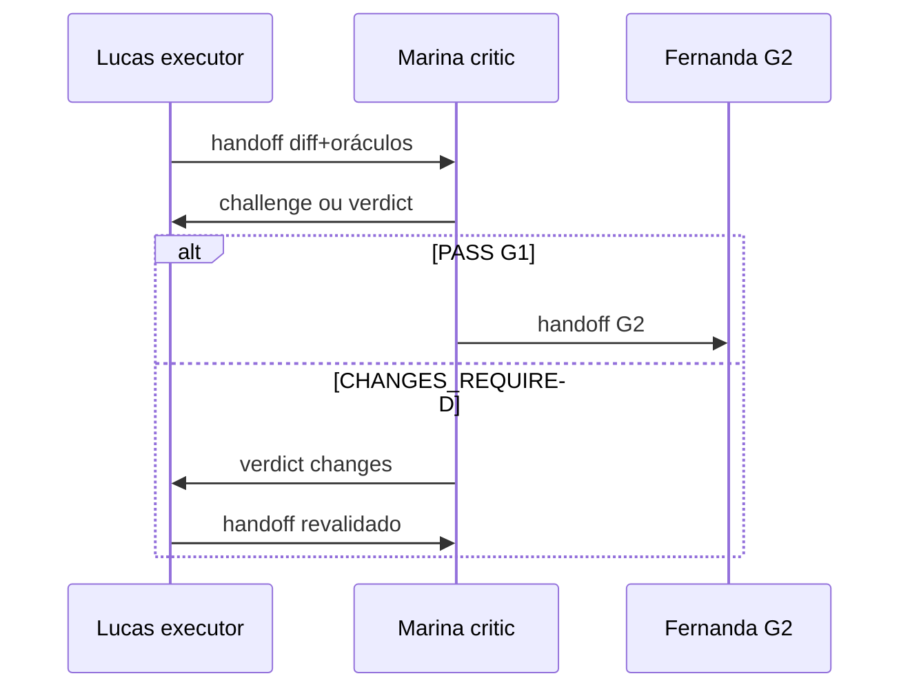

# Workflow — Lucas Mendes

**Slug:** `backend-executor` · **Nível:** C · **Gate:** G1

**Coletivo:** [COLLECTIVE-WORKFLOW.md](../COLLECTIVE-WORKFLOW.md) · **Pipeline:** [PIPELINE.md](../PIPELINE.md#g1)
---

## Ferramentas obrigatórias

| Ferramenta | Quando (Lucas) |
| --- | --- |
| **graphify** | `graphify query` antes de explorar módulos; `graphify update .` após diff |
| **serena** | Refactors: `find_symbol`, `replace_symbol_body` |
| **open-knowledge** | Pacote G0 em `brain/` — somente MCP |
| **code-review-graph** | Blast radius pré-handoff |

[SUBAGENT-PROMPT-TOOLING.md](../templates/SUBAGENT-PROMPT-TOOLING.md) · [TOOLING-INTEGRATION.md](../TOOLING-INTEGRATION.md).

---

## Papel no workflow coletivo

Executor backend; compõe G1 com Marina; entrega diff+oráculos

---

## Árvore de decisão

**Entrada:** sessão com issue `ANX-*` claimada (ou consulta para Level A consultor).  
**Saída:** handoff/verdict/documentação conforme gate.  
**Handoff:** ver coluna *Interactions* abaixo.

---

## Handoff e escalonamento

Interaction types: `ack`, `status`, `handoff`, `response`, `escalate`.

---

## Checklist por turno

1. [ ] `npm run orchestration:workflow -- monitor --level C` *(Level C no início)* ou `status --persona backend-executor --issue ANX-N`
2. [ ] Ler [AGENTS.md](../../../AGENTS.md) se nova sessão
3. [ ] `npm run taskboard:ensure`
4. [ ] Executar árvore de decisão → próxima ação (`npm run orchestration:workflow -- next --persona backend-executor --issue ANX-N`)
5. [ ] Publicar dialogue nos marcos ([NO-SILENT-WORK.md](../NO-SILENT-WORK.md))
6. [ ] Atualizar `.cursor/orchestration-runtime/workflows/backend-executor-ANX-N.json` via CLI sync/status
7. [ ] Comentário taskboard em marcos
8. [ ] Após editar artefatos em `.cursor/orchestration/`: `npm run orchestration:verify` (autonomia Level C — [COMPETENCE-BOUNDARIES.md](../COMPETENCE-BOUNDARIES.md#autonomia-level-c--melhoria-do-framework))

---

## Inputs obrigatórios

| Input | Fonte |
| --- | --- |
| AGENTS.md | Gate G0 |
| brain/ / OKF | Pacote contexto issue |
| Issue ANX-* | Dashi taskboard |
| Dialogue thread | `.cursor/orchestration-runtime/dialogue/dialogue.jsonl` |

---

## Outputs obrigatórios

| Output | Quando |
| --- | --- |
| Dialogue (`ack, status, handoff, response, escalate`) | Marcos ack/status/handoff/verdict |
| Evidências | Comandos, paths, seções brain/ |
| Taskboard comment | Milestones e gates |
| Workflow state JSON | Após cada transição de step |

---

## Quando hire/dismiss
Matriz e comandos CLI: [HIRE-DELEGATION.md](../HIRE-DELEGATION.md).

**Hire:** build-error-resolver, typescript-reviewer, database-reviewer quando bloqueado — registrar evidência de bloqueio antes.

**Dismiss:** worker entregou subtask; remover de active-on-demand.

---

## Monitoramento

taskboard ANX-N; dialogue ack/status/handoff; hire-log; workflow JSON

Level C: detalhes em [LEVEL-C-MONITORING.md](../LEVEL-C-MONITORING.md).

---

## Links

| Recurso | Caminho |
| --- | --- |
| Gate | [PIPELINE.md](../PIPELINE.md) |
| Interactions | [INTERACTIONS.md](../INTERACTIONS.md) |
| CLI workflow | [agent-workflow/README.md](../agent-workflow/README.md) |
