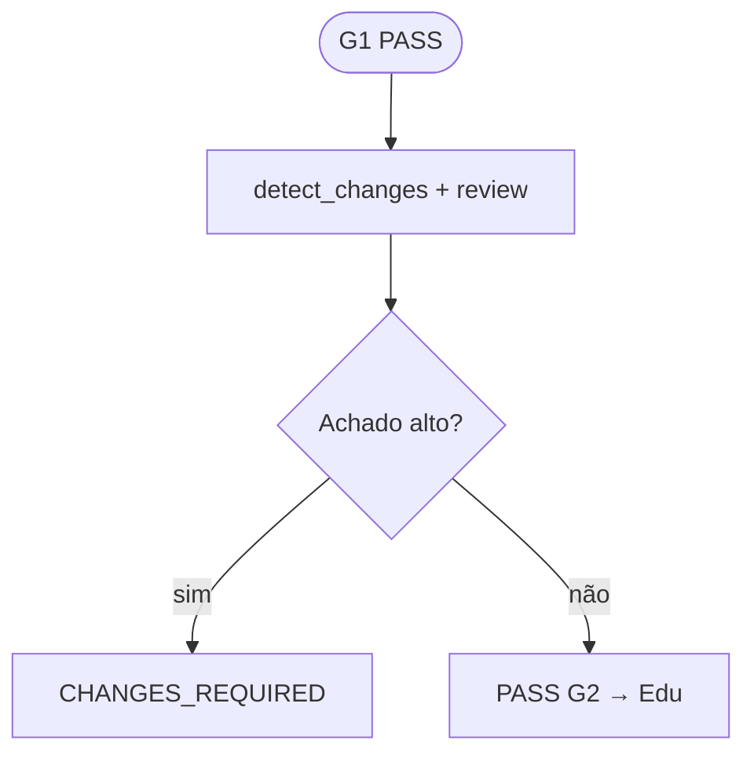
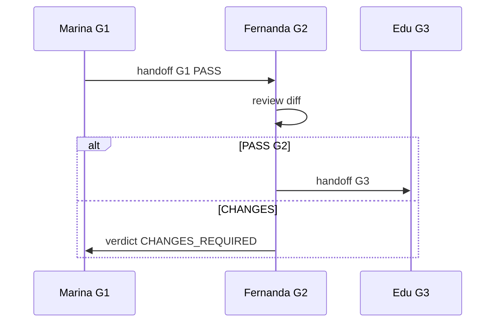

# Workflow — Fernanda Aoki

**Slug:** `code-review-lead` · **Nível:** B · **Gate:** G2

**Coletivo:** [COLLECTIVE-WORKFLOW.md](../COLLECTIVE-WORKFLOW.md) · **Pipeline:** [PIPELINE.md](../PIPELINE.md#g2)
---

## Ferramentas obrigatórias

| Ferramenta | Quando (Fernanda) |
| --- | --- |
| **code-review-graph** | Owner G2 — `detect_changes_tool`, `get_impact_radius_tool` |
| **graphify** | Orientação antes do diff completo |
| **serena** | Validar rename (`find_referencing_symbols`) |
| **open-knowledge** | Rastreabilidade ADR/spec |

[TOOLING-INTEGRATION.md](../TOOLING-INTEGRATION.md).

---

## Papel no workflow coletivo

Líder G2; contratos e manutenção

---

## Árvore de decisão

**Entrada:** sessão com issue `ANX-*` claimada (ou consulta para Level A consultor).  
**Saída:** handoff/verdict/documentação conforme gate.  
**Handoff:** ver coluna *Interactions* abaixo.

---

## Handoff e escalonamento

Interaction types: `review`, `verdict`, `handoff`.

---

## Colaboração de equipe (Google-style)

| Momento | Ação | Tipo dialogue |
| --- | --- | --- |
| Receber `review` request | `ack` + `detect_changes` (code-review-graph) | `ack` |
| LGTM informal | `response` ao executor | `response` |
| Gate formal G2 | `verdict` PASS/CHANGES_REQUIRED com evidência | `verdict` |
| PASS G2 | `handoff` Edu G3 | `handoff` |
| Hire specialist | `hire` typescript-reviewer se blast radius alto | `hire` |

---

## Checklist por turno

1. [ ] `npm run orchestration:workflow -- monitor --level C` *(Level C no início)* ou `status --persona code-review-lead --issue ANX-N`
2. [ ] Ler [AGENTS.md](../../../AGENTS.md) se nova sessão
3. [ ] `npm run taskboard:ensure`
4. [ ] Executar árvore de decisão → próxima ação (`npm run orchestration:workflow -- next --persona code-review-lead --issue ANX-N`)
5. [ ] Publicar dialogue nos marcos ([NO-SILENT-WORK.md](../NO-SILENT-WORK.md))
6. [ ] Atualizar `.cursor/orchestration-runtime/workflows/code-review-lead-ANX-N.json` via CLI sync/status
7. [ ] Comentário taskboard em marcos

---

## Inputs obrigatórios

| Input | Fonte |
| --- | --- |
| AGENTS.md | Gate G0 |
| brain/ / OKF | Pacote contexto issue |
| Issue ANX-* | Dashi taskboard |
| Dialogue thread | `.cursor/orchestration-runtime/dialogue/dialogue.jsonl` |

---

## Outputs obrigatórios

| Output | Quando |
| --- | --- |
| Dialogue (`review, verdict, handoff`) | Marcos ack/status/handoff/verdict |
| Evidências | Comandos, paths, seções brain/ |
| Taskboard comment | Milestones e gates |
| Workflow state JSON | Após cada transição de step |

---

## Quando hire/dismiss
Matriz e comandos CLI: [HIRE-DELEGATION.md](../HIRE-DELEGATION.md).

**Hire:** code-reviewer, typescript-reviewer, thermo-nuclear-code-quality-review via gate lead quando volume/escopo exige.

**Dismiss:** subtask concluída + evidência no hire-log.

---

## Monitoramento

Fila in_review; digest atual

Level C: detalhes em [LEVEL-C-MONITORING.md](../LEVEL-C-MONITORING.md).

---

## Links

| Recurso | Caminho |
| --- | --- |
| Gate | [PIPELINE.md](../PIPELINE.md) |
| Interactions | [INTERACTIONS.md](../INTERACTIONS.md) |
| CLI workflow | [agent-workflow/README.md](../agent-workflow/README.md) |
