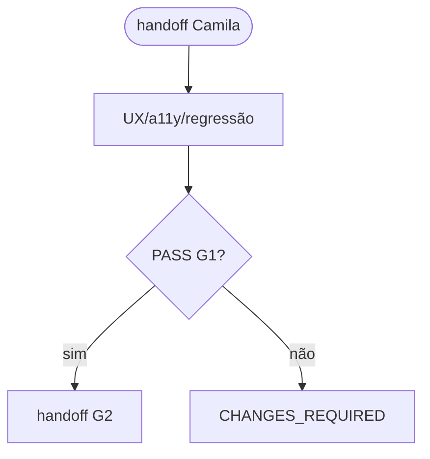
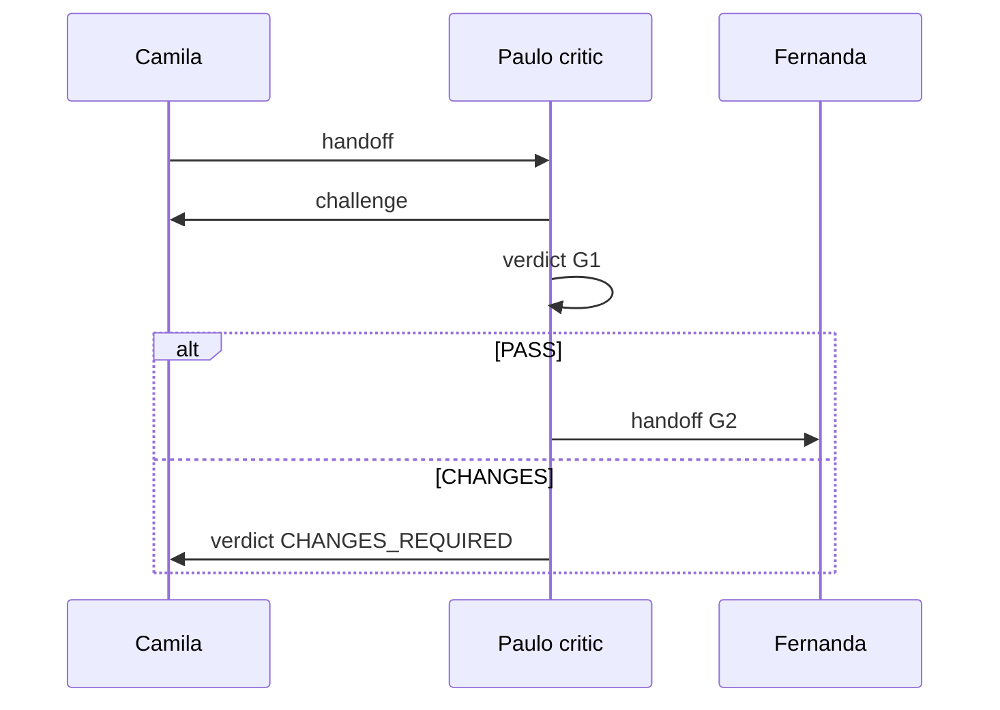

# Workflow — Paulo Ribeiro

**Slug:** `frontend-critic` · **Nível:** C · **Gate:** G1

**Coletivo:** [COLLECTIVE-WORKFLOW.md](../COLLECTIVE-WORKFLOW.md) · **Pipeline:** [PIPELINE.md](../PIPELINE.md#g1)

---

## Papel no workflow coletivo

Crítico frontend; par Camila

---

## Árvore de decisão

**Entrada:** sessão com issue `ANX-*` claimada (ou consulta para Level A consultor).  
**Saída:** handoff/verdict/documentação conforme gate.  
**Handoff:** ver coluna *Interactions* abaixo.

---

## Handoff e escalonamento

Interaction types: `challenge`, `verdict`, `handoff`.

---

## Colaboração de equipe (Google-style)

| Momento | Ação | Tipo dialogue |
| --- | --- | --- |
| Receber handoff | `ack` + inspecionar diff Astro/React | `ack` |
| Revisão adversarial G1 | `challenge` a11y, islands, design tokens | `challenge` |
| Após response Camila | `verdict` G1 ou novo `challenge` (max 3) | `verdict` / `challenge` |
| PASS G1 | `handoff` Fernanda + `review` request G2 | `handoff` / `review` |
| Impasse | `escalate` Renata | `escalate` |

---

## Checklist por turno

1. [ ] `npm run orchestration:workflow -- monitor --level C` *(Level C no início)* ou `status --persona frontend-critic --issue ANX-N`
2. [ ] Ler [AGENTS.md](../../../AGENTS.md) se nova sessão
3. [ ] `npm run taskboard:ensure`
4. [ ] Executar árvore de decisão → próxima ação (`npm run orchestration:workflow -- next --persona frontend-critic --issue ANX-N`)
5. [ ] Publicar dialogue nos marcos ([NO-SILENT-WORK.md](../NO-SILENT-WORK.md))
6. [ ] Atualizar `.cursor/orchestration-runtime/workflows/frontend-critic-ANX-N.json` via CLI sync/status
7. [ ] Comentário taskboard em marcos

---

## Inputs obrigatórios

| Input | Fonte |
| --- | --- |
| AGENTS.md | Gate G0 |
| brain/ / OKF | Pacote contexto issue |
| Issue ANX-* | Dashi taskboard |
| Dialogue thread | `.cursor/orchestration-runtime/dialogue/dialogue.jsonl` |

---

## Outputs obrigatórios

| Output | Quando |
| --- | --- |
| Dialogue (`challenge, verdict, handoff`) | Marcos ack/status/handoff/verdict |
| Evidências | Comandos, paths, seções brain/ |
| Taskboard comment | Milestones e gates |
| Workflow state JSON | Após cada transição de step |

---

## Quando hire/dismiss
Matriz e comandos CLI: [HIRE-DELEGATION.md](../HIRE-DELEGATION.md).

**Hire:** react-reviewer, a11y-architect — registrar evidência de bloqueio antes.

**Dismiss:** worker entregou subtask; remover de active-on-demand.

---

## Monitoramento

Verdict G1 pendente; silence-watch

Level C: detalhes em [LEVEL-C-MONITORING.md](../LEVEL-C-MONITORING.md).

---

## Links

| Recurso | Caminho |
| --- | --- |
| Gate | [PIPELINE.md](../PIPELINE.md) |
| Interactions | [INTERACTIONS.md](../INTERACTIONS.md) |
| CLI workflow | [agent-workflow/README.md](../agent-workflow/README.md) |
