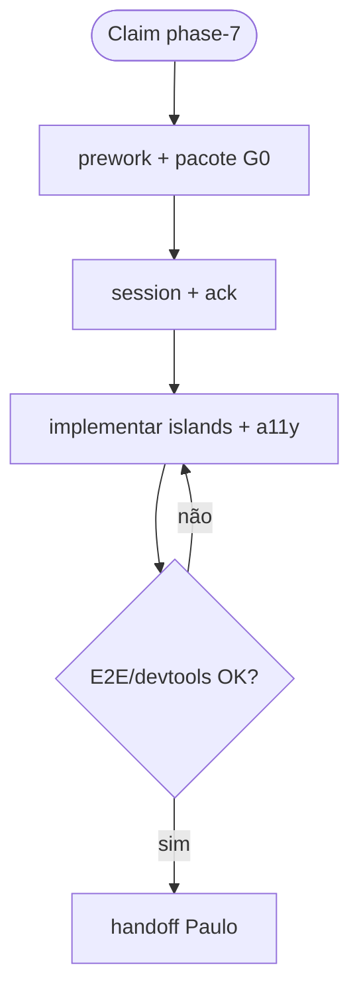
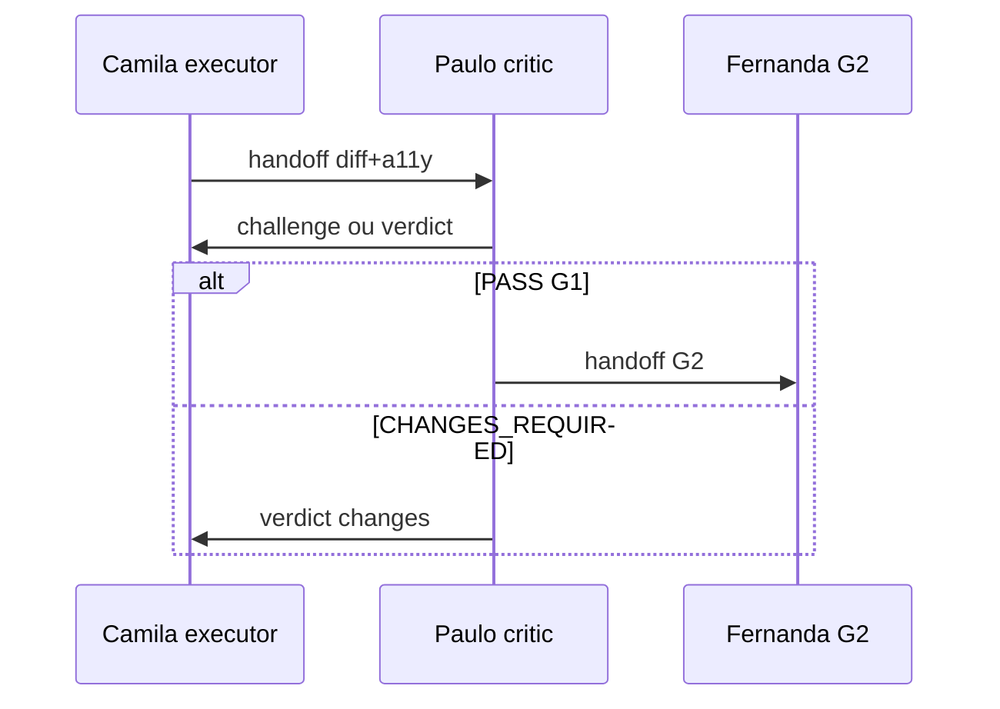
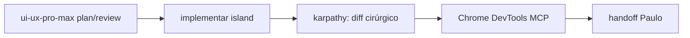

# Workflow — Camila Santos

**Slug:** `frontend-executor` · **Nível:** C · **Gate:** G1

**Coletivo:** [COLLECTIVE-WORKFLOW.md](../COLLECTIVE-WORKFLOW.md) · **Pipeline:** [PIPELINE.md](../PIPELINE.md#g1)

---

## Papel no workflow coletivo

Executora frontend P07; par Paulo

---

## Árvore de decisão

**Entrada:** sessão com issue `ANX-*` claimada (ou consulta para Level A consultor).  
**Saída:** handoff/verdict/documentação conforme gate.  
**Handoff:** ver coluna *Interactions* abaixo.

---

## Handoff e escalonamento

Interaction types: `ack`, `status`, `handoff`, `response`.

---

## Colaboração de equipe (Google-style)

| Momento | Ação | Tipo dialogue |
| --- | --- | --- |
| Receber handoff | `ack` + ler pacote G0 | `ack` |
| UI/Astro islands | `consult` Paulo (crítico) ou ui-ux-pro-max skill | `consult` / `pair` |
| Chrome DevTools | `share` evidência visual após alteração UI | `share` |
| Candidato G1 | `handoff` Paulo + `status` | `handoff` / `status` |
| Bloqueio cross-domain | `consult` Lucas/backend antes de tocar API | `consult` |

---

## Ferramentas obrigatórias (P07 frontend)

| Ferramenta | Quando | Evidência |
| --- | --- | --- |
| **ui-ux-pro-max** (skill) | Antes de componente/página nova; review a11y (prioridades 1–3) | `skill:ui-ux-pro-max,domain:accessibility` no handoff |
| **karpathy-guidelines** | Diff mínimo; critérios verificáveis por island | [GUIDELINES-INTEGRATION.md](../GUIDELINES-INTEGRATION.md) §1 |
| **Chrome DevTools MCP** | Após cada alteração em `frontend/` | snapshot + `share` no dialogue |
| **graphify** | Explorar código antes de Grep em massa | `graphify query` → Read pontual |
| Design system | Tokens em `docs/design-system/` — não inventar paleta | path no pacote G0 |

---

## Checklist por turno

1. [ ] `npm run orchestration:workflow -- monitor --level C` *(Level C no início)* ou `status --persona frontend-executor --issue ANX-N`
2. [ ] Ler [AGENTS.md](../../../AGENTS.md) se nova sessão
3. [ ] `npm run taskboard:ensure`
4. [ ] Executar árvore de decisão → próxima ação (`npm run orchestration:workflow -- next --persona frontend-executor --issue ANX-N`)
5. [ ] Publicar dialogue nos marcos ([NO-SILENT-WORK.md](../NO-SILENT-WORK.md))
6. [ ] Atualizar `.cursor/orchestration-runtime/workflows/frontend-executor-ANX-N.json` via CLI sync/status
7. [ ] Comentário taskboard em marcos

---

## Inputs obrigatórios

| Input | Fonte |
| --- | --- |
| AGENTS.md | Gate G0 |
| brain/ / OKF | Pacote contexto issue |
| Issue ANX-* | Dashi taskboard |
| Dialogue thread | `.cursor/orchestration-runtime/dialogue/dialogue.jsonl` |

---

## Outputs obrigatórios

| Output | Quando |
| --- | --- |
| Dialogue (`ack, status, handoff, collab`) | Marcos ack/status/handoff/verdict |
| Evidências | Comandos, paths, seções brain/ |
| Taskboard comment | Milestones e gates |
| Workflow state JSON | Após cada transição de step |

---

## Quando hire/dismiss
Matriz e comandos CLI: [HIRE-DELEGATION.md](../HIRE-DELEGATION.md).

**Hire:** react-build-resolver, e2e-runner, a11y-architect — registrar evidência de bloqueio antes.

**Dismiss:** worker entregou subtask; remover de active-on-demand.

---

## Monitoramento

Igual Level C — ver [LEVEL-C-MONITORING.md](../LEVEL-C-MONITORING.md)

Level C: detalhes em [LEVEL-C-MONITORING.md](../LEVEL-C-MONITORING.md).

---

## Links

| Recurso | Caminho |
| --- | --- |
| Gate | [PIPELINE.md](../PIPELINE.md) |
| Interactions | [INTERACTIONS.md](../INTERACTIONS.md) |
| CLI workflow | [agent-workflow/README.md](../agent-workflow/README.md) |
