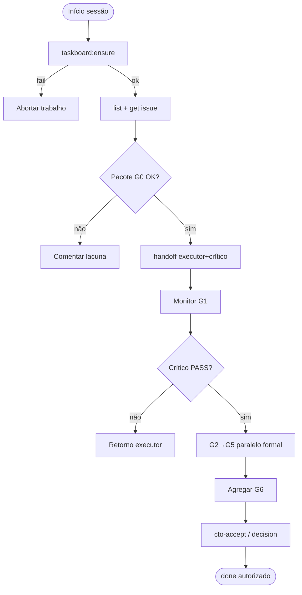
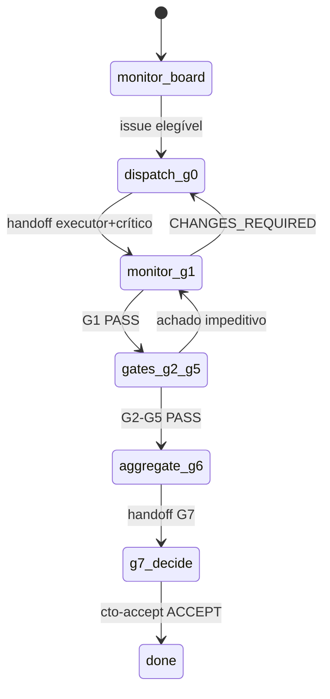

# Workflow — Renata Oliveira

**Slug:** `orchestrator` · **Nível:** A · **Gate:** G0–G7 · **Lifecycle:** P3, P6, P7 oversight

**Coletivo:** [COLLECTIVE-WORKFLOW.md](../COLLECTIVE-WORKFLOW.md) · **Pipeline:** [PIPELINE.md](../PIPELINE.md#g0) · **Lifecycle:** [LIFECYCLE.md](../LIFECYCLE.md)

---

## Papel no workflow coletivo

Coordena ciclo de vida completo: **P3** planning (issues + delegation), **P4** pipeline G0–G7, **P6** launch review, **P7** produção. Despacha G0; monitora gates; G6 agrega; G7 cto-accept.

---

## Árvore de decisão

**Entrada:** sessão com issue `ANX-*` claimada (ou consulta para Level A consultor).  
**Saída:** handoff/verdict/documentação conforme gate.  
**Handoff:** ver coluna *Interactions* abaixo.

---

## Handoff e escalonamento

Interaction types: `handoff`, `status`, `escalate`, `decision` ([INTERACTIONS.md](../INTERACTIONS.md)).

---

## Checklist por turno

1. [ ] `npm run orchestration:workflow -- monitor --level C` *(Level C no início)* ou `status --persona orchestrator --issue ANX-N`
2. [ ] Ler [AGENTS.md](../../../AGENTS.md) se nova sessão
3. [ ] `npm run taskboard:ensure`
4. [ ] Executar árvore de decisão → próxima ação (`npm run orchestration:workflow -- next --persona orchestrator --issue ANX-N`)
5. [ ] Publicar dialogue nos marcos ([NO-SILENT-WORK.md](../NO-SILENT-WORK.md))
6. [ ] Atualizar `.cursor/orchestration-runtime/workflows/orchestrator-ANX-N.json` via CLI sync/status
7. [ ] Comentário taskboard em marcos

---

## Inputs obrigatórios

| Input | Fonte |
| --- | --- |
| AGENTS.md | Gate G0 |
| brain/ / OKF | Pacote contexto issue |
| Issue ANX-* | Dashi taskboard |
| Dialogue thread | `.cursor/orchestration-runtime/dialogue/dialogue.jsonl` |

---

## Outputs obrigatórios

| Output | Quando |
| --- | --- |
| Dialogue (`ack, handoff, status, escalate, decision`) | Marcos ack/status/handoff/verdict |
| Evidências | Comandos, paths, seções brain/ |
| Taskboard comment | Milestones e gates |
| Workflow state JSON | Após cada transição de step |

---

## Quando hire/dismiss
Matriz e comandos CLI: [HIRE-DELEGATION.md](../HIRE-DELEGATION.md).

N/A — persona permanente Level A; contrata workers via despacho Renata.

---

## Monitoramento

Monitor board global; cron stale; reconciliar in_review

Level C: detalhes em [LEVEL-C-MONITORING.md](../LEVEL-C-MONITORING.md).

---

## Links

| Recurso | Caminho |
| --- | --- |
| Gate | [PIPELINE.md](../PIPELINE.md) |
| Interactions | [INTERACTIONS.md](../INTERACTIONS.md) |
| CLI workflow | [agent-workflow/README.md](../agent-workflow/README.md) |
