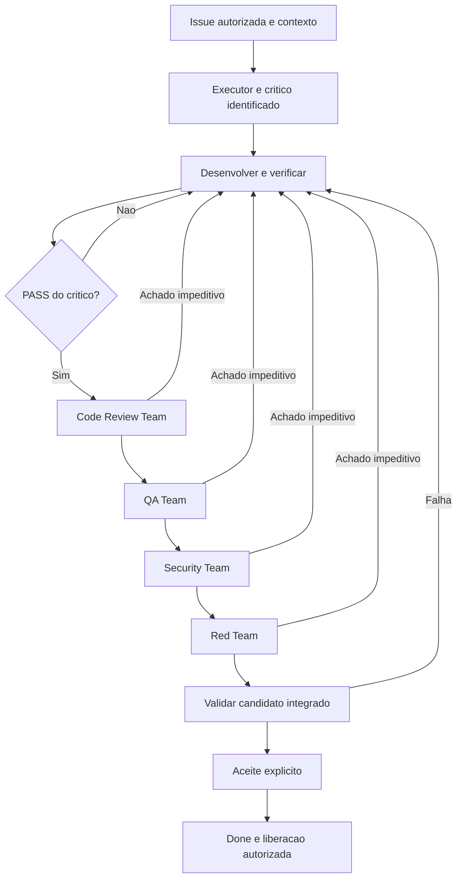

# anxionOS — instruções para agentes

Guia operacional do repositório. Leia antes de codar, propor arquitetura ou alterar documentação canônica.

## Gate obrigatório — leitura antes de qualquer trabalho

**Todo humano e todo agente de IA deve ler este arquivo (`AGENTS.md`) no início da sessão, antes de qualquer trabalho técnico** — exploração de código, implementação, commits ou edição de documentação pública (`README`, `CONTRIBUTING`, `docs/`, `backend/`, `frontend/`, `.github/`).

| Requisito | Detalhe |
| --- | --- |
| Quando | Antes de explorar, codar, commitar ou editar docs públicas |
| Subagentes | O agente pai **deve** incluir "Read AGENTS.md" em todo prompt de subagente com trabalho técnico |
| Violação | Trabalho **inválido** — mesma severidade da [política zero-trabalho-fora-do-board](#dashi-taskboard-obrigatório--tempo-real) |
| Exceção | Consulta pura sem alterar arquivos; ainda assim, recomenda-se ler para precisão |

**Ordem de gates (sem atalhos):** (1) ler `AGENTS.md` → (2) **carregar o framework** de orquestração (§ abaixo) → (3) `npm run taskboard:ensure` + claim `ANX-*` (ou `CURSOR_GOAL_ID` para meta-tooling) → (4) `orchestration:compliance --pre-work` exit 0 → (5) graphify antes de Grep/Glob/Read em massa → (6) executar escopo da issue.

Regras Cursor (alwaysApply — carregadas com o workspace): `.cursor/rules/mandatory-orchestration.mdc`, `orchestration-compliance.mdc`, `no-silent-work.mdc`, `agents-in-chat.mdc`, `taskboard-required.mdc`, `graphify.mdc`, `tooling-mandatory.mdc`.

## O que é o projeto

anxionOS é uma plataforma multi-tenant de investimentos autônomos governados por um **grafo institucional**: agências, agentes, modelos, estratégias, capital e decisões conectados com autoridade, risco e auditoria explícitos. Humanos e agentes compartilham contratos de domínio; a apresentação varia por papel (Owner, operador, plataforma, parceiro).

## Estado atual

| Aspecto | Situação |
| --- | --- |
| Board | Dashi ativo — 453 issues (442 `done`, 3 `in_review`, 1 `in_progress`, 2 `backlog`, 5 `canceled`) em 2026-09-11. **O board é a fonte de status**; revalidar antes de implementar |
| Código | Baseline P01–P09 implementado: `backend/` com os 23 módulos do ADR0002, API Bun/Elysia, `frontend/` Astro+React e deploy Docker com sandbox de engines. Verificado localmente em 2026-09-11: `bun run lint` e `tsc --build` com exit 0; `bun test` 1576 pass / 3 skip / 0 fail |
| Implantação | Ambiente real de produção **não verificado**; engines operam em sandbox/SIMULATED |
| Documentação | Duas árvores ativas: `brain/` **local** (OKF; não versionada) e o material versionado (`docs/` 548, `notes/` 70, `project-docs/` 12). A numeração de ADRs e specs **colide** entre elas (ADR0005 e spec 006 existem nas duas com assuntos distintos) — identificar sempre por caminho + título. Saneamento em ANX-455 |
| Organização do backend | **Aceita** — [ADR0002](brain/project-docs/decisions/0002-adopt-modular-backend-layout.md) |
| Modelo operacional do grafo | **Proposto** — [ADR0001](brain/project-docs/decisions/0001-graph-operational-domain-authority.md) |
| PRD | Rascunho — [0001-anxionos-prd-mestre](brain/project-docs/proposals/0001-anxionos-prd-mestre.md) |
| Capital real e autonomia L3/L4 | **Não autorizados** — REAL e certificação L3/L4 permanecem em `backlog` (ANX-172, ANX-173) |

Este retrato é factual e datado; autorizações de escopo continuam regidas pelo board e pelo greenlight explícito do usuário.

## Repositório público vs. `brain/` local

A pasta **`brain/`** (Open Knowledge / OKF) é **somente local**: está no `.gitignore` e **não** é enviada ao GitHub. Os caminhos abaixo (`brain/index.md`, specs, ADRs) são fontes de verdade **no workspace local**; links relativos continuam válidos para quem tem `brain/` clonado ou sincronizado fora do git.

Além de [README.md](README.md) e deste arquivo, o remote publica documentação **legada** em `notes/` (70 arquivos), `project-docs/` (12 arquivos, incluindo specs e o ADR0005) e `docs/` (548 arquivos). Esse material **não** é canônico: em conflito de numeração, status decisório ou conteúdo, prevalece `brain/` (ver ANX-455). Obtenham `brain/` pelo canal acordado com o mantenedor.

**Não** commitar `brain/` neste repositório.

 Implementação de código exige greenlight explícito do usuário e segue a sequência P01→P09 documentada na estrutura do backend.

## Fontes de verdade

Com `brain/` presente localmente, consultar **antes** de implementar ou contradizer decisões:

1. **[brain/index.md](brain/index.md)** — índice e links principais
2. **[brain/notes/anxionos-backend-structure.md](brain/notes/anxionos-backend-structure.md)** — árvore de módulos, ownership, dependências e gates (baseline aceito)
3. **[brain/project-docs/specs/001-institutional-contract/spec.md](brain/project-docs/specs/001-institutional-contract/spec.md)** — SDD institucional e roadmap P01–P09
4. **ADRs** em [brain/project-docs/decisions/](brain/project-docs/decisions/) — decisões aceitas vencem propostas em conflito
5. **Specs de domínio** em [brain/project-docs/specs/](brain/project-docs/specs/) — contratos por capacidade (agents, investimento, connections, evolução)
6. **Notas de planejamento** em [brain/notes/](brain/notes/) — contexto operacional (connections, graph, inferência, catálogo)

Se um fato não está documentado, **não invente** stack, vendors ou comportamento. Registre lacuna ou pergunte.

## Rastreabilidade obrigatória entre documentação e implementação

Antes de alterar código, registrar na issue um **pacote de contexto**: documento e seção aplicável, status decisório, requisito/capability, módulo proprietário, camada, arquivos previstos, armazenamento, eventos e testes de aceitação. Ler via OpenKnowledge a estrutura aceita, o mapa de armazenamento, ADRs aplicáveis, spec do domínio e plano/handoff vigente do slice. Título da issue, transcript de debate e código semelhante não substituem esses contratos.

- **Precedência:** instrução explícita vigente do usuário e ADR aceito aplicável orientam a decisão. Proposta, matriz draft ou decisão de debate não substitui silenciosamente ADR aceito. Registrar conflitos e resolver o requisito afetado antes de implementá-lo; prosseguir no escopo independente autorizado. Identificar ADR por caminho e título, pois há numeração repetida entre `brain/` e `docs/`.
- **23 módulos do baseline:** usar exatamente a lista da estrutura aceita. Inferência pertence a `connections`; evolução envolve donos já definidos. Uma linha de capacidade não cria módulo físico. `tools` permanece proposta no ADR0003 enquanto não houver aceite e atualização da árvore.
- **Camadas:** `application` usa ports de domínio, inclusive UnitOfWork, provider, cache, verificação e persistência; não importa implementação de `infrastructure`, schema Drizzle ou driver SQL. Infra implementa ports; composition root injeta adapters. `src/` intermediário é organização de pacote, não motivo para duplicar domínio.
- **Dependências:** verificar imports resolvidos, aliases e reexports; export público não autoriza consumidor a escrever estado alheio. Bootstrap pode instanciar adapters públicos sem transferir ownership. Workers específicos permanecem no módulo; apps apenas compõem os runtimes.
- **Evidência:** manter matriz requisito → fonte/seção → arquivo/símbolo → teste/comando → resultado. Classificar como aderente, desvio, planejado fora do slice ou não verificado. Passar em `boundaries` não prova regras que seu conjunto de verificações não implementa.
- **Escopo e concorrência:** registrar revisão e arquivos não commitados relevantes; nunca atribuir mudanças de outra sessão à entrega. Validar novamente evidências afetadas por alterações concorrentes.
- **Handoff:** atualizar documentação operacional que descreve o comportamento alterado, preservar histórico de ADRs e vincular a fonte canônica. Código existente não torna um desvio padrão. Correção fora da issue exige unidade rastreável autorizada; não ocultar achados sob “segue o padrão”.
- **G2/G3:** revisar AR01–AR08 proporcionais ao slice, incluindo ownership/migrations, estado+journal+outbox, projeção/rebuild, paridade UI/API/tools e isolamento AGENCY/PLATFORM. Distinguir inspeção estática de prova executada com engines reais. SIMULATED documentado não é inferência real homologada.

Auditoria inicial e pendências rastreadas: [ANX-118 — aderência do backend](brain/notes/anxionos-backend-conformance-2026-09-08.md).

## Regras de desenvolvimento

Aplicam-se quando houver implementação, conforme [estrutura do backend](brain/notes/anxionos-backend-structure.md):

### Layout (ADR0002)

- `backend/apps/` — composition roots (API Bun + Elysia; workers TypeScript)
- `backend/modules/` — donos de estado e casos de uso (23 módulos planejados)
- `backend/packages/` — contratos, eventing, database, secrets, observability
- `backend/services/` — runtimes especializados Go/Python por protocolo de job/evento
- `backend/tests/` e `backend/deploy/` — conforme árvore documentada

### Padrão por módulo

`domain/` → `application/` → `infrastructure/` + `api/` + `graph/` + `workers/`. Cada módulo expõe superfície pública em `index.ts`. Criar subpastas **somente** quando houver responsabilidade concreta.

### Dependências (resumo)

- `domain` não importa frameworks, providers nem apps
- Módulos se comunicam por contrato público, SDK ou evento versionado — nunca por repositório privado cross-module
- Estado + journal + outbox atômicos por domínio; `packages/eventing` é mecanismo, não regra de negócio
- Secrets só na infra autorizada; nunca em events, DTOs, prompts ou grafo
- Projeções de grafo nascem de eventos com `eventId`/`checkpoint`/`ownerDomain`

### Sequência de implementação

P01 (tooling e boundaries) → P02 (contracts, eventing, identity…) → P03 (graph) → P04–P09 conforme SDD. Criar **apenas** módulos e pastas do pacote ativo; não scaffoldar a árvore inteira.

### Qualidade mínima (quando houver código)

- Validação de schema nos boundaries (ex.: Zod)
- Testes de módulo, contratos e integração nos gates AR01–AR06
- Mudanças materiais de estrutura → atualizar nota + ADR com plano de migração

### Tolerância zero — código incompleto e débito disfarçado

**Política obrigatória para todo agente executor, crítico e revisor.** Violação invalida a entrega (mesma severidade de trabalho fora do board). Não há “deixar para depois” no diff entregue.

| Proibido | O que fazer em vez disso |
| --- | --- |
| Código incompleto, stub, `throw new Error("not implemented")`, retornos vazios ou ramos mortos “para depois” | Implementar o escopo da issue até comportamento verificável, ou **não** mergear e registrar bloqueio no board |
| Comentários `TODO`, `FIXME`, `HACK`, `XXX`, `TEMP` sem rastreio | Resolver na mesma entrega **ou** abrir issue `ANX-*` e referenciar o id no comentário (ex.: `TODO(ANX-123)`); sem id = proibido |
| Mocks, placeholders e dados fake em caminhos de produção (`apps/`, `modules/`, `packages/`, `frontend/` fora de `e2e/` e fixtures nomeadas) | Usar contratos, ports, fixtures de teste isoladas ou feature flags documentadas em ADR/spec |
| Valores hardcoded (URLs, hosts, tenant/agency ids, segredos, limites de negócio, timeouts mágicos) | `process.env` / config tipada, constantes nomeadas com fonte documentada, ou valores do fixture de teste explicitamente delimitados |
| Segredos, peppers, tokens ou credenciais no source | `.env.example` + secret store autorizado; nunca em eventos, DTOs, prompts ou grafo |
| `console.log` / `debugger` / prints de diagnóstico deixados no commit | Logger estruturado (`@anxionos/observability`) ou remover antes do handoff |
| Erros engolidos (`catch {}`, `catch { return null }`) sem política explícita | Propagar, mapear para `AppError`/envelope institucional ou registrar com contexto auditável |
| Código morto, imports não usados, arquivos órfãos introduzidos no diff | Remover na mesma entrega; não expandir superfície “por precaução” |
| Duplicar regra de negócio em rotas, workers globais ou helpers genéricos | Dono de domínio no módulo correto (ADR0002) |

**Exceções explícitas (devem ser óbvias no diff):**

- Fixtures e helpers em `backend/tests/`, `frontend/e2e/`, `**/fixtures/**` com nome e spec que delimitam escopo F0/mock.
- Rotas e seeds **dev-only** atrás de `ENABLE_DEV_ROUTES`, `ALLOW_DEV_SEED`, `NODE_ENV !== production` — documentados em `backend/.env.example`.
- Placeholders de UI **somente** quando a spec da fase (ex.: P07) declarar shell/placeholder e o componente deixar isso explícito ao usuário (copy ou status `pending`), sem simular dados autoritativos.

**Verificação antes de `in_review` (executor + crítico):**

1. Buscar no diff: `TODO`, `FIXME`, `HACK`, `not implemented`, `placeholder`, `mock` fora de testes.
2. Confirmar que config sensível vem de env/config, não de literais de produção.
3. Confirmar que cada caminho novo tem tratamento de erro e teste ou justificativa rastreável na issue.
4. Code Review (G2) **rejeita** qualquer achado da tabela acima sem disposição documentada na issue.

Regra Cursor espelhada: [.cursor/rules/zero-tolerance-code.mdc](.cursor/rules/zero-tolerance-code.mdc).


## Armazenamento confirmado

Consultar o [mapa de armazenamento dos 23 módulos](brain/notes/anxionos-storage-ownership.md). SQLite é proposto para checkpoints/caches/sandboxes locais, sem autoridade sobre capital, grants, ordens ou quotas compartilhadas. Nunca escrever diretamente no SQLite interno de Dashi/OpenKnowledge; usar as interfaces suportadas. Testes locais não substituem os engines reais.

Usar **Neo4j para o grafo institucional**, **PostgreSQL para transações**, **TimescaleDB para séries temporais** e **pgvector para embeddings**, conforme [ADR0004](brain/project-docs/decisions/0004-postgresql-timescaledb-pgvector.md). A escolha PostgreSQL não substitui Neo4j. Manter journal/outbox autoritativos, projeções reconstruíveis e Graph Kernel governado. Latest estável exige matriz compatível e validação; edição/licença e desempenho ainda precisam de evidência.

## Bibliotecas nativas e integrações oficiais

A base indicada é Bun, Elysia e Astro. **Zod, Drizzle, Better Auth, pg e Scalar são preferências do usuário a avaliar com opinião independente e evidências rastreáveis**; a recomendação atual os mantém pelas integrações documentadas. Não tratar a lista como justificativa suficiente nem substituir componentes silenciosamente. Consultar a [análise e fontes preservadas](brain/research/bun-elysia-astro-foundation.md) antes de implementar. Escolha de pacote não confirma versão ou compatibilidade: validar runtime, APIs e peer dependencies no lockfile.

Priorizar recursos nativos adequados, depois integrações oficiais e bibliotecas indicadas nas documentações oficiais. A recomendação técnica atual é Drizzle sobre pg para PostgreSQL, Zod para validação, Better Auth para autenticação/sessão e Scalar pela integração OpenAPI compatível do Elysia. Validar adequação e compatibilidade e comparar alternativas quando a evidência indicar; estas recomendações não são decisões irreversíveis atribuídas ao usuário. Não instalar alternativas duplicadas apenas por constarem de exemplos.

Antes de adicionar dependência, registrar necessidade, fonte oficial/data, classificação (nativa/oficial/documentada/alternativa), versão, compatibilidade e verificação pertinente na issue. Alternativa fora das recomendações exige justificativa concreta e revisão; mudança de arquitetura exige ADR aplicável. Não exigir nova aprovação para escolha rotineira já autorizada.

Usar sempre a release estável mais recente (latest) das bibliotecas ao adicionar ou atualizar dependências, conforme instrução do usuário. Consultar registry oficial, release notes e peer dependencies no momento da execução; registrar versão resolvida e data, fixar versão exata/lockfile e testar o conjunto. Não deixar latest flutuante em builds de CI nem atualizar durante deploy. Se latest apontar para prerelease ou houver incompatibilidade, registrar evidência e propor solução antes de adoção; não adotar rc/beta nem fazer downgrade silencioso. Esta regra não cria atualizações automáticas ou monitoramento permanente. Não remover tooling existente, substituir drivers ou converter build Astro/Vite para Bun por inferência desta regra. Node/adapters do Astro têm requisitos próprios. Preservar domínio sem frameworks e a autorização institucional além de Better Auth.

“Usar tudo que for necessário” significa adicionar por caso de uso verificável. “E outros” não autoriza instalar todos os plugins. Code Review verifica esta política e QA comprova as integrações.

## MCP e ferramentas

### open-knowledge (`brain/`)

Use o MCP **open-knowledge** para buscar, editar e auditar documentação em `brain/`. Respeite frontmatter, templates OKF e status (`accepted` vs `proposed` vs `draft`).

### Supermemory

Em chamadas Supermemory, passe sempre `workspaceRoot` com o path absoluto deste repositório.

### code-review-graph

Quando existir código indexado, **priorize** as ferramentas code-review-graph antes de Grep/Glob/Read para exploração, impacto e review. Regras detalhadas no `AGENTS.md` global do usuário (fora deste repo).

| Ferramenta | Quando |
| --- | --- |
| `semantic_search_nodes_tool` / `query_graph_tool` | Explorar código e relações |
| `get_impact_radius_tool` | Blast radius de mudanças |
| `detect_changes_tool` + `get_review_context_tool` | Code review |
| `get_architecture_overview_tool` | Visão estrutural |

Até haver código, explore via documentação em `brain/`.

### Archify (diagramas)

[Archify](https://github.com/tt-a1i/archify) gera diagramas interativos (HTML/SVG) a partir de JSON tipado em `.archify/specs/`. **Complementa** o code-review-graph: Archify comunica arquitetura e fluxos; o grafo de código responde impacto e relações no source.

| Uso | Quando |
| --- | --- |
| Visão de plataforma / módulos | `architecture` — ex.: `.archify/specs/anxionos-platform.architecture.json` |
| Sequência de implementação P01–P09 | `workflow` — `.archify/specs/anxionos-delivery-p01-p09.workflow.json` |
| Fluxo Connections (binding → ledger) | `workflow` — `.archify/specs/anxionos-connections-inference.workflow.json` |
| Workflow de agentes ou runbooks | `workflow` — derivar do fluxo em AGENTS.md |
| Sequências de API / eventos | `sequence`, `dataflow`, `lifecycle` |

Comandos na raiz: `npm run archify:validate`, `npm run archify:build`. Detalhes em [docs/archify/README.md](docs/archify/README.md). Com `backend/` implantado, atualizar specs com evidência real — não inventar componentes.
### Graphify (grafo de conhecimento)

[Graphify](https://github.com/Graphify-Labs/graphify) indexa código e documentação em um grafo local (`graph.json`) com AST (tree-sitter) e, opcionalmente, extração semântica via LLM. **Complementa** Archify e o code-review-graph MCP.

| Uso | Quando |
| --- | --- |
| Explorar corpus pequeno (scripts, specs públicas, `AGENTS.md`) | Antes de Grep/Glob em massa — `npm run graphify:index` |
| God nodes, comunidades, conexões surpreendentes | Após `graphify extract` ou skill `/graphify` (requer API key para docs/imagens) |
| Manter índice após editar código | `npm run graphify:index` (AST-only, sem API) |
| Navegação por wiki | `.graphify/out/wiki/index.md` quando gerado |

Comandos na raiz: `npm run graphify:doctor`, `graphify:index`, `graphify:check`. Saída em `.graphify/out/` (gitignored). Detalhes em [docs/graphify/README.md](docs/graphify/README.md).
No Cursor: `.graphify/.venv/bin/graphify cursor install` escreve `.cursor/rules/graphify.mdc` (regra `alwaysApply`) para priorizar consultas ao grafo antes de Grep/Glob/Read.

#### Archify vs Graphify vs code-review-graph

| Ferramenta | Entrada | Saída | Melhor para |
| --- | --- | --- | --- |
| **Archify** | JSON em `.archify/specs/` | HTML/SVG de arquitetura e fluxos | Comunicar design aceito, roadmap P01–P09, fluxos institucionais |
| **Graphify** | Arquivos do repo (código, md, pdf…) | `graph.json`, relatórios, wiki opcional | Descobrir estrutura e relações no corpus indexado; compressão de contexto |
| **code-review-graph** (MCP) | Código indexado no MCP | Callers, callees, impacto, review | Exploração estrutural e blast radius quando o grafo MCP está ativo |

Prioridade para agentes: **code-review-graph** (se código indexado no MCP) → **Graphify** (se `.graphify/out/graph.json` existe) → documentação em `brain/` (local) → Grep/Glob.

### Framework de orquestração (Cursor) — carregamento obrigatório

A pasta [.cursor/orchestration/](./.cursor/orchestration/) **estende** este `AGENTS.md` com personas, dialogue, pipeline G0–G7, dispatch de subagentes e runbooks — **não** substitui regras canônicas do produto. **Todo agente no Cursor deve carregar o framework antes de trabalho técnico** (exploração, implementação, docs públicas, commits). Trabalho sem framework carregado = **inválido** (mesma severidade que zero-trabalho-fora-do-board).

**Fronteira:** equipe Cursor (Renata, Lucas, Marina…) ≠ agentes institucionais do produto (`backend/modules/agents/`). Ver [SCOPE.md](.cursor/orchestration/SCOPE.md).

#### O que carregar (leitura — nesta ordem)

| # | Documento | Quando |
| --- | --- | --- |
| 1 | [MANDATORY-COMPLIANCE.md](.cursor/orchestration/MANDATORY-COMPLIANCE.md) | Sempre — sequência de gates executável |
| 2 | [ONBOARDING.md](.cursor/orchestration/ONBOARDING.md) | Primeira sessão ou persona nova |
| 3 | [COMPLIANCE.md](.cursor/orchestration/COMPLIANCE.md) | Antes de codar ou editar docs |
| 4 | [RUNBOOK.md](.cursor/orchestration/RUNBOOK.md) | Comandos dialogue, broadcast, sessão |
| 5 | [PERSONAS.md](.cursor/orchestration/PERSONAS.md) + workflow `workflow-{slug}.md` | Ao assumir uma persona |
| 6 | [CURSOR-AGENTS-INTEGRATION.md](.cursor/orchestration/CURSOR-AGENTS-INTEGRATION.md) + [GROK-BOT-PARITY.md](.cursor/orchestration/GROK-BOT-PARITY.md) | Orquestrador / delegação via `Task` |

Índice mestre: [README.md](.cursor/orchestration/README.md) · config: [`.cursor/orchestration.config.json`](.cursor/orchestration.config.json)

#### Bootstrap de sessão (executar)

```bash
# 1. Board + contexto
npm run taskboard:ensure || exit 1          # produto ANX-* — falhou = PARAR
npm run taskboard:context
# Meta-tooling (.cursor/orchestration/, regras): export CURSOR_GOAL_ID=<goal> ou registry em .cursor/orchestration-runtime/goals/

# 2. Framework runtime (atalho único — equivalente aos passos abaixo)
npm run orchestration:boot -- --persona <slug>
# Meta-tooling sem Dashi: npm run orchestration:boot -- --skip-taskboard

# Equivalente manual (hooks sessionStart rodam lifecycle + proactive + dispatch parcial):
# npm run orchestration:lifecycle-cleanup
# npm run orchestration:proactive -- check --persona <slug>
# npm run orchestration:chat -- --check-pending
# npm run orchestration:dispatch -- inject
# npm run orchestration:dispatch -- spawn-plan --json

# 4. Após claim da issue
npm run orchestration:session -- start --persona <slug> --issue ANX-N
npm run orchestration:workflow -- sync --persona <slug> --issue ANX-N
npm run orchestration:compliance -- --pre-work --issue ANX-N --persona <slug>   # exit 0 obrigatório
npm run orchestration:broadcast -- --from-persona <slug> --type ack --issue ANX-N --body "..." --evidence "cmd:..."

# 5. Level C (executores + críticos)
npm run orchestration:workflow -- monitor --level C
```

**Dual-board:** produto (`backend/`, `frontend/`, `docs/`, `ANX-*`) → Dashi taskboard; framework (`.cursor/orchestration/`, regras Cursor) → Cursor taskboard (`CURSOR_GOAL_ID`). Ver [TASKBOARD-ROUTING.md](.cursor/orchestration/TASKBOARD-ROUTING.md). **Nunca misturar** boards na mesma unidade de trabalho.

**Políticas Zero (Z0–Z21):** [ZERO-POLICIES.md](.cursor/orchestration/ZERO-POLICIES.md) · `npm run orchestration:zero-policies`

#### Subagentes e delegação

O agente **pai** que invoca `Task` deve incluir em todo prompt técnico:

1. "Read AGENTS.md" + carregar [SUBAGENT-DELEGATION-PACKAGE.md](.cursor/orchestration/templates/SUBAGENT-DELEGATION-PACKAGE.md)
2. Persona, issue `ANX-*`, compliance `pre-work`, dialogue (`ack` / `status` / `handoff`)
3. Tooling: graphify, serena, open-knowledge para `brain/`, [SUBAGENT-PROMPT-TOOLING.md](.cursor/orchestration/templates/SUBAGENT-PROMPT-TOOLING.md)

Hire → fila dispatch → `spawn-plan` / `inject` → `Task` com `subagent_type` de [levels.mjs](.cursor/orchestration/agent-hire/levels.mjs) (críticos: `code-reviewer`). Monitor: `npm run orchestration:delegate-monitor -- list`.

#### Fim de turno

```bash
npm run orchestration:compliance -- --pre-commit --issue ANX-N --persona <slug>
npm run orchestration:broadcast -- --from-persona <slug> --type handoff --issue ANX-N --body "..." --evidence "..."
npm run orchestration:session -- end --persona <slug>
```

Skills obrigatórias: `manage-taskboard`, `orchestrate-work` (despacho multi-agente G0–G7).

### Frontend

**Stack obrigatória:** Astro + React islands (`@astrojs/react`) + TypeScript. **Não** usar Next.js, Vite SPA standalone nem React Native para consoles web. Interatividade via islands; páginas e layout em `.astro`.

Após alterações de UI, inspecionar com Chrome DevTools MCP quando aplicável.

### Dashi Taskboard (obrigatório — tempo real)

O [Dashi/Codex Taskboard](https://github.com/chuspeeism/dashi-taskboard) é a **fonte de verdade local** para todo trabalho neste repositório. Roda em loopback (`http://127.0.0.1:47823`); **não** entra no CI nem em deploy.

**Todo agente (humano ou IA) DEVE usar o board em tempo real.** Sem issue no board, sem trabalho — inclusive micro-fixes.

Skills obrigatórias: `manage-taskboard` (claims, status, comentários) e `orchestrate-work` (despacho multi-agente, gates G0–G7).

**Dual-board (orquestrador):** trabalho de **produto** (`backend/`, `frontend/`, docs públicas, slices `ANX-*`) usa o **Dashi taskboard**; trabalho **framework/non-project** (`.cursor/orchestration/`, regras Cursor, personas, meta-tooling) usa o **Cursor taskboard** (`CreateGoal` + `CURSOR_GOAL_ID` ou registry em `.cursor/orchestration-runtime/goals/`). Ver [.cursor/orchestration/TASKBOARD-ROUTING.md](.cursor/orchestration/TASKBOARD-ROUTING.md). **Nunca misturar boards** na mesma unidade de trabalho.

#### Políticas Zero (framework de orquestração)

O framework Cursor mantém **22 Políticas Zero** (Z0–Z21) — violação = trabalho inválido. Incluem zero-trabalho-fora-do-board (Z0), tolerância zero de código (Z1/Z9), no silent work (Z3), dual-board (Z10) e visibilidade no chat (Z4/Z8). Catálogo canônico: [.cursor/orchestration/ZERO-POLICIES.md](.cursor/orchestration/ZERO-POLICIES.md) · `npm run orchestration:zero-policies`.

#### Política zero-trabalho-fora-do-board

**Nenhum agente pode executar trabalho técnico fora do taskboard.** O board não é registro posterior — é pré-condição de execução.

**Fluxo obrigatório** (toda sessão, sem atalhos):

1. `npm run taskboard:ensure` — se falhar, **abortar** a tarefa (não codar, não commitar, não editar docs públicas).
2. `npm run taskboard:context` + `npm run taskboard:list` ou `node scripts/taskboard.mjs get ANX-<N>`.
3. Issue `ANX-*` existente (buscar duplicatas) ou **criar** antes de qualquer alteração.
4. Claim: mover para `in_progress` com binding de thread completo (`manage-taskboard`).
5. Executar o escopo **somente** da issue claimada.
6. Ao terminar: comentário com evidências → `in_review`. `done` só com aceite explícito.

Atalho de verificação: `npm run taskboard:prework` (ensure + lembrete de issue obrigatória).

**Proibições explícitas** (violação = trabalho inválido):

1. Codar, commitar ou alterar docs públicas (`README`, `AGENTS.md`, `CONTRIBUTING`, `.github/`, `backend/`, `frontend/`) sem issue `ANX-*` em `in_progress` vinculada à conversa atual.
2. Trabalhar “de cabeça” — tarefa inventada na sessão sem claim no board.
3. Continuar quando `npm run taskboard:ensure` falhou (board offline).
4. Ignorar board offline improvisando (lista mental, issue fantasma, “vou registrar depois”).
5. Fechar sessão com issue desatualizada (`in_progress` sem entrega, `in_review` sem comentário, status que não reflete o trabalho real).
6. Tomar ou mover issue claimada por outra conversa/thread.
7. Abrir PR sem identificador `ANX-*` no título ou corpo (PR sem issue = rejeitar).

**Board offline — PARAR, não improvisar:**

- Não codar, não commitar, não editar documentação pública.
- Informar o usuário que o taskboard está offline e pedir para subir o serviço (Codex Taskboard app ou dashi-taskboard em `http://127.0.0.1:47823`).
- Se o impedimento persistir: mover a issue para `blocked` com comentário explicando o bloqueio (quando o board voltar).
- **Não** substituir o board por issue do GitHub, nota mental ou “registro depois”.

**Exceções:** nenhuma para trabalho técnico. Única exceção permitida: responder **perguntas** do usuário sem alterar arquivos (modo consulta, sem código nem docs).

**Gate de aborto:** `npm run taskboard:ensure` com exit code ≠ 0 → **abortar imediatamente** toda a tarefa até o board estar online.

#### Regras obrigatórias

1. **Antes de qualquer tarefa:** confirmar que o board está online e ler o contexto do projeto.
2. **Issue vinculada:** toda unidade de trabalho tem uma issue `ANX-*`. Se não existir, **criar antes de codar** (buscar duplicatas primeiro).
3. **Status em tempo real:** refletir o progresso no board conforme avança — nunca deixar issue desatualizada ao fim da sessão.
4. **Thread binding:** usar `CODEX_THREAD_ID`, `CLAUDE_CODE_SESSION_ID` ou `CURSOR_THREAD_ID` em claims e moves; binding completo conforme skill `manage-taskboard`.
5. **Comentários:** registrar decisões relevantes, bloqueios e resultado de verificação (via `taskctl comment add` se o wrapper não cobrir).
6. **Bloqueios:** mover para `blocked` com comentário explicando o impedimento.
7. **Multi-agente:** uma issue por unidade de trabalho; não duplicar; não tomar issue de outra conversa. Orquestração: skill `orchestrate-work` + `manage-taskboard`.

#### Fluxo de status

`backlog` (não executar sem autorização) → `todo` (claimable) → `in_progress` → `in_review` → `done` (só com aceite explícito). Também: `blocked`, `canceled`.

| Transição | Quando |
| --- | --- |
| → `in_progress` | Ao **iniciar** trabalho (claim com `--if-version`) |
| → `in_review` | Ao **terminar** implementação; comentário com o que mudou |
| → `done` | Só após aceite explícito do usuário/revisor |
| → `blocked` | Impedimento externo ou dependência não resolvida |

**Labels:** `for-claude` (elegível para agente), `hold` (não tocar), `phase-N` (fase P0x).

**Projeto:** `anxionOS` (resolvido por `workspacePath` do repo, `TASKBOARD_PROJECT_NAME` ou pin `TASKBOARD_PROJECT_ID` em `.env`).

#### Workflow: start work / end work

**Start work** (início de cada tarefa):

```bash
npm run taskboard:ensure          # falha se board offline — pare e suba o serviço
npm run taskboard:context
npm run taskboard:list            # ou: node scripts/taskboard.mjs get ANX-<N>
# issue inexistente → create antes de continuar
node scripts/taskboard.mjs move ANX-<N> in_progress   # requer taskctl + thread id
```

**End work** (fim da implementação, antes de pedir review):

```bash
# taskctl comment add ANX-<N> --body "..." --thread-id "$CODEX_THREAD_ID"
node scripts/taskboard.mjs move ANX-<N> in_review
# done só após aceite explícito
```

**CLI preferido:** `taskctl` (global ou macOS: `'/Applications/Codex Taskboard.app/Contents/Resources/bin/taskctl'`). Env: `CODEX_TASKBOARD_URL` ou `TASKBOARD_URL`.

**Wrapper do repo:**

```bash
cp .env.example .env   # opcional; defaults funcionam em dev local
npm run taskboard:ensure
npm run taskboard:context
npm run taskboard:list
node scripts/taskboard.mjs get ANX-2
node scripts/taskboard.mjs create --title "..." --status todo
node scripts/taskboard.mjs move ANX-2 in_progress
```

Escritas (`create`, `move`) exigem `taskctl` e thread id. Claim: mover `todo → in_progress` com `--if-version` e binding completo conforme `manage-taskboard`.

**API HTTP (leitura / fallback):** `GET /health`, `GET /api/projects`, `GET /api/tasks`, `POST /api/tasks`. Sem autenticação no modo local.

**Offline:** subir o app Codex Taskboard (ou serviço dashi-taskboard) na máquina; `npm run taskboard:ensure` deve passar antes de qualquer trabalho.

## O que NÃO fazer

- **Não** entregar código incompleto, `TODO`/`FIXME` sem issue, mocks em produção, hardcoded não documentado nem erros silenciosos — ver [Tolerância zero](#tolerância-zero--código-incompleto-e-débito-disfarçado)
- **Não** criar `backend/` com 23 módulos vazios ou pastas placeholder
- **Não** iniciar código sem greenlight explícito do usuário
- **Não** contradizer ADR0002 ou a estrutura aceita sem novo ADR
- **Não** tratar ADR0001 (proposto) como decisão fechada de stack física
- **Não** concentrar regra de negócio em rotas, workers globais ou `packages/common` genérico
- **Não** duplicar documentação canônica — linkar e atualizar a fonte em `brain/`
- **Não** commitar `brain/` nem segredos, credenciais ou dumps sensíveis
- **Não** codar nem alterar docs canônicas sem issue `ANX-*` ativa no taskboard
- **Não** deixar status do board desatualizado ao fim da sessão

## Pipeline obrigatório de desenvolvimento e revisão

Decisão do usuário em 2026-09-07: cada agente executor deve ter seu próprio crítico independente durante o desenvolvimento. Após aprovação objetiva do crítico, a entrega deve passar por Code Review Team, QA Team, Security Team e Red Team. Estas regras também orientam o orquestrador local; não concedem autoridade aos agentes do produto.

### Etapas e critérios

| Gate | Responsável | Evidência e condição de saída |
| --- | --- | --- |
| G0 — Preparar | Orquestrador + executor | Issue autorizada, ownership, escopo, critérios, dependências, ambiente e crítico nominal por executor |
| G1 — Desenvolver | Executor + seu crítico | Crítico acompanha plano e incrementos; executor implementa e verifica. **Tolerância zero** a código incompleto, TODO sem issue, hardcoded e mocks em produção (ver seção dedicada em AGENTS.md). Aprovação explícita do crítico sobre a revisão exata, critérios satisfeitos e achados impeditivos resolvidos |
| G2 — Revisar código | Code Review Team independente | Diff completo, contratos, arquitetura, concorrência, manutenção, migração e testes revisados; relatório com referências concretas |
| G3 — Validar produto | QA Team independente | Critérios funcionais, casos negativos, integração, regressão e E2E aplicáveis executados; ambiente, comandos, resultados e limitações registrados |
| G4 — Revisar segurança | Security Team independente | Fronteiras de confiança, autorização/tenancy, secrets, dependências e fluxos de dados avaliados; testes de segurança pertinentes e achados classificados |
| G5 — Testar adversarialmente | Red Team independente | Tentar invalidar controles e premissas em ambiente isolado autorizado; cenários de abuso, bypass de autoridade, prompt injection, concorrência e falhas conforme escopo; reprodução e cleanup registrados |
| G6 — Integrar | Orquestrador + responsáveis pelos gates | Agregar pareceres sobre o mesmo candidato; testar integração dos filhos e verificar ausência de evidência obsoleta; entregar para aceite |
| G7 — Aceitar e liberar | Usuário/revisor autorizado | Aceite explícito para `done` **somente com entrega 100% concluída** — zero ressalvas, zero follow-ups MEDIUM pendentes no escopo, filhos bloqueadores resolvidos; merge/deploy somente dentro da autorização aplicável, com verificações de release, observabilidade e rollback |

Fluxo: G0 → G1 → G2 → G3 → G4 → G5 → G6 → G7. Análises preliminares podem ocorrer em paralelo, mas o avanço formal respeita as dependências. Aprovação do crítico é condição para o handoff às quatro equipes, não substitui seus pareceres.

### Independência, achados e retorno

- Cada executor tem um crítico identificado, distinto do autor, com contexto próprio e acesso ao diff/requisitos/evidências. Não vale trocar de persona na mesma execução e declarar revisão independente.
- Cada equipe tem um responsável identificado e parecer separado; ninguém aprova alteração que escreveu. Revisores não precisam recriar uma cadeia infinita de revisores: se escreverem correções, passam a ser executores dessas mudanças e outro revisor as aprova.
- “Crítico convencido” significa critérios demonstrados, não persuasão do autor. Parecer obrigatório: gate, issue/run, autor/revisor, revisão ou digest do artefato, escopo, evidências, achados, severidade, decisão e riscos residuais.
- Decisões possíveis: PASS, CHANGES_REQUIRED, BLOCKED e NOT_APPLICABLE. NOT_APPLICABLE exige justificativa verificável e concordância do responsável do gate; nunca é substituto para teste indisponível. Todas as quatro equipes emitem disposição, inclusive em entrega documental, com avaliação proporcional ao artefato.
- Qualquer requisito obrigatório descumprido, teste obrigatório falho ou achado crítico/alto bloqueia. Achados médios/baixos exigem correção ou disposição explícita pelo responsável autorizado, com justificativa e issue rastreável; autor não aceita unilateralmente o próprio risco.
- Correções retornam ao executor e seu crítico. Qualquer alteração invalida aprovações do candidato anterior: cada gate já realizado deve repetir os testes/revisões afetados ou emitir revalidação explícita com análise de impacto sobre o novo digest. Nunca reaproveitar automaticamente um PASS antigo.
- Timeouts, ferramenta ausente e orçamento esgotado produzem pendência/bloqueio, jamais aprovação. Após três ciclos sem convergência, escalar impasse com evidências; não relaxar critérios ou repetir indefinidamente.
- Red Team atua somente em fixtures/sandbox/staging com escopo autorizado, limites e condição de parada; não operar capital real, atacar terceiros, usar segredos reais ou fazer teste destrutivo em produção por autorização implícita deste pipeline.
- Após integração, validar o candidato integrado; PASS de cada filho isolado não aprova o conjunto. Após release autorizada, observar sinais de falha e aplicar o rollback autorizado; lições viram regressões ou melhorias rastreadas. Qualidade é demonstrada por evidência, nunca prometida como perfeição.

### Dashi, delegação e fechamento

Manter uma issue por unidade executável e relações de dependência para revisões delegadas, quando suportadas e verificadas. Revisão auxiliar pode permanecer na issue do coordenador com run/revisor/gate identificados; equipe não toma o claim do executor. O executor solicita o handoff e o orquestrador despacha/reconcilia os responsáveis.

Estados dos gates são internos, registrados em comentários/artefatos; não inventar novos status do board. A entrega fica in_progress enquanto produz e corrige, e in_review quando submetida às equipes ou ao aceite, com gates pendentes explícitos. in_review nunca significa aprovada. Só `done` após todos os gates obrigatórios concluídos, **100% do escopo entregue sem ressalvas**, filhos bloqueadores resolvidos e aceite explícito aplicável. **Proibido** `done COM RESSALVAS` ou aceite com MEDIUM pendente no escopo ([ZERO-RESERVATIONS-DONE.md](.cursor/orchestration/ZERO-RESERVATIONS-DONE.md)). Ao iniciar correção autorizada de sua própria entrega, retornar a in_progress com versão atual.

Sem identidade verificável ou agente independente disponível, registrar gate pendente e suspender o avanço; não fingir que equipes foram executadas. Cada pacote de handoff contém issue, revisão/digest, requisitos, diff/artefatos, ambiente, evidências, achados prévios, limites de acesso, critérios do gate e mecanismo de retorno. O board preserva status/ownership; relatórios preservam a prova de cada decisão.

## Personas e colaboração no OpenKnowledge

Aplicar [Personas e colaboração da equipe](brain/notes/anxionos-team-personas.md): Executor pragmático; crítico questionador e cooperativo; Code Review orientado a contratos/manutenção; QA a comportamento reproduzível; Security a controles e risco; Red Team a hipóteses adversariais autorizadas. Cada participante mantém identidade IA real e independente, responsabilidade e parecer próprios.

Colaborar em linguagem natural por assunto, com perguntas específicas, menções para ação, handoffs confirmados e discordâncias resolvidas por evidência. Silêncio, reação ou texto não autenticado não aprovam gates. Mensagem deve preservar issue, autor, candidato e evidências quando pertinentes; mudanças invalidam aprovações anteriores.

OpenKnowledge é o ambiente principal de conhecimento e discussão: reutilizar notes, fontes/pesquisa/artigos, propostas/ADRs/specs, guias, postmortems, wiki, conceitos, índices e logs conforme a finalidade. Usar comentários ancorados quando disponíveis; sem ferramenta de escrita de comentários, registrar síntese atribuída no documento/issue, nunca inventar API ou conversa. Ler comentários pendentes via MCP. Dashi mantém status/ownership; Git/CI e relatórios mantêm evidências. Não criar um arquivo por mensagem nem preencher pastas sem necessidade.

Usar templates, links/backlinks, history, checkpoints, skills e audit conforme a etapa. Toda escrita Markdown passa por OpenKnowledge. Contexto local não é publicado automaticamente; “como Slack” define interação e não autoriza integração/envio externo. Sem participantes disponíveis, reportar gate pendente, não atuar como várias pessoas fictícias.

## Workflow para agentes



Aplicar integralmente G0–G7 acima. Retorno para correções exige nova revisão do crítico e revalidação explícita dos gates anteriores para o candidato atualizado. Etapa indisponível permanece pendente. Documentação usa OpenKnowledge; testes e revisões são proporcionais ao artefato, sem declarar execução de testes de produto em mudanças apenas documentais.


## Frontend (P07 — consoles web)

**Stack obrigatória:** Astro + React islands; não Next/Vite SPA/React Native.

Consoles **Astro + React/TypeScript** em `frontend/` (Owner, Operator, Platform, Partner — apenas Owner shell na P07).

| Recurso | Caminho |
| --- | --- |
| App | `frontend/` (`@anxionos/frontend`) |
| Design system | [docs/design-system/README.md](docs/design-system/README.md) → `frontend/design-system/MASTER.md` |
| Documentação frontend | [docs/frontend/README.md](docs/frontend/README.md) |
| Org chart equipe | [docs/team/org-chart.md](docs/team/org-chart.md) |
| Dev | `npm run frontend:dev` → http://localhost:4321 |
| API proxy | `/api` → http://localhost:3000 (backend) |

Seguir tokens do design system; a11y WCAG (contraste, labels, focus). Não usar React Native.

## Repositório

| Recurso | Caminho |
| --- | --- |
| Hub de documentação | [docs/index.md](docs/index.md) |
| Visão geral e estado do projeto | [README.md](README.md) |
| Backend (detalhado) | [docs/backend/README.md](docs/backend/README.md) |
| Como contribuir | [CONTRIBUTING.md](CONTRIBUTING.md) |
| Licença | [LICENSE](LICENSE) |
| Templates GitHub (issues, PR, CI) | [.github/](.github/) |

## Idioma

Comunicação com o usuário em **português (PT-BR)**. Identificadores de código, contratos e commits podem seguir inglês quando já estabelecido na documentação.

## Links canônicos

| Documento | Caminho |
| --- | --- |
| Índice da knowledge base (local) | [brain/index.md](brain/index.md) |
| Estrutura do backend (aceita) | [brain/notes/anxionos-backend-structure.md](brain/notes/anxionos-backend-structure.md) |
| SDD institucional | [brain/project-docs/specs/001-institutional-contract/spec.md](brain/project-docs/specs/001-institutional-contract/spec.md) |
| Connections | [brain/project-docs/specs/005-connections-integration/spec.md](brain/project-docs/specs/005-connections-integration/spec.md) |
| Agents & knowledge | [brain/project-docs/specs/002-agents-knowledge/spec.md](brain/project-docs/specs/002-agents-knowledge/spec.md) |
| Ciclo de investimento | [brain/project-docs/specs/003-investment-lifecycle/spec.md](brain/project-docs/specs/003-investment-lifecycle/spec.md) |
| Evolução institucional | [brain/project-docs/specs/004-institutional-evolution/spec.md](brain/project-docs/specs/004-institutional-evolution/spec.md) |
| ADR — layout modular (aceito) | [brain/project-docs/decisions/0002-adopt-modular-backend-layout.md](brain/project-docs/decisions/0002-adopt-modular-backend-layout.md) |
| ADR — grafo operacional (proposto) | [brain/project-docs/decisions/0001-graph-operational-domain-authority.md](brain/project-docs/decisions/0001-graph-operational-domain-authority.md) |
| PRD mestre (draft) | [brain/project-docs/proposals/0001-anxionos-prd-mestre.md](brain/project-docs/proposals/0001-anxionos-prd-mestre.md) |
| Framework orquestração (índice) | [.cursor/orchestration/README.md](.cursor/orchestration/README.md) |
| Compliance obrigatório (enforcement) | [.cursor/orchestration/MANDATORY-COMPLIANCE.md](.cursor/orchestration/MANDATORY-COMPLIANCE.md) |
| Onboarding agentes Cursor | [.cursor/orchestration/ONBOARDING.md](.cursor/orchestration/ONBOARDING.md) |
| Dispatch Grok-style → Task | [.cursor/orchestration/GROK-BOT-PARITY.md](.cursor/orchestration/GROK-BOT-PARITY.md) |
| Políticas Zero Z0–Z21 | [.cursor/orchestration/ZERO-POLICIES.md](.cursor/orchestration/ZERO-POLICIES.md) |
