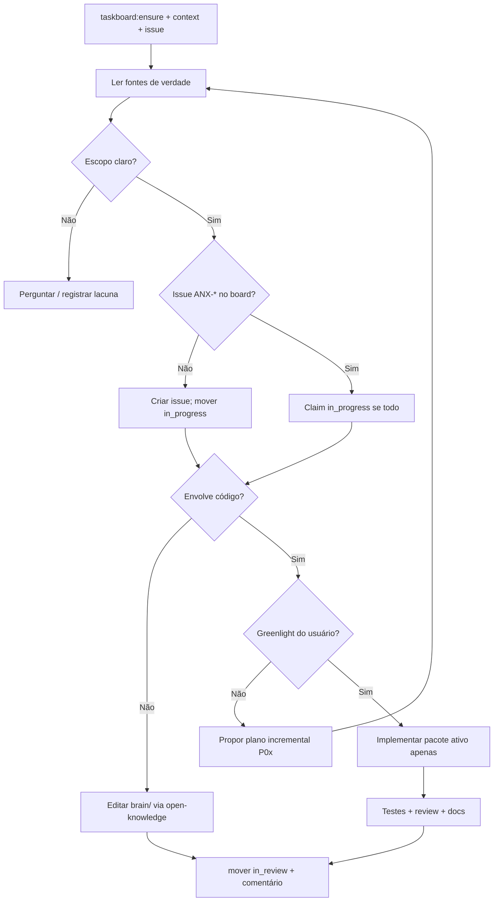

# anxionOS — instruções para agentes

Guia operacional do repositório. Leia antes de codar, propor arquitetura ou alterar documentação canônica.

## O que é o projeto

anxionOS é uma plataforma multi-tenant de investimentos autônomos governados por um **grafo institucional**: agências, agentes, modelos, estratégias, capital e decisões conectados com autoridade, risco e auditoria explícitos. Humanos e agentes compartilham contratos de domínio; a apresentação varia por papel (Owner, operador, plataforma, parceiro).

## Estado atual

| Aspecto | Situação |
| --- | --- |
| Código | **Não existe** `backend/` nem aplicação implantada verificada |
| Documentação | Ativa em `brain/` **local** (OKF; não versionada no GitHub) |
| Organização do backend | **Aceita** — [ADR0002](brain/project-docs/decisions/0002-adopt-modular-backend-layout.md) |
| Modelo operacional do grafo | **Proposto** — [ADR0001](brain/project-docs/decisions/0001-graph-operational-domain-authority.md) |
| PRD | Rascunho — [0001-anxionos-prd-mestre](brain/project-docs/proposals/0001-anxionos-prd-mestre.md) |

Esta fase autoriza **planejamento e documentação**.
## Repositório público vs. `brain/` local

A pasta **`brain/`** (Open Knowledge / OKF) é **somente local**: está no `.gitignore` e **não** é enviada ao GitHub. Os caminhos abaixo (`brain/index.md`, specs, ADRs) são fontes de verdade **no workspace local**; links relativos continuam válidos para quem tem `brain/` clonado ou sincronizado fora do git. Colaboradores que só clonam o remote veem [README.md](README.md) e este arquivo — obtenham `brain/` pelo canal acordado com o mantenedor.

**Não** commitar `brain/` neste repositório.

 Implementação de código exige greenlight explícito do usuário e segue a sequência P01→P09 documentada na estrutura do backend.

## Fontes de verdade

Com `brain/` presente localmente, consultar **antes** de implementar ou contradizer decisões:

1. **[brain/index.md](brain/index.md)** — índice e links principais
2. **[brain/notes/anxionos-backend-structure.md](brain/notes/anxionos-backend-structure.md)** — árvore de módulos, ownership, dependências e gates (baseline aceito)
3. **[brain/project-docs/specs/001-institutional-contract/spec.md](brain/project-docs/specs/001-institutional-contract/spec.md)** — SDD institucional e roadmap P01–P09
4. **ADRs** em [brain/project-docs/decisions/](brain/project-docs/decisions/) — decisões aceitas vencem propostas em conflito
5. **Specs de domínio** em [brain/project-docs/specs/](brain/project-docs/specs/) — contratos por capacidade (agents, investimento, connections, evolução)
6. **Notas de planejamento** em [brain/notes/](brain/notes/) — contexto operacional (connections, graph, inferência, catálogo)

Se um fato não está documentado, **não invente** stack, vendors ou comportamento. Registre lacuna ou pergunte.

## Regras de desenvolvimento

Aplicam-se quando houver implementação, conforme [estrutura do backend](brain/notes/anxionos-backend-structure.md):

### Layout (ADR0002)

- `backend/apps/` — composition roots (API Bun + Elysia; workers TypeScript)
- `backend/modules/` — donos de estado e casos de uso (23 módulos planejados)
- `backend/packages/` — contratos, eventing, database, secrets, observability
- `backend/services/` — runtimes especializados Go/Python por protocolo de job/evento
- `backend/tests/` e `backend/deploy/` — conforme árvore documentada

### Padrão por módulo

`domain/` → `application/` → `infrastructure/` + `api/` + `graph/` + `workers/`. Cada módulo expõe superfície pública em `index.ts`. Criar subpastas **somente** quando houver responsabilidade concreta.

### Dependências (resumo)

- `domain` não importa frameworks, providers nem apps
- Módulos se comunicam por contrato público, SDK ou evento versionado — nunca por repositório privado cross-module
- Estado + journal + outbox atômicos por domínio; `packages/eventing` é mecanismo, não regra de negócio
- Secrets só na infra autorizada; nunca em events, DTOs, prompts ou grafo
- Projeções de grafo nascem de eventos com `eventId`/`checkpoint`/`ownerDomain`

### Sequência de implementação

P01 (tooling e boundaries) → P02 (contracts, eventing, identity…) → P03 (graph) → P04–P09 conforme SDD. Criar **apenas** módulos e pastas do pacote ativo; não scaffoldar a árvore inteira.

### Qualidade mínima (quando houver código)

- Validação de schema nos boundaries (ex.: Zod)
- Testes de módulo, contratos e integração nos gates AR01–AR06
- Mudanças materiais de estrutura → atualizar nota + ADR com plano de migração

## MCP e ferramentas

### open-knowledge (`brain/`)

Use o MCP **open-knowledge** para buscar, editar e auditar documentação em `brain/`. Respeite frontmatter, templates OKF e status (`accepted` vs `proposed` vs `draft`).

### Supermemory

Em chamadas Supermemory, passe sempre `workspaceRoot` com o path absoluto deste repositório.

### code-review-graph

Quando existir código indexado, **priorize** as ferramentas code-review-graph antes de Grep/Glob/Read para exploração, impacto e review. Regras detalhadas no `AGENTS.md` global do usuário (fora deste repo).

| Ferramenta | Quando |
| --- | --- |
| `semantic_search_nodes_tool` / `query_graph_tool` | Explorar código e relações |
| `get_impact_radius_tool` | Blast radius de mudanças |
| `detect_changes_tool` + `get_review_context_tool` | Code review |
| `get_architecture_overview_tool` | Visão estrutural |

Até haver código, explore via documentação em `brain/`.

### Archify (diagramas)

[Archify](https://github.com/tt-a1i/archify) gera diagramas interativos (HTML/SVG) a partir de JSON tipado em `.archify/specs/`. **Complementa** o code-review-graph: Archify comunica arquitetura e fluxos; o grafo de código responde impacto e relações no source.

| Uso | Quando |
| --- | --- |
| Visão de plataforma / módulos | `architecture` — ex.: `.archify/specs/anxionos-platform.architecture.json` |
| Sequência de implementação P01–P09 | `workflow` — `.archify/specs/anxionos-delivery-p01-p09.workflow.json` |
| Fluxo Connections (binding → ledger) | `workflow` — `.archify/specs/anxionos-connections-inference.workflow.json` |
| Workflow de agentes ou runbooks | `workflow` — derivar do fluxo em AGENTS.md |
| Sequências de API / eventos | `sequence`, `dataflow`, `lifecycle` |

Comandos na raiz: `npm run archify:validate`, `npm run archify:build`. Detalhes em [.archify/README.md](.archify/README.md). Com `backend/` implantado, atualizar specs com evidência real — não inventar componentes.

### Frontend

Após alterações de UI, inspecionar com Chrome DevTools MCP quando aplicável.

### Dashi Taskboard (obrigatório — tempo real)

O [Dashi/Codex Taskboard](https://github.com/chuspeeism/dashi-taskboard) é a **fonte de verdade local** para todo trabalho neste repositório. Roda em loopback (`http://127.0.0.1:47823`); **não** entra no CI nem em deploy.

**Todo agente (humano ou IA) DEVE usar o board em tempo real.** Sem issue no board, sem trabalho — inclusive micro-fixes. Exceção: nenhuma.

#### Regras obrigatórias

1. **Antes de qualquer tarefa:** confirmar que o board está online e ler o contexto do projeto.
2. **Issue vinculada:** toda unidade de trabalho tem uma issue `ANX-*`. Se não existir, **criar antes de codar** (buscar duplicatas primeiro).
3. **Status em tempo real:** refletir o progresso no board conforme avança — nunca deixar issue desatualizada ao fim da sessão.
4. **Thread binding:** usar `CODEX_THREAD_ID`, `CLAUDE_CODE_SESSION_ID` ou `CURSOR_THREAD_ID` em claims e moves; binding completo conforme skill `manage-taskboard`.
5. **Comentários:** registrar decisões relevantes, bloqueios e resultado de verificação (via `taskctl comment add` se o wrapper não cobrir).
6. **Bloqueios:** mover para `blocked` com comentário explicando o impedimento.
7. **Multi-agente:** uma issue por unidade de trabalho; não duplicar; não tomar issue de outra conversa. Orquestração: skill `orchestrate-work` + `manage-taskboard`.

#### Fluxo de status

`backlog` (não executar sem autorização) → `todo` (claimable) → `in_progress` → `in_review` → `done` (só com aceite explícito). Também: `blocked`, `canceled`.

| Transição | Quando |
| --- | --- |
| → `in_progress` | Ao **iniciar** trabalho (claim com `--if-version`) |
| → `in_review` | Ao **terminar** implementação; comentário com o que mudou |
| → `done` | Só após aceite explícito do usuário/revisor |
| → `blocked` | Impedimento externo ou dependência não resolvida |

**Labels:** `for-claude` (elegível para agente), `hold` (não tocar), `phase-N` (fase P0x).

**Projeto:** `anxionOS` (resolvido por `workspacePath` do repo, `TASKBOARD_PROJECT_NAME` ou pin `TASKBOARD_PROJECT_ID` em `.env`).

#### Workflow: start work / end work

**Start work** (início de cada tarefa):

```bash
npm run taskboard:ensure          # falha se board offline — pare e suba o serviço
npm run taskboard:context
npm run taskboard:list            # ou: node scripts/taskboard.mjs get ANX-<N>
# issue inexistente → create antes de continuar
node scripts/taskboard.mjs move ANX-<N> in_progress   # requer taskctl + thread id
```

**End work** (fim da implementação, antes de pedir review):

```bash
# taskctl comment add ANX-<N> --text "..." --thread-id "$CODEX_THREAD_ID"
node scripts/taskboard.mjs move ANX-<N> in_review
# done só após aceite explícito
```

**CLI preferido:** `taskctl` (global ou macOS: `'/Applications/Codex Taskboard.app/Contents/Resources/bin/taskctl'`). Env: `CODEX_TASKBOARD_URL` ou `TASKBOARD_URL`.

**Wrapper do repo:**

```bash
cp .env.example .env   # opcional; defaults funcionam em dev local
npm run taskboard:ensure
npm run taskboard:context
npm run taskboard:list
node scripts/taskboard.mjs get ANX-2
node scripts/taskboard.mjs create --title "..." --status todo
node scripts/taskboard.mjs move ANX-2 in_progress
```

Escritas (`create`, `move`) exigem `taskctl` e thread id. Claim: mover `todo → in_progress` com `--if-version` e binding completo conforme `manage-taskboard`.

**API HTTP (leitura / fallback):** `GET /health`, `GET /api/projects`, `GET /api/tasks`, `POST /api/tasks`. Sem autenticação no modo local.

**Offline:** subir o app Codex Taskboard (ou serviço dashi-taskboard) na máquina; `npm run taskboard:ensure` deve passar antes de qualquer trabalho.

## O que NÃO fazer

- **Não** criar `backend/` com 23 módulos vazios ou pastas placeholder
- **Não** iniciar código sem greenlight explícito do usuário
- **Não** contradizer ADR0002 ou a estrutura aceita sem novo ADR
- **Não** tratar ADR0001 (proposto) como decisão fechada de stack física
- **Não** concentrar regra de negócio em rotas, workers globais ou `packages/common` genérico
- **Não** duplicar documentação canônica — linkar e atualizar a fonte em `brain/`
- **Não** commitar `brain/` nem segredos, credenciais ou dumps sensíveis
- **Não** codar nem alterar docs canônicas sem issue `ANX-*` ativa no taskboard
- **Não** deixar status do board desatualizado ao fim da sessão

## Workflow para agentes



1. **Taskboard:** `taskboard:ensure`, contexto, issue `ANX-*` em `in_progress` (criar se necessário)
2. **Ler** índice, estrutura do backend e specs/ADRs relevantes
3. **Propor** plano curto com critérios de sucesso verificáveis (Karpathy: simplicidade, mudanças cirúrgicas)
4. **Implementar** incrementalmente — um pacote P0x por vez, sem especulação
5. **Verificar** gates do SDD e AR01–AR06; mover issue para `in_review` com comentário
6. **Documentar** decisões novas como ADR; atualizar notas afetadas; `done` só com aceite explícito


## Repositório

| Recurso | Caminho |
| --- | --- |
| Visão geral e estado do projeto | [README.md](README.md) |
| Como contribuir | [CONTRIBUTING.md](CONTRIBUTING.md) |
| Licença | [LICENSE](LICENSE) |
| Templates GitHub (issues, PR, CI) | [.github/](.github/) |

## Idioma

Comunicação com o usuário em **português (PT-BR)**. Identificadores de código, contratos e commits podem seguir inglês quando já estabelecido na documentação.

## Links canônicos

| Documento | Caminho |
| --- | --- |
| Índice da knowledge base (local) | [brain/index.md](brain/index.md) |
| Estrutura do backend (aceita) | [brain/notes/anxionos-backend-structure.md](brain/notes/anxionos-backend-structure.md) |
| SDD institucional | [brain/project-docs/specs/001-institutional-contract/spec.md](brain/project-docs/specs/001-institutional-contract/spec.md) |
| Connections | [brain/project-docs/specs/005-connections-integration/spec.md](brain/project-docs/specs/005-connections-integration/spec.md) |
| Agents & knowledge | [brain/project-docs/specs/002-agents-knowledge/spec.md](brain/project-docs/specs/002-agents-knowledge/spec.md) |
| Ciclo de investimento | [brain/project-docs/specs/003-investment-lifecycle/spec.md](brain/project-docs/specs/003-investment-lifecycle/spec.md) |
| Evolução institucional | [brain/project-docs/specs/004-institutional-evolution/spec.md](brain/project-docs/specs/004-institutional-evolution/spec.md) |
| ADR — layout modular (aceito) | [brain/project-docs/decisions/0002-adopt-modular-backend-layout.md](brain/project-docs/decisions/0002-adopt-modular-backend-layout.md) |
| ADR — grafo operacional (proposto) | [brain/project-docs/decisions/0001-graph-operational-domain-authority.md](brain/project-docs/decisions/0001-graph-operational-domain-authority.md) |
| PRD mestre (draft) | [brain/project-docs/proposals/0001-anxionos-prd-mestre.md](brain/project-docs/proposals/0001-anxionos-prd-mestre.md) |
