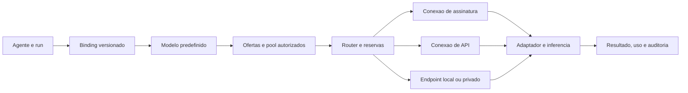

# anxionOS — Connections: gerenciamento e roteamento de modelos de IA

Versão 0.12, PRD de módulo em rascunho. Atualiza a v0.1 com o requisito confirmado: **todos os agentes usam um modelo predefinido; Connections gerencia acessos por assinaturas e APIs e executa o roteamento**. Repertório funcional e código de referência: [extração integral do 9Router](../research/9router-extracao-connections.md), fixada em [snapshot preservado](../external-sources/9router-eb712ca-source.md).

Documento integrado ao [PRD mestre](../project-docs/proposals/0001-anxionos-prd-mestre.md), ao [grafo](./anxionos-graph-domain-model.md) e ao [planejamento](./anxionos-planejamento-end-to-end.md). Nenhuma integração foi implementada ou habilitada nesta rodada.

## Integração e estrutura do backend

A [spec Connections integration v1](../project-docs/specs/005-connections-integration/spec.md) completa escopos organizacionais, Strategy bindings, runtimes locais, ensembles/cascatas explícitos, APIs/SDK/workers e pacotes CX-P1–CX-P7. Preserva SAME_MODEL_ONLY, rotação da conta menos recentemente despachada, SYSTEM_FREE e contratos v0.12. A [estrutura de backend aceita](./anxionos-backend-structure.md) define onde implementar cada responsabilidade. Descoberta/registry não equivalem a adapter homologado.

## Resolução dos gaps — contrato vigente

A [revisão do 9Router e do modelo](../research/9router-gaps-validacao.md) registra 12 achados, oito reproduções locais e um patch candidato. O [contrato operacional v1](./anxionos-connections-operational-contract.md) detalha as regras desta versão, incluindo SYSTEM_FREE, identidade de contas, reservas, rotação, erro/recuperação e aceites V01–V10. Seus defaults são escolhas técnicas desta revisão, sem afirmar implantação ou homologação.

## Problema e resultado esperado

O Owner precisa conectar seus acessos a inteligência, ver quais modelos cada conta realmente oferece, atribuir um modelo aos agentes e acompanhar disponibilidade, limites e custo. Agentes devem consumir inferência sem conhecer chaves, renovação de tokens ou particularidades de cada fornecedor.

Resultado: CEO, CIO, CRO e demais agentes nascem com bindings definidos pelo blueprint da empresa. O Owner pode alterar o modelo nas configurações, sob permissões e políticas. O router seleciona uma oferta compatível daquele modelo, depois conta, conexão e endpoint; não decide livremente qual modelo substituirá o configurado.

A assinatura comercial do anxionOS pertence a Billing & Entitlements. Uma assinatura de acesso a modelos pertence a AIProviderAccount/ProviderSubscription. Seus preços, quotas e ciclos são independentes.

## Decisões confirmadas e hipóteses

| Estado | Definição |
| --- | --- |
| Confirmado pelo usuário | Connections centraliza gestão e roteamento de LLM por assinaturas e APIs |
| Confirmado pelo usuário | Cada agente possui um modelo predefinido |
| Confirmado pelo usuário | Extrair o repertório do decolua/9router para o módulo |
| Proposta de contrato | AgentModelBinding é versionado e fixado no início de cada run |
| Hipótese em uso | Modelo permanece o mesmo durante failover entre conexões; substituição por outro modelo fica desabilitada |
| Confirmado pelo usuário — regra vigente | Providers configurados no onboarding; usuário/AGENCY usa contas próprias, gratuitas ou pagas, e ofertas SYSTEM_FREE publicadas; PLATFORM alterna globalmente entre contas elegíveis dos usuários |
| Confirmado pelo usuário | Agentes próprios da plataforma podem usar modelos pagos e gratuitos de todos os usuários, inclusive em tarefas internas |
| Confirmado pelo usuário | Connections gerencia effort, thinking e demais parâmetros de inferência |
| Default técnico da revisão | SYSTEM_FREE é oferta administrada pela plataforma e gratuita ao consumidor; não republica contas de outros usuários |
| Configuração de lançamento | Providers/modelos iniciais, valores de quotas/budgets, reserva titular/PLATFORM, retenção e custeio SYSTEM_FREE |
| Em aberto | Fallback entre modelos explicitamente configurados, ainda aguardando preferência do usuário |

Capabilities servem para validar o modelo/oferta predefinido. Falta de tools, contexto ou modalidade resulta em incompatibilidade explícita. O roteador não escolhe outro modelo escondido para compensar.

## Fronteiras

Connections cuida de registry, autenticação upstream, pools, seleção de rota, tradução, inferência, quotas, uso e saúde. Graph Kernel resolve autoridade e contexto institucional. Agent Runtime conduz sessões/tarefas. Tool Gateway autoriza e executa chamadas de ferramentas. Risk e Execution controlam o capital próprio do Owner.

Uma resposta do modelo propondo uma ordem não concede autorização de trading. Mudança de mercado da empresa (stocks/cripto/ambos) não troca automaticamente seus modelos. Billing não confunde tokens com patrimônio ou exposição financeira.

## Jornadas do usuário

1. **Conectar assinatura:** escolher provider → visualizar método disponível → autorizar por OAuth/device flow suportado → identificar conta/plano → descobrir e testar ofertas → publicar no escopo permitido. Estados de expiração, reautorização e quota são visíveis.
2. **Conectar API:** escolher provider/endpoint → fornecer segredo em campo protegido → testar → verificar modelos → definir escopo, limite e prioridade → ativar. Exibir apenas identificação mascarada após salvar.
3. **Configurar agente:** abrir agente → escolher modelo permitido → verificar ao menos uma rota compatível → salvar nova versão do binding → mostrar impacto nos próximos runs. Agente sem rota fica aguardando configuração, sem escolha silenciosa.
4. **Acompanhar execução:** tarefa → modelo configurado → rota selecionada → tentativas → tokens/consumo → resultado. Explicar exclusões sem revelar outras empresas ou segredos.
5. **Recuperar indisponibilidade:** observar cooldown, quota ou autenticação expirada → reautorizar/adicionar conexão/mudar binding conforme permissão → retomar tarefa de forma controlada.
6. **Administrar:** usuário consulta somente suas contas configuradas e todas as informações disponíveis delas; administrador da plataforma consulta todas as contas de todos os usuários, com filtros, consolidação e detalhe. Operador recebe apenas diagnósticos autorizados.

Onboarding retoma sem duplicar contas, bindings ou C-levels. O blueprint contém binding obrigatório para cada agente; conta indisponível deixa o agente configurado e suspenso para inferência. Nomes concretos de modelos do blueprint ainda serão escolhidos.

## Onboarding e política de compartilhamento

Definição confirmada na [resposta do usuário](./anxionos-brainstorm.md): cada usuário configura seus providers e assinaturas durante o onboarding. As configurações persistem em Connections e podem ser administradas depois.

| Tipo de oferta | Agentes do titular | Agentes de outras empresas | Própria plataforma |
| --- | --- | --- | --- |
| Gratuita em conta particular, com acesso verificado | Permitido | Proibido: não consumir conta de outro usuário | Permitido com alternância balanceada |
| API paga ou assinatura paga | Permitido no escopo do titular | Proibido para agentes desses outros clientes | Permitido aos agentes próprios da plataforma, inclusive tarefas internas |
| Preço ou entitlement desconhecido | Validar antes de ativar | Não publicar como gratuita | Validar antes de ativar |
| SYSTEM_FREE administrado pela plataforma | Permitido por publicação/grant e quota da empresa | Disponível a empresas elegíveis, sem expor contas internas | Permitido por grant e capacidade próprios |

Regra vigente: somente os agentes próprios PLATFORM usam o conjunto global de contas dos usuários. Usuário e agentes AGENCY usam contas de seu titular e ofertas SYSTEM_FREE administradas/publicadas pela plataforma. SYSTEM_FREE não permite consumir contas particulares de outros usuários. Modelo predefinido, perfil, grants e limites são obrigatórios em ambas as origens. O catálogo mostra ofertas; não revela contas internas.

**Propriedade, gratuidade e permissão são dimensões distintas.** Uma conexão continua pertencendo ao usuário que a configurou, mesmo quando publica uma oferta gratuita. API key é método de autenticação, não prova de cobrança. Classificar por oferta/entitlement: um provider pode expor modelos gratuitos e pagos na mesma conta. Franquia incluída em assinatura paga, créditos comprados e acesso promocional com débito de saldo não tornam a conexão gratuita global.

### Passos do onboarding

1. Cadastrar/autorizar providers, APIs e assinaturas do usuário, com titular identificado.
2. Descobrir ofertas e verificar autenticação, entitlement, capacidades e classificação de custo.
3. Mostrar ao usuário a regra do produto: ele e seus agentes usam suas próprias contas e ofertas gratuitas SYSTEM_FREE publicadas; agentes próprios da plataforma usam as contas elegíveis dos usuários em rotação balanceada.
4. Persistir conta, conexão, referências de segredo e versões; disponibilizar ofertas verificadas para o titular e para o pool dos agentes PLATFORM.
5. Criar grants do titular para suas ofertas gratuitas/pagas e grants PLATFORM_INTERNAL. SYSTEM_FREE possui publicação e grant próprios por elegibilidade da empresa. Não criar grant de cliente para contas de outro usuário.
6. Validar os bindings de todos os agentes C-level contra as rotas elegíveis; registrar bloqueios de configuração.
7. Concluir a etapa quando a configuração estiver válida; falhas podem ser retomadas sem duplicar conexões ou grants. Não exigir contratação paga: provider gratuito também atende à etapa.

Cadastro/descoberta não habilita consumo antes da validação. Agentes podem permanecer provisionados enquanto esta etapa estiver pendente. O eventual adiamento da etapa para concluir o onboarding comercial ainda será definido.

### Uso pela própria plataforma

Agentes da plataforma são configurados e gerenciados pelos administradores da plataforma, pertencem ao escopo PLATFORM e não são agentes de usuários. Os agentes das empresas, incluindo CEO e demais C-levels provisionados no onboarding, pertencem ao escopo AGENCY do respectivo usuário. Um administrador editar ou prestar suporte a um agente de usuário não altera essa classificação.

O painel administrativo mantém cadastro próprio de agentes da plataforma, com modelo, perfil de inferência, políticas e ciclo de vida configurados pelos administradores. O servidor verifica vínculo institucional e registro administrativo; não deduz escopo pela pessoa que fez a última edição, pelo runtime utilizado ou pelo nome/papel do agente.

Confirmado pelo usuário: agentes próprios da plataforma podem usar ofertas pagas e gratuitas de todos os usuários, inclusive para trabalho interno. PLATFORM_INTERNAL passa a ser finalidade elegível no planejamento. A regra substitui a hipótese anterior limitada a tarefas para o titular.

Cada chamada registra agentId, agentScope, servicePrincipalId, purpose, beneficiaryScopeId, fundingSourceId, fundingAccountId quando houver, capacityResourceId e grantId. AgentScope PLATFORM é atribuído pelo domínio de identidade a agentes próprios da plataforma; não é um parâmetro que um agente cliente possa escolher. Leitura de administrador, delegação por um cliente ou passagem pelo gateway não transforma agente de empresa em agente de plataforma.

Grants de consumo PLATFORM_INTERNAL são materializados pela política de onboarding e contemplam as ofertas elegíveis pagas/gratuitas do titular. Contas já existentes exigem atualização versionada dessa política. Quotas, budgets e concorrência continuam sendo respeitados; proporções entre uso do titular e uso da plataforma ainda serão definidas. Atribuir ao titular da conta o custo upstream e identificar separadamente o consumo da plataforma; reembolso ou crédito comercial não foi definido. Compartilhar inferência não compartilha capital, memórias, prompts, resultados ou autoridade.

### Custo, quota e retirada de publicação

Uma rota classificada como gratuita não pode debitar saldo pago silenciosamente. Esgotar quota gratuita exige reavaliar outra oferta e seu orçamento; uso pago da plataforma é identificado como pago. Usuário/AGENCY nunca migra para conta de outro usuário, independentemente do preço. Pode consumir oferta SYSTEM_FREE elegível conforme binding/política; gratuidade para o usuário e custo upstream são campos separados.

Mudança de preço, fim de promoção, entitlement vencido ou classificação desconhecida exige reavaliar elegibilidade, orçamento e classificação antes de novas tentativas. Nenhuma mudança torna a conta de outro usuário elegível a agente AGENCY; publicação SYSTEM_FREE não usa contas particulares de usuários.

Revogar/desconectar a conta retira suas ofertas de novas seleções, invalida caches de elegibilidade e preserva histórico. O algoritmo do pool deve limitar concorrência por conta e distribuir capacidade entre empresas; pesos e limites numéricos continuam pendentes. Dados e sessões upstream também precisam de separação: oferta sem isolamento de sessão adequado não é elegível para uso entre empresas.

## Modelo de domínio

| Entidade | Campos/contrato essencial |
| --- | --- |
| Provider | id, nome, adapterId, estado e documentação de referência |
| AIProviderAccount | id, providerId, titular, scopeId, identidade upstream quando verificada, nome e status; múltiplas contas por titular/provider |
| ProviderSubscription | accountId, plano declarado/verificado, vigência, entitlement, quotas conhecidas; sem presumir franquia ilimitada |
| Connection | accountId quando houver, accessKind, authMethod, ownerScope, status, configVersion, credentialRef quando exigido; NONE usa capacityResourceId sem conta fictícia |
| Endpoint | URL autorizada, protocolo, rede/região declarada, transporte e política de saída |
| CredentialRef | id, versão, tipo, expiração, estado; segredo apenas no cofre |
| Model / ModelVersion | identidade canônica, versão/snapshot quando disponível, estado de depreciação |
| ModelOffering | modelVersionId ou alias rastreável, connectionId quando houver, endpointId, capacityResourceId, upstreamModelId, capabilities, upstreamCostClass, consumerChargeMode, entitlementRef e validade |
| OfferingPublicationVersion / SupplyScope | OWNER_PRIVATE ou SYSTEM_FREE; elegibilidade, grant, capacidade, trustProfile, financiamento e versão; sem ampliar leitura de contas |
| OfferingAccessGrant | offeringId/publicationId, principalScope, purpose, fundingSourceId, fundingAccountId quando houver, quotaPolicyId, validFrom/Until, versão e estado; nunca contém segredo |
| CapabilityProfile | declaração, teste, origem, data e limites por oferta/adaptador |
| ModelReference / ModelGroupAssignment | Nome informado, identidade resolvida, G1–G4 ou UNCLASSIFIED, política/método/evidência e vigência |
| ContextProfileVersion / ModelCapabilityEvidence | Contexto/input/output, contabilidade, capacidades por oferta, proveniência, confiança e status |
| TaskSuitabilityProfileVersion / CatalogRelease | Adequação por tarefa/rubrica, classificação publicada e diff sem alterar binding |
| AgentModelBinding | agentId, agentScope (AGENCY/PLATFORM), modelId, versionSelector, poolId, routingPolicyVersionId, inferenceProfileVersionId, validFrom/Until, changedBy/reason |
| InferenceProfileVersion / EffectiveInferenceConfig | Parâmetros versionados, origem, overrides autorizados, schema/adapterVersion, configuração solicitada, resolvida e enviada |
| ConnectionPool / OwnerProviderPool | Escopo, titular/provider quando privado, contas elegíveis, estratégia e versão; vários acessos da mesma conta não duplicam capacidade |
| TaskRoutingPolicyVersion / TaskRequirementsSnapshot | Tipo/complexidade, requisitos, perfil permitido, providers/ofertas compatíveis, prioridade, deadline e motivos versionados |
| RoutingPolicyVersion | restrições, seleção de conexão, timeout, attempts, orçamento, afinidade e fallback permitido |
| QuotaWindow | escopo, unidade, janela, limite, usado/reservado, resetAt, observedAt, origem |
| Budget / BudgetReservation | unidade monetária/créditos, escopo, janela, teto, reserva atômica e liquidação |
| PriceVersion | unidade, moeda, vigência e origem; custo marginal separado de custo fixo de assinatura |
| InferenceRequest | tenant/agency/agent/run/task, bindingVersion, requestId, deadline e classificação |
| RoutingDecision | política, candidatos elegíveis/excluídos, motivos, oferta escolhida |
| InferenceAttempt | requestId, número, connectionId, upstreamRequestId, tempos, estado, adapterVersion |
| UsageRecord | valores observados/estimados, preço aplicado, ajustes, custo conhecido ou pendente |
| ModelEvaluation | rubrica, conjunto de avaliação e resultado; recomenda revisão humana do binding |

`accessKind`: SUBSCRIPTION, API, LOCAL ou COMPATIBLE. `authMethod` é independente: API_KEY, OAUTH_PKCE, DEVICE_CODE, NONE para endpoint homologado sem autenticação e métodos específicos homologados. O upstream possui importadores adicionais; não são condição para o onboarding normal.

A mesma família comercial através de dois providers não garante a mesma versão ou comportamento. ModelOffering declara equivalência verificada; aliases mutáveis ficam identificados como tal. Registrar requestedModel, resolvedUpstreamModel e actualModelReported separadamente; ausência de versão reportada permanece desconhecida.

## Tipos de modelo e bindings por finalidade

O [contrato multimodal](./anxionos-multimodal-inference.md), fundamentado na [análise da NVIDIA Build](../research/nvidia-model-types-connections.md), amplia o requisito para TTS, embeddings e demais operações. Model/ModelVersion declara taskKinds; ModelOffering identifica operações e limites realmente disponíveis. ModelOperationSchema tipa entradas, saídas, parâmetros, protocolo e unidades de consumo. Publisher, operador de inferência e deploymentKind HOSTED/PARTNER/SELF_HOSTED/LOCAL são dimensões separadas.

Cada agente mantém um binding principal de raciocínio e pode ter no máximo um padrão vigente por slot/finalidade, como speech.synthesis ou speech.transcription. InferenceBindingVersion generaliza AgentModelBinding para agentes e serviços institucionais; o escopo do consumidor permanece validado. Embeddings de query/documento e reranker são vinculados à coleção/serviço Knowledge para preservar compatibilidade do índice. Ausência de configuração gera NOT_CONFIGURED, sem seleção implícita de modelo.

EmbeddingSpaceContract registra versão, dimensão e transformações compatíveis; trocar espaço exige novo índice/reindexação em Knowledge. VoiceProfile mantém voz/idioma/formato. ArtifactRef e InferenceJob oferecem resultados protegidos e tarefas assíncronas; segmentos do mesmo stream não são novas requisições de balanceamento. Unidades de uso incluem tokens, caracteres, segundos, páginas, vetores, pares, bytes e GPU, conforme oferta, sem somar unidades diferentes. MM01–MM12 complementam V01–V10 e MC01–MC10.

## Catálogo inteligente e grupos de modelos

O [catálogo e classificação de modelos](./anxionos-model-catalog.md) incorpora os quatro grupos definidos pelo usuário: G1 gpt-astra/fable; G2 opus/gpt-sol/deepseek 4 pro/lua; G3 sonnet 5/gpt-lunna/deepseek 4 flash; G4 gpt-5.4-mini/haiku. Os nomes são referências de grupo até resolução de identidade; não certificam equivalência, janela ou suporte upstream.

Classificar separadamente grupo, janela de contexto, capacidades e adequação por tarefa. Contexto/input/output têm limites por oferta e regra de contabilização, com origem, data e status de verificação. O catálogo descobre, normaliza, avalia e publica dados sob política versionada; desconhecido fica explícito. Grupos ajudam a escolher o modelo do binding, sem trocar automaticamente o modelo de um agente. C1–C5 incluem MC01–MC10 do contrato de catálogo.

## Catálogo contínuo e restrição de modelos caros

Requisito confirmado: detectar alterações por provider e automaticamente analisar, classificar, publicar e disponibilizar novos modelos. O [contrato de automação e custo](./anxionos-catalog-automation.md) define watchers EVENT/POLL/HYBRID, diffs, jobs idempotentes, publicação e habilitação imediata de operações compatíveis para consumidores autorizados. Não exigir cadastro manual nem benchmark completo antes de uso básico admissível. Falhas de contrato/dado obrigatório ficam localizadas; publicação não troca bindings nem concede grants.

Modelos caros só podem operar em PLANNING ou SPECIAL validados pelo servidor, com política, modelo fixo e orçamento. ROUTINE é bloqueado. Classificação de caro combina regra explícita de modelo/oferta e custo estimado por tarefa; não equivale a G1–G4 ou a todo modelo pago. Blueprint pode ter reasoning.primary econômico, reasoning.planning e reasoning.special predefinidos. Falta de slot válido não autoriza fallback silencioso. C1–C4 incluem CA01–CA12; thresholds numéricos e allowlist especial são configuração de lançamento.

## Contrato do binding e do router

```typescript
// Visão do binding principal; outros slots seguem InferenceBindingVersion.
type AgentModelBinding = {
  purpose: "reasoning.primary";
  taskKind: "text.generate";
  id: string;
  version: number;
  agentScope: { kind: "AGENCY"; agencyId: string } | { kind: "PLATFORM"; platformId: string };
  agentId: string;
  modelId: string;
  versionSelector: string;
  connectionPoolId: string;
  routingPolicyVersionId: string;
  inferenceProfileVersionId: string;
  allowedSupplyScopes: Array<"OWNER_PRIVATE" | "SYSTEM_FREE">;
  supplyPreference: "OWN_FIRST" | "FREE_FIRST" | "SYSTEM_FREE_ONLY";
  fallbackMode: "SAME_MODEL_ONLY"; // baseline; extensão entre modelos em discussão
};

type InferCommand = {
  requestId: string;
  agentScope: { kind: "AGENCY"; agencyId: string } | { kind: "PLATFORM"; platformId: string }; // validado no servidor
  agentId: string;
  runId: string;
  taskId: string;
  bindingId: string;
  bindingVersion: number;
  taskKind: string; // validado contra binding e ModelOperationSchema
  deadlineAt: string;
  inputRef: string;
  dataClassification: string;
};
```

O runtime não envia apiKey, provider preferido arbitrário ou modelo diferente do binding. O servidor deriva e valida identidade/escopo; os campos do request não concedem acesso por si mesmos.

1. Autenticar workload e resolver binding/autoridade vigentes.
2. Capturar versão de política e classificação/requisitos da tarefa por tipo/complexidade; resolver perfil autorizado e validar se o run continua autorizado.
3. Listar ofertas do modelo permitido, com versão e capacidades compatíveis.
4. Filtrar grants por titular/beneficiário/finalidade, classe gratuita ou paga, entitlement, dados, destino, saúde, quota e orçamento. Para usuário/AGENCY, aceitar conta do titular ou publicação SYSTEM_FREE com grant, conforme binding; excluir contas de outros usuários. Para PLATFORM, incluir contas globais elegíveis e aplicar alternância por requisição.
5. Para PLATFORM, escolher a próxima conta elegível da rotação coordenada e depois sua conexão/endpoint; para AGENCY, selecionar a origem autorizada e balancear contas próprias ou recursos SYSTEM_FREE compatíveis com a tarefa. Validar compatibilidade de continuidade antes de dispatch.
6. Reservar capacidade/orçamento atomicamente; criar decisão e tentativa.
7. Resolver segredo dentro do adaptador confiável; renovar quando necessário.
8. Traduzir conforme contrato, chamar upstream e transmitir eventos normalizados.
9. Registrar resultado/uso, liquidar reserva e publicar eventos; reconciliar consumo incerto.



Priorizar assinatura antes de API paga é opção explícita da política e só entre ofertas equivalentes elegíveis. Não deve ocorrer gasto em API paga apenas porque uma assinatura esgotou a quota, sem orçamento e permissão para aquela rota.

## Perfis de inferência: effort, thinking e demais parâmetros

O [contrato completo de configuração](./anxionos-inference-config.md) define InferenceProfileVersion e EffectiveInferenceConfig. Cada agente de empresa ou da plataforma tem modelo e perfil predefinidos; alterações são versionadas e capturadas por run.

Gerenciar modos de reasoning/thinking, níveis de effort, budget de raciocínio, limites de saída/contexto, amostragem, formato/verbosidade, ferramentas, modalidades, streaming, cache e extensões do provider conforme suporte verificado. O painel mostra apenas opções compatíveis e permite pré-visualizar configuração solicitada, efetiva e mapeamento nativo.

Não há escala universal de effort nem conversão universal para tokens. O router filtra ofertas pela configuração exigida antes de selecionar conta. Rejeitar incompatibilidades ou aplicar adaptação previamente configurada, visível e rastreável; não reduzir effort, ativar thinking ou perder parâmetros silenciosamente no failover.

## Alternância balanceada das contas da plataforma

Regra confirmada: cada nova requisição de agente PLATFORM escolhe uma conta diferente da seleção anterior do pool elegível. Não atribuir contas permanentemente a agentes. Como política proposta, usar round-robin por conta upstream, coordenado entre todos os agentes PLATFORM e réplicas do router.

- Filtrar primeiro modelo/perfil, autenticação, grants, dados, quota, orçamento e capacidade. Não trocar modelo para forçar uma conta diferente.
- Rotacionar Account, não apenas Credential/Connection: duas API keys ou endpoints da mesma conta não constituem alternância.
- Reservar posição da rotação e capacidade atomicamente no dispatch. Cada tentativa enviada entra na contagem; retry tenta outra conta elegível e respeita o deadline.
- Repetição idempotente do mesmo request retorna seu estado existente, sem nova seleção ou avanço da rotação.
- Com A/B/C elegíveis: requisições de agentes P1, P2, P1, P3 usam A/B/C/A. Conta pode ser reutilizada após a rodada; não há exclusividade vitalícia por agente.
- A regra equilibra contagem de requisições/tentativas entre contas igualmente elegíveis; não promete igualdade de tokens ou custo. Mostrar ambas as distribuições.
- Se uma conta sair por quota/saúde, pular e registrar motivo. Ao voltar, reintegrar sem compensação em rajada. Regras de múltiplos conjuntos de elegibilidade devem preservar contabilização global por conta e limites upstream.
- Não há promessa de uma conta diferente para cada requisição simultaneamente ativa quando a demanda exceder o número de contas. Limite de concorrência e fila permanecem controles distintos da rotação.
- Default SINGLE_ACCOUNT_WAIT: conta única pode ser usada se difere da última seleção; se é a mesma, aguardar alternativa até deadline e retornar ROTATION_ALTERNATIVE_UNAVAILABLE. Reutilização irrestrita não foi confirmada. O contrato operacional define sequência global, conjuntos variáveis e custo de coordenação.
- Sessão upstream que exige afinidade obrigatória não pode cumprir alternância por chamada. Para PLATFORM, usar contexto/continuidade portável quando suportado; caso contrário, declarar rota incompatível, sem manter sticky account escondido.

Para contas particulares, usuário e seus agentes permanecem restritos ao ownerUserId correspondente. A origem adicional SYSTEM_FREE usa publicação da plataforma e quota da empresa. Com várias contas próprias, inclusive assinaturas e APIs do mesmo provider, o sistema balanceia entre as elegíveis; nunca recorre às de outro usuário. A rotação global não conta chamadas próprias do titular como novos turnos PLATFORM, mas essas chamadas continuam consumindo a quota/capacidade comum.

## Múltiplas contas do mesmo provider

Definição confirmada: o usuário cadastra múltiplas contas, incluindo assinaturas e APIs distintas do mesmo provider. Não há limite numérico de contas definido nesta rodada. Uma conta não sobrescreve outra por compartilhar provider, nome ou modelo.

Organização proposta: **titular → provider → contas → conexões/credenciais → ofertas de modelos**. Uma mesma conta upstream pode ter acessos por assinatura e API: representar esses acessos separadamente, preservando o vínculo quando conhecido e os grupos reais de quota. Não presumir que assinatura e API oferecem os mesmos modelos, parâmetros ou créditos.

Cada conta mantém accountId interno, identidade upstream quando conhecida, dono, nome de exibição, estado e grupos de quota. Connection mantém método de autenticação, endpoint, segredo referenciado e versão de configuração. Tokens, refresh, headers de transporte e metadados específicos nunca ficam em um único registro global mutável do provider.

Cadastro repetido é detectado por identidade upstream verificada no escopo do titular. Nome/e-mail isolados não bastam para fundir contas. Importação inconclusiva exige reconciliação de identidade; não mesclar automaticamente contas nem contar keys duplicadas como capacidade nova.

### Balanceamento das contas do usuário

OwnerProviderPool agrupa contas do mesmo titular/provider. Uma política de rota pode considerar vários pools próprios, desde que exponham o modelo/perfil permitido.

1. Resolver titular autenticado, agente, tarefa e modelo configurado.
2. Classificar a tarefa e derivar requisitos sob política versionada.
3. Encontrar providers/ofertas que atendem modelo, perfil, modalidade, dados e deadline.
4. Dentro do conjunto permitido, balancear as contas do titular considerando quota, concorrência e saúde.
5. Reservar recursos de forma atômica e despachar; registrar classificação, provider, conta, conexão e configuração efetiva.

Baseline proposto: round-robin entre contas igualmente elegíveis, pulando indisponíveis e respeitando limites. Uma conta própria única pode atender ao usuário dentro de seus limites; o default SINGLE_ACCOUNT_WAIT é específico à rotação de contas contribuídas para PLATFORM. Número de contas não altera o isolamento de propriedade.

Falha de autenticação na conta 1 não desabilita contas 2/3 do mesmo provider. Rate limit de uma key pode atingir conta/projeto compartilhado; atualizar o grupo correto sem multiplicar quota. Credenciais são renovadas sob lock por conta/credencial, não por nome do provider. O consumo do titular e de PLATFORM usa o mesmo controlador de quota real, embora suas políticas/contagens de balanceamento sejam separadas.

### Tarefas por tipo e complexidade

TaskRoutingPolicyVersion descreve tipos de trabalho, sinais de complexidade, capabilities necessárias, perfil permitido, prioridade, deadline, limites e providers/ofertas elegíveis. Classificação recomendada começa por regras auditáveis e metadados do runtime; texto da tarefa informa requisitos, mas não pode alterar grants ou regras de acesso.

TaskRequirementsSnapshot registra taskType, complexity, inputEstimate, requiredCapabilities, dataClassification, deadlineAt, profileSelectionRuleId, classificação/versão e motivo. Tipo, complexidade e prioridade são dimensões diferentes: tarefa longa não tem prioridade automática sobre tarefa urgente.

| Tipo ilustrativo | Sinais de complexidade | Requisitos que orientam a rota |
| --- | --- | --- |
| Classificação/extração | Volume, número de campos e estrutura da entrada | Saída estruturada, tamanho de contexto e prazo |
| Resumo/documentos | Tokens, documentos e necessidade de referências | Contexto adequado, perfil de resumo e limites de saída |
| Código/ferramentas | Número de passos, schemas e dependências | Tool calling, structured output e integridade de chamadas |
| Pesquisa/análise | Fontes, contexto, profundidade e múltiplos passos | Perfil de reasoning autorizado, contexto e orçamento |
| Multimodal | Imagem/áudio/vídeo, resolução e duração | Modalidade e limites daquela oferta |
| Batch/segundo plano | Quantidade de itens e janela de execução | Suporte de job, fila, custo e cancelamento por lote |

Classes de complexidade propostas: simples, intermediária, complexa e desconhecida. Limiares dependem de avaliação por tipo; não inventar equivalência universal entre “complexa” e effort high. Se for adotado classificador por LLM, terá modelo/rota fixos de bootstrap, orçamento e política de erro próprios, sem chamada recursiva ao classificador para decidir como classificá-lo.

O classificador seleciona requisitos e um perfil dentro dos presets/overrides autorizados. O perfil é resolvido antes do run e preservado por tentativa. Sem regra válida ou evidência suficiente, usar o perfil padrão do agente ou devolver classificação pendente conforme política; não elevar orçamento arbitrariamente.

**Compatibilidade com modelo predefinido:** classificar tarefa não permite usar outro modelo porque um provider é especializado. Primeiro identificar ofertas do modelo configurado; só então distribuir tarefas entre providers compatíveis. Se apenas um provider expõe esse modelo, balancear suas contas; se nenhum atende ao requisito, informar incompatibilidade/indisponibilidade. Escolha entre modelos autorizados por tarefa foi perguntada e continua pendente.

### Fila, conflitos e diagnóstico

Fila/admissão por provider e grupo de limite organiza tarefas conforme prioridade autorizada, deadline e capacidade disponível. Lease e idempotency key evitam dois workers despacharem a mesma tentativa; espera não muda propriedade nem reserva capacidade indefinidamente. Concorrência de tarefas simples não bloqueia indefinidamente tarefas complexas: política de distribuição/aging precisa ser definida e testada.

Ao falhar uma rota, reavaliar outra conta própria do mesmo provider e, se permitido, outra oferta própria em provider compatível. Preservar modelo, perfil, contexto portável e limite total de tentativas. Sessão com afinidade obrigatória pode restringir o pool e deve aparecer no diagnóstico; não mover contexto incompatível silenciosamente.

Dashboard pessoal agrupa por provider e mostra cada conta, assinatura/API, modelos, tarefas em fila, capacidade conhecida, uso e motivo de seleção/exclusão. Administrador vê os mesmos agrupamentos por titular e a distribuição PLATFORM. Explicação da rota distingue classificação da tarefa, elegibilidade do provider e escolha da conta.

## Catálogo free e cooldown governado

Requisito confirmado: gerenciar lista de modelos publicamente declarados free e seu cooldown. O [contrato free/cooldown](./anxionos-free-cooldown.md) define FreeDeclaration, PublicFreeCatalog, SourceSnapshot, CooldownRecord e QuotaGroup, com CF01–CF16. Tags/flags/variantes oficiais são catalogadas com proveniência; sem piso de 200k tokens, sem remover :free, sem converter missing price em zero. Gratuidade declarada, acesso do consumidor e disponibilidade atual são dimensões separadas.

Cooldown aplica-se ao escopo comprovado: conta+modelo+operação, conta/credencial, endpoint/recurso público, quota group ou provider. Registros persistidos têm geração, notBefore e recheckAt; prazo conhecido não é encurtado. Agregar máximo de bloqueios aplicáveis por rota e mínimo entre rotas autorizadas, sem previsão garantida para autenticação/revogação. Workers revalidam com lease e limites; sucesso antigo não limpa bloqueio novo. Conta noauth também tem capacityResourceId e bloqueio.

Dashboard mantém free em cooldown visível e mostra origem/condições/reset/freshness, respeitando titular/admin. Recuperação é direcionada por cooldownId, geração e motivo; limpar cooldown não limpa quota upstream nem concede autoridade. Fonte stale permanece explícita. Política econômica é separada de supplyPreference: nenhum fim de gratuidade autoriza variante paga ou outro modelo silenciosamente.

## Estados e falhas

Conexão: DRAFT → VALIDATING → ACTIVE; pode ir para DEGRADED, THROTTLED, REAUTH_REQUIRED, DISABLED ou REVOKED. Estado de conexão e saúde por modelo são distintos.

Request: RECEIVED → VALIDATED → QUEUED (opcional) → ADMITTED → RUNNING → SUCCEEDED/FAILED/CANCELLED/PARTIAL/UNKNOWN_OUTCOME. Attempt e liquidação têm estados separados definidos no contrato operacional; consumo pode seguir pendente mesmo com texto concluído.

| Ocorrência | Regra proposta |
| --- | --- |
| 429/quota esgotada | Registrar janela/reset e tentar outra conexão elegível do mesmo modelo, respeitando deadline e limite total |
| 5xx/rede | Retry somente quando envio não ocorreu ou há garantia remota aplicável; possível envio sem confirmação gera UNKNOWN_OUTCOME. Backoff não prova ausência de cobrança |
| Token expirado | Uma renovação coordenada; credencial nova persistida com controle de versão |
| Refresh inválido/revogado | REAUTH_REQUIRED; interromper uso dessa credencial |
| Modelo inexistente, input inválido, contexto/capability insuficiente | Erro terminal de contrato; não adivinhar provider nem perder campos silenciosamente |
| Negação de política/dados/conteúdo | Encerrar ou escalar conforme política; não usar rota alternativa para contornar a restrição |
| Sem rota elegível | MODEL_UNAVAILABLE com motivo e retryAt quando conhecido; tarefa aguardando com prazo |
| Orçamento insuficiente | BUDGET_EXCEEDED; sem upgrade/downgrade implícito |
| Streaming parcial ou efeito remoto incerto | Marcar parcial/incerto; não concatenar nova geração como continuação equivalente |
| Cancelamento | Propagar abort quando suportado, liberar parte não consumida e reconciliar o restante |
| Tool call duplicada | Connections devolve proposta; Tool Gateway controla idempotência da ação externa |
| Remoção de conexão/política durante run | Revalidar antes de nova tentativa; revogação prevalece sobre configuração capturada |

Timeout não prova que o provider não cobrou. Idempotency key do gateway evita duplicações internas, mas não promete exactly-once no upstream. Cada tentativa tem identidade e orçamento próprios; retries não executam ferramentas automaticamente.

## Segredos, isolamento e concorrência

Escopos: plataforma, organização, empresa/Agency e pessoal. Ofertas gratuitas e pagas do titular atendem somente a ele/seus agentes AGENCY e aos agentes próprios PLATFORM. Grants sobre o conjunto de contas particulares dos usuários são exclusivos de PLATFORM. SYSTEM_FREE tem publicação própria, sem conceder consumo entre contas de usuários. Propriedade, leitura e administração das contas continuam privadas ou administrativas conforme papel.

Cofre guarda segredos; grafo, logs e respostas contêm CredentialRef. API key upstream difere da credencial do consumidor do gateway. Se o provider não emitir token temporário, o segredo permanente fica restrito ao adaptador; não inventar short-lived credentials.

OAuth usa sessão vinculada ao ator/tenant, state de uso único, PKCE quando aplicável, expiração e callback registrado. Polling de device code respeita intervalos e expiração. Refresh exige lock por conta/credencial entre réplicas e compare-and-swap de versão; não apenas Map em memória.

Quotas e reservas usam operação atômica no estado autoritativo. Endpoint customizado requer política de destino, redirects e rede; conexão local não é automaticamente privada se encaminhar dados externamente.

Captura de prompts/respostas depende de retenção e classificação. Trace deve explicar a rota sem conteúdo sensível. Compressão, reescrita ou descarte de modalidades só sob transformação autorizada, versionada e registrada.

## Persistência, eventos e grafo

Proposta: PostgreSQL armazena configurações, bindings, reservas, tentativas e uso; cofre armazena segredos; grafo projeta vínculos e linhagem; barramento transporta eventos de domínio. Transação com outbox evita dual write entre banco e stream. Consumidores idempotentes controlam versão e atraso de projeção. Seleção crítica não confia em quota ou grant desatualizado no grafo.

| Relação | Cardinalidade e regra |
| --- | --- |
| Agent HAS_MODEL_BINDING InferenceBindingVersion | Muitos históricos; um principal de raciocínio e no máximo um padrão vigente por slot/finalidade |
| Binding SELECTS Model/ModelVersion | Um modelo configurado por versão do binding |
| Binding USES_POOL ConnectionPool | Um pool; pode conter múltiplas ofertas equivalentes autorizadas |
| Account HAS_SUBSCRIPTION ProviderSubscription | Zero ou mais históricos; contratos identificados |
| Account HAS_CONNECTION Connection | Uma ou mais conexões, sem duplicar identidade por refresh |
| Connection EXPOSES ModelOffering | Muitas ofertas; cada oferta liga conexão, endpoint e modelo |
| ModelOffering HAS_ACCESS_GRANT OfferingAccessGrant | Muitos grants temporais; proprietário/PLATFORM ou publicação SYSTEM_FREE, com finalidade, financiamento e quota |
| OfferingAccessGrant PERMITS_SCOPE Agency/Platform | Beneficiário e finalidade explícitos; plataforma não implica todos os clientes |
| InferenceRequest USED_BINDING Binding | Uma versão capturada |
| InferenceRequest HAS_ATTEMPT InferenceAttempt | Zero ou mais tentativas |
| Attempt ROUTED_THROUGH Connection | Exatamente uma rota por tentativa |
| Attempt PRODUCED_USAGE UsageRecord | Zero ou mais observações/ajustes sem somar duas vezes |
| Decision BASED_ON InferenceRequest | Linhagem do resultado usado na decisão institucional |

Eventos propostos: connection.created/validated/disabled/revoked; credential.refreshed/reauth_required; subscription.entitlement_updated; model.offering_discovered/deprecated; agent.model_binding_changed; routing.decided; inference.started/completed/failed/cancelled; quota.observed; usage.recorded/reconciled; offering.cost_class_changed; offering.published/unpublished; offering.access_granted/revoked.

Relações sensíveis carregam validade, registro, ator, razão e versão. Nenhum evento contém segredo. Evidência de decisão permanece consultável mesmo após trocar modelo/conexão.

## Interfaces e API do módulo

### Dashboard do usuário — minhas contas

Definição confirmada: listar somente AIProviderAccount/Connection cujo titular é o usuário autenticado. Ter papel de Owner ou consumir uma oferta compartilhada não torna visíveis contas de outros titulares.

Apresentar todas as informações disponíveis das próprias contas: provider, identificação da conta, tipo de acesso, assinatura/plano, modelos/ofertas, capacidades, estado, quota, renovação, validade, uso, custos, latência, erros, configuração, grants PLATFORM e histórico. O catálogo SYSTEM_FREE é administrado pela plataforma, em visão separada. Valores não fornecidos pelo provider aparecem como indisponíveis, com origem e data quando conhecidas. Segredos permanecem no cofre, com identificação mascarada conforme contrato existente.

Telas: Visão geral das minhas contas; Providers configurados; Minhas assinaturas; Minhas APIs/conexões locais; Modelos dos meus agentes; Quotas e custos; Saúde; Histórico das minhas contas. Indicadores, filtros e contagens incluem apenas as contas do titular.

O usuário acompanha o consumo total de sua conta, separando seu uso e o dos agentes da plataforma, com modalidade gratuita/paga e finalidade. Uma tarefa própria identifica a conta do usuário ou a publicação SYSTEM_FREE utilizada; neste último caso, não revela a conta interna. Não há consumo de contas de outros usuários. Dados internos dos agentes da plataforma permanecem protegidos; consumo não concede leitura de seus prompts/tarefas.

### Dashboard do administrador — todas as contas

“Administrador” nesta regra significa administrador da plataforma, distinto do Owner de uma empresa. O painel lista todas as contas de todos os usuários, gratuitas e pagas, com paginação, filtros por titular/empresa/provider/tipo/estado e totais globais coerentes com a consulta.

Permitir abrir a ficha de qualquer conta e consultar suas informações operacionais disponíveis, configuração, ofertas, quotas, plano, uso, custo, saúde, falhas e histórico. Mostrar atribuição ao titular e separar consumo próprio e da plataforma, gratuito/pago. O administrador vê o pool global PLATFORM e a distribuição de requisições, tentativas, tokens, custos e exclusões por conta.

A leitura global é uma capability administrativa. Ações de gestão continuam sob capabilities próprias e auditoria; visualizar a conta não concede automaticamente consumo irrestrito, leitura de segredo ou execução em nome do titular. Q05 autoriza consumo pago/gratuito por agentes próprios da plataforma; essa capacidade de workload permanece distinta da leitura administrativa.

### Contratos de leitura e consumo

Separar `connections.account.read_own`, `connections.account.read_all`, `connections.account.manage` e `inference.consume`. OfferingAccessGrant autoriza inferência; não implica account.read. Serviços do router podem resolver a rota internamente sem expor a projeção administrativa ao consumidor.

API “minhas contas” deriva ownerUserId da sessão; não aceita trocar o titular por parâmetro. API administrativa exige read_all e permite filtros explícitos de usuário/empresa. A mesma regra protege detalhe por ID, busca, métricas, exportação, notificações, eventos em tempo real e consultas de grafo; não apenas a tabela visual. Cache e paginação preservam o escopo de leitura.

A seleção de modelo informa disponibilidade nas contas próprias e no catálogo SYSTEM_FREE, com quotas e capacidades por origem. Catálogo informativo não concede acesso a contas alheias. Gerenciamento e distribuição do pool global PLATFORM pertencem ao dashboard administrativo.

Ficha de agente: modelo configurado, versão/alias, disponibilidade de rotas, custo, estado e histórico de alteração. Contas próprias podem ser detalhadas; SYSTEM_FREE mostra apenas a oferta e o uso autorizado, sem contas internas. Contas de outros usuários continuam inelegíveis. Ficha de assinatura: conta mascarada, plano conhecido, vencimento conhecido, entitlement, quota com data da observação e reautorização. Não preencher dados desconhecidos com zero.

Contratos de aplicação propostos: createConnection, startAuthorization, completeAuthorization, discoverOfferings, testConnection, assignAgentModel, previewRoute, infer, cancelInference, explainRouting, observeQuota, reconcileUsage, rotateCredential e disableConnection. APIs administrativas e de inferência têm permissões distintas.

Conservar compatibilidade de protocolo quando útil a clientes externos; agentes internos usam contrato semântico. Arbitrary Cypher e acesso direto ao cofre não são interfaces de agente.

## Consumo e métricas

Separar tokens de entrada/saída/cache/reasoning conforme semântica do provider; observado vs estimado; custo fixo da assinatura vs custo marginal de API; custo interno vs cobrança ao cliente; quota remota vs orçamento interno.

Preço e uso têm fonte, unidade, vigência e identificador de reconciliação. Correção financeira é ajuste rastreável. Provider sem uso disponível gera pendência, não custo fictício zero.

Métricas: sucesso por provider/modelo/tenant; TTFT e duração total; latência do router separada da upstream; taxa de 429; refresh; falhas/partiais; failover entre contas; custo por agente/run; idade de quota; reservas pendentes. Metas numéricas dependerão de benchmark e orçamento.

A [matriz integral de capacidades](../research/9router-functional-coverage.md) enumera 36 famílias do upstream, evidência de leitura/inventário, destino e fase. Cada conector/recurso terá rastreabilidade de sourceCommit, arquivos, patches, fixtures e estado portado/testado/homologado/habilitado; preservação do snapshot não equivale a implementação.

## Reaproveitamento e entrega

A [matriz de extração](../research/9router-extracao-connections.md) cobre todo o inventário. Portar adapters, tradutores e fixtures úteis; substituir identidade, persistência e coordenação; adaptar painel ao anxionOS. Manter MIT/copyright e manifesto de arquivos derivados. Registrar delta contra commit-base para futuras atualizações.

| Incremento | Entrega | Critério de saída |
| --- | --- | --- |
| C0 — concluído | Snapshot, inventário e PRD v0.2 | Fonte e decisões rastreáveis |
| C1 — contratos | Binding, perfis de inferência, identidade AGENCY/PLATFORM, oferta, grants, erros e eventos | Requests sem binding/escopo e perfis incompatíveis são rejeitados |
| C2 — acesso | Um provider API e um por assinatura, catálogo e cofre | Autorizar, testar, renovar e revogar com identidade preservada |
| C3 — roteamento | Pool do mesmo modelo, afinidade, limites e stream | Falha em conta A troca para B elegível sem mudar modelo |
| C4 — operação | Uso, quotas, reserva, painel, logs e reconciliação | Concorrência e consumo incerto tratados |
| C5 — cobertura | Providers/protocolos do inventário em lotes | Matriz inventariado/portado/testado/habilitado por conector |
| C6 — extensão | Modalidades adicionais, busca, compressão, combos e fusion | TTS/embeddings e schema multimodal já integram C1–C4; demais operações têm habilitação própria |

C5 abrange o repertório completo; não promete disponibilidade imediata de toda assinatura externa. Combos/fusion e seleção por qualidade são extensões explícitas, não comportamento padrão dos agentes com binding estrito.

Migração: importação opcional do snapshot de configuração upstream em staging, segredos enviados ao cofre, IDs mapeados, tokens fora do log, verificação de oferta e escopo antes da ativação. Rollout por empresa/pool com kill switch; rollback restaura configuração versionada sem perder uso já registrado.

## Análise de expansão — proposta consultiva

A [revisão e proposta de expansão operacional](../project-docs/proposals/0002-connections-expansao-operacional.md) identifica seis achados e 16 frentes priorizadas, com cinco incrementos de entrega. Complementa este contrato sem aprovar automaticamente novas políticas: o contrato operacional v1 agora define distribuição de capacidade, confiança no destino, recuperação e encerramento, com configuração numérica e homologação pendentes. A proposta permanece draft.

## Aceitação de ponta a ponta

Exigir também a matriz V01–V10 do contrato operacional: publicação SYSTEM_FREE, nome duplicado, OR/versionamento de locks, payload final de inferência, lease/crash, ledger e encerramento. O [patch local validado](../research/9router-account-lock.patch) resolve somente a avaliação de locks; não substitui testes integrados.


- Titular cadastra duas assinaturas e uma API do mesmo provider sem sobrescrever credenciais, endpoints, quotas ou configurações.
- Conta 1 em refresh/erro não bloqueia conta 2 independente; grupo remoto compartilhado continua respeitado.
- Usuário balanceia entre suas contas privadas e pode consumir SYSTEM_FREE como origem separada; duas keys da mesma conta não multiplicam capacidade.
- Tipo/complexidade gera requisitos e perfil autorizados, preservando modelo predefinido; provider incompatível é excluído com motivo.
- Concorrência titular/PLATFORM compartilha reserva real sem sobrealocação; trace explica tarefa → provider → conta → tentativa.
- Tarefa que exige outro modelo retorna incompatibilidade até existir política explícita autorizada para seleção entre modelos.

- Usuário A lista, pesquisa e abre apenas contas configuradas por A; IDs, filtros, exportações, eventos e caches não revelam contas de B.
- Usuário/AGENCY A não consome nem visualiza conta de B, mesmo gratuita; pode consumir publicação SYSTEM_FREE sem ver sua conta interna. Ausência de ambas as origens compatíveis gera indisponibilidade explicável.
- A vê informações e consumo total disponíveis da própria conta, separando uso próprio e PLATFORM; não há consumo de agentes de outros usuários.
- Administrador da plataforma lista e abre contas de A e B, filtra por titular/empresa e obtém totais globais coerentes; acesso é auditado.
- Owner de empresa sem read_all não recebe a visão administrativa global.

- CEO e demais agentes possuem binding persistido; cada run registra sua versão.
- Modelo configurado não muda por cooldown, custo ou capacidade ausente.
- Modelo indisponível produz estado explicável e não chama provider inferido.
- PLATFORM alterna contas A → B → C → A para quatro requisições com essas três contas continuamente elegíveis; não mantém afinidade permanente por agente.
- Empresa B não consome API paga, assinatura, saldo ou franquia paga de A, nem por cache, refresh ou fallback.
- PLATFORM autenticado pode usar ofertas pagas/gratuitas de A/B em rotação, respeitando modelo/perfil/grants/limites; AGENCY de B usa contas de B ou publicação SYSTEM_FREE elegível.
- Seleções concorrentes coordenam a rotação; múltiplas keys da mesma conta não contam como contas diferentes.
- Em pool estável igualmente elegível, a diferença entre contagens de dispatch de contas por rodada é no máximo uma; custo/tokens são métricas separadas.
- Cliente não obtém identidade PLATFORM alterando payload, headers, task ou delegação.
- CEO/C-level criado automaticamente para empresa de usuário continua AGENCY.
- Administrador configura effort/modelo de agente AGENCY sem lhe conceder acesso pago de outros titulares.
- Agente PLATFORM tem vínculo com a plataforma e configuração administrativa auditável; não pertence a uma empresa de usuário.
- Uso PLATFORM_INTERNAL aparece separado no histórico da conta contribuinte e na visão global administrativa.
- Effort/thinking e demais parâmetros ficam versionados; oferta incompatível é excluída ou adaptada conforme política explícita.
- Gratuidade encerrada ou quota gratuita esgotada não causa débito pago silencioso; toda nova oferta paga exige orçamento/grant elegível.
- Conexão revogada desaparece das novas seleções, inclusive com caches concorrentes.
- Duas réplicas não ultrapassam orçamento reservado nem sobrescrevem token novo.
- Oferta publicada exige entitlement e compatibilidade identificados.
- Fallback para API paga respeita política e reserva, mesmo com assinatura esgotada.
- Stream interrompido fica parcial; ferramenta confirmada não é reexecutada.
- Uso desconhecido permanece pendente; ajustes não duplicam cobrança.
- Alterar binding afeta próximos runs; revogação impede novas tentativas dos runs ativos.
- Owner explica modelo, conta mascarada, rota, falha e custo sem acessar segredo.
- Contratos têm fixtures de tradução, teste de tenant, carga concorrente e falhas injetadas.

Pendências de produto/lançamento: seleção entre modelos, providers/modelos iniciais, valores de quotas/budgets e reserva titular/PLATFORM, custeio SYSTEM_FREE, retenção e runtime final. Semântica de rotação, conta única, reservas e erro está definida no contrato operacional; implementação e homologação permanecem pendentes. Essas decisões continuam no [brainstorm](./anxionos-brainstorm.md).
