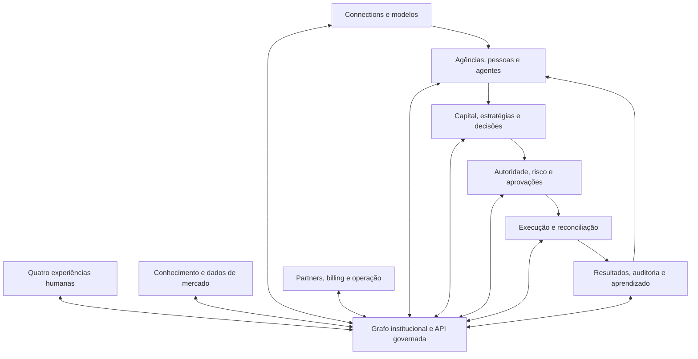

# anxionOS — modelo do grafo institucional

Modelo conceitual inicial para discussão, derivado das mensagens 33 e 41 da [conversa](../external-sources/plataforma-investimentos-autonoma-chatgpt.md), do [enquadramento](./anxionos-brainstorm.md) e dos requisitos R01–R24 do [PRD](../project-docs/proposals/0001-anxionos-prd-mestre.md). As regras abaixo são propostas de contrato; não descrevem código existente.

## Contratos detalhados vigentes

Esta nota preserva o mapa conceitual inicial. O detalhamento agora está no [SDD institucional](../project-docs/specs/001-institutional-contract/spec.md), [schema v1](./anxionos-graph-schema-v1.md) e [T01–T20 com fixtures](./anxionos-graph-traversals-v1.md). Agents/Knowledge, Investment e evolução institucional possuem specs vinculadas no SDD. A [estrutura do backend](./anxionos-backend-structure.md) foi aceita explicitamente pelo usuário; implementação/homologação não são presumidas.

## Papel central

O grafo institucional representa identidades, autoridade, contexto, relações e histórico que orientam todos os módulos. Agency, Capital, Market, Decision, Execution e Knowledge são vistas do mesmo modelo institucional.

A Graph API é a interface governada para humanos, agentes e serviços. Ela oferece operações de domínio, resolve contexto e autoridade e publica resultados com escopo e versão. Consultas livres ao banco não são uma capability do agente.

Neo4j é o candidato principal trazido pela conversa para o armazenamento de relações. A abstração preserva a semântica do produto; a escolha de edição, topologia e operação depende de Q07. PostgreSQL, TimescaleDB e armazenamento vetorial atenderiam fatos transacionais, séries e recuperação semântica, respectivamente. Isso não muda a centralidade operacional do grafo.

## Vista do modelo operacional

As ligações abaixo representam contratos e relações institucionais. Não indicam uma consulta ao grafo para cada tick de mercado.

## Vocabulário por domínio

| Domínio | Tipos conceituais | Proprietário de mudanças proposto |
| --- | --- | --- |
| Instituição | Platform, Organization, Agency, Department, Team, User, Membership, CompanyBlueprintVersion, OnboardingRun | Identity/Agency |
| Autoridade | Role, Capability, AuthorityGrant, Delegation, PolicyVersion, MandateVersion, Approval, RiskCheck | Governance |
| Agentes | Agent, AgentVersion, Runtime, SkillVersion, Goal, Task, Run, Session, ToolInvocation | Agents/Gateway |
| Inteligência | Document, Evidence, Observation, Memory, KnowledgeClaim, DatasetVersion | Knowledge/Market |
| Modelos | Provider, AIProviderAccount, ProviderSubscription, Connection, Endpoint, CredentialRef, Model, ModelVersion, ModelReference, ModelGroupAssignment, ContextProfileVersion, ModelCapabilityEvidence, TaskSuitabilityProfileVersion, CatalogRelease, ModelOffering, OfferingAccessGrant, AgentModelBinding, ConnectionPool, OwnerProviderPool, TaskRoutingPolicyVersion, TaskRequirementsSnapshot, RoutingPolicyVersion, InferenceProfileVersion, ParameterSchemaVersion, EffectiveInferenceConfig, InferenceRequest, RoutingDecision, InferenceAttempt, UsageRecord | Connections |
| Investimentos | CapitalAccount, CapitalAllocation, Portfolio, Asset, Instrument, MarketDomain, Market, Strategy, StrategyVersion, Signal, Decision, TradeIntent | Investment |
| Execução | ExecutionEngine, Venue, Broker, Exchange, Order, SubmissionAttempt, ExecutionReport, Fill, Position, LedgerEntry, ReconciliationCase | Execution/Accounting |
| Avaliação | BacktestRun, Evaluation, Certification, Deployment, Outcome, PerformanceAttribution | Strategy/Evaluation |
| Operação e comercial | Incident, AuditEvent, Partner, Campaign, Referral, Commission, Payout, Subscription, Invoice | Operations/Commercial |

AIProviderAccount e CapitalAccount são tipos diferentes. ModelOffering representa um modelo servido por determinada conexão/endpoint, evitando inferir que um fornecedor serve toda versão ou capability. Um evento de fill e um fill são registros relacionados, mas não a mesma entidade.

## Owner e provisionamento da empresa

Diretriz confirmada pelo usuário: assinatura, empresa nomeada no onboarding, equipe C-level pré-criada e operação exclusiva de capital próprio. A [resposta literal](./anxionos-brainstorm.md) é a fonte desta decisão.

Empresa é a apresentação de Agency. Cada Agency tem exatamente um Owner do tipo User humano; Agent nunca pode ocupar, remover ou substituir esse vínculo. Quantas empresas um mesmo usuário pode ter depende do plano ainda a definir. Papéis operacionais são grants distintos da propriedade.

Proposta de relações de onboarding: usuário → assinatura; usuário → empresa como Owner; empresa → OnboardingRun; empresa → CompanyBlueprintVersion; empresa → agentes provisionados. O blueprint é compartilhável como configuração versionada, mas cada instância de agente tem identidade, memória, credenciais referenciadas e estado isolados.

Criar, renomear ou reprocessar o onboarding não altera o Owner. Suspensão comercial não transfere propriedade. A criação do CEO e dos demais C-levels não concede automaticamente autoridade para negociar capital.

## Identidade e escopo

Contrato proposto para nós institucionais: id estável, type, schemaVersion, ownerDomain, scopeType, scopeId, status, createdAt e recordedAt. agencyId e organizationId são exigidos onde aplicáveis; recursos públicos de mercado e catálogos globais usam escopo explícito de plataforma.

Contrato proposto para relações: id, type, from, to, scope, validFrom, validUntil, recordedAt, supersededAt, actorId, reason, policyVersion e eventId conforme o domínio. Intervalos usam início inclusivo e fim exclusivo; ausência de fim representa vigência aberta.

Separar **tempo de validade no domínio** de **tempo de registro no sistema** permite tratar correções retroativas sem reescrever a visão histórica que orientou uma decisão. As consultas indicam qual dos dois tempos usam.

Uma relação entre recursos privados de tenants diferentes é proibida por padrão. Compartilhamento demanda um grant explícito para recurso publicável, com escopo, finalidade e validade. Catálogos globais não concedem acesso a credenciais ou posições. A política de [Connections](./anxionos-connections.md) concede consumo gratuito/pago somente ao titular/AGENCY correspondente e aos agentes próprios PLATFORM. Estes alternam contas por requisição. AGENCY também pode consumir publicação SYSTEM_FREE administrada pela plataforma; continua proibida a conta particular de outro usuário.

Agentes têm escopo institucional explícito AGENCY ou PLATFORM. PLATFORM identifica agente da própria plataforma configurado pelos administradores, sem vínculo de pertencimento à empresa de usuário; AGENCY identifica agente do usuário, incluindo C-levels do onboarding. Ator da última configuração não determina o escopo: suporte administrativo preserva o pertencimento original. Os próprios da plataforma podem consumir ofertas pagas/gratuitas de todos os titulares por grants PLATFORM_INTERNAL, conforme definição do usuário. Clientes não podem atribuir esse escopo por payload ou delegação. Binding de modelo e perfil de inferência são obrigatórios em ambos os escopos.

## Leitura de contas versus consumo de inferência

Conforme a [definição dos dashboards](./anxionos-brainstorm.md), usuário consulta apenas suas AIProviderAccounts/Connections e seus dados disponíveis; administrador da plataforma possui leitura global explícita. OfferingAccessGrant não concede navegação para a conta contribuinte. Uma traversal para AGENCY retorna ofertas de contas próprias e publicações SYSTEM_FREE autorizadas; para PLATFORM pode resolver rotas globais conforme grants, sem expor segredos ao agente.

As consultas de impacto e roteamento produzem projeções por papel: usuário vê suas tarefas/contas e agregados permitidos; administrador vê contas de todos os titulares. Atribuir o papel Owner da Agency não implica papel administrativo de plataforma. A leitura global não autoriza consumo pago irrestrito.

## Domínios de mercado da empresa

Conforme a [definição do usuário](./anxionos-brainstorm.md), cada empresa seleciona Stocks, Cripto ou ambos no onboarding e altera essa seleção posteriormente.

Proposta de representação: nós de catálogo MarketDomain com códigos STOCKS e CRYPTO; relações temporais Agency → OPERATES_IN → MarketDomain. A seleção conjunta é a presença dos dois vínculos, preservando uma única identidade de empresa. MarketDomain identifica a categoria; Market/Venue identificam os mercados e locais concretos de negociação.

Cada empresa configurada mantém pelo menos um domínio selecionado. Antes de concluir essa etapa do onboarding, a ausência da escolha indica configuração pendente. Uma pausa operacional é um estado separado, não uma terceira categoria vazia.

A alteração registra autor, versão e vigência. Instrumentos e estratégias declaram o domínio aplicável; novas intenções são verificadas contra a seleção vigente, o mandato e a autoridade. Ordens, posições e decisões anteriores mantêm suas referências mesmo após retirar um domínio. A transição de operações em curso segue Q13; o grafo não apaga a história nem inventa uma ordem de liquidação.

## Relações e cardinalidades iniciais

As cardinalidades são por versão/estado válido, não por todo o histórico. N:N não significa acesso irrestrito.

| Relação | Origem → destino | Cardinalidade e invariantes |
| --- | --- | --- |
| CONTAINS | Platform → Organization → Agency | Cada empresa/Agency tem uma organização de origem; essa camada não exige um passo adicional no onboarding |
| OWNS_COMPANY | User → Agency | Exatamente um Owner humano por empresa; agentes não podem alterar esse vínculo |
| SUBSCRIBES_TO | User → Subscription | Assinatura tem usuário assinante identificado; quantidade de empresas cobertas depende do plano |
| BOOTSTRAPPED_FROM / HAS_ONBOARDING | Agency → CompanyBlueprintVersion/OnboardingRun | Versão de origem e execução de provisionamento rastreáveis |
| HAS_AGENT | Agency → Agent | Instâncias privadas; chave empresa/versão de blueprint/papel evita duplicação durante retomada |
| HAS_MEMBERSHIP / PRINCIPAL | Agency → Membership → User | Membership pertence a uma agência e identifica um usuário |
| HAS_TEAM / HAS_DEPARTMENT | Agency → Team/Department | Unidades privadas de uma agência |
| REPORTS_TO | Agent → Agent/User | Vários vínculos tipados possíveis; cadeia de gestão sem ciclos |
| HAS_VERSION | Agent/Strategy/Model → versão correspondente | Uma versão pertence a uma identidade; histórico imutável |
| PURSUES / ASSIGNED_TO | Agent → Goal; Task → Agent/User | Tarefa tem proprietário operacional vigente definido |
| DELEGATES | Delegation → delegador/delegado/Task | Não amplia capability, recurso, limites ou validade |
| GRANTS / TO / ON | AuthorityGrant → Capability, principal e recurso | Grant identifica concessor, política e vigência |
| CONSTRAINED_BY | Agency/Portfolio/Strategy/TradeIntent → PolicyVersion/MandateVersion | N:N com precedência de políticas explícita |
| OPERATES_IN | Agency → MarketDomain | Um ou dois vínculos vigentes após seleção: STOCKS, CRYPTO ou ambos; alteração temporal por configuração |
| IN_DOMAIN | Instrument → MarketDomain | Domínio de classificação explícito para verificar elegibilidade operacional |
| OWNED_BY | CapitalAccount → User/Organization | Capital deve pertencer ao Owner humano da Agency; representação por organização, se suportada, exige vínculo explícito a esse capital próprio |
| USES_ACCOUNT | Portfolio → CapitalAccount | N:N apenas dentro do escopo permitido e do capital próprio do Owner, com partição/alocação definida; sem capital de outro usuário |
| ALLOCATES | CapitalAllocation → Account/Portfolio/Strategy | Reserva rastreável; não duplica saldo disponível |
| DEPLOYS | Deployment → StrategyVersion/Portfolio/ExecutionEngine | Ambiente e limites explícitos |
| IDENTIFIES | Instrument → Asset/Market/Venue | Identidade por mercado; ticker isolado é insuficiente |
| GENERATES | StrategyVersion → Signal | Sinal registra dados e instante observados |
| MADE_BY / BASED_ON | Decision → AgentVersion/User; Decision → Evidence/Signal | Decisão possui autor e evidência referenciada |
| PROPOSES | Decision → TradeIntent | Intenção versionada; alterar quantidade exige revalidação |
| CHECKED_BY | TradeIntent → RiskCheck | Check referencia estado, política, validade e resultado |
| APPROVED_BY | TradeIntent → Approval | Aprovação vinculada à versão/hash da intenção |
| MATERIALIZES | TradeIntent → Order | 0:N, suportando divisão com teto agregado |
| HAS_ATTEMPT | Order → SubmissionAttempt | Tentativas não equivalem a novas ordens |
| REPORTED_AS / FILLED_AS | Order → ExecutionReport/Fill | Ordem pode ter vários fills e relatórios fora de ordem |
| AFFECTS | Fill → Position/LedgerEntry | Duplicata de fill não altera contabilidade novamente |
| RECONCILES | ReconciliationCase → Account/Order/Position | Resultado guarda evidência externa e diferenças |
| HAS_ACCOUNT / USES_ENDPOINT | Provider → AIProviderAccount; Connection → Endpoint | Titular pode ter várias contas do mesmo provider; conexões/segredos independentes, com identidade upstream e grupos de limite quando conhecidos |
| CONTAINS_ACCOUNT / CLASSIFIED_AS | OwnerProviderPool → AIProviderAccount; InferenceRequest → TaskRequirementsSnapshot | Pool privado por titular/provider; classificação de tipo/complexidade orienta perfil e elegibilidade, não autoridade |
| EXPOSES / OFFERS_MODEL | Connection → ModelOffering; ModelOffering → Model/ModelVersion | Uma oferta identifica conexão, endpoint e modelo; capabilities verificadas por oferta |
| HAS_MODEL_BINDING / SELECTS | Agent/Service → InferenceBindingVersion → Model/ModelVersion | Um principal por agente e no máximo um padrão vigente por slot; histórico e versão usada por operação |
| USES_POOL / HAS_SUBSCRIPTION | Binding → ConnectionPool; AIProviderAccount → ProviderSubscription | Pool AGENCY contém contas próprias; pool PLATFORM contém contas globais elegíveis e rotação coordenada; assinatura upstream distinta da SaaS |
| HAS_ACCESS_GRANT / PERMITS_SCOPE | ModelOffering → OfferingAccessGrant → Agency/Platform | Grant temporal com finalidade, beneficiário, classe de custo e quota; gratuidade não concede acesso à conta de outro usuário; pool de contas de usuários é exclusivo de PLATFORM; SYSTEM_FREE possui publicação e grant próprios |
| USES_CREDENTIAL | Connection → CredentialRef | Referência sem valor secreto |
| ROUTED_BY / ATTEMPTED_VIA | Run → RoutingDecision; InferenceAttempt → ModelOffering | Tentativas preservadas individualmente |
| CONSUMED | UsageRecord → InferenceAttempt/Run/Agency | Mesmo uso não é cobrado duas vezes |
| EVALUATES | Evaluation → AgentVersion/ModelVersion/StrategyVersion | Dataset, rubrica e avaliador versionados |
| SUPPORTS / DERIVED_FROM | KnowledgeClaim → Evidence/Document | Proveniência e natureza inferida/observada explícitas |
| RESULTED_IN | Decision/Deployment → Outcome | Resultado observado separado da hipótese causal |
| CONTRIBUTED_TO | PerformanceAttribution → Outcome | Método, janela e confiança obrigatórios |
| REFERRED / ATTRIBUTED_TO | Referral → Agency/Campaign/Partner | Política comercial e contestação rastreáveis |
| EARNS / SETTLED_BY | Commission → Partner; Commission → Payout | Valor, moeda, estorno e conciliação explícitos |

Vocabulários anteriores como MADE, MADE_BY e CREATED precisam ser normalizados na especificação por domínio. Evitar relações genéricas sem tipo de origem/destino e regras. A meta de 80–120 relações mencionada na conversa não é critério de qualidade: o catálogo final será derivado dos casos de uso, sem preencher uma quantidade artificial.

Relações de inferência: Binding HAS_INFERENCE_PROFILE InferenceProfileVersion; Attempt USED_CONFIG EffectiveInferenceConfig; Config CONFORMED_TO ParameterSchemaVersion. Referências imutáveis identificam os parâmetros pedidos, resolvidos e enviados, sem armazenar segredos. Ver [contrato de configuração](./anxionos-inference-config.md).

## Comandos, eventos e armazenamento

Proposta para resolver a tensão das “quatro fontes de verdade”:

1. Cada fato tem um domínio proprietário e um ponto de confirmação durável.
2. Comandos institucionais passam pelo Graph Kernel e serviços proprietários; o agente não modifica arestas de autoridade diretamente.
3. O evento confirmado registra o efeito do comando. Projeções e índices podem ser reconstruídos a partir do histórico preservado.
4. O registro de ordens, fills e lançamentos identifica fatos externos e não disputa autoridade com uma cópia no grafo.
5. A publicação entre armazenamentos não é presumida atômica. A especificação escolherá mecanismo de outbox/journal, ordenação e deduplicação por domínio.
6. NATS/JetStream é candidato a transporte e entrega durável. Retenção de auditoria e capacidade de reconstrução serão contratadas separadamente, não inferidas da presença do broker.
7. Eventos incluem eventId, aggregateId, aggregateVersion, scope, occurredAt, recordedAt, correlationId, causationId, schemaVersion e referência de payload.
8. Consumidores registram checkpoint e evento aplicado; replay deve produzir o mesmo estado determinístico projetado. Inferência não determinística exige preservar resultado e entrada, não prometer resposta idêntica numa nova chamada.

O [baseline de autoridade](../project-docs/decisions/0001-graph-operational-domain-authority.md) propõe PostgreSQL por agregado com journal/outbox atômicos e grafo Neo4j projetado; NATS transporta eventos. A decisão final de implantação exige P01/testes de falhas. Q06 agora possui contrato, alternativas e ponto de confirmação explícitos no SDD, sem quatro escritores concorrentes.

## Autoridade e execução em andamento

Graph authorization resolve capabilities, grants, negações, escopos, mandato e tempo; hierarquia organizacional sozinha não concede poderes. Proposta: negação explícita prevalece; ausência de grant nega; delegação é uma interseção de direitos.

A aprovação fixa a versão da intenção, os limites e sua validade. Antes do efeito externo, o executor valida a autoridade vigente e a versão exigida pelo contrato. O caminho de baixa latência pode usar materialização limitada por versão e validade, com mecanismo de revogação; não pode operar indefinidamente com snapshot antigo.

Estados iniciais para discutir: intenção proposta → validada → aguardando aprovação ou autorizada → em execução → concluída, rejeitada, expirada ou revogada. Ordem possui máquina independente, incluindo envio pendente, aceita, parcialmente preenchida, preenchida, cancelamento pendente, cancelada, rejeitada e resultado incerto. Resultado incerto exige reconciliação antes de reenviar.

Interromper novas ordens, cancelar ordens abertas e encerrar posições são comandos distintos. O domínio financeiro definirá o efeito de cada um; um único botão não deve esconder consequências diferentes.

## Contrato operacional de Connections

O [contrato operacional v1](./anxionos-connections-operational-contract.md) define SupplyScope OWNER_PRIVATE/SYSTEM_FREE, OfferingPublicationVersion, capacityResourceId e fundingSourceId. Endpoint sem autenticação não exige conta/credencial fictícia. AGENCY pode consumir SYSTEM_FREE sem navegar à conta interna. Grafo projeta Account/Offering/Grant/Request/Attempt/Usage; limites, cursor, leases e reservas têm autoridade transacional. Replay não executa inferência ou efeitos. Ver [gaps e evidências](../research/9router-gaps-validacao.md).

O [catálogo de modelos](./anxionos-model-catalog.md) acrescenta classificações G1–G4 versionadas, perfis de contexto por oferta e evidências por capability. Relações: ModelVersion CLASSIFIED_AS ModelGroupAssignment → Group; ModelOffering HAS_CONTEXT_PROFILE ContextProfileVersion; Assignment SUPPORTED_BY Evidence. Grupo/janela não concede autoridade; campos desconhecidos e conflitos não viram capacidades por traversal.

O [contrato multimodal](./anxionos-multimodal-inference.md) acrescenta InferenceBindingVersion, ModelOperationSchema, VoiceProfile, EmbeddingSpaceContract, ArtifactRef e InferenceJob. Relações: Binding FOR_OPERATION OperationSchema; Binding USES_VOICE VoiceProfile; KnowledgeCollection USES_EMBEDDING_SPACE EmbeddingSpaceContract; InferenceRequest PRODUCED ArtifactRef e InferenceJob EXECUTES InferenceRequest. Coleção/índice pertencem a Knowledge; Connections executa inferência. Artefatos permanecem em armazenamento autorizado: grafo guarda identidade/linhagem, não áudio, vetores completos ou segredos. Unicidade de binding é por dono, slot e vigência; G1–G4 não classificam operações não LLM.

O [contrato free/cooldown](./anxionos-free-cooldown.md) acrescenta FreeDeclaration, SourceSnapshot, CooldownRecord e QuotaGroup: ModelOffering DECLARED_FREE_BY FreeDeclaration SUPPORTED_BY SourceSnapshot; Offering BLOCKED_BY CooldownRecord; CapacityResource SHARES_QUOTA QuotaGroup. Declaração free não cria grant. Grafo projeta estado/linhagem; decisão de dispatch verifica geração/bloqueios/quota na autoridade transacional.

O [contrato de catálogo automático e custo](./anxionos-catalog-automation.md) acrescenta ProviderCatalogWatchPolicy, CatalogChange, CatalogAnalysisJob, CatalogAdmissionDecision, ExpensiveModelPolicyVersion, TaskPurposePolicy e SpecialUseAuthorization. Grafo projeta Change PRODUCED CatalogRelease, Admission SUPPORTED_BY Evidence, Offering GOVERNED_BY ExpensiveModelPolicyVersion e Task AUTHORIZED_BY SpecialUseAuthorization. G1–G4 não concede uso caro; autoridade transacional verifica finalidade e reserva antes de dispatch.

## Vinte consultas críticas

Todas exigem escopo, limites de expansão, orçamento de consulta e resposta com versão/atualidade. Metas p95/p99 dependem do benchmark de Q07.

| ID | Consulta | Entrada → resultado esperado |
| --- | --- | --- |
| T01 | Quem pode executar esta intenção agora? | Principal, ação, intenção, instante → decisão e cadeia de autoridade |
| T02 | Quem podia operar no momento histórico? | Recurso, validAt, knownAt → grants e políticas vigentes |
| T03 | Por que uma ação foi negada? | Pedido → regra, evidência e alternativa de aprovação quando aplicável |
| T04 | Quem possui a capability necessária nesta agência? | Capability e escopo → candidatos autorizados e disponíveis |
| T05 | Qual contexto este agente pode receber? | AgentVersion e tarefa → contexto filtrado, fontes e orçamento |
| T06 | Como um objetivo se decompõe em trabalho? | Goal → tarefas, responsáveis, bloqueios e progresso |
| T07 | Qual capital está delegado a este agente? | Agente → grants, carteiras, contas e alocações |
| T08 | Onde uma estratégia está implantada? | StrategyVersion → deployments, ambientes, contas e limites |
| T09 | Qual exposição consolidada existe por ativo? | Asset e escopo → posições/alocações sem dupla contagem |
| T10 | Quais evidências sustentam esta decisão? | Decision → sinais, dados, versões e autor |
| T11 | Como este fill foi autorizado? | Fill → ordem, intenção, aprovação e RiskCheck |
| T12 | Como um resultado foi atribuído? | Outcome → registros, método e contribuições estimadas |
| T13 | O que é afetado ao desligar um agente? | Agent → tarefas, delegações, estratégias e recursos dependentes |
| T14 | O que é afetado ao revogar uma conexão? | Connection → tarefas, ofertas, consumidores e alternativas elegíveis |
| T15 | Qual provider/conta atende ao modelo, perfil e requisitos da tarefa? | Classificação de tipo/complexidade → ofertas compatíveis → contas: AGENCY seleciona contas próprias por provider ou SYSTEM_FREE; PLATFORM alterna contas globais elegíveis. Filtrar grants, perfil, capacidade, limites e continuidade |
| T16 | Por que esta rota de inferência foi escolhida? | RoutingDecision → candidatos, políticas e tentativas |
| T17 | Quanto custou este objetivo ou agência? | Goal/Agency e período → uso deduplicado e preços aplicados |
| T18 | Quais divergências exigem intervenção? | Agency/Account → casos, ordens e evidências conflitantes |
| T19 | Que mudança de autoridade um snapshot propõe? | Snapshot e alteração → diferenças, conflitos e aprovações requeridas |
| T20 | Como uma indicação gerou comissão? | Referral/Payout → campanha, agência, política e lançamentos comerciais |

Estas consultas operacionalizam a visão da [fonte](../external-sources/plataforma-investimentos-autonoma-chatgpt.md); são um catálogo proposto, não medições.

## Evolução e evidências necessárias

O [schema v1](./anxionos-graph-schema-v1.md) detalha propriedades, assinaturas tipadas, cardinalidades, índices, eventos e migrações; [traversals v1](./anxionos-graph-traversals-v1.md) define entradas, planos lógicos, fixtures e oracles. A validação da implementação ainda exige executar os cenários de duas agências, correção temporal, revogação concorrente e eventos duplicados/fora de ordem.

Snapshots para digital twin pertencem a um ambiente de simulação, têm identidade própria e não enviam comandos a produção. Aplicar uma mudança simulada requer novo comando autorizado sobre o estado corrente.

Questões Q02/Q07 e configurações de lançamento seguem no [brainstorm](./anxionos-brainstorm.md). Q03/Q06/Q12/Q13 têm comportamento proposto nos contratos detalhados; homologação, valores e aceite de implantação mantêm seus gates explícitos. O [planejamento](./anxionos-planejamento-end-to-end.md) relaciona esses contratos às entregas.
