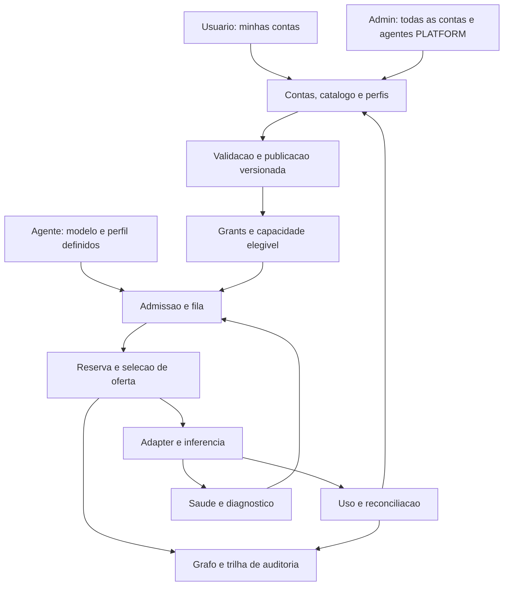

# Connections — expansão para operação completa

Proposta em rascunho e revisão consultiva. Amplia o planejamento de [Connections](../../notes/anxionos-connections.md) e seu [contrato de inferência](../../notes/anxionos-inference-config.md). Os achados abaixo são recomendações de design; não alteram automaticamente decisões confirmadas nem representam auditoria do software implementado.

## Atualização confirmada após a revisão

A definição mais recente do usuário exige alternância balanceada por requisição para agentes PLATFORM e uso exclusivo de contas próprias para usuário/AGENCY, inclusive gratuitas. Substitui o compartilhamento gratuito entre clientes descrito na base inicial. Os achados são históricos/consultivos; A2 foi parcialmente resolvido quanto à distribuição entre contas, restando limites de capacidade e a exceção de única conta elegível. Contrato vigente em [Connections v0.8](../../notes/anxionos-connections.md).

Complemento confirmado: cada usuário pode ter várias contas de assinatura/API do mesmo provider e balancear entre elas; tipo/complexidade orienta provider/oferta e perfil. X01/X03/X04 passam a incluir identidade de conta independente, OwnerProviderPool, grupos de quota e TaskRequirementsSnapshot. A escolha entre modelos por tarefa não foi confirmada; modelo predefinido permanece o baseline.

## Resolução posterior dos achados

A [revisão com oito reproduções locais](../../research/9router-gaps-validacao.md) e o [contrato operacional v1](../../notes/anxionos-connections-operational-contract.md) aplicam as correções de design autorizadas pelo usuário. A1–A6 abaixo são o registro consultivo anterior: seus contratos agora estão detalhados em V01–V10. Validação operacional e valores de lançamento continuam pendentes. Acrescentado SYSTEM_FREE como catálogo administrativo separado de contas particulares; referências históricas a acesso exclusivamente próprio têm essa ampliação.

## Motivation

### Beneficiários, mudança observável e decisão

**Beneficiários:** Owner que conecta suas contas e depende delas para seus agentes; administrador que configura agentes próprios da plataforma e opera o conjunto de contas; operador que precisa recuperar falhas e explicar consumo.

**Mudança observável:** configurar, validar, publicar, consumir, atualizar, suspender, reconciliar e encerrar uma conta passa a ter resultado e tratamento de falha verificáveis. Sob concorrência, o sistema explica quem recebeu capacidade, quem consumiu a conta e por que uma tarefa aguardou. Uma alteração de provider/modelo não rompe silenciosamente os perfis dos agentes.

**Decisão proposta:** priorizar ciclo de vida de contas, admissão de trabalho, contabilidade e homologação antes de aumentar a quantidade de conectores. Construir um control plane modular com execução de inferência especializada, preservando os contratos e adaptadores extraídos do 9Router.

O enquadramento deriva dos pedidos já confirmados no [brainstorm](../../notes/anxionos-brainstorm.md) e no [PRD mestre](./0001-anxionos-prd-mestre.md). Não há métricas de produção, entrevistas ou incidente real que comprovem impacto quantitativo; os cenários são testes de consistência das regras pretendidas.

### O que já está bem definido

- Onboarding de providers, APIs e assinaturas; conta, conexão, oferta e segredo separados.
- Modelos predefinidos e perfis versionados de effort/thinking e demais parâmetros.
- Agentes PLATFORM configurados pelos administradores, distintos dos agentes AGENCY de usuários.
- Regra vigente: usuário/AGENCY usa somente contas próprias, gratuitas/pagas; agentes próprios PLATFORM alternam contas globais elegíveis de forma balanceada por requisição.
- Dashboard pessoal com contas próprias; dashboard administrativo com todas as contas.
- Tradução, grants, tentativas, orçamento, uso, eventos e grafo como contratos de domínio.
- [Snapshot e extração do 9Router](../../research/9router-extracao-connections.md), sem afirmar que os conectores já estão implementados/homologados.

O ganho principal agora vem de fechar esses ciclos, não de criar mais nomes para recursos já descritos. “Completo” significa cobertura operacional e evidência por conector suportado, não suporte universal imediato a todo serviço externo.

### Revisão consultiva — achados priorizados

Evidências referem-se às seções dos documentos vinculados. Não foram encontrados ADRs aceitos ou postmortems na pasta de ciclo de software nesta revisão.

| ID e gravidade | Achado e evidência | Efeito e resolução proposta | Confiança e o que mudaria a conclusão |
| --- | --- | --- | --- |
| A1 — substantivo; condição antes de compartilhamento de dados privados | Connections, “Custo, quota e retirada de publicação”, exige isolamento de sessão, mas “Modelos/Endpoint” contempla destinos locais/customizados e contas de outros titulares. Falta critério verificável de confiança no destino | Isolamento do dashboard não demonstra isolamento de conteúdo fora da plataforma. Qualificar oferta por destino, retenção, histórico upstream e dados admitidos; usar conteúdo público/sintético onde não houver evidência suficiente | Alta quanto à lacuna de contrato; cai se o schema de publicação já comprovar destino/retencão e isolamento externo |
| A2 — substantivo; condição antes de uso compartilhado sob carga | Connections, “Uso pela própria plataforma”, deixa proporções de uso em aberto; seleção descreve prioridade/round-robin | Permissão de acesso não determina quem recebe a última quota. Definir política de capacidade com reserva do titular, parcela da plataforma, concorrência e espera por classe | Alta; cai com política quantitativa e simulação de saturação que mostre o comportamento escolhido |
| A3 — substantivo | Connections lista QuotaWindow e reservas atômicas, mas ainda não define quando várias credenciais/rotas compartilham o mesmo limite remoto | Várias keys ou aliases podem representar a mesma capacidade; uso fora do gateway também pode tornar a amostra obsoleta. Modelar grupo de limite upstream, origem/idade da observação e consumo externo desconhecido | Alta para a necessidade; escopo reduz se integrações escolhidas tiverem quotas comprovadamente independentes e uso exclusivo |
| A4 — substantivo | Estados de Request omitem fila durável e o contrato de reservas não descreve recuperação de lease após falha; o próprio documento prevê UNKNOWN_OUTCOME | Worker pode morrer entre submissão e confirmação. Definir admissão, lease, deadline, tentativa incerta e reconciliação; não tratar replay como nova inferência | Alta; cai com teste de crash que demonstre recuperação sem reenvio indevido ou reserva abandonada |
| A5 — substantivo | Perfis usam schemas/aliases versionados e a extração prevê status por conector, mas não há processo fechado de promoção de catálogo/adapter e impacto sobre bindings | Mudança de catálogo pode invalidar effort/tools ou alterar versão efetiva. Introduzir release de adapter, matriz homologada, diff, canary e migração explícita de bindings | Alta; cai com processo de promoção já testado para mudanças incompatíveis |
| A6 — substantivo | Connections distingue custo do titular/plataforma e a proposta de perfis registra configuração; encerramento aparece apenas no programa geral | Faltam jornada de encerramento/retenção e extrato operacional que confira contribuição, gasto interno da plataforma e divergências externas | Média-alta; reduz se E12/E13 já oferecerem esses contratos sem duplicação em Connections |

Os achados não negam a autorização dada aos agentes da plataforma. Eles definem as condições operacionais para aplicar essa autorização de forma explicável. Não há evidência para declarar o módulo inteiro inviável.

### Fronteiras preservadas

Connections gerencia infraestrutura de inferência. Agent Runtime continua responsável por identidade e trabalho dos agentes; Knowledge por memória/RAG; Tool Gateway por efeitos das ferramentas; Billing por assinatura comercial e cobranças; Risk/Execution por mercado/capital. Busca, mídia, batch e realtime são extensões do acesso a modelos, sem trazer esses outros domínios inteiros para dentro de Connections.

## Design

### 1. Três partes operacionais

| Parte | Responsabilidade | Falha tratada |
| --- | --- | --- |
| Gestão e políticas | Contas, assinaturas, catálogo, grants, perfis, administração, releases | Alteração validada/versionada; operadores veem estado e impacto |
| Execução de inferência | Admissão, quota/reserva, seleção de oferta, adapter, streaming/cancelamento | Trabalho rejeitado, em espera, parcial ou incerto explicitamente |
| Operação e reconciliação | Uso, drift, saúde, alertas, extratos, comparação e recuperação | Estado observado pode divergir da configuração; reconciliação fecha o ciclo |

São fronteiras lógicas, não exigência de três microserviços. O grafo conecta identidade, configuração, decisão e consumo; o estado autoritativo de quota/reserva não é substituído por uma projeção atrasada.

### 2. Mapa de expansão com prioridade

P0 = condição para operação compartilhada confiável; P1 = fechar o produto completo; P2 = extensões orientadas por demanda. “Base” significa documentado, não implementado.

| ID | Frente e estado da base | Expansão proposta e benefício | Aceite observável |
| --- | --- | --- | --- |
| X01 — P0 | Contas e assinaturas: parcial | Reconexão, renovação, troca de plano, perda de entitlement, deduplicação de conta upstream e readiness do onboarding | Renovar key/token preserva conta, histórico e quota; plano vencido retira elegibilidade |
| X02 — P0 | Compartilhamento: regras claras, qualificação incompleta | Publicação por oferta, classe de dados/destino e identidade de workload; projeções pessoais/globais | Conta de terceiro não recebe payload privado em rota não qualificada; usuário não vê conta alheia |
| X03 — P0 | Quotas/pools: parcial | Alocação titular/PLATFORM, grupos de limites remotos, limites hierárquicos, fila e controle de admissão | Concorrência em várias keys não multiplica quota da mesma conta |
| X04 — P0 | Configuração: bem descrita | Schemas executáveis, compilação, diagnóstico de campo, presets e compatibilidade por oferta | Perfil incompatível não gera chamada; parâmetros enviados têm origem e versão |
| X05 — P0 | Recuperação: parcial | Lease, estados incertos, cancelamento, backpressure, limite global de retries e restauração | Crash não reenvia geração incerta nem libera orçamento potencialmente consumido como se fosse zero |
| X06 — P0 | Uso/custo: parcial | Registro de consumo com ajustes, atribuição do beneficiário e origem dos fundos, reconciliação externa | Extrato separa uso próprio e PLATFORM, gratuito/pago, sem somar custo duas vezes |
| X07 — P0 | Conectores: inventariados | Kit de adapter, sandbox de teste, matriz de compatibilidade, release/canary/rollback | Conector só aparece habilitado para capacidades que passaram pelo contrato |
| X08 — P1 | Dashboard: fronteiras claras | Jornadas completas, ações em lote com prévia, diagnósticos, filtros salvos, notificações e exportação assíncrona | Usuário resolve reautorização sem suporte; admin identifica grupo de falhas e escopo afetado |
| X09 — P1 | Operação: parcial | Centro de incidentes, health passivo/ativo com budget, SLOs, runbooks e botões de intervenção | Operador localiza causa/impacto e suspende uma rota sem derrubar todas |
| X10 — P1 | Catálogo: parcial | Descoberta incremental, origem, idade, drift, aliases e depreciação com análise de impacto | Atualização aponta bindings afetados antes da publicação |
| X11 — P1 | Cliente/dados: parcial | Desconectar, suspender conta, suspender SaaS, exportar, excluir e aplicar retenção como fluxos diferentes | Fechamento interrompe novas seleções e trata runs/segredos/dados pendentes |
| X12 — P1 | Integração: contratos conceituais | API/SDK versionados, erros estáveis, eventos/webhooks autenticados e exemplos | Runtime integra sem conhecer formato nativo ou segredo |
| X13 — P1 | Avaliação: prevista | Playground governado, fixtures, regressão de qualidade, custo e ferramentas por modelo/perfil | Perfil recomendado tem evidência; promoção não ocorre automaticamente |
| X14 — P2 | Cache/otimização: prevista | Cache isolado, cache nativo, batching e compressão avaliada | Chave inclui escopo/modelo/perfil/versões; nenhum hit cruza permissões |
| X15 — escopo confirmado / entrega faseada | TTS e embeddings agora requeridos | Schema multimodal, bindings por finalidade, espaços vetoriais, voz e unidades entram C1–C4; demais modalidades por lotes | MM01–MM12; jobs/streams acompanham orçamento, grants e cancelamento |
| X16 — P2 | Combos/fusion: inventariados | Experimentos com fallback entre modelos e ensembles explicitamente configurados | Extensão não altera o baseline de modelo predefinido sem decisão específica |

A [análise NVIDIA](../../research/nvidia-model-types-connections.md) fundamenta o [contrato multimodal](../../notes/anxionos-multimodal-inference.md). X15 deixa de tratar TTS/embeddings como extensão opcional P2: estrutura comum entra D1–D3/C1–C4; homologação dos conectores é faseada em C5. G1–G4 aplicam-se à linguagem. Um binding principal por agente convive com bindings por finalidade, mantendo o modelo fixo em cada um. Serviços técnicos não ampliam escopo nem grants do consumidor.

O requisito confirmado de [catálogo free e cooldown](../../notes/anxionos-free-cooldown.md) detalha descoberta por tag/flag/variante oficial, preço por operação, freshness, bloqueios por escopo e recuperação com geração/lease. A [revisão funcional](../../research/9router-functional-coverage.md) cobre 36 famílias e aprofunda 12 gaps; DFree/DCool integram D1–D4/C1–C4 com CF01–CF16. Rotação permanece subordinada a quotas compartilhadas; free não amplia acesso a contas particulares.

### 3. Capacidade compartilhada e prioridades

Definição confirmada: rotação por conta a cada requisição PLATFORM, coordenada entre agentes/réplicas, preservando modelo e perfil. A → B → C → A ilustra um conjunto estável elegível. Múltiplas keys da mesma conta não aumentam participação. Balanceamento por contagem não garante igualdade de custo/tokens. A recomendação de reserva abaixo trata capacidade titular/plataforma e continua proposta, não substitui essa rotação.

Recomendo **reserva de capacidade para o titular + parcela configurada para agentes da plataforma + fila com distribuição por consumidor**. A autorização da plataforma continua válida; o scheduler controla momento e volume. A prioridade é aplicada somente depois dos filtros de grant, modelo, perfil, dados e orçamento.

Considerar request/minuto, tokens/minuto, concorrência, janela de plano, budget monetário e limites por modelo como dimensões diferentes. Usar UpstreamLimitGroup para representar limites compartilhados por conta, projeto, organização ou família de modelos quando identificados. Múltiplas conexões podem apontar para o mesmo grupo.

Alternativas reais: prioridade absoluta do titular favorece sua experiência, mas pode impedir trabalho da plataforma sob saturação; prioridade absoluta da plataforma favorece operação central, mas torna a conta menos previsível para o titular. A divisão proposta reduz esses extremos, com custo de configuração e menor utilização quando reservas ficam ociosas.

Empréstimo de capacidade ociosa pode ser opção posterior. Não cancelar inferência em curso apenas para recuperar capacidade emprestada; interromper novas admissões conforme a política. Pesos, porcentagens, tamanho de fila e teto de espera não foram escolhidos.

Amostra externa informa observedAt, janela, confiança/origem e resetAt. Quota desconhecida não é ilimitada. Reservas garantem o limite interno do gateway; não garantem controle de consumo feito diretamente no provider fora dele. Mostrar esse limite no cálculo de disponibilidade.

### 4. Ciclo completo de contas, planos e ofertas

Estados de configuração, autenticação, saúde e publicação permanecem separados. Uma conta pode autenticar e ainda não ter nenhuma oferta elegível ao perfil de um agente.

Acrescentar SubscriptionSnapshot com plano, validade conhecida, última verificação e entitlement; UpstreamAccountIdentity para deduplicar sem vazar identificação entre titulares; ReadinessCheck com causas e ação recomendada; OfferingPublicationVersion com critérios de acesso.

Alterar plano, preço, região/destino, credencial ou adapter reavalia ofertas e bindings dependentes. Quando não houver informação disponível, mostrar desconhecido; não inferir renovação ou saldo. Configuração não compra/renova assinatura externa automaticamente.

Atualizações em lote têm prévia, resultado por item, idempotência e retomada. Não presumir transação global entre vários providers.

### 5. Confiança no destino e isolamento fora do dashboard

A conta contribuinte, o operador do endpoint e o beneficiário da tarefa são identidades distintas. Uma API customizada pode receber o payload completo; uma conta upstream pode ter histórico ou retenção com visibilidade própria. A publicação precisa avaliar essas possibilidades, sem assumir comportamento de um fornecedor específico.

Proposta: classe de destino, operador, políticas de retenção conhecidas, capacidades de desativar armazenamento quando disponíveis, isolamento de sessão/cache e classes de dados admitidas. Endpoints privados/customizados não ganham acesso global só porque anunciam modelo gratuito.

Enquanto uma oferta não estiver qualificada para dados privados de terceiros, pode continuar útil para tarefas públicas/sintéticas compatíveis. Para agentes da plataforma, a mesma regra protege conteúdo interno enviado pela conta de outro titular. Isso é filtro de elegibilidade de dados, não remoção da autorização geral de consumo.

Contas e segredos continuam pessoais; resultado compartilhado/cache não pode revelar requests de outro consumidor. Homologação exige cenários de conta A atendendo PLATFORM, cliente B impedido de usar A mesmo gratuitamente, cache, históricos e logs sanitizados.

### 6. Admissão, jobs e recuperação

Fila de inferência só precisa virar recurso durável quando o contrato permitir esperar/retomar; não impor fila a cada chamada síncrona. Mesmo no modo síncrono, há admissão, rejeição estruturada e deadline.

Para tarefas enfileiradas: RECEIVED → QUEUED → LEASED → DISPATCHED → RUNNING → SUCCEEDED/FAILED/PARTIAL/CANCELLED/UNKNOWN_OUTCOME. Manter estado financeiro separado. Reservar orçamento na admissão ou no dispatch conforme contrato; não reservar capacidade de throughput durante longa espera sem necessidade.

Lease expirado antes de dispatch permite reencaminhamento; depois de possível envio, investigar estado remoto conforme suporte. Chave idempotente interna não garante deduplicação upstream. Cancelar não prova que não houve cobrança; repetir não é ferramenta de reconciliação.

Teto de retries por request e por grupo de limite previne uma falha transformar uma tarefa em dezenas de chamadas. Afinidade obrigatória de sessão pode excluir failover para outra conta mesmo com o mesmo modelo.

Na restauração, reprocessar eventos para recompor estado e extrato não dispara inferência, tool calls ou cobrança nova. Usar fencing/versão do estado autoritativo para impedir dois workers de despacharem a mesma tentativa.

### 7. Consumo, extratos e suporte financeiro

Registrar fundingAccountId, beneficiaryScope, agentId, requested/resolved model, profile/config versions, tentativa e preço aplicado. Separar custo monetário, unidade de quota, tokens observados/estimados e custo fixo da assinatura.

Extrato do titular mostra consumo próprio e consumo balanceado da plataforma, separados em gratuito/pago, com divergências e ajustes. Admin vê o consolidado e detalha contas; usuários não recebem identidades/tarefas privadas de outros consumidores. Exibir custo do provedor e custo comercial do anxionOS como campos diferentes.

Ajustes de reconciliação são registros novos, não reescrita silenciosa do histórico. Credits/reembolsos ao contribuinte, se o produto vier a oferecê-los, são decisão comercial de Billing; não aparecem como promessa nesta proposta.

### 8. Catálogo, perfis e kit de conectores

AdapterManifest declara versão, autenticação, refresh, protocolos, modelo/ofertas, capacidades, schema de parâmetros, uso/quotas observáveis, erros, continuidade, cancelamento e limitações. Código de adapter não deve poder alterar grants ou configuração global.

Ciclo: INVENTORIED → PORTED → CONTRACT_TESTED → CANARY → ENABLED → DEPRECATED/QUARANTINED. Cobertura é por capacidade; passar chat não certifica tools, structured output, thinking, multimodal ou streaming.

Descoberta de catálogo gera candidato/diff. Publicação registra evidência, migrações de schema e bindings impactados. Modelos aposentados exigem alteração explícita do binding; o módulo não escolhe silenciosamente o sucessor.

Plataforma homologa templates/perfis; Owner usa opções compatíveis em seus agentes. Banco de fixtures sintéticas cobre ferramentas, tokens, perfis, interrupções e adaptação explícita. Replay de metadados pode ser gratuito; avaliação real usa inferência e tem budget.

### 9. Dashboards e diagnóstico orientados à ação

| Experiência | Expansão |
| --- | --- |
| Usuário | Prontidão por conta/agente; assinatura/quotas; extrato; alertas de expiração; reautorização; perfil/preview; exportar/desconectar |
| Administrador | Todas as contas; cadastro próprio de agentes PLATFORM; matriz de capacidade; filas; distribuição de consumo; catálogo/releases; incidentes; ações em lote |
| Diagnóstico de rota | Motivo de inelegibilidade, deadline, capacidade e perfil, com projeção autorizada |
| Notificações | Conta expirada, quota próxima do limite, perfil incompatível, custo anômalo e reconciliação pendente; agrupamento e estado de resolução |

SLOs separados para admissão, tempo em fila, overhead do router, TTFT upstream, sucesso de stream, atraso de quota e reconciliação. Health ativo tem budget e não consome a quota inteira tentando verificar uma rota indisponível. “Provider healthy” não implica oferta compatível ou autorizada.

### 10. Operação, manutenção e encerramento

Kill switches por provider, conta, oferta, consumer class e agente. Desabilitar leitura não é desabilitar inferência; suspender nova admissão não garante cancelamento remoto. Interface mostra exatamente qual ação está em execução.

Runbooks: refresh revogado, quota incorreta, mudança de preço, modelo retirado, rota sem suporte de thinking, stream travado, reserva órfã e consumo divergente. Documentar backup/restauração, versões incompatíveis, limite de retenção e responsável operacional.

Encerrar conexão remove grants para novas tentativas, coordena runs ativos, trata revogação upstream quando suportada e preserva o mínimo histórico conforme política. Encerrar SaaS e excluir dados possuem contratos separados. A exportação inclui somente dados autorizados; não exporta segredos como parte de relatório operacional.

### 11. Entidades adicionais e grafo

Introduzir entidades apenas onde sustentarem um ciclo necessário:

| Entidade proposta | Relação principal |
| --- | --- |
| CapacityAllocationPolicyVersion / UpstreamLimitGroup | Conta/conexões compartilham limite; política aloca por classe |
| AdmissionRecord / DispatchLease | Request registra elegibilidade e posse temporária de execução |
| OfferingPublicationVersion / TrustProfileVersion | Oferta publicada sob dados/destino/grants específicos |
| SubscriptionSnapshot / ReadinessCheck | Conta/assinatura observada e capacidade de operar |
| AdapterRelease / CompatibilityReport | Oferta usa versão testada e evidência por capacidade |
| ReconciliationCase / UsageAdjustment | Uso divergente gera caso e ajuste rastreável |

Grafo projeta vínculos; lease, budget e limite corrente têm proprietário transacional definido. Evitar espelhar cada chunk/token como nó: eventos de ciclo e referências de conteúdo atendem auditoria sem transformar telemetria detalhada em grafo institucional.

### 12. Sequência de entrega

| Incremento proposto | Escopo | Dependência | Critério de saída |
| --- | --- | --- | --- |
| D1 — contratos de operação | X01–X04; identidade, publicação e política de capacidade | Regras confirmadas; escolhas EQ1/EQ2 | Cenários A/B/PLATFORM completos, campos e erros definidos |
| D2 — fatia vertical | X01/X04/X07/X08; um acesso API e um por assinatura | D1, providers iniciais escolhidos | Onboarding → binding/perfil → inferência → extrato → reautorização em fakes e conectores homologados |
| D3 — compartilhamento confiável | X02/X03/X05/X06 | D2 | Concorrência, conta compartilhando limite, crash, revogação e dados privados testados |
| D4 — operação completa | X08–X13 e rollout/recuperação | D3 | Operador resolve incidentes; usuário encerra conta; releases têm rollback e relatórios |
| D5 — expansão do repertório | Novos adapters e X14–X16 | Contratos/evidência estabilizados | Cada capacidade entra com teste, custo operacional e responsável |

Mapeamento: D1–D3 aprofundam C1–C4 de Connections e I1–I4 de inferência; D4 fecha C4/C5 e I5; D5 amplia C5/C6. A proposta não cria um roadmap paralelo sem vínculo com E06.

Sem equipe, volume, providers iniciais e orçamento, estimativas em semanas seriam especulativas. Cada D entrega vertical e pode reduzir escopo de providers mantendo os contratos completos.

## Alternatives

### Expandir primeiro o número de providers e o painel

Oferece demonstração ampla e aproveita o repertório do 9Router rapidamente. É boa escolha para validar quais integrações os clientes desejam, especialmente com dados sintéticos. Não é a recomendação para produção compartilhada: aumenta a superfície a manter antes de resolver quota, isolamento e recuperação.

### Operar instâncias separadas do router por usuário

Dá isolamento operacional mais simples e reduz disputas locais de estado. Pode ser opção para clientes privados/dedicados. Perde preferência geral porque os agentes PLATFORM precisam consumir contas de vários titulares, exigindo uma federação adicional e observabilidade/conciliação entre instâncias. Preservar como possibilidade de deployment, não excluir da arquitetura.

### Control plane modular e adapters compartilhados — recomendada

Centraliza regras e permite escala seletiva de execução; satisfaz dashboard global e consumo PLATFORM sem duplicar catálogo/contabilidade. Exige construir contratos de admissão, confiança e quota. Escolhida como proposta por atender às regras atuais com uma única semântica institucional.

### Manter o planejamento atual e entregar somente um piloto isolado

É uma alternativa válida para aprender com menor investimento. Não fecha o objetivo de módulo completo, mas pode ser a primeira entrega D2 se o compartilhamento real ficar condicionado aos cenários D3. Não declarar o piloto equivalente à operação final.

## Drawbacks

- Distribuição de capacidade exige escolhas comerciais e pode reduzir utilização máxima em favor de previsibilidade.
- A conta do usuário pode financiar trabalho da plataforma: transparência e alocação não eliminam esse custo; critérios comerciais precisam ser claros.
- Qualificar destinos e retenção reduz o conjunto de ofertas elegíveis para dados privados, mesmo que o modelo exista no catálogo.
- Registro de tentativas/configurações e histórico de releases acrescenta armazenamento e manutenção.
- Mais protocolos e modalidades significam mais contratos de falha; “adicionar um adapter” não é custo único.
- Canary, testes e reconciliação prolongam a homologação em troca de menor incerteza operacional.
- Desenhar todo o escopo agora pode produzir excesso de generalidade; por isso X14–X16 dependem de demanda e evidência, enquanto P0 fecha requisitos já confirmados.

## Contrato de integração posterior

A [spec Connections integration](../specs/005-connections-integration/spec.md) detalha X13–X16/AC06, APIs/workers/SDK e pacotes CX-P1–CX-P7. Ensembles e cascatas são workflows de agentes/slots com bindings fixos; o router mantém SAME_MODEL_ONLY. Organização de pastas segue a [estrutura aceita](../../notes/anxionos-backend-structure.md). Homologação e parâmetros de lançamento abaixo continuam gates de execução, com comportamento especificado.

## Unresolved questions

| ID | Questão | Quem decide | Evidência necessária / quando |
| --- | --- | --- | --- |
| EQ1 — semântica resolvida; valores pendentes | SINGLE_ACCOUNT_WAIT como default; reserva titular e teto PLATFORM explícitos, sem empréstimo automático. Configurar os valores por janela/conta | Fundador/produto/operações | Simulação de saturação e custo; antes de D3 |
| EQ2 — contrato definido; homologação pendente | TrustProfile por destino e classe de dados; desconhecido não recebe dados privados. Demonstrar isolamento por adapter | Arquitetura/segurança/produto | Critérios de confiança e testes de retenção/sessão por adapter; antes da publicação privada compartilhada |
| EQ3 | Quais providers API/assinatura entram primeiro? | Produto/engenharia | Demanda, homologação, capacidades e esforço; antes de D2 |
| EQ4 — contrato definido; valores pendentes | Fila opcional durável, deadline, lease/fencing, aging e reservas; configurar limites segundo workload | Produto/runtime/operações | Workloads reais/simulados e deadlines; antes de D3 |
| EQ5 | Como apresentar/cobrar/compensar consumo da plataforma na conta do titular? | Fundador/Billing | Modelo comercial e extratos com cenários; antes do lançamento compartilhado |
| EQ6 | Qual retenção, exclusão e exportação por classe de dado? | Produto/dados/operações | Política e exercício de encerramento; antes de D4 |
| EQ7 | Quais SLOs, RPO/RTO e orçamento de operação? | Engenharia/operações | Benchmark, recuperação e capacidade de equipe; antes de D4 |
| EQ8 — contrato definido; ativação avançada pendente | SAME_MODEL_ONLY no router; ensemble/cascata só como workflow versionado de agentes/slots fixos | Usuário/fundador | Spec005/CX08 + Evaluation; homologar antes de habilitar X16 |

EQ1–EQ7 detalham o que ainda está aberto em Q06/Q08/Q10/Q11/Q12; não reabrem Q05, já resolvida quanto ao direito de uso da plataforma. EQ8 mantém SAME_MODEL_ONLY como baseline e distingue workflows explicitamente configurados de fallback automático.

**Definição proposta de pronto:** para cada conector/capacidade anunciada, as jornadas de configuração, consumo, falha, alteração, conferência e encerramento passam com A/B/PLATFORM; perfis e acessos permanecem corretos; incidentes são diagnosticáveis; rollback/restauração não provocam efeitos novos. Quantidade de providers não substitui essa evidência.

Status permanece draft. Aceitação e avanço de status são decisões humanas; esta rodada entrega análise e proposta, não implementação nem homologação.
