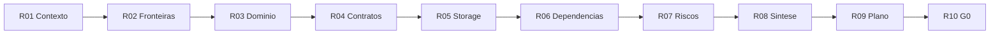

# Protocolo de debates estilo Slack

**Status:** ativo  
**Issue de referência:** ANX-44 (roster obrigatório), ANX-39 (organizations), ANX-42 (structure-debate), ANX-43 (system-capabilities)  
**Fonte de personas:** `brain/notes/anxionos-team-personas.md`  
**Roster detalhado:** [DEBATE-ROSTER.md](./DEBATE-ROSTER.md)

## Objetivo

Todo debate formal de orquestração (rodadas R01–R10 por módulo, structure-debate por componente) deve ser conduzido como **diálogo multi-persona visível no terminal** (Cursor chat), não apenas como síntese unilateral. O transcript é artefato primário; o documento `R0N-*.md` consolida decisões.

## Trilhas de debate

| Trilha | Pasta | Escopo | Issue típica |
| --- | --- | --- | --- |
| **Módulo (R01–R10)** | [modules/](./modules/) | Debate SDD por módulo antes de G1 | ANX-39 (organizations) |
| **Structure-debate** | [structure-debate/](./structure-debate/) | Fronteiras e layout por componente ADR0002 | ANX-42 |
| **System-capabilities** | [system-capabilities/](./system-capabilities/) | Mapa integrado humano+agente, affordances, integrações cross-módulo | Issue dedicada (debate funcionalidades) |

A trilha **system-capabilities** complementa debates por módulo: responde *o que humanos e agentes podem fazer* em cada capacidade, como módulos se integram e onde há lacunas vs. `brain/`. Artefatos esperados:

| Artefato | Função |
| --- | --- |
| `CAPABILITY-MAP.md` | Matriz 23 módulos × affordances humano/agente, eventos, API, grafo |
| `MODULE-STRUCTURE-CHECKLIST.md` | Conformidade ADR0002 por camada |
| `SLACK-TRANSCRIPTS.md` | Debates Slack `#platform-vision`, `#module-p02-foundation`, etc. |
| `modules/<nome>.md` | Outlines de funcionalidade por módulo (batch por pacote P0x) |

**Requisito do usuário (affordances humano + agente):** todo debate de capacidades deve explicitar, por módulo ou fluxo:

1. **Affordances humanas** — papéis Owner, Operator, Platform, Partner; ações via console/API com autoridade explícita.
2. **Affordances de agente** — Brain, workers, audit agents; comandos/eventos permitidos, limites de autonomia, kill switch e trilha de auditoria.
3. **Integração** — quem emite/consome eventos, projeções de grafo e ports cross-module (sem import de repositório privado).

Debates de módulo (R01–R10) referenciam decisões de system-capabilities quando afetam escopo v1; o decision log (`R08`) registra deferências e links.

## Conformidade ADR0002 (estrutura de módulo)

Todo módulo debateado deve respeitar o layout aceito em `brain/project-docs/decisions/0002-adopt-modular-backend-layout.md` e `brain/notes/anxionos-backend-structure.md`:

```
modules/<name>/
  domain/           # entidades, invariantes, ports — sem framework
  application/      # commands, queries, casos de uso
  infrastructure/   # PG, adapters, migrações
  api/              # handlers expostos ao composition root (se aplicável)
  graph/            # projeções/consumers locais (se aplicável)
  workers/          # jobs/event handlers (se aplicável)
  index.ts          # superfície pública do módulo
```

| Regra | Verificação no debate |
| --- | --- |
| `domain` não importa frameworks/providers/apps | R2 fronteiras, R3 domínio |
| Comunicação cross-module por contrato/SDK/evento | R4 contratos, R6 dependências |
| Composition root em `apps/*`, não regra de negócio em rotas | R2, structure-debate |
| Estado + journal + outbox atômicos por domínio | R5 armazenamento |
| Secrets só na infra autorizada | R5, R7 riscos |

Checklist operacional: [system-capabilities/MODULE-STRUCTURE-CHECKLIST.md](./system-capabilities/MODULE-STRUCTURE-CHECKLIST.md) (quando publicado). Layout ad hoc **proibido** — registrar violação como achado de Crítico/Arquiteto.

## Canais lógicos

| Canal | Uso |
| --- | --- |
| `#module-<nome>` | Debate SDD do módulo (ex.: `#module-organizations`) |
| `#structure-debate` | Debate de fronteira/arquitetura por componente (ex.: identity R02) |
| `#platform-vision` | Visão integrada humano+agente (trilha system-capabilities) |
| `#module-p0x-<tema>` | Capacidades por pacote SDD (ex.: `#module-p02-foundation`) |
| `#work-<issue>` | Thread operacional ligada à issue Dashi (ex.: `#work-ANX-39`) |
| `#engineering-decisions` | Resumos pós-consenso com link para ADR/spec |

**Regra:** o cabeçalho do transcript usa o canal principal do assunto. Menções `@persona` substituem ping no Slack.

## Formato de mensagem

Cada mensagem no transcript segue:

```text
**DisplayName (Papel)** · HH:MM
Texto em PT-BR, parágrafos curtos. @menção quando precisa de ação.
```

Opcional (recomendado em threads longas):

- `↳ thread` para respostas aninhadas
- `(reação: 👀 recebido)` ou `(reação: ✅ alinhado — não é PASS de gate)` para contexto
- Citação de fonte: `R06 D-R6-12`, `ANX-28`, `identity/R02`

## Roster obrigatório por sessão de debate

Cada sessão formal inclui **todos** os papéis abaixo. Detalhes, pareamento e checklists: [DEBATE-ROSTER.md](./DEBATE-ROSTER.md).

| Papel | DisplayName | Obrigatório | Gate |
| --- | --- | --- | --- |
| Orquestrador | **Orquestrador (CTO)** | Sim | G0, G6, G7 |
| Executor | **Executor (Dev)** | Sim | G1 (produz) |
| Crítico | **Crítico** | Sim | G1 (aprova handoff) |
| Code Review | **Code Review** | Sim | **G2** |
| QA | **QA** | Sim | **G3** |
| Security | **Security (Kai)** | Sim | **G4** |
| Red Team | **Red Team (Ryn)** | Sim | **G5** |
| Arquiteto | **Arquiteto** | Recomendado | Debate R2–R6 |

### Regras de participação

1. **Nenhuma rodada fecha** sem pelo menos **uma mensagem** de cada: **Crítico**, **Code Review**, **QA**, **Security**, **Red Team**.
2. **Crítico desafia** propostas materiais do **Executor** antes de qualquer consenso — silêncio não é aprovação.
3. **Executor e Crítico** são o par G1; **Code Review, QA, Security e Red Team** antecipam achados dos gates G2–G5 no debate (parecer formal continua no candidato de código).
4. Quem corrige achado de G2–G5 volta a ser Executor; outro revisor valida — mesma regra de [AGENTS.md](../../AGENTS.md).

### Mapeamento debate → gates G2–G5

| Papel no debate | Gate | No debate | No gate formal |
| --- | --- | --- | --- |
| Code Review | G2 | Contratos, idempotência, migração, manutenção | Relatório sobre diff completo |
| QA | G3 | Matriz de cenários, fixtures, negativos | Comandos + evidência executada |
| Security (Kai) | G4 | Tenancy, secrets, fail-closed, rate limits | Classificação de achados |
| Red Team (Ryn) | G5 | Bypass, corrida, abuso em escopo da rodada | Reprodução sandbox + cleanup |

Personas são **posturas IA** com parecer independente — menção ou reação no transcript **não** substitui PASS G1–G7.

### Template — cabeçalho de sessão (roster com @menções)

```markdown
## Session N — <título> {#session-N}

**Canal:** `#module-<nome>`  
**Issue:** ANX-NN · **Rodada:** R0N  
**Data:** YYYY-MM-DD  
**Roster obrigatório:** @Orquestrador @Executor @Crítico @CodeReview @QA @Security @RedTeam  
**Recomendado:** @Arquiteto  
**Pareamento:** Executor (Dev) ↔ Crítico  
**Gates antecipados:** G2 · G3 · G4 · G5
```

Na mensagem de abertura, o Orquestrador deve @mencionar cada participante obrigatório.

## Mapeamento rodadas R01–R10

Alinhado ao [module-development-playbook.md](./module-development-playbook.md):

| Rodada | Título | Participantes típicos | Saída |
| --- | --- | --- | --- |
| R01 | Contexto | Orquestrador, Arquiteto, Executor | `R01-context.md` |
| R02 | Fronteiras | Arquiteto, Crítico, Security | `R02-boundaries.md` |
| R03 | Domain sketch | Executor, Arquiteto, Crítico | `R03-domain-sketch.md` |
| R04 | Contratos/API/eventos | Executor, Code Review, Arquiteto | `R04-contracts.md` |
| R05 | Armazenamento | Executor, Arquiteto, Security | `R05-storage.md` |
| R06 | Dependências | Arquiteto, Executor, Security | `R06-dependencies.md` |
| R07 | Riscos | Security, Crítico, Red Team, Arquiteto | `R07-risks.md` |
| R08 | Síntese | Orquestrador, Crítico | `R08-decision-log.md` |
| R09 | Plano de implementação | Executor, QA, Code Review | `R09-dev-plan.md` |
| R10 | Pacote G0 | Orquestrador, todas (handoff) | `R10-g0-package.md` |

**Structure-debate** (ex.: `docs/orchestration/structure-debate/identity/`) usa o mesmo formato de mensagem; rodadas R01–R04+ conforme [INDEX.md](structure-debate/index.md).

### Pipeline visual R01–R10

Ver regras de compatibilidade em [MERMAID-STYLE.md](./MERMAID-STYLE.md).



## Fluxo de uma sessão

1. **Abertura** — Orquestrador cita issue, rodada, roster obrigatório com @menções, pendências da rodada anterior.
2. **Proposta** — Executor apresenta plano com evidência e critérios.
3. **Desafio** — Crítico questiona premissas/escopo **antes** do consenso; Executor responde.
4. **Antecipação G2–G5** — Code Review, QA, Security e Red Team registram achados ou condições mínimas.
5. **Debate** — Mínimo **15 mensagens**, **roster completo** (8 papéis, Arquiteto recomendado); discordância com evidência obrigatória.
6. **Consenso** — Só após checklist de fechamento em [DEBATE-ROSTER.md](./DEBATE-ROSTER.md); seções `## Consenso da rodada` + `## Decisões registradas`.
7. **Persistência** — Append no transcript da trilha (`modules/<module>/` ou `system-capabilities/`).
8. **Taskboard** — Comentário na issue com link relativo ao transcript + resumo de 2 linhas.
9. **Documento canônico** — Atualizar `R0N-*.md` com decisões.

## Requisitos de qualidade do transcript

| Requisito | Detalhe |
| --- | --- |
| Roster | Orquestrador, Executor, Crítico, Code Review, QA, Security, Red Team presentes |
| Volume | ≥15 mensagens; cada papel obrigatório com ≥1 mensagem |
| Par G1 | Crítico desafia Executor antes do consenso |
| Discordância | Pelo menos um eixo contestado com resolução explícita |
| Evidência | Referenciar docs (`R06`, `identity/R02`), issues (`ANX-28`, `ANX-39`) |
| Idioma | PT-BR no corpo; identificadores de código/API em inglês |
| Gates | Reação ou menção não equivale a PASS G1–G7 |

## Onde colar o transcript

| Escopo | Arquivo |
| --- | --- |
| Módulo organizations | [modules/organizations/SLACK-TRANSCRIPTS.md](./modules/organizations/SLACK-TRANSCRIPTS.md) |
| System-capabilities (humano+agente) | [system-capabilities/SLACK-TRANSCRIPTS.md](./system-capabilities/SLACK-TRANSCRIPTS.md) |
| Structure-debate por componente | `structure-debate/<component>/` (artefato R0N ou transcript dedicado) |

## Histórico

| Data | Mudança |
| --- | --- |
| 2026-09-07 | Protocolo inicial — debates Slack obrigatórios, Session 1 organizations R07 |
| 2026-09-07 | Trilha system-capabilities, affordances humano+agente, checklist ADR0002 |
| 2026-09-07 | Roster obrigatório (Executor+Crítico, G2–G5 no debate), DEBATE-ROSTER.md, ANX-44 |
