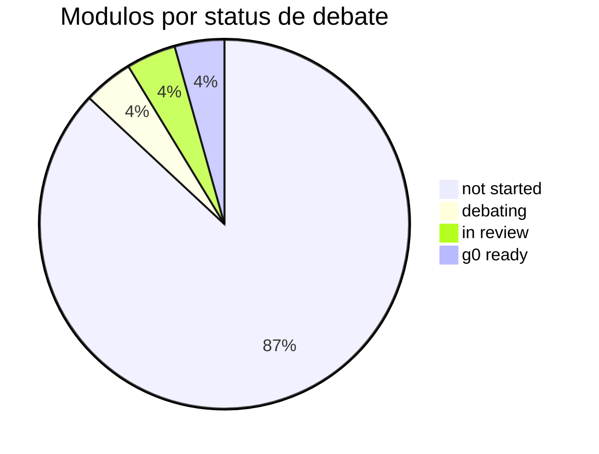
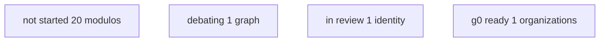
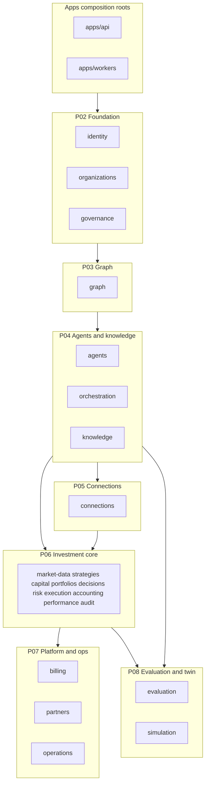
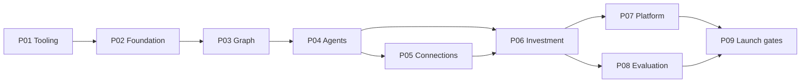
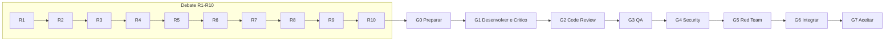
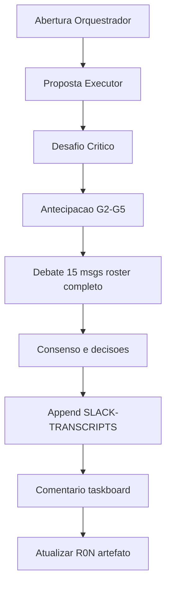

# Mermaid — guia de compatibilidade (GitHub + Cursor)

**Status:** ativo  
**Escopo:** `docs/orchestration/` e blocos colados em chat Cursor

Diagramas que não renderizam costumam falhar por **caracteres especiais em labels**, `graph` legado, `pie` malformado ou IDs de subgraph inválidos. Use estes templates como fonte de verdade.

## Regras obrigatórias

| Regra | Faça | Evite |
| --- | --- | --- |
| Tipo de grafo | `flowchart TB` ou `flowchart LR` | `graph TD`, `graph LR` |
| Pie | linha 1 `pie`; linha 2 `title Texto`; fatias `"label" : N` | `pie title` na mesma linha; underscores nas labels |
| Labels pie | ASCII com espacos, aspas duplas | `pie title` combinado; em-dash; acentos |
| Quebra de linha | `["linha 1\nlinha 2"]` em flowchart | ` ` |
| Subgraph ID | alfanumérico: `subgraph P02["P02 Foundation"]` | `subgraph P02 — x`, underscores só no ID se necessário |
| Arestas | `-->` | `---` como conector entre nós |
| Símbolos em nós | aspas duplas no texto | `+`, `/path/*`, `(nota)` sem necessidade |

## Template — progresso de debates (pie)

Atualize os números conforme [module-queue.md](./module-queue.md).

**Sintaxe correta:** `pie` e `title` em linhas separadas (nunca `pie title ...` na mesma linha).

### Fallback Cursor chat (se pie ainda falhar)

Use flowchart — suportado de forma consistente no preview do Cursor:

## Template — árvore backend por pacote SDD (simplificado)

## Template — sequência P01–P09 (entrega)

## Template — pipeline debate R01–R10 e gates G0–G7

## Template — orquestração de sessão Slack

## Checklist antes de commitar diagrama

1. Preview no Cursor ou GitHub — bloco abre sem erro.
2. IDs de subgraph só `[A-Za-z0-9]`.
3. Pie: linha 1 so `pie`; linha 2 `title ...`; fatias com aspas; sem underscores se preview falhar.
4. Sem em-dash `—`, `&` ou `+` em labels de pie.
5. Sequence diagrams: nomes de participante curtos; evite `/` e `*` em aliases.

## Referências

- [DEBATE-FORMAT.md](./DEBATE-FORMAT.md)
- [module-development-playbook.md](./module-development-playbook.md)
- [structure-debate/INDEX.md](structure-debate/index.md)
- [module-queue.md](./module-queue.md)
