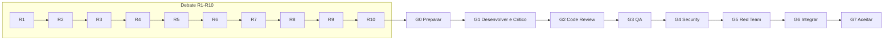

# Playbook — desenvolvimento modular do backend anxionOS

Guia operacional para orquestrar os **23 módulos** definidos em `brain/project-docs/decisions/0002-adopt-modular-backend-layout.md` e na `brain/notes/anxionos-backend-structure.md`, alinhado ao SDD `brain/project-docs/specs/001-institutional-contract/spec.md` e ao pipeline **G0–G7** de [AGENTS.md](../../AGENTS.md).

## Objetivo

Antes de qualquer código de módulo, a equipe executa até **10 rodadas de debate documentado**. Após aprovação do pacote **G0**, segue desenvolvimento (G1) e gates independentes G2→G7. Este playbook não autoriza scaffolding dos 23 módulos de uma vez — apenas o módulo ativo do pacote corrente.

## Equipe contratada (roster por ciclo de módulo)

Cada módulo recebe a mesma estrutura de papéis. Subagentes Cursor mapeados para execução técnica; personas humanas-equivalentes conforme `brain/notes/anxionos-team-personas.md`.

| Papel | Nome funcional | Subagente / skill | Responsabilidade | Gate |
| --- | --- | --- | --- | --- |
| **Orquestrador** | Coordenador CTO | `orchestrate-work` + este playbook | Prioriza fila, despacha debate, consolida G6, encaminha G7 | G0, G6, G7 |
| **Executor** | Eng. implementação | `code-architect` → implementação direta | Entrega código, testes, evidências | G1 (produz) |
| **Crítico** | Revisor adversarial G1 | `critic-reviewer` | Questiona premissas, valida critérios antes do handoff | G1 (aprova handoff) |
| **Code Review** | Mantenedor de contratos | `code-reviewer` + `typescript-reviewer` | Diff, arquitetura, manutenção, migrações | G2 |
| **QA** | Comportamento observável | `e2e-runner` + `tdd-guide` | Cenários positivos/negativos, regressão, E2E aplicável | G3 |
| **Security** | Controles e fronteiras | `security-reviewer` | AuthZ, tenancy, secrets, dependências | G4 |
| **Red Team** | Cenários adversariais | `security-reviewer` (escopo Red Team) | Bypass, corrida, abuso em sandbox autorizado | G5 |
| **Arquiteto** | Desenho e fronteiras | `architect` / `code-explorer` | R2–R6 do debate; valida ADR0002 | Debate R2–R6 |
| **Explorador** | Inventário e impacto | `code-explorer` + graphify | R1 doc/code inventory; blast radius | Debate R1 |

### Regras de independência

1. Executor e Crítico **nunca** são o mesmo agente na mesma entrega.
2. Quem corrige achado de G2–G5 volta a ser Executor; outro revisor valida a correção.
3. Aprovação de gate anterior **não** se reaproveita após mudança material — revalidação explícita.
4. `done` no taskboard só após aceite explícito do usuário (G7).

## Participação obrigatória nos debates

Todo debate formal (rodadas R01–R10, structure-debate, system-capabilities) segue o protocolo [DEBATE-FORMAT.md](./DEBATE-FORMAT.md) e o roster detalhado em [DEBATE-ROSTER.md](./DEBATE-ROSTER.md).

| Regra | Detalhe |
| --- | --- |
| **Roster mínimo** | Orquestrador, Executor, Crítico, Code Review, QA, Security, Red Team — Arquiteto recomendado |
| **Par G1** | Executor (Dev) ↔ Crítico; Crítico desafia propostas antes do consenso |
| **G2–G5 no debate** | Code Review, QA, Security e Red Team participam com ≥1 mensagem cada — antecipam achados dos gates formais |
| **Fechamento** | Rodada incompleta se faltar voz de Crítico ou de qualquer equipe G2–G5 |
| **Transcript** | ≥15 mensagens; cabeçalho com @menções obrigatórias conforme template |

Os papéis da tabela [Equipe contratada](#equipe-contratada-roster-por-ciclo-de-módulo) são os mesmos nos debates e nos gates G1–G7. Debate não substitui parecer formal; prepara evidência e reduz surpresas em G2→G5.

Exemplo de sessão com roster completo: [modules/organizations/SLACK-TRANSCRIPTS.md](./modules/organizations/SLACK-TRANSCRIPTS.md) Session 4 (R09 readiness).

## Fila e pacotes (P01→P09)

Ordem canônica extraída do SDD e da estrutura modular:

| Pacote | Módulos / entregáveis | Pré-requisito |
| --- | --- | --- |
| **P01** | Tooling, boundaries, CI, licenças | — |
| **P02** | `packages/*` (contracts, eventing, database, secrets, observability, sdk) + **identity**, **organizations**, **governance** | P01 |
| **P03** | **graph** (kernel, T01–T20, projeções) | P02 |
| **P04** | **agents**, **orchestration**, **knowledge** | P02, P03 |
| **P05** | **connections** | P02, contratos CX |
| **P06** | **market-data**, **strategies**, **capital**, **portfolios**, **decisions**, **risk**, **execution**, **accounting**, **performance**, **audit** | P03, P04, P05 |
| **P07** | **billing**, **partners**, **operations** + consoles | P04–P06 |
| **P08** | **evaluation**, **simulation** | P04, P06 + dados |
| **P09** | Recovery, tenancy, launch gates | P01–P07 |

Fila detalhada com status: [module-queue.md](./module-queue.md).

## Workflow de debate (máx. 10 rodadas)

Para **cada** módulo, antes de G1:

| Rodada | Atividade | Artefato | Participantes principais |
| --- | --- | --- | --- |
| **R1** | Inventário — specs, ADRs, brain, código existente | `modules/<name>/R01-context.md` | Explorador, Arquiteto |
| **R2** | Fronteira — o que o módulo possui e o que **não** possui | `R02-boundaries.md` | Arquiteto, Crítico |
| **R3** | Modelo de domínio — entidades, invariantes, ports | `R03-domain-sketch.md` | Arquiteto, Executor |
| **R4** | API e eventos — superfície pública, contratos | `R04-contracts.md` | Executor, Code Review |
| **R5** | Armazenamento — PG / Neo4j / SQLite por mapa | `R05-storage.md` | Arquiteto, Security |
| **R6** | Dependências — upstream / downstream | `R06-dependencies.md` | Explorador, Orquestrador |
| **R7** | Riscos e perguntas abertas | `R07-risks.md` | Crítico, Security |
| **R8** | Síntese do debate — posições e decisões | `R08-decision-log.md` | Todos |
| **R9** | Plano de implementação — arquivos, migrações, testes | `R09-dev-plan.md` | Executor, QA |
| **R10** | Pacote G0 — critérios, ambiente, escopo da issue | `R10-g0-package.md` | Orquestrador |

**Regras:**

- Consenso antes de R10 → encerrar debate cedo (registrar rodada final em `R08-decision-log.md`).
- Sem consenso em R10 → escalar ao usuário; **não** iniciar G1.
- Nunca ultrapassar 10 rodadas sem decisão explícita de escalonamento.

## Mapeamento debate → pipeline G0–G7

Diagramas: [MERMAID-STYLE.md](./MERMAID-STYLE.md).

| Gate | Entrada | Evidência mínima |
| --- | --- | --- |
| **G0** | `R10-g0-package.md` aprovado | Issue claimada, escopo fechado, deps resolvidas, crítico nominal |
| **G1** | Implementação + testes | Parecer do Crítico: PASS |
| **G2** | Diff completo | Relatório code-reviewer com severidades |
| **G3** | Critérios funcionais | Comandos executados, cenários negativos |
| **G4** | Fronteiras de confiança | Classificação de achados |
| **G5** | Sandbox autorizado | Reprodução + cleanup |
| **G6** | Pareceres agregados | Integração sem conflito de evidência |
| **G7** | Aceite usuário | `done` no taskboard |

## Taskboard — estrutura de issues

| Tipo | Padrão de título | Status inicial |
| --- | --- | --- |
| Epic pai | `Orchestration: modular backend delivery P01-P09` | `todo` / `in_progress` |
| Debate módulo | `Debate R1-R10: modules/<name>` | `in_progress` durante debate |
| Implementação | `P0x: modules/<name> (...)` | `todo` → claim → `in_review` |
| Gate filho | `G2 Review: ANX-NN modules/<name>` | `todo` quando G1 PASS |

Relações: `parent` do debate e implementação → epic de orquestração; `blocks` quando dependência explícita (ex.: organizations bloqueado até identity `done`).

## Gates obrigatórios por sessão de agente

1. Ler [AGENTS.md](../../AGENTS.md)
2. `npm run taskboard:ensure`
3. Claim issue `ANX-*` em `in_progress`
4. `graphify query` antes de exploração em massa
5. Ao terminar: comentário com links → `in_review`

## Diagrama Archify

Workflow visual: [.archify/specs/anxionos-module-orchestration.workflow.json](../../.archify/specs/anxionos-module-orchestration.workflow.json) → `npm run archify:build`.

## Referências

- `brain/notes/anxionos-backend-structure.md`
- `brain/notes/anxionos-storage-ownership.md`
- `brain/project-docs/specs/001-institutional-contract/spec.md`
- `brain/notes/anxionos-team-personas.md`
- [Fila de módulos](./module-queue.md)
- [Protocolo de debates](./DEBATE-FORMAT.md)
- [Roster obrigatório nos debates](./DEBATE-ROSTER.md)
