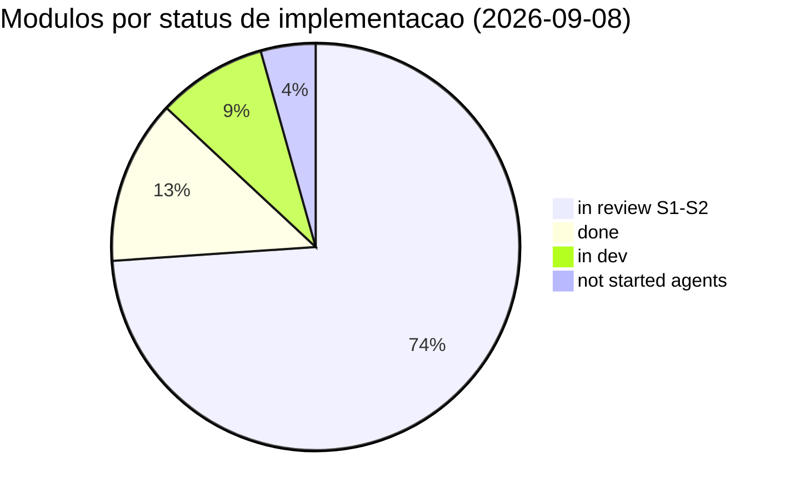

# Fila de módulos — backend anxionOS (23 módulos)

## Continuação vigente — programa ANX-126

Reconciliação ANX-127 em 2026-09-08: o board é fonte do status atual. O programa ANX-126 está em `in_review`; seus 60 filhos ANX-127–186 estão distribuídos em 57 `todo`, ANX-127 `in_progress` e ANX-172/173 `backlog`. `todo` não significa dependências satisfeitas nem dispensa claim/G0. ANX-124/125 permanecem `blocked`, afetando ANX-144. ANX-54/118 estão `done`; não executar novamente tarefas históricas por causa da tabela abaixo.

| Frente de continuação | Issues |
| --- | --- |
| Contratos, boundaries, secrets, eventing, tenancy e workers | ANX-127–133 |
| Identity, organizations, governance e graph | ANX-134–138 |
| Agents, orchestration, connections, knowledge e teammates | ANX-139–144 |
| Dados e ciclo financeiro | ANX-145–154 |
| Audit, billing, partners, operations, simulation e evaluation | ANX-155–160 |
| SDK de adapters, Docker e paper integrado | ANX-161–163 |
| Quatro consoles e realtime | ANX-164–168 |
| Restore, SLOs e evolução controlada | ANX-169–171 |
| REAL e autonomia L3/L4 — somente backlog futuro | ANX-172–173 |
| Sete motores externos, homologação em sandbox | ANX-174–180 |
| Críticos, revisão, QA, Security, Red Team e aceite | ANX-181–186 |

Consulte a [matriz reconciliada](./module-contract-matrix-23.md) para módulo→issue, fonte→source→oráculo e limitações. Os 23 módulos têm inspeção inicial parcial; schemas, capacidades completas e gates não estão homologados. A ausência de agents no inventário físico não impede que seu debate exista. `adapter-gateway` é diretório extra observado, não um 24º módulo aceito.

A retomada começa pela reconciliação ANX-127. As relações `blockedBy` do board controlam a ordem detalhada; antes de claim, ler issue/comentários e revalidar dependências, autoridade, criticidade e alterações concorrentes. Não iniciar todos os filhos em paralelo.

## Histórico preservado — não usar como fila atual

As tabelas, contagens, PASS e prioridades históricas a seguir foram registradas no snapshot 2026-09-08T15:40Z (ANX-54). Não foram convertidas em evidência do candidato atual nem representam status presente. Mantidas para rastrear debates/aceites; conflitos internos e resultados como 591/591 devem ser confrontados com revisão, ambiente e parecer originais.

**Mapa funcional humano+agente:** [system-capabilities/CAPABILITY-MAP.md](./system-capabilities/CAPABILITY-MAP.md) (ANX-43) · debates Slack em [SLACK-TRANSCRIPTS.md](./system-capabilities/SLACK-TRANSCRIPTS.md)

**Fundação P01/P02:** [contratos e gates](./system-capabilities/p01-p02-contracts-and-gates.md) · [backlog priorizado](./system-capabilities/p01-p02-backlog.md) (ANX-45; draft para revisão)
**Roadmap integrado:** [execução dos 23 módulos](./execution-roadmap.md) (ANX-45; draft para revisão)

## Legenda de status

| Status | Significado |
| --- | --- |
| `not_started` | Sem pasta de módulo nem debate iniciado |
| `debating` | Rodadas R1–R10 em andamento (`docs/orchestration/modules/<name>/`) |
| `g0_ready` | Debate concluído; pacote G0 aprovado; aguardando claim de implementação |
| `in_dev` | G1 ativo (issue `in_progress`) |
| `in_review` | Implementação entregue; gates G2–G7 pendentes ou em curso |
| `done` | Aceite explícito G7 |

## Pacotes compartilhados (`backend/packages/`)

| Componente | Pacote P | Status | Issue / notas |
| --- | --- | --- | --- |
| contracts | P02 | `in_review` | Parcial — errors, events, realtime |
| eventing | P02 | `in_review` | Parcial — outbox Postgres (ANX-27) |
| database | P02 | `in_dev` | Infra conexões; sem secrets package |
| observability | P02 | `in_review` | Logger, redact |
| secrets | P02 | `not_started` | — |
| sdk | P02 | `not_started` | — |

## Progresso dos debates (snapshot)

Diagramas compatíveis: [MERMAID-STYLE.md](./MERMAID-STYLE.md).

| Métrica | Valor |
| --- | ---: |
| **Debates `g0_ready` (R01–R10 + PC-G0 10/10)** | **23/23** |
| Impl S1–S2 P05–P08 (`in_review`) | 17 issues (ANX-84…116) |
| Suite backend | **591/591** pass · boundaries 0 violações |
| Debates G7 pendentes (`in_review` no board) | 17 (+ cross-ref ANX-83 G2 revalidação) |
| Debate G7 aceito | ANX-40 (governance) |

## Fila dos 23 módulos

| # | Módulo | Pacote | Status | Issue taskboard | Debate |
| --- | --- | --- | --- | --- | --- |
| 1 | **identity** | P02 | P0 **`done`** · debate **`g0_ready`** | ANX-28 (`done`, G7) · **ANX-77** (`in_review`, G7 debate) · **ANX-78** (`in_review`, P1 impl) | [R06–R10](./modules/identity/) · [R01–R05](./structure-debate/identity/R01-context.md) · [ROUNDS](./modules/identity/ROUNDS.md) · PC-G0 **10/10** |
| 2 | **organizations** | P02 | **`done`** · debate **`g0_ready`** | ANX-29 (`done`, G7 2026-09-07) · **ANX-39** (`in_review`, G7 debate) | [R01–R10](./modules/organizations/) · [R10 G0](./modules/organizations/R10-g0-handoff.md) · PC-G0 **10/10** · S1–S6+ API (48 testes); revalidação G6 integrado pendente |
| 3 | governance | P02 | **`done`** · debate **`g0_ready`** | ANX-30 (`done`) · **ANX-40** (`done`, G7 debate 2026-09-08) | [R01–R10](./modules/governance/) · [R10 G0](./modules/governance/R10-g0-handoff.md) · PC-G0 **10/10** |
| 4 | **graph** | P03 | **`in_review`** · debate **`g0_ready`** | ANX-32 (`in_review`, G2 re-run) · **ANX-41** (`in_review`, G7 debate) | [R01–R10](./structure-debate/graph/) · [R10 G0](./structure-debate/graph/R10-g0-handoff.md) · PC-G0 **10/10** · S1–S7 entregue; S8 defer; **RB-D04** grant events pendente |
| 5 | agents | P04 | **`in_review`** · debate **`g0_ready`** | **ANX-82** (`in_review`, G7 debate) | [R01–R10](./structure-debate/agents/) · [R10 G0](./structure-debate/agents/R10-g0-handoff.md) · PC-G0 **10/10** |
| 6 | **orchestration** | P04 | **`in_dev`** · debate **`g0_ready`** | **ANX-53** (`in_review` S1) · ANX-73 (`in_progress`) · **ANX-46** (`in_review`, G7 debate) | [R01–R10](./structure-debate/orchestration/) · [R10 G0](./structure-debate/orchestration/R10-g0-handoff.md) · PC-G0 **10/10** · S6–S7 bloqueado **RB-D04** |
| 7 | **connections** | P05 | **`in_review`** · debate **`g0_ready`** | **ANX-83** (`in_review`, debate — G2 CHANGES_REQUIRED doc) · **ANX-84** (`in_review`, impl S1–S2 G6 PASS) · **ANX-62** (contrato `in_review`) · **ANX-36** (epic gate `in_review`) | [R01–R10](./modules/connections/) · [R10 G0](./modules/connections/R10-g0-handoff.md) · PC-G0 10/10 |
| 8 | **knowledge** | P04 | **`in_review`** · debate **`g0_ready`** | **ANX-85** (`in_review`, debate — G5 CHANGES_REQUIRED) · **ANX-86** (`in_review`, impl S1–S2 G6 PASS) · **ANX-36** (epic gate `in_review`) · ANX-42 (R01 estrutural) | [R01–R10](./structure-debate/knowledge/) · [R10 G0](./structure-debate/knowledge/R10-g0-handoff.md) · [ROUNDS](./structure-debate/knowledge/ROUNDS.md) · PC-G0 10/10 |
| 9 | **market-data** | P06 | **`in_review`** · debate **`g0_ready`** | **ANX-87** (`in_review`, debate R01–R10 ✅) · **ANX-88** (`in_review`, impl S1–S2 G6 PASS) · ANX-42 (R01 estrutural) · ANX-58 (contrato P06 `in_review`) | [R01–R10](./structure-debate/market-data/) · [R10 G0](./structure-debate/market-data/R10-g0-handoff.md) · [ROUNDS](./structure-debate/market-data/ROUNDS.md) · PC-G0 10/10 |
| 10 | **strategies** | P06 | **`in_review`** · debate **`g0_ready`** | **ANX-89** (`in_review`, debate R01–R10 ✅) · **ANX-90** (`in_review`, impl S1–S2 G6 PASS) · ANX-58 (contrato P06 `in_review`) · ANX-88 (market-data upstream `in_review`) | [R01–R10](./structure-debate/strategies/) · [R10 G0](./structure-debate/strategies/R10-g0-handoff.md) · [ROUNDS](./structure-debate/strategies/ROUNDS.md) · PC-G0 10/10 |
| 11 | **capital** | P06 | **`in_review`** · debate **`g0_ready`** | **ANX-91** (`in_review`, debate R01–R10 ✅) · **ANX-92** (`in_review`, impl S1–S2 G6 PASS) · ANX-58 (contrato P06 `in_review`) | [R01–R10](./structure-debate/capital/) · [R10 G0](./structure-debate/capital/R10-g0-handoff.md) · [ROUNDS](./structure-debate/capital/ROUNDS.md) · PC-G0 10/10 |
| 12 | **portfolios** | P06 | **`in_review`** · debate **`g0_ready`** | **ANX-95** (`in_review`, debate R01–R10 ✅) · **ANX-96** (`in_review`, impl S1–S2 G6 PASS) · ANX-58 (contrato P06 `in_review`) · ANX-91 (capital upstream `in_review`) · ANX-93 (accounting upstream `in_review`) | [R01–R10](./structure-debate/portfolios/) · [R10 G0](./structure-debate/portfolios/R10-g0-handoff.md) · [ROUNDS](./structure-debate/portfolios/ROUNDS.md) · PC-G0 10/10 |
| 13 | **decisions** | P06 | **`in_review`** · debate **`g0_ready`** | **ANX-97** (`in_review`, debate R01–R10 ✅) · **ANX-98** (`in_review`, impl S1–S2 G6 PASS) · ANX-58 (contrato P06 `in_review`) · ANX-85 (knowledge upstream `in_review`) · ANX-95 (portfolios upstream `in_review`) | [R01–R10](./structure-debate/decisions/) · [R10 G0](./structure-debate/decisions/R10-g0-handoff.md) · [ROUNDS](./structure-debate/decisions/ROUNDS.md) · PC-G0 10/10 |
| 14 | **risk** | P06 | **`in_review`** · debate **`g0_ready`** | **ANX-99** (`in_review`, debate R01–R10 ✅) · **ANX-100** (`in_review`, impl S1–S2 G6 PASS) · ANX-58 (contrato P06 `in_review`) · ANX-97 (decisions upstream `in_review`) · ANX-95 (portfolios upstream `in_review`) · ANX-91 (capital upstream `in_review`) · ANX-30 (governance upstream) | [R01–R10](./structure-debate/risk/) · [R10 G0](./structure-debate/risk/R10-g0-handoff.md) · [ROUNDS](./structure-debate/risk/ROUNDS.md) · PC-G0 10/10 |
| 15 | **execution** | P06 | **`in_review`** · debate **`g0_ready`** | **ANX-101** (`in_review`, debate R01–R10 ✅) · **ANX-102** (`in_review`, impl S1–S2 G6 PASS) · ANX-58 (contrato P06 `in_review`) · ANX-99 (risk upstream `in_review`) · ANX-97 (decisions upstream `in_review`) · ANX-91 (capital upstream `in_review`) · ANX-93 (accounting downstream `in_review`) · ANX-83 (connections upstream `in_review`) | [R01–R10](./structure-debate/execution/) · [R10 G0](./structure-debate/execution/R10-g0-handoff.md) · [ROUNDS](./structure-debate/execution/ROUNDS.md) · PC-G0 10/10 |
| 16 | **accounting** | P06 | **`in_review`** · debate **`g0_ready`** | **ANX-93** (`in_review`, debate R01–R10 ✅) · **ANX-94** (`in_review`, impl S1–S2 G6 PASS) · ANX-58 (contrato P06 `in_review`) · ANX-91 (capital upstream `in_review`) | [R01–R10](./structure-debate/accounting/) · [R10 G0](./structure-debate/accounting/R10-g0-handoff.md) · [ROUNDS](./structure-debate/accounting/ROUNDS.md) · PC-G0 10/10 |
| 17 | **performance** | P06 | **`in_review`** · debate **`g0_ready`** | **ANX-105** (`in_review`, debate R01–R10 ✅) · **ANX-106** (`in_review`, impl S1–S2 G6 PASS) · ANX-93 (accounting upstream `in_review`) | [R01–R10](./structure-debate/performance/) · [R10 G0](./structure-debate/performance/R10-g0-handoff.md) · [ROUNDS](./structure-debate/performance/ROUNDS.md) · PC-G0 10/10 |
| 18 | **audit** | P06 | **`in_review`** · debate **`g0_ready`** | **ANX-107** (`in_review`, debate R01–R10 ✅) · **ANX-108** (`in_review`, impl S1–S2 G6 PASS) | [R01–R10](./structure-debate/audit/) · [R10 G0](./structure-debate/audit/R10-g0-handoff.md) · [ROUNDS](./structure-debate/audit/ROUNDS.md) · PC-G0 10/10 |
| 19 | **billing** | P07 | **`in_review`** · debate **`g0_ready`** | **ANX-103** (`in_review`, debate R01–R10 ✅) · **ANX-104** (`in_review`, impl S1–S2 G6 PASS) · ANX-83 (connections upstream `in_review`) | [R01–R10](./structure-debate/billing/) · [R10 G0](./structure-debate/billing/R10-g0-handoff.md) · [ROUNDS](./structure-debate/billing/ROUNDS.md) · PC-G0 10/10 · invoice via `connections.usage.recorded.v1` |
| 20 | **partners** | P07 | **`in_review`** · debate **`g0_ready`** | **ANX-113** (`in_review`, debate R01–R10 ✅) · **ANX-114** (`in_review`, impl S1–S2 G6 PASS) · ANX-103 (billing upstream `in_review`) | [R01–R10](./structure-debate/partners/) · [R10 G0](./structure-debate/partners/R10-g0-handoff.md) · [ROUNDS](./structure-debate/partners/ROUNDS.md) · PC-G0 10/10 |
| 21 | **operations** | P07 | **`in_review`** · debate **`g0_ready`** | **ANX-111** (`in_review`, debate R01–R10 ✅) · **ANX-112** (`in_review`, impl S1–S2 G6 PASS) · ANX-107 (audit upstream `in_review`) | [R01–R10](./structure-debate/operations/) · [R10 G0](./structure-debate/operations/R10-g0-handoff.md) · [ROUNDS](./structure-debate/operations/ROUNDS.md) · PC-G0 10/10 |
| 22 | **evaluation** | P08 | **`in_review`** · debate **`g0_ready`** | **ANX-109** (`in_review`, debate R01–R10 ✅) · **ANX-110** (`in_review`, impl S1–S2 G6 PASS) · ANX-105 (performance upstream `in_review`) · ANX-115 (simulation upstream `in_review`) | [R01–R10](./structure-debate/evaluation/) · [R10 G0](./structure-debate/evaluation/R10-g0-handoff.md) · [ROUNDS](./structure-debate/evaluation/ROUNDS.md) · PC-G0 10/10 · scoring P08 agent/strategy |
| 23 | **simulation** | P08 | **`in_review`** · debate **`g0_ready`** | **ANX-115** (`in_review`, debate R01–R10 ✅) · **ANX-116** (`in_review`, impl S1–S2 G6 PASS) · ANX-89 (strategies upstream `in_review`) | [R01–R10](./structure-debate/simulation/) · [R10 G0](./structure-debate/simulation/R10-g0-handoff.md) · [ROUNDS](./structure-debate/simulation/ROUNDS.md) · PC-G0 10/10 |

## Apps e services (fora dos 23, mas na árvore ADR0002)

| Componente | Status | Notas |
| --- | --- | --- |
| `apps/api` | `in_review` | Elysia, auth, realtime, dev routes |
| `apps/workers` | `in_dev` | Outbox relay + governance projection workers |
| `services/execution-go` | `not_started` | P06 |
| `services/research-python` | `not_started` | P08 |

## Próximos passos do snapshot histórico (substituídos pela continuação vigente)

1. **G7 batch** — aceite explícito owner: 17 debates + 17 impl + ANX-118/119–122 (template em comentários ANX-54)
2. **Debates doc** — revalidar G2 nos 10 `CHANGES_REQUIRED` (correções R04/R05 iniciadas: connections, strategies, billing)
3. **graph** — ANX-32 `in_review`; RB-D04 grant events
4. **agents** — único módulo baseline sem pasta; ANX-82 debate `in_review`
5. **orchestration** — ANX-53 S1 `in_review`; S6–S7 parcial RB-D04

## Contagens do snapshot histórico

| Métrica | Quantidade |
| --- | ---: |
| **Debates `g0_ready` (23 módulos)** | **23** |
| Implementação `done` (G7) | 3 (identity, organizations, governance) |
| Implementação `in_review` S1–S2 | **17** (ANX-84…116) |
| Implementação `in_dev` / parcial | 2 (graph ANX-32, orchestration ANX-53) |
| Implementação `not_started` | 1 (`agents` — sem pasta) |
| Debates G7 `in_review` | 17 |
| Debates G2 `CHANGES_REQUIRED` (doc) | 0 (ANX-85 G5 parcial PASS S1–S2; S4–S5 defer) |
| Issues transversais `in_review` | ANX-54, ANX-118, ANX-119–121, ANX-122 |
| Debate G7 `done` | 1 (ANX-40) |
| Módulo extra (fora baseline 23) | `adapter-gateway` |

**Total módulos:** 23

## Gates ANX-28 — identity (snapshot 2026-09-07)

| Gate | Responsável | Disposição | Evidência | Notas |
| --- | --- | --- | --- | --- |
| **G0–G6** | Executor + equipes | **PASS** | P0 package; 5/5 testes identity | Revisões documentadas em comentários ANX-28 |
| **G7** | Usuário/revisor | **PASS** | aceite explícito 2026-09-07 | P1 defer: Better Auth, rotas públicas identity API |

**P0 aceito:** `backend/modules/identity`, migrations Drizzle, `getPrincipalById`, adapter `createIdentityPrincipalLookup` consumido por organizations bootstrap.

## Gates ANX-29 — organizations (snapshot 2026-09-07)

Candidato **isolado** (`backend/modules/organizations` + plugin API + contratos; `PrincipalLookup` mock/fixture em testes unitários). Candidato **integrado** (bootstrap `eventing→identity→organizations`, wiring real ANX-28) **desbloqueado** — `createIdentityPrincipalLookup(pool)` em `apps/api/src/organizations/bootstrap.ts`; revalidação G6 pendente.

| Gate | Responsável | Disposição | Digest / evidência | Notas |
| --- | --- | --- | --- | --- |
| **G0** | Orquestrador | **PASS** | [R10-g0-handoff](./modules/organizations/R10-g0-handoff.md) | PC-G0 10/10; PC-G0-04 (identity G7) ✅ ANX-28 done |
| **G1** | Executor + Crítico | **PASS (isolado)** | S1–S6 entregue (`ba2e9259`, closeout `6c548878`) | **Integrado: desbloqueado** — revalidação G6 pendente |
| **G2** | Code Review | **PASS** | re-run `e2f212b5` (`798966c4`) | Duplicatas HTTP, race accept, rate limit — corrigidos |
| **G3** | QA | **PASS** | `ce9a39ac` (`1e1b4835`) | 45 pass org+contracts; G3-03 NOT_COVERED (baixo) |
| **G4** | Security | **PASS** | re-run pós G4-01 (`96aa2b27`) | RBAC owner/admin; residuais médio não bloqueantes |
| **G5** | Red Team | **PASS** | `415f66e1` (`84fc8228`) | G5-02a médio (invite race 500 vs 409) — não bloqueante |
| **G6** | Orquestrador | **PASS (isolado)** | G6 integração 2026-09-07 | `bun test tests/organizations` → **47 pass** (2026-09-07 pós-ANX-28 G7); integrado **PENDENTE revalidação formal** |
| **G7** | Usuário/revisor | **PASS** | aceite explícito 2026-09-07 (`548d7a16`) | Candidato isolado aceito; revalidação integrada pós-ANX-28 |

**Bloqueador integrado:** RB-D04 governance grant events — identity G7 ✅ (ANX-28 done 2026-09-07). Próximo: G6 integrado formal + RB-D04.

**Riscos residuais aceitos (G6):** G5-02a, G3-03, G5-03a, R-ORG-06 (dupla Idempotency-Key), application-only tenancy (P09 RLS defer).
