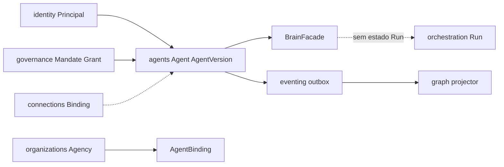

# R01 — Contexto: `modules/agents`

**Módulo:** agents (P04)  
**Rodada:** R1 — Inventário documental e de código  
**Data:** 2026-09-11  
**Issue:** ANX-392 (pack canônico P1) · histórico ANX-42 / ANX-82  
**PC serial:** [PC 03](../../../../notes/anxionos-pc03-agents-debate.md)

## In / Out (R1)

**In:** inventário Agent, AgentVersion, skills, bindings e fachada Brain neste pack.

**Out:** este contexto. **Não** Goal/Task/Run (`orchestration`). **Não** Grant (`governance`). Personas Cursor ≠ agentes institucionais.

## Non-goals

Não spec `accepted`. Não ST08 live. Não ANX-389 `done`. Sem código de produto.

## Ownership

| Superfície | Dono |
| --- | --- |
| Agent / AgentVersion / Skill / AgentBinding / BrainFacade | **agents** |
| adapter-gateway | **KEEP** |

## Participantes

| Papel | Agente |
| --- | --- |
| Explorador | code-explorer |
| Arquiteto | architect |
| Crítico | critic-reviewer |
| Orquestrador | CTO orchestrator |

## Objetivo da rodada

Consolidar fontes de verdade, código existente e lacunas **neste** diretório (`docs/orchestration/modules/agents/`), no padrão [governance](../governance/R01-context.md). O [structure-debate](../../structure-debate/agents/R01-context.md) permanece histórico — não é o dono G0.

Personas Cursor (Renata, Lucas) **não** são os agentes institucionais deste módulo.

## Inventário documental

| Fonte | Caminho | Relevância |
| --- | --- | --- |
| Estrutura modular (aceita) | `brain/notes/anxionos-backend-structure.md` | Dono físico: Agent, AgentVersion, skills, bindings, Brain facade |
| Mapa de armazenamento | `brain/notes/anxionos-storage-ownership.md` | PG `agents_*`; Neo4j via projector graph |
| Spec 002 | `brain/project-docs/specs/002-agents-knowledge/spec.md` | Lifecycle, Brain, paridade AP01–AP08 |
| ADR0002 | `brain/project-docs/decisions/0002-adopt-modular-backend-layout.md` | Layout `modules/agents/` |
| ADR0004 | `brain/project-docs/decisions/0004-postgresql-timescaledb-pgvector.md` | Engines: PG + Neo4j; sem Timescale/pgvector neste módulo |
| ADR0010 | `brain/project-docs/decisions/0010-agent-hierarchy-modes-triangular-circular.md` | TREE/CIRCULAR via governance, não neste módulo |
| PC 03 | [debate M03](../../../../notes/anxionos-pc03-agents-debate.md) | In/out/non-goals + mermaid |
| Ficha | [agents.md](../../system-capabilities/modules/agents.md) | Histórias humano+agente |
| Governance R02 | [R02](../governance/R02-boundaries.md) | Mandate vs Grant; Authority L0–L6 ≠ autonomia L0–L4 |
| Orchestration deps | [orchestration R06](../orchestration/R06-dependencies.md) | `AgentRegistryPort` |

## Inventário de código (snapshot P1)

| Artefato | Estado | Notas |
| --- | --- | --- |
| `backend/modules/agents/` | **Pode existir** (CAPABILITY-MAP: Parcial) | Não é DEV_READY nem G7; este pack **não** autoriza código novo |
| `backend/packages/contracts/src/agents/` | Parcial | Contratos de rotina/skills podem existir; catálogo R04 é normativo para G1 |
| `backend/modules/orchestration/` | Parcial | Consome registry; não é dono de AgentVersion |
| `backend/modules/graph/` | Parcial | Projector `graph:agents:v1` é dono Neo4j |

## Debate R1 (síntese atribuída)

**Explorador:** o pack `modules/agents/` estava pointer-only (~180 linhas vs governance ~670). Structure-debate R01–R10 já tem profundidade; P1 promove cópia adaptada para o layout canônico.

**Arquiteto:** agents é configuração institucional do agente — não é runtime de Task/Run. Autonomia de investimento L0–L4 vive no Mandate/binding (eixo distinto de Authority L0–L6).

**Crítico:** não criar pastas `agent-teams` (PC 04) nem `capabilities` (PC 05). Spec 002 permanece `draft` até checklist de promoção evidenciado.

**Security:** AgentVersion nunca carrega secrets; invoke exige T01+grant fail-closed.

**Orquestrador:** R1 fecha inventário. Próximo: R2 fronteiras explícitas.

## Diagrama de contexto

## Lacunas identificadas

1. Spec 002 `draft` — ownership completo só após preencher + checklist P1.
2. Promotion AgentVersion para evaluation P08 (não bloqueia pack G0).
3. D-GOV-010 permanece deferido P06 (não é deste módulo).

## Saída R1

Context brief aprovado para R2.
