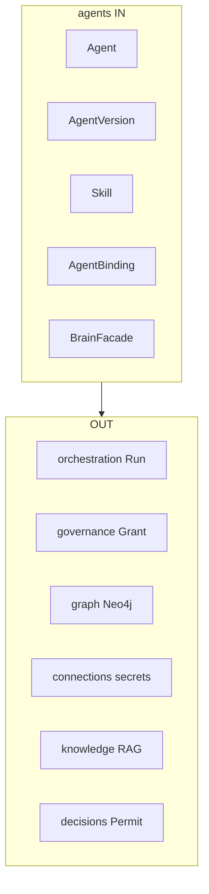

# R02 — Fronteiras: `modules/agents`

**Rodada:** R2 — Scope boundary  
**Data:** 2026-09-11  
**Issue:** ANX-392  
**Fontes:** [PC 03](../../../../notes/anxionos-pc03-agents-debate.md) · [structure R02](../../structure-debate/agents/R02-boundaries.md) · [governance R02](../governance/R02-boundaries.md)

## Debate R2 (diálogo atribuído)

**Arquiteto:** agents é dono de identidade de agente (Agent, AgentVersion), skills declarativas, bindings a Agency/Organization e fachada Brain (invocação governada — não execução de Task/Run).

**Crítico:** O que não entra?

**Arquiteto:** Goal/Task/Run/lease/heartbeat → orchestration. Grants/`authorityEpoch`/Approval → governance. Traverse Neo4j → graph. Provider keys / `inference.invoke` → connections. Memória/RAG → knowledge. ExecutionPermit / TradeIntent → decisions.

**Security:** Publish de AgentVersion exige principal autenticado; nenhum agente auto-expande grant (CAP-B02). Invoke fail-closed em timeout T01.

**QA:** Publish imutável e invoke sem grant são oráculos G3 obrigatórios.

**Síntese Orquestrador:** Fronteira aceita; sem objeção bloqueante.

## O módulo POSSUI (estado autoritativo PostgreSQL)

| Agregado / porta | Responsabilidade |
| --- | --- |
| `Agent` | Identidade estável no tenant (CEO, operador, worker); kind AGENCY/PLATFORM |
| `AgentVersion` | Snapshot imutável após publish; `instructionRef` + skillRefs + manifest hash |
| `Skill` | Catálogo declarativo tenant-scoped; sem secrets |
| `AgentBinding` | Agent↔Agency/scope; janela `effectiveFrom`/`effectiveUntil` |
| `BrainFacade` | Porta de invocação; **sem** persistir Run |

Autonomia de investimento **L0–L4** no Mandate/binding — eixo distinto de Authority **L0–L6** ([governance](../governance/R02-boundaries.md)).

## O módulo NÃO POSSUI

| Item | Dono correto |
| --- | --- |
| Goal, Task, Run, lease, heartbeat | orchestration |
| Grant, Delegation, Approval, `authorityEpoch` | governance |
| Nós/arestas Neo4j Agent/Skill | graph (kernel + projector) |
| Provider API keys, OAuth, inference runtime | connections + `packages/secrets` |
| Documentos, memória longa, evidências | knowledge |
| ExecutionPermit, TradeIntent | decisions |
| Checkout ANX-* taskboard | framework Cursor ≠ produto |

## Non-goals

- Não criar pasta `agent-teams` (PC 04 = orchestration + organizations).
- Não criar pasta `capabilities` (PC 05 = manifest transversal).
- AgentVersion nunca carrega secrets de provider.
- BrainFacade não persiste Run e não substitui orchestration.
- Não implementar D-GOV-010 (risk P06).

## Invariantes de fronteira

1. `AgentVersion` imutável após publish; mutação = nova versão + evento.
2. Publish e invoke externo exigem T01 ALLOW + grant; timeout → DENY.
3. BrainFacade não persiste sessão de Run — consulta orchestration port se DRAINING.
4. Skills referenciam `@anxionos/contracts` — sem strings mágicas em runtime.
5. Comandos idempotentes com `commandId` + envelope institucional.
6. Sem FK física cross-module (`organization_id` / `principal_id` lógicos).

## Diagrama in/out

## Saída R2

Boundary doc aprovado para R3 (domínio).
