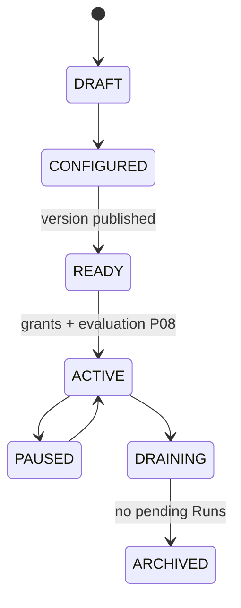

# R03 — Esboço de domínio: `modules/agents`

**Rodada:** R3 — Domain model  
**Data:** 2026-09-11  
**Issue:** ANX-392  
**Pré-requisito:** [R02-boundaries.md](./R02-boundaries.md) · spec 002 · [structure R03](../../structure-debate/agents/R03-domain-sketch.md)

## Debate R3 (síntese atribuída)

**Arquiteto:** Quatro agregados v1 — `Agent`, `AgentVersion`, `Skill`, `AgentBinding`. `BrainFacade` é porta application, não agregado.

**Executor:** Ports: `AgentRepository`, `AgentVersionRepository`, `SkillRepository`, `AgentBindingRepository`, `AgentsUnitOfWork`, `OrchestrationRunQueryPort` (read-only DRAINING). Mutações confirmam PG + journal + outbox na mesma transação.

**Crítico:** Publish ≠ promote. ACTIVE em produção exige evaluation P08 quando aplicável. L3/L4 documentados; runtime bloqueado até ADR + Red Team.

**Security:** Nenhum secret, prompt bruto ou PII em eventos; `CapabilityManifest` filtrado por grant (descobrir ≠ conceder).

## Agregado: Agent

Identidade institucional do agente no tenant.

| Campo | Tipo | Notas |
| --- | --- | --- |
| id | AgentId | UUID |
| organizationId | UUID | Tenancy |
| agencyId | UUID? | Quando kind AGENCY |
| kind | AGENCY \| PLATFORM | Imutável após insert |
| displayName | string | |
| status | AgentLifecycleStatus | DRAFT…ARCHIVED |
| activeVersionId | AgentVersionId? | |
| revision | number | Optimistic concurrency |

### Invariantes INV-AGT-01..08

| ID | Regra |
| --- | --- |
| INV-AGT-01 | `Agent.kind` só nasce pelo domínio autorizado — não mutável por UI/agente |
| INV-AGT-02 | PLATFORM não adquire capital ou trading authority de clientes |
| INV-AGT-03 | ACTIVE exige `activeVersionId` publicado + grants mínimos |
| INV-AGT-04 | DRAINING → ARCHIVED só sem Runs pendentes (port orchestration, não estado local) |
| INV-AGT-05 | Mutações confirmam estado + journal + outbox na mesma transação PG |
| INV-AGT-06 | `domain/` não importa LLM SDK, HTTP, Neo4j nem orchestration internals |
| INV-AGT-07 | Descobrir capability ≠ conceder — manifesto filtrado por T01 |
| INV-AGT-08 | Revogação de grant impede novo efeito; in-flight segue política orchestration |

## Agregado: AgentVersion

Snapshot imutável. `instructionRef: ObjectRef`. `autonomyLevel: L0–L4`. Status: draft | published | deprecated.

**AGT-R03-01:** L3/L4 no schema; implementação bloqueada até ADR + Red Team.

## Entidade: Skill

Catálogo tenant-scoped. **AGT-R03-02:** core fixo em `@anxionos/contracts/agents/skills/` + extensão via `definitionRef` auditável.

## Entidade: AgentBinding

Scope AGENCY | ORGANIZATION | PLATFORM. Hierarquia TREE/CIRCULAR via governance `reportingAgentId`.

## Porta: BrainFacade

| Método | Comportamento |
| --- | --- |
| invokeCapability | Valida grant + manifest; delega; retorna resultado ou operationId |
| listCapabilities | Manifest filtrado |
| prepareContext | Contexto read-only de AgentVersion + knowledge ports |

**AGT-R03-03:** HTTP síncrono só com `ENABLE_DEV_ROUTES`; produção evento-first `agents.brain.invocation.requested.v1`.

## Ports (domain/)

| Port | Responsabilidade |
| --- | --- |
| AgentRepository | CRUD + lifecycle |
| AgentVersionRepository | Draft/publish/deprecate |
| SkillRepository | Catálogo |
| AgentBindingRepository | Bindings + janela efetiva |
| AgentsUnitOfWork | estado + journal + outbox |
| OrchestrationRunQueryPort | Runs pendentes (DRAINING) |
| TraversalEvaluator | T01 (governance/graph) |
| PrincipalLookup | identity |
| AgencyScopePort | organizations |
| ModelBindingPort | connections — metadata sem secret |

## Comandos application

| Comando | Idempotência | Evento |
| --- | --- | --- |
| RegisterAgent | (organizationId, displayName, kind) | `agents.agent.registered.v1` |
| PublishAgentVersion | (agentId, versionNumber) | `agents.agent_version.published.v1` |
| TransitionAgentStatus | (agentId, targetStatus, expectedRevision) | `agents.agent.status_changed.v1` |
| BindAgentToScope | (agentId, scopeType, scopeId) | `agents.binding.created.v1` |
| RegisterSkill | (organizationId, name, schemaVersion) | `agents.skill.registered.v1` |

## Diagrama de ciclo de vida

## Saída R3

Domain sketch v1 aprovado para R4.
