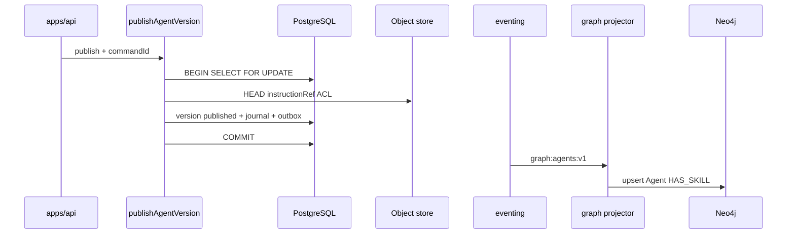

# R05 — Armazenamento: `modules/agents`

**Rodada:** R5  
**Data:** 2026-09-11  
**Issue:** ANX-392  
**Engines ADR0004:** PostgreSQL autoritativo; Neo4j só via graph projector; **sem** Timescale e **sem** pgvector neste módulo; SQLite **não** é AgentVersion autoritativo.

## Princípios de autoridade

| Princípio | Decisão |
| --- | --- |
| Fonte de verdade transacional | PostgreSQL `agents_*` |
| Instrução / skill body | Object store via ObjectRef — não BYTEA |
| Grafo | Neo4j — consumer `graph:agents:v1` |
| Journal / outbox | `@anxionos/eventing` mesma transação |
| Idempotência HTTP | `agents_command_journal` |
| FK cross-module | **Não** |
| Segredos em eventos | **Proibido** |

## Fluxo publish

## Tabelas PostgreSQL

| Tabela | Propósito |
| --- | --- |
| `agents_agents` | Agent; kind imutável; revision; active_version_id |
| `agents_agent_versions` | UNIQUE (agent_id, version_number); instruction_ref JSONB; trigger bloqueia UPDATE published (exceto deprecate) |
| `agents_skills` | UNIQUE (organization_id, name) |
| `agents_bindings` | índice parcial effective_until IS NULL |
| `agents_command_journal` | command_id PK, response_hash |

Enums: `agents_agent_kind`, `agents_lifecycle_status`, `agents_version_status`, `agents_autonomy_level` (L0–L4), `agents_binding_scope_type`, `agents_skill_status`.

**AGT-R05-01:** trigger BEFORE UPDATE rejeita mutação de row `published` exceto deprecate.

## Neo4j (projeção graph)

| Evento | Nó / aresta |
| --- | --- |
| agent.registered | Agent (displayName, kind, status) |
| version.published | atualiza activeVersionId, hash, autonomyLevel |
| skill.registered | Skill |
| binding.created | REPORTS_TO / scope edge |

Proibido no grafo: instruction text, prompts, secrets, API keys.

## Alternativas rejeitadas

Prompt em BYTEA; versionamento só Neo4j; SQLite write path; FK para organizations.agencies.

## Saída R5

Modelo v1 fechado para R6. Sem migration neste pack documental.
