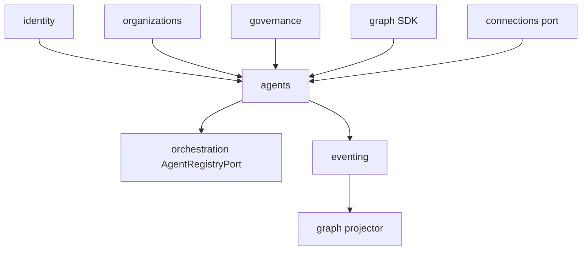

# R06 — Dependências: `modules/agents`

**Rodada:** R6  
**Data:** 2026-09-11  
**Issue:** ANX-392

## Decisões-chave

| ID | Decisão |
| --- | --- |
| AGT-R06-01 | PrincipalLookup identity — fail-closed AGT_PRINCIPAL_NOT_FOUND |
| AGT-R06-02 | AgencyScopePort organizations — sem FK cross-schema |
| AGT-R06-03 | T01 obrigatório pré-publish e pré-invoke; timeout 2s → DENY |
| AGT-R06-04 | GraphContextPort T04/T05 só leitura via graph SDK — nunca neo4j-driver |
| AGT-R06-05 | Journal/outbox `@anxionos/eventing` mesma transação PG |
| AGT-R06-06 | Projector Neo4j no **graph** — consumer `graph:agents:v1` |
| AGT-R06-07 | Publica eventos `agents.*.v1`; não depende de execution/capital/billing |
| AGT-R06-08 | `AgentRegistryPort` exportado para orchestration |
| AGT-R06-09 | ModelBindingPort connections — IDs sem secret |
| AGT-R06-10 | Brain worker em `apps/workers` — composition root, fora do domínio |

## Upstream

| Módulo | Port | Uso |
| --- | --- | --- |
| identity | PrincipalLookup | ownerPrincipalId |
| organizations | AgencyScopePort | tenancy |
| governance | TraversalEvaluator | T01 |
| graph | GraphContextPort | T04/T05 |
| connections | ModelBindingPort | metadata |
| packages/eventing | journal + outbox | |
| packages/contracts | agents/* + T01 types | |

## Downstream

| Consumidor | Contrato |
| --- | --- |
| orchestration | AgentRegistryPort |
| knowledge | indexa version.published |
| graph | inbox graph:agents:v1 |
| audit | subscriber events |
| evaluation P08 | promotion gate (defer) |

Não depende de execution, capital, billing, partners. Sem módulo adapter-gateway.

## Imports proibidos

- `orchestration/infrastructure/**`, `knowledge/infrastructure/**`, `connections/infrastructure/**`
- `graph/infrastructure/**`, `neo4j-driver`
- secrets / LLM SDK em `domain/`

## Diagrama de dependências

## Saída R6

Mapa v1 fechado para R7.
