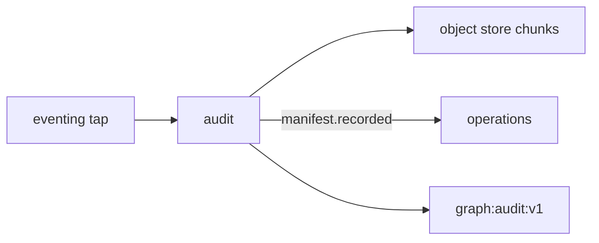

# R01 — Contexto: `modules/audit`

**Componente:** modules/audit  
**Rodada:** R1 — Inventário documental  
**Pacote SDD:** P06  
**Data:** 2026-09-11  
**Issue pack:** ANX-389 · debate estrutura ANX-42 · debate módulo **ANX-107** · impl futura **ANX-108** (não neste pack)  
**Callers:** [R02-boundaries.md](./R02-boundaries.md) · [ROUNDS.md](./ROUNDS.md).  
**Fontes:** `brain/notes/anxionos-backend-structure.md` · `brain/notes/anxionos-storage-ownership.md` · spec 001 **draft** · ADR0002.

## Objetivo da rodada

Inventariar Flight Recorder, linhagem e replay **governado**. Manifests e índices — **não** segundo ledger. Specs **draft**. ST08 **0/23**. Não stamp `accepted`. Não G1. Não done ANX-342 / ANX-389.

## Propósito

Audit **ingere** eventos de domínio (tap redacted), **indexa** hash chain, **guarda** chunks imutáveis e **reproduz** sessões read-only com grant `audit.replay`. Operations exporta via `deltaRefId` — não reescreve o trail.

## In / Out (R1)

**In:** tap de eventing (`*.v1` redacted); POST replay (grant `audit.replay` + T01); GET manifests scoped; AgencyScope.

**Out:** AuditManifest + ReplaySession em PG; chunks object store; `audit.manifest.recorded.v1`; `audit.replay.requested.v1` / completed; projector `graph:audit:v1` (ids). **Não** ledger, **não** kill-switch, **não** logs de app.

## O módulo POSSUI

AuditManifest, IndexCursor/AuditIndex, RetentionPolicy (ponteiro), ReplaySession (read-only), DeltaRef `ownerDomain=audit`, FlightRecorderChunk.

## O módulo NÃO POSSUI (ownership nomeado)

| Item | Dono |
| --- | --- |
| Journal de domínio | cada módulo + **eventing** |
| Ledger | **accounting** |
| Logs app | **packages/observability** |
| Grant/Approval | **governance** |
| Kill switch / D-GOV-010 | **risk** P06 |
| Export job operacional | **operations** (consome deltaRefId) |
| Pasta approvals/policies | **não criar** |

## Non-goals

- SQLite como audit trail único.
- Replay que reexecuta ordens/capital.
- Segundo ledger.
- Cypher/driver Neo4j neste módulo.
- Migration / ST08 live.

## Dependências

| Direção | Componentes |
| --- | --- |
| Upstream | packages/eventing, identity, organizations, governance T01 |
| Downstream | operations, graph, Platform console |

## Armazenamento

PG manifests/índices/replay/journal. Object store chunks. Neo4j linhagem **só ids**. SQLite logs auxiliares **nunca** trail único. ST08 0/23.

## Estado do código

**Ausente** como bounded context completo.

## Oráculos (não executados)

| ID | Gate | Esperado |
| --- | --- | --- |
| G3-AUD-01 | G3 | replay read-only — zero writes accounting |
| G3-AUD-02 | G3 | tap dedupe por eventId |
| G5-AUD-01 | G5 | export/GET cross-tenant 403 |
| G5-AUD-02 | G5 | UPDATE chunk rejeitado |

→ **R02** ([R02-boundaries.md](./R02-boundaries.md))
