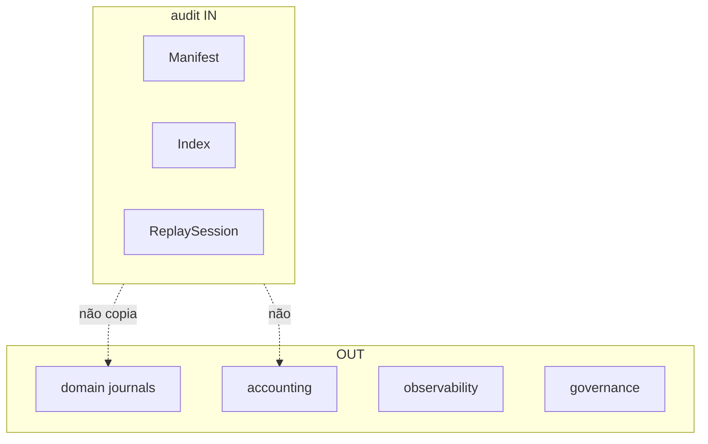

# R02 — Fronteiras: `modules/audit`

**Pacote SDD:** P06 · **Issue:** ANX-107 · pack ANX-389 · PC 26  
**Callers:** [R01-context.md](./R01-context.md) · [R03-domain-sketch.md](./R03-domain-sketch.md) · [ROUNDS.md](./ROUNDS.md).

## Objetivo da rodada

Fechar possui/não possui: Flight Recorder vs journal de domínio vs ledger vs observability vs kill switch.

## Debate R2

**Arquiteto:** audit é Flight Recorder: manifests, índices, retenção, replay **governado**.

**Crítico:** Replay não muta produção. Logs = observability. Kill switch = risk. Sem pastas approvals/policies.

**Security:** Payload redacted; T01 em replay/export; AgencyScope.

## O módulo POSSUI

AuditManifest, IndexCursor, RetentionPolicy (ponteiro), ReplaySession (read-only), DeltaRef ownerDomain=audit.

## O módulo NÃO POSSUI

| Item | Dono |
| --- | --- |
| Journal domínio | cada módulo + eventing |
| Ledger | **accounting** |
| Logs app | **observability** |
| Grant/Approval | **governance** |
| Kill switch | **risk** |
| Pasta approvals/policies | **não criar** |

## Non-goals

- SQLite trail único.
- Replay com side-effect de capital.
- D-GOV-010 neste módulo.
- Emitir `accounting.journal.*`.

## In / Out (R2)

**In:** domain event tap; grant `audit.replay`; AgencyScope; TraversalEvaluator.

**Out:** fatos `audit.*`; deltaRefId para operations. Sem mutate de journals alheios.

## Invariantes (`AUD-R02-INV-*`)

| ID | Regra |
| --- | --- |
| AUD-R02-INV-01 | Dono único agregados R03 |
| AUD-R02-INV-02 | Cross-module só contrato/evento |
| AUD-R02-INV-03 | SQLite proibido audit trail único |
| AUD-R02-INV-04 | ownerDomain=audit |
| AUD-R02-INV-05 | Replay sem side-effect de capital |
| AUD-R02-INV-06 | Payload redacted — sem secrets |

## Oráculos

| ID | Gate | Esperado |
| --- | --- | --- |
| G3-AUD-01 | G3 | replay zero writes ledger |
| G5-AUD-01 | G5 | 403 cross-tenant |

## Saída R2

Para R3.
