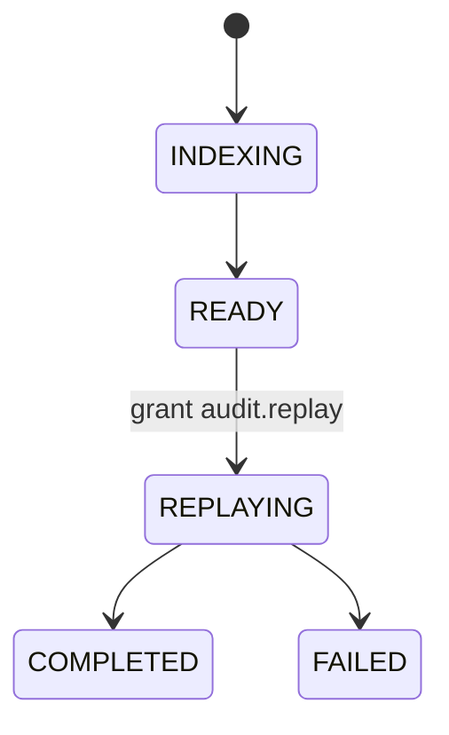

# R03 — Esboço de domínio: `modules/audit`

**Issue:** ANX-107 · pack ANX-389  
**Callers:** [R02-boundaries.md](./R02-boundaries.md) · [R04-contracts-events.md](./R04-contracts-events.md). Arquivo já existe. Sem dados de produção. Instrução: «3. **audit**».

## Agregados

| Agregado | Papel |
| --- | --- |
| DeltaRef | ownerDomain=audit; outros módulos só `deltaRefId` |
| AuditManifest | índice + hash chain |
| FlightRecorderChunk | blob append-only |
| ReplaySession | cursor read-only; grant `audit.replay` |
| AuditIndex | checkpoint (organizationId, consumerName) |

## Ports

AuditUnitOfWork, DomainEventTapPort, ObjectChunkPort, TraversalEvaluator, AgencyScopePort.

## Comandos / eventos

requestReplay → `audit.replay.requested.v1`; completeReplay → `audit.replay.completed.v1`; ingest tap → `audit.manifest.recorded.v1`.

**AUD-R03-01:** replay não chama commands de capital/execution. **AUD-R03-02:** chunk imutável.

## Saída R3

Para R4.
