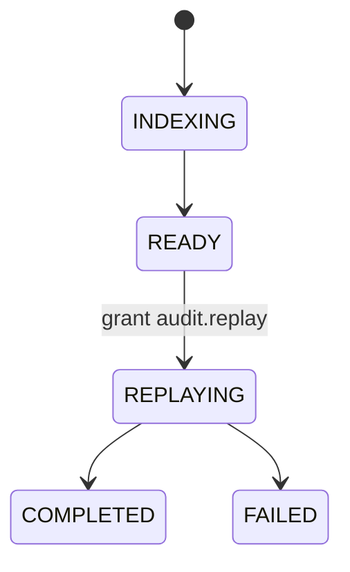

# R03 — Esboço de domínio: `modules/audit`

**Issue:** ANX-107 · pack ANX-389  
**Callers:** [R02-boundaries.md](./R02-boundaries.md) · [R04-contracts-events.md](./R04-contracts-events.md). Sem dados de produção.

## Debate R3 (síntese atribuída)

**Arquiteto:** Agregados DeltaRef, AuditManifest, FlightRecorderChunk, ReplaySession, AuditIndex.

**Executor:** AuditUnitOfWork + DomainEventTapPort + ObjectChunkPort.

**Crítico:** Replay não chama commands de capital/execution. Chunk imutável.

**Security:** redact antes do chunk; grant `audit.replay`.

## In / Out (R3)

**In:** tap redacted; requestReplay (grant); AgencyScopePort; TraversalEvaluator.

**Out:** Manifest hash chain; chunk SHA-256; ReplaySession cursor read-only; eventos replay requested/completed. Sem Order, Grant apply, JournalEntry.

## Non-goals

- Não segundo ledger.
- Não BYTEA de payload no PG.
- Não D-GOV-010.

## Agregados

| Agregado | Papel |
| --- | --- |
| DeltaRef | ownerDomain=audit; outros módulos só `deltaRefId` |
| AuditManifest | índice + hash chain |
| FlightRecorderChunk | blob append-only |
| ReplaySession | cursor read-only; grant `audit.replay` |
| AuditIndex | checkpoint (organizationId, consumerName) |

## Ports

| Port | Responsabilidade |
| --- | --- |
| AuditUnitOfWork | estado + journal + outbox |
| DomainEventTapPort | ingest |
| ObjectChunkPort | append chunk |
| TraversalEvaluator | T01 |
| AgencyScopePort | tenancy |
| ReplaySessionRepository | cursor |

## Comandos / eventos

requestReplay → `audit.replay.requested.v1`; completeReplay → `audit.replay.completed.v1`; ingest tap → `audit.manifest.recorded.v1`.

**AUD-R03-01:** replay não chama commands de capital/execution. **AUD-R03-02:** chunk imutável.

## Oráculos

| ID | Gate | Esperado |
| --- | --- | --- |
| G3-AUD-01 | G3 | replay read-only |
| G5-AUD-02 | G5 | UPDATE chunk rejeitado |

## Saída R3

Para R4.
