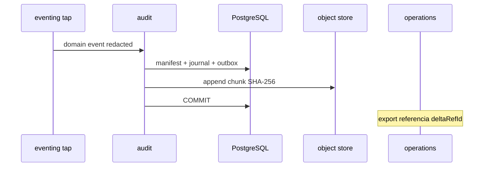

# R05 — Armazenamento: `modules/audit`

**Rodada:** R5 · 2026-09-11 · ANX-389 · ANX-107 · **ANX-108** não impl  
**Callers:** [R04-contracts-events.md](./R04-contracts-events.md) · [R06-dependencies.md](./R06-dependencies.md) · [ROUNDS.md](./ROUNDS.md).  
**Fonte:** brain/notes/anxionos-storage-ownership.md · ADR0004. ST08 **0/23**. **Sem migration.** D-GOV-010 = **risk P06**.

## In scope (engines nomeados)

| Engine | O que audit **possui** |
| --- | --- |
| PostgreSQL | audit_manifests, audit_replay_sessions, audit_command_journal |
| Object store | audit_chunks append-only (SHA-256; WORM); **não** BYTEA |
| Neo4j | projector graph:audit:v1 — só ids de manifesto; **não** payload |

## Out of scope

| Dado | Dono |
| --- | --- |
| Ledger / grants / ordens | accounting / capital / execution |
| Export job / incident operacional | operations (deltaRefId consumer) |
| Kill switch / D-GOV-010 | risk P06 |
| Driver Neo4j | graph |
| Pasta policies/approvals | **não criar** (PC 25 = governance+risk) |
| SQLite como trail autoritativo | **proibido** |

## Non-goals

Sem migration; specs draft; replay **não** muta produção; chunks imutáveis; audit **não** é segundo ledger.

## Princípios

| Princípio | Decisão |
| --- | --- |
| Índice autoritativo | PostgreSQL audit_manifests (hash chain prevHash + contentHash) |
| Payload | object store audit_chunks |
| Replay | audit_replay_sessions + grant audit.replay read-only |
| Journal/outbox | mesma UoW |
| FK cross-module | **Não** |
| Secrets no chunk | **Proibido** — redact + CI scan |

## Tabelas / blobs (alvo G1)

| Artefato | Engine | Integridade |
| --- | --- | --- |
| audit_manifests | PostgreSQL | UNIQUE eventId; hash chain |
| audit_command_journal | PostgreSQL | command_id PK |
| audit_replay_sessions | PostgreSQL | cursor + grant |
| audit_chunks | object store | SHA-256 imutável; WORM |

**AUD-R05-01** PG index autoritativo. **AUD-R05-02** ingest+outbox mesma transação. **AUD-R05-03** chunk append-only. **AUD-R05-04** export referencia deltaRefId. **AUD-R05-05** RLS defer P09.

## Oráculos

| ID | Gate | Esperado |
| --- | --- | --- |
| G3-AUD-01 | G3 | replay read-only: zero UPDATE em capital/execution/accounting |
| G3-AUD-02 | G3 | tap dedupe por eventId |
| G3-AUD-S2-01 | G3 | mesmo evento não duplica manifesto |
| G3-AUD-S3-01 | G3 | ReplaySession sem grant → 403 |

## Alternativas rejeitadas

SQLite trail; chunk no BYTEA; Cypher no módulo; segundo ledger.

## Saída R5

Modelo v1. Nenhuma migration.
