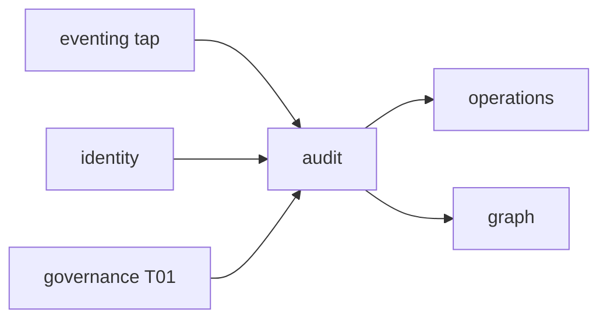

# R06 — Dependências: `modules/audit`

**Rodada:** R6 · 2026-09-11 · ANX-389 · ANX-107 · **ANX-108** não impl  
**Callers:** [R05-storage-pg.md](./R05-storage-pg.md) · [R07-risks.md](./R07-risks.md) · [ROUNDS.md](./ROUNDS.md). Sem API runtime. D-GOV-010 = **risk P06**.

## Decisões-chave

| ID | Decisão |
| --- | --- |
| AUD-R06-01 | Tap via eventing — não importa infrastructure/ alheia |
| AUD-R06-02 | Projector graph:audit:v1 no **graph** |
| AUD-R06-03 | operations consome export/replay status + deltaRefId |
| AUD-R06-04 | governance só consulta — sem pasta approvals |
| AUD-R06-05 | T01 grant audit.replay fail-closed |
| AUD-R06-06 | Journal/outbox mesma UoW PG |
| AUD-R06-07 | Redaction **antes** do chunk; sem secrets em DTO |
| AUD-R06-08 | D-GOV-010 não é deste módulo (risk P06) |
| AUD-R06-09 | AgencyScopePort — sem FK organizations |
| AUD-R06-10 | Replay session read-only no driver de domínio alvo |

## Upstream

| Módulo | Port | Uso |
| --- | --- | --- |
| packages/eventing | tap | todos os *.v1 redacted |
| identity | PrincipalLookup | actor |
| organizations | AgencyScopePort | tenancy |
| governance | TraversalEvaluator | T01 audit.replay / audit.export |
| graph | GraphContextPort | leitura |
| packages/contracts | audit/* | |

## Downstream

| Consumidor | Contrato |
| --- | --- |
| operations | deltaRefId / export completed |
| graph | graph:audit:v1 |
| frontend Platform | export/replay UI |
| governance | consulta de manifesto |

## Imports proibidos

journals privados de outros módulos; neo4j-driver; secrets em payload; pasta policies/.

## Oráculos de fronteira

| ID | Esperado |
| --- | --- |
| G3-AUD-01 | replay zero writes em accounting/capital/execution |
| G3-AUD-02 | tap dedupe eventId |
| G5-AUD-01 | GET manifesto outra org 403 |

## Saída R6

Mapa v1 para R7.
