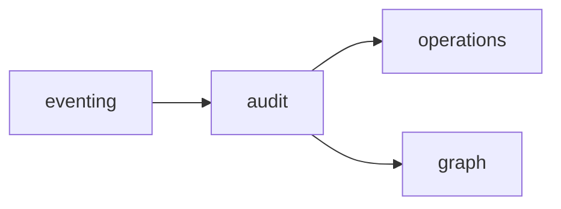

# R06 — Dependências: `modules/audit`

**Issues:** ANX-107 · ANX-108 · pack ANX-389  
**Callers:** [R05-storage-pg.md](./R05-storage-pg.md) · [R07-risks.md](./R07-risks.md).

## Decisões

| ID | Decisão |
| --- | --- |
| AUD-R06-01 | Tap via eventing — não importa infrastructure alheia |
| AUD-R06-02 | graph:audit:v1 no **graph** |
| AUD-R06-03 | operations consome export/replay status |
| AUD-R06-04 | governance só consulta — sem pasta approvals |
| AUD-R06-05 | T01 grant `audit.replay` fail-closed |

## Upstream

eventing (tap), todos os módulos (eventos), identity/organizations/governance (actor+T01), graph SDK leitura.

## Downstream

operations, governance (read), graph projector, frontend Platform (export).

## Imports proibidos

journals privados de outros módulos; neo4j-driver; secrets em payload.

## Saída R6

Para R7.
