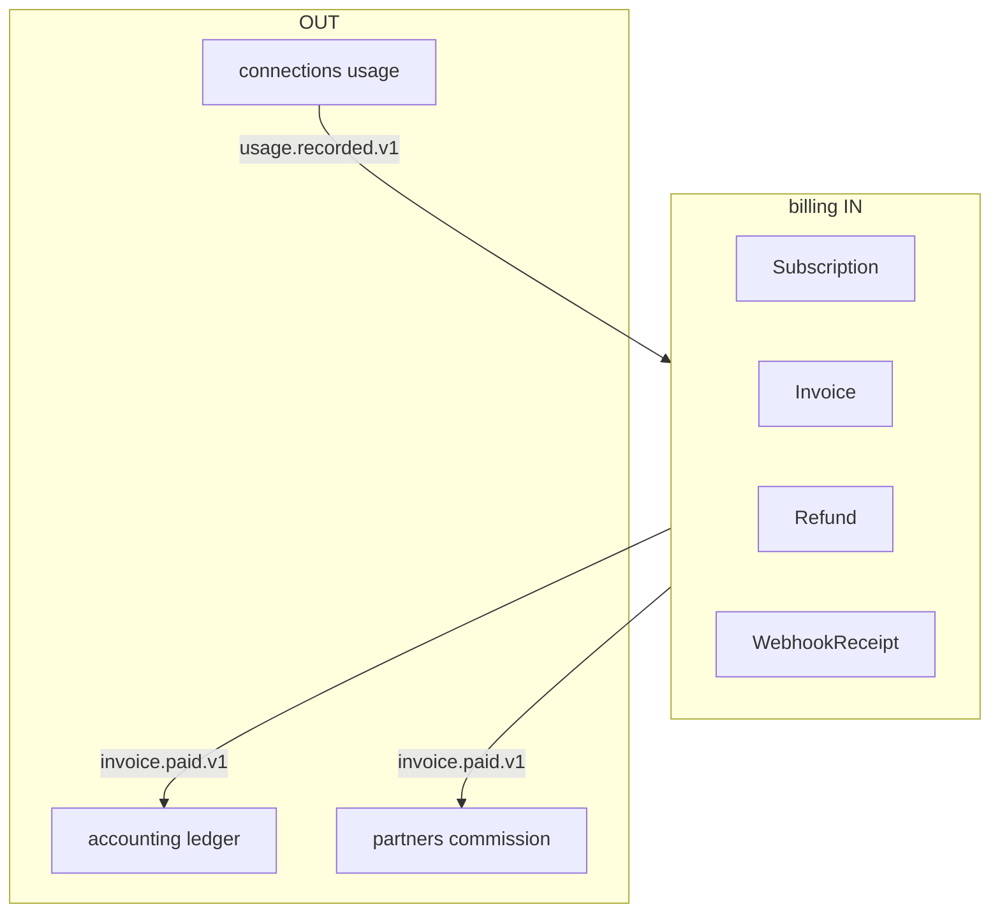

# R02 — Fronteiras: `modules/billing`

**Componente:** modules/billing  
**Rodada:** R2 — Scope boundary  
**Pacote SDD:** P07  
**Data:** 2026-09-11  
**Issue debate estrutura:** ANX-42 · debate módulo: **ANX-103** · pack: **ANX-389**  
**Callers:** [R01-context.md](./R01-context.md) · [R03-domain-sketch.md](./R03-domain-sketch.md) · [ROUNDS.md](./ROUNDS.md). Sem API runtime.

## In / Out (R2)

**In:** plano, assinatura, fatura, refund, webhook comercial.

**Out:** ledger de trading (`accounting`). Payout (`partners`). Usage bruto (`connections`). Grant (`governance`).

## Non-goals

Não spec `accepted`. Não ST08 live. Não ANX-389 `done`. Sem código de produto.

## Ownership

| Superfície | Dono |
| --- | --- |
| Subscription / Invoice / Refund / WebhookReceipt | **billing** |
| adapter-gateway | **KEEP** |

## Objetivo da rodada

Fechar **possui / não possui** entre billing e vizinhos (**connections**, **accounting**, **partners**, **organizations**, **governance**); ratificar que invoice paid **não** é lançamento de trading; proibir SQLite autoritativo e pastas 24º módulo.

## Fontes aplicadas

| Fonte | Uso em R2 |
| --- | --- |
| [R01-context.md](./R01-context.md) | Inventário |
| `brain/notes/anxionos-thin-billing-debate.md` | POSSUI/NÃO POSSUI |
| ADR0002 | dono físico |
| spec 003 | accounting = ledger; billing = comercial |
| ANX-103 | debate histórico |

## Debate R2 (síntese)

**Arquiteto:** billing é o motor comercial da plataforma: plano, assinatura, fatura, refund, recibo de webhook.

**Crítico:** O que não entra? Lançamentos PnL, payouts, usage bruto, grants. Invoice paid dispara **eventos** — accounting projeta; partners acrua.

**Security:** T01 em mutate invoice/refund/webhook; secrets de PSP só em infra; payload de evento sem PAN/token.

## O módulo POSSUI

Subscription, BillingPlan, Invoice, InvoiceLine, UsageAggregation, Refund, WebhookReceipt.

## O módulo NÃO POSSUI

| Item | Dono correto |
| --- | --- |
| Ledger / JournalEntry trading | accounting |
| Referral, Commission, Payout | partners |
| usageRecord bruto / binding provider | connections |
| Membership / org | organizations |
| Approval / D-GOV-010 | governance / risk **P06** |
| Marketplace / products pasta | PC 10/29 composto — **sem pasta** |

## Non-goals

- Não criar `approvals/`, `policies/`, `marketplace/`, `products/`.
- Não persistir ledger.
- Não confirmar cobrança em SQLite.
- Não chamar connections síncrono para montar InvoiceLine (D-CX-041).
- LIVE/REAL de **trading** não se aplica; PSP sandbox vs live é config de **infra**.

## Decisão: possui / não possui

| Dado / comportamento | Dono |
| --- | --- |
| Subscription, Invoice, Refund, WebhookReceipt | **billing** |
| Usage bruto | **connections** |
| Lançamento | **accounting** |
| Comissão / payout | **partners** |

## Invariantes R02 (`BIL-R02-INV-*`)

| ID | Regra |
| --- | --- |
| BIL-R02-INV-01 | Dono único dos agregados R03 |
| BIL-R02-INV-02 | Cross-module só contrato/evento — sem FK cross-schema |
| BIL-R02-INV-03 | SQLite proibido para estado autoritativo |
| BIL-R02-INV-04 | `ownerDomain=billing` em comandos/eventos |
| BIL-R02-INV-05 | InvoiceLine referencia `usageRecordId` — não duplica source |
| BIL-R02-INV-06 | Refund só após invoice paid; reversal via evento |
| BIL-R02-INV-07 | D-GOV-010 **não** vive neste módulo |

## Critérios de aceite — R02

| # | Critério | Status |
| --- | --- | --- |
| AC-R02-01 | Tabela possui/não possui | ✅ |
| AC-R02-02 | billing ≠ accounting | ✅ |
| AC-R02-03 | SQLite non-goal | ✅ |

→ **R03** ([R03-domain-sketch.md](./R03-domain-sketch.md))
