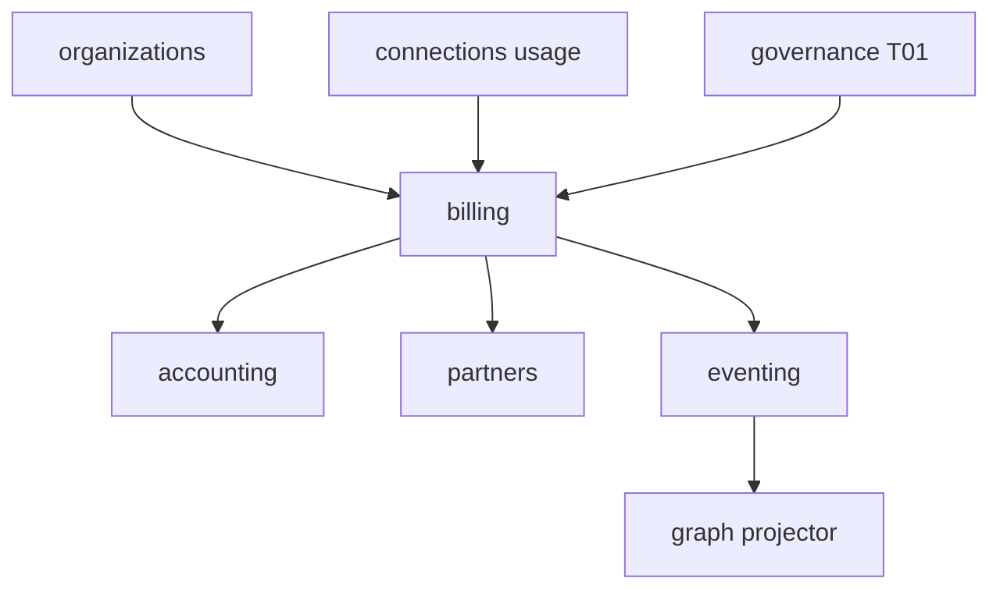

# R06 — Dependências: `modules/billing`

**Rodada:** R6  
**Data:** 2026-09-11  
**Issue pack:** ANX-389 · histórico ANX-103  
**Callers:** [R05-storage-pg.md](./R05-storage-pg.md) · [R07-risks.md](./R07-risks.md) · [ROUNDS.md](./ROUNDS.md). Sem API runtime neste artefato.

## Decisões-chave

| ID | Decisão |
| --- | --- |
| BIL-R06-01 | Usage só via evento — sem import connections/infrastructure |
| BIL-R06-02 | AgencyScopePort — sem FK organizations |
| BIL-R06-03 | T01 pré-issue/refund; timeout → DENY |
| BIL-R06-04 | Graph SDK só leitura — nunca neo4j-driver no módulo |
| BIL-R06-05 | Journal/outbox mesma transação PG |
| BIL-R06-06 | Projector no **graph** `graph:billing:v1` |
| BIL-R06-07 | Não emite journal de accounting |
| BIL-R06-08 | partners consome paid/refund — billing não acrua |
| BIL-R06-09 | PaymentProviderPort só infra |
| BIL-R06-10 | D-GOV-010 não é deste módulo (risk P06) |

## Upstream

| Módulo | Port | Uso |
| --- | --- | --- |
| identity | PrincipalLookup | actor |
| organizations | AgencyScopePort + subscription.changed | tenancy / plano |
| governance | TraversalEvaluator | T01 `billing.*` |
| connections | EventConsumer | usage.recorded.v1 |
| graph | GraphContextPort | T04/T05 leitura |
| packages/eventing | journal + outbox | |
| packages/contracts | billing/* | |

## Downstream

| Consumidor | Contrato |
| --- | --- |
| accounting | `billing.invoice.issued/paid.v1`, `billing.refund.processed.v1` |
| partners | paid + refund |
| operations | issued/paid (dunning operacional) |
| graph | `graph:billing:v1` |
| audit | subscriber |

Não depende de execution, capital, strategies, simulation. Sem pasta `marketplace/`.

## Imports proibidos

`accounting/infrastructure/**`, `partners/infrastructure/**`, `connections/infrastructure/**`, `graph/infrastructure/**`, `neo4j-driver`, SDK PSP em `domain/`.

## Saída R6

Mapa v1 fechado para R7.
