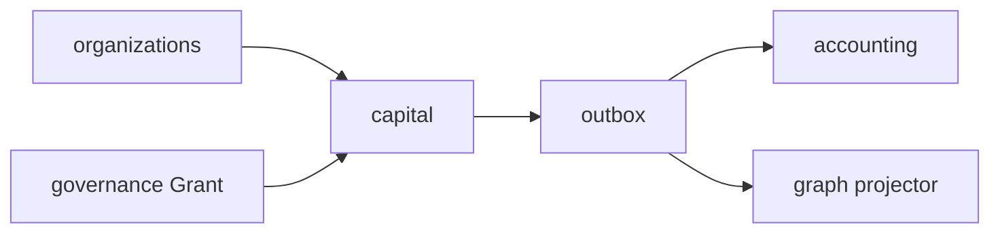

# R06 — Dependências: `modules/capital`

**Issues:** ANX-91 · ANX-29 · ANX-30 · ANX-58 · ANX-89 · pack ANX-389  
**Callers:** [R05-storage-pg.md](./R05-storage-pg.md) · [R07-risks.md](./R07-risks.md) · [ROUNDS.md](./ROUNDS.md)

## Ownership

capital: CapitalAccount, Allocation, CapitalReservation, BalanceView. Grant entidade = **governance**. Ledger = **accounting**. Posição = **portfolios**.

## Upstream (contrato/evento — sem repo privado)

| Módulo | Artefato |
| --- | --- |
| organizations | Owner / Agency scope |
| identity | Principal do titular |
| governance | Grant + T01 `capital.*` |
| graph | projector `graph:capital:v1` (não driver) |
| market-data | FX / asOf |
| packages/contracts + eventing | `capital.*` journal+outbox |

## Downstream

portfolios · decisions · risk (valida reserva, não reescreve) · execution · accounting · performance · audit.

## Imports proibidos

neo4j-driver; repositories de accounting/governance; Cypher; SQLite saldo.

## Bootstrap S1–S2 (futuro G1)

Após organizations G7 + governance grant stub + contracts skeleton; market-data FX fixture. v1 SIMULATED/PAPER (ANX-58). D-GOV-010 **não** aqui.

→ **R07** ([R07-risks.md](./R07-risks.md))
