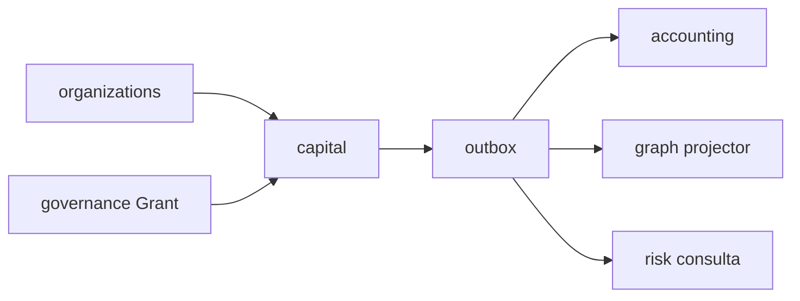

# R06 — Dependências: `modules/capital`

**Issues:** ANX-91 · ANX-29 · ANX-30 · ANX-58 · ANX-89 · pack ANX-389  
**Callers:** [R05-storage-pg.md](./R05-storage-pg.md) · [R07-risks.md](./R07-risks.md) · [ROUNDS.md](./ROUNDS.md)

## In / Out (R6)

**In:** AgencyScope; PrincipalLookup; TraversalEvaluator T01 `capital.*`; MarketDataPort FX as-of; eventing.

**Out:** `capital.*` para risk/decisions/portfolios/audit/graph. Sem mutate Grant, ledger ou Position. Sem neo4j-driver. Sem D-GOV-010 aqui.

## Non-goals

D-GOV-010 = **risk P06**. Sem import `governance/infrastructure/**` nem `accounting/infrastructure/**`. Sem spec `accepted`. Sem ST08 live.

**KEEP adapter-gateway**.

## Ownership

| Superfície | Dono |
| --- | --- |
| CapitalAccount, Allocation, CapitalReservation, BalanceView | **capital** |
| Grant entidade | **governance** |
| Ledger | **accounting** |
| Position | **portfolios** |
| adapter-gateway | **KEEP** |

## Debate R6

**Arquiteto:** capital emite eventos; risk **consulta** reserva — não reescreve. strategies **não** reserva direto (D-CAP-011: Allocation pós-governance).

**Crítico:** FX as-of via MarketDataPort — sem tick autoritativo neste módulo.

## Upstream (contrato/evento — sem repo privado)

| Módulo | Artefato |
| --- | --- |
| organizations | Owner / Agency scope |
| identity | Principal do titular |
| governance | Grant + T01 `capital.*` |
| graph | projector `graph:capital:v1` (não driver) |
| market-data | FX / asOf |
| packages/contracts + eventing | `capital.*` journal+outbox |

## Downstream

portfolios · decisions · risk (valida reserva, não reescreve) · execution · accounting · performance · audit.

## Imports proibidos

neo4j-driver; repositories de accounting/governance; Cypher; SQLite saldo.

## Bootstrap S1–S2 (futuro G1)

Após organizations G7 + governance grant stub + contracts skeleton; market-data FX fixture. v1 SIMULATED/PAPER (ANX-58). D-GOV-010 **não** aqui.

## Oráculos de fronteira

| ID | Esperado |
| --- | --- |
| G3-CAP-01 | reserve idempotente |
| G5-CAP-01 | cross-tenant reject |
| G5-CAP-03 | REAL reject |

## Saída R6

Para R07. → **R07** ([R07-risks.md](./R07-risks.md))
