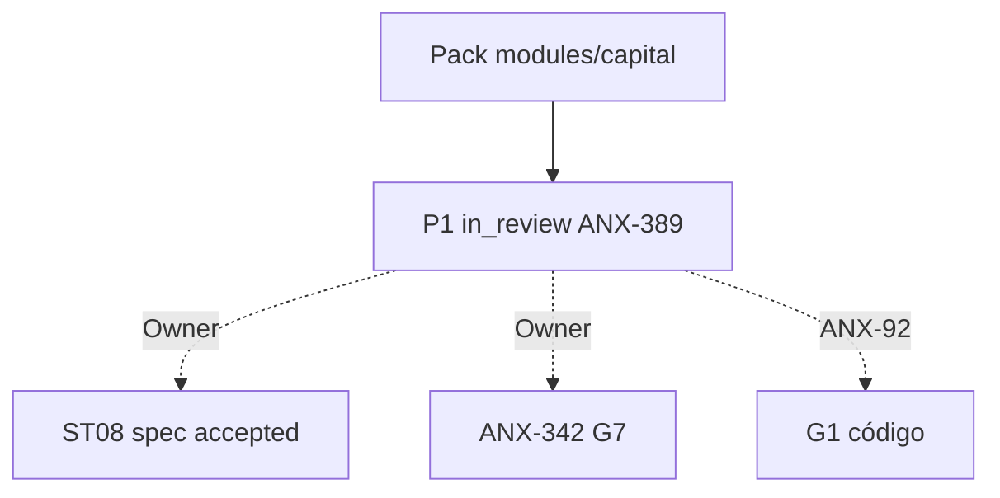

# R10 — Pacote G0 (handoff): `modules/capital`

**Rodada:** R10  
**Data:** 2026-09-11  
**Issues:** ANX-389 (pack P1) · ANX-91 (debate histórico) · **ANX-92** (impl — **não** executada neste pack)  
**Callers:** [R09-dev-plan.md](./R09-dev-plan.md) · [ROUNDS.md](./ROUNDS.md). Sem código de produto. Specs 001–005 **draft**. ANX-342 permanece `todo`. D-GOV-010 = **risk P06**.

## Classificação epistemológica

| Afirmação | Status |
| --- | --- |
| Debate R01–R10 neste dir | fechado P1 documental |
| Specs 001–005 | **draft** (ST08 0/23) |
| ANX-342 | **todo** — não hijack |
| D-GOV-010 | **risk P06** — fora |
| Pasta approvals/policies | **não criar** |
| Código `backend/modules/capital` | pack ≠ G1/G7 |

## In scope documental

| Área | Entrega |
| --- | --- |
| Domínio | CapitalAccount, Allocation, Reservation, BalanceLine |
| Contratos | `@anxionos/contracts/capital/*` + eventos R04 |
| Persistência nomeada | PostgreSQL `capital_accounts`, `capital_allocations`, `capital_reservations` UNIQUE ativa (account_id, intent_hash, kind), `capital_balance_lines`, `capital_command_journal` |
| Grafo | projector `graph:capital:v1` — titular→conta→portfolio |
| API | `/v1/capital` esboço R04 |
| Testes | G3-CAP-* / G5-CAP-* abaixo |

## Out of scope

| Item | Destino |
| --- | --- |
| Ledger / journal | accounting |
| Position / NAV | portfolios |
| RiskPermit / kill switch | risk |
| Neo4j driver | graph |
| D-GOV-010 | risk P06 |
| Spec accepted | Owner + checklist |
| ANX-342 G7 | Owner |
| G1 código ANX-92 | issue distinta |

## Non-goals

- Nenhuma migration ST08 neste pack.
- SQLite **não** é saldo/reserva autoritativo (CAP-R05-01).
- Capital **não** posta ledger; available deriva de `accounting.ledger.posted.v1` (S3).
- Sem pasta `approvals/` / `policies/`.
- REAL mode reject v1.

## Oráculos G3 / G5 (fecho do pack)

| ID | Gate | Esperado |
| --- | --- | --- |
| G3-CAP-S2-01 | G3 | insufficient available → reject |
| G3-CAP-S2-02 | G3 | grant invalid / epoch stale → reject |
| G3-CAP-S2-03 | G3 | FI02 duas reservas concorrentes |
| G3-CAP-S2-04 | G3 | REAL mode reject |
| G3-CAP-S2-05 | G3 | releaseReservation idempotente |
| G3-CAP-S2-06 | G3 | consumeReservation após release → reject |
| G3-CAP-S2-07 | G3 | grant revoked → HELD auto-released |
| G5-CAP-01 | G5 | command journal outra org → 403 |
| G5-CAP-02 | G5 | replay stale epoch |
| G5-CAP-03 | G5 | double consume retry |

## Critérios de aceite **deste** pack (P1 documental)

| # | Critério |
| --- | --- |
| AC-P1-01 | In/out/non-goals explícitos |
| AC-P1-02 | Oráculos G3/G5 nomeados |
| AC-P1-03 | Tabelas PG nomeadas em R05 + R10 |
| AC-P1-04 | Decision log R08 com P1-CAP-* |
| AC-P1-05 | R09 **sem** greenlight G1 |

**Veredito P1:** G0 documental completo. **Não** autoriza G1. Próximo serial: [decisions](../decisions/ROUNDS.md).

## Saída R10

G0 debate P1 fechado. ANX-389 evidência — não G7. ANX-342 `todo`. Specs 001–005 **draft**.
