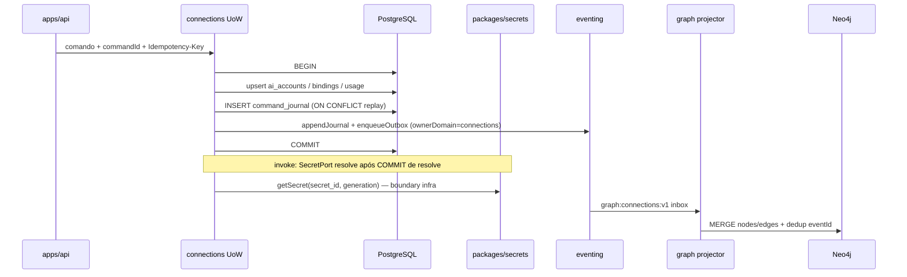

# R05 — Armazenamento: `modules/connections`

**Módulo:** connections (P05 Connections)  
**Rodada:** R5 — PostgreSQL, journal/outbox, projeção Neo4j, cache SQLite  
**Pacote SDD:** P05  
**Data:** 2026-09-08  
**Issue debate:** ANX-83 · contrato P05: ANX-62 · gate implementação: ANX-36  
**Pré-requisito:** [R04-contracts-events.md](./R04-contracts-events.md) · [R03-domain-sketch.md](./R03-domain-sketch.md) · [R02-boundaries.md](./R02-boundaries.md) · `brain/project-docs/specs/005-connections-integration/spec.md` · `brain/notes/anxionos-storage-ownership.md`

## Participantes

| Papel | Agente |
| --- | --- |
| Orquestrador | CTO orchestrator |
| Executor | code-architect |
| Crítico | critic-reviewer |
| Code Review | code-reviewer |
| QA | QA |
| Security | security-reviewer |
| Arquiteto | architect |

Roster obrigatório: [DEBATE-ROSTER.md](../../DEBATE-ROSTER.md).

## Objetivo da rodada

Definir o modelo de persistência autoritativo de **connections** após [R04-contracts-events.md](./R04-contracts-events.md): tabelas PostgreSQL (`connections_*`), journal/outbox atômico com `ownerDomain: connections`, projeção Neo4j pelo consumer `graph:connections:v1`, cache SQLite descartável de catálogo, colunas `secret_ref` sem valor de credencial, índices de idempotência/tenancy/binding lookup, estratégia de migração P05 em slices — espelhando [organizations/R05-storage.md](../organizations/R05-storage.md), [identity/R05-storage.md](../../structure-debate/identity/R05-storage.md) e [agents/R05-storage-pg.md](../../structure-debate/agents/R05-storage-pg.md).

## Fontes aplicadas

| Fonte | Uso em R5 |
| --- | --- |
| [R04-contracts-events.md](./R04-contracts-events.md) | Catálogo `connections.*.v1`, HTTP idempotency, `secretRefSchema` |
| [R03-domain-sketch.md](./R03-domain-sketch.md) | Agregados AIAccount, ConnectionBinding, UsageRecord; CX-R03-INV-* |
| [R02-boundaries.md](./R02-boundaries.md) | CX-R02-SEC-*, SIMULATED/PAPER only, usage autoritativo |
| `brain/notes/anxionos-storage-ownership.md` | Matriz connections: PG + Neo4j + SQLite catálogo |
| [graph/R05-cache-projection.md](../../structure-debate/graph/R05-cache-projection.md) | Inbox dedup, `offerGeneration`, T15/T16/T17 |
| `backend/packages/eventing/` | `domain_journal`, `outbox`, `appendJournal`, `enqueueOutbox` |

## Debate R5 (diálogo atribuído)

**Arquiteto:** PostgreSQL confirma prefixo `connections_*` para todo estado autoritativo v1. Dois agregados raiz (CX-R03-01): `connections_ai_accounts` e `connections_connection_bindings`. Usage e quotas na mesma transação UoW que outbox — billing consome evento, não duplica tabela.

**Security:** Colunas `secret_id` + `secret_generation` normalizadas — **nunca** `api_key`, `token`, `refresh_token` ou PEM. Valor de credencial só via `packages/secrets` na invocação do adapter. Eventos e journal omitem material secret (CX-R02-SEC-01..02).

**Crítico:** `connections_command_journal` obrigatório — HTTP `/v1/connections/*` usa `Idempotency-Key` (R04). Idempotência de invoke por `(organization_id, idempotency_key)` em `connections_usage_records` e `connections_inference_requests`. Quota/cooldown **nunca** em SQLite.

**Executor:** `ConnectionsUnitOfWork`: BEGIN → mutação estado → command_journal (se HTTP) → appendJournal + enqueueOutbox → COMMIT. Bootstrap `ensureConnectionsSchema(pool)` após governance no composition root (R06 detalha ordem).

**Code Review:** Migrations Drizzle locais ao módulo: `0000` enums+tabelas núcleo; `0001` índices parciais ACTIVE bindings e usage idempotency; `0002` fairness/quota; `0003` catalog/adapters.

**QA:** Testes P0 documentais: rollback se outbox falha; replay `command_id`; invoke duplo retorna mesmo `inferenceRequestId`; quota lease + dispatch sequence na mesma transação (CX-R03-06).

**Síntese Orquestrador:** Modelo de armazenamento v1 fechado; zero código até greenlight ANX-36; R06 cobre wiring upstream/downstream.

---

## Princípios de autoridade

| Princípio | Decisão |
| --- | --- |
| Fonte de verdade transacional | PostgreSQL (`connections_*`) |
| Grafo institucional | Neo4j — projeção derivada de eventos `ownerDomain: connections` |
| Journal de eventos | Tabela compartilhada `domain_journal` |
| Outbox | Tabela compartilhada `outbox` — mesma transação que mutação |
| Idempotência HTTP | Tabela dedicada `connections_command_journal` |
| Idempotência invoke/usage | `(organization_id, idempotency_key)` UNIQUE |
| Idempotência binding publish | `(connection_id, binding_version)` quando status terminal |
| SQLite | **Permitido** apenas cache descartável de catálogo público — **não** quota/cooldown/saldo |
| FK cross-module | **Não** — `organization_id`, `owner_principal_id`, `grant_id` referências lógicas |
| Segredos em eventos | **Proibido** — ver CX-R02-SEC-* |

Fluxo de escrita (activate binding + invoke):



---

## Inventário de tabelas (resumo)

| Tabela | Agregado / papel | Autoritativo |
| --- | --- | --- |
| `connections_providers` | Catálogo família provider | PG |
| `connections_provider_subscriptions` | Assinatura usuário↔provider | PG |
| `connections_ai_accounts` | Agregado raiz AIAccount | PG |
| `connections_connection_bindings` | Agregado raiz ConnectionBinding | PG |
| `connections_model_offerings` | Ofertas/model catalog | PG (+ cache SQLite) |
| `connections_catalog_releases` | Release versionado catálogo | PG (+ cache SQLite) |
| `connections_inference_profiles` | Snapshot params por binding | PG |
| `connections_quota_leases` | Reserva quota/budget | PG |
| `connections_platform_dispatch_sequences` | Fairness PLATFORM global | PG |
| `connections_owner_provider_pools` | Pool fairness AGENCY | PG |
| `connections_usage_records` | Consumo autoritativo | PG |
| `connections_inference_requests` | Correlaciona invoke/stream | PG |
| `connections_adapter_registry` | Metadata adapters ENABLED | PG |
| `connections_health_probes` | Circuit/health por connection | PG |
| `connections_reconciliation_cases` | UNKNOWN / reconcile | PG |
| `connections_command_journal` | Idempotência HTTP | PG |
| `connections_catalog_cache` | Cache SQLite catálogo | SQLite (descartável) |

---

## PostgreSQL — enums

Prefixo: `connections_*`.

| Enum Drizzle | Valores | Uso |
| --- | --- | --- |
| `connections_ai_account_status` | `draft`, `authorized`, `active`, `suspended`, `revoked` | [R03](./R03-domain-sketch.md) |
| `connections_connection_kind` | `market_data`, `simulation`, `paper_account`, `model`, `knowledge`, `taskboard` | **Sem** `real_execution` |
| `connections_connection_environment` | `simulated`, `paper` | CX-R02-INV-01 |
| `connections_binding_status` | `draft`, `validating`, `active`, `suspended`, `revoked` | Lifecycle binding |
| `connections_effect_class` | `read_only`, `simulated_effect`, `paper_effect`, `inference`, `sync_metadata` | **Sem** `live_trading` |
| `connections_consumer_kind` | `owner`, `agency`, `platform` | Usage / fairness |
| `connections_usage_unit` | `tokens_in`, `tokens_out`, `request`, `gpu_seconds`, `characters`, `other` | UsageRecord |
| `connections_usage_status` | `estimated`, `reconciled`, `void` | UsageRecord |
| `connections_inference_request_status` | `pending`, `streaming`, `completed`, `failed`, `unknown`, `cancelled` | Invoke lifecycle |
| `connections_health_status` | `healthy`, `degraded`, `unhealthy`, `unknown` | Health probe |
| `connections_adapter_status` | `enabled`, `disabled`, `degraded` | Registry |

---

## PostgreSQL — tabela `connections_ai_accounts`

Agregado raiz titular/scopes/secret ref.

| Coluna | Tipo | Nullable | Descrição |
| --- | --- | --- | --- |
| `id` | `text` PK | não | `aiAccountId` branded |
| `organization_id` | `text` | não | Tenancy |
| `owner_principal_id` | `text` | não | Referência lógica → identity |
| `provider_id` | `text` | não | FK lógica → `connections_providers.id` |
| `display_name` | `varchar(256)` | não | |
| `status` | `connections_ai_account_status` | não | Default `draft` |
| `visibility_scope` | `jsonb` | não | `ScopeRef` |
| `consumption_scope` | `jsonb` | não | DL-CX1 |
| `funding_scope` | `jsonb` | não | DL-CX1 |
| `secret_id` | `text` | sim | Opaco — preenchido em authorize |
| `secret_generation` | `integer` | sim | Default 0; incrementa rotação |
| `authority_epoch` | `integer` | não | Default 0 |
| `revision` | `integer` | não | Default 1 |
| `created_at` | `timestamptz` | não | |
| `updated_at` | `timestamptz` | não | |

### Índices `connections_ai_accounts`

| Nome | Definição | Propósito |
| --- | --- | --- |
| `connections_ai_accounts_org_owner_provider_idx` | `(organization_id, owner_principal_id, provider_id)` | Listagem titular |
| `connections_ai_accounts_org_status_idx` | `(organization_id, status)` | Ops / admin |
| `connections_ai_accounts_register_draft_uidx` | UNIQUE `(organization_id, owner_principal_id, provider_id, display_name)` WHERE `status = 'draft'` | Idempotência RegisterAIAccount |

**Decisão CX-R05-01:** `secret_id` + `secret_generation` colunas normalizadas — **não** JSONB com valor de credencial. Eventos usam objeto `secretRef` derivado dessas colunas (id + generation apenas).

---

## PostgreSQL — tabela `connections_connection_bindings`

Agregado raiz autorização operacional versionada.

| Coluna | Tipo | Nullable | Descrição |
| --- | --- | --- | --- |
| `id` | `text` PK | não | `bindingId` |
| `connection_id` | `text` | não | Identificador estável da connection |
| `binding_version` | `integer` | não | UNIQUE `(connection_id, binding_version)` |
| `organization_id` | `text` | não | Tenancy denormalizado |
| `ai_account_id` | `text` | não | FK → `connections_ai_accounts.id` |
| `kind` | `connections_connection_kind` | não | Enum fechado v1 |
| `environment` | `connections_connection_environment` | não | |
| `adapter_id` | `text` | não | |
| `adapter_version` | `text` | não | |
| `effect_class` | `connections_effect_class` | não | |
| `capabilities` | `jsonb` | não | Array `CapabilityToken[]` |
| `secret_id` | `text` | não | Referência opaca |
| `secret_generation` | `integer` | não | Validado na resolução |
| `grant_id` | `uuid` | sim | Referência lógica → governance |
| `grant_epoch` | `integer` | sim | Snapshot na ativação |
| `authority_epoch` | `integer` | não | |
| `policy_epoch` | `integer` | não | Default 0 |
| `expires_at` | `timestamptz` | sim | |
| `rate_limits` | `jsonb` | não | `RateLimitPolicy` |
| `budget_limits` | `jsonb` | não | `BudgetPolicy` |
| `contract_hash` | `varchar(128)` | não | SHA-256 manifest |
| `status` | `connections_binding_status` | não | |
| `revision` | `integer` | não | |
| `created_at` | `timestamptz` | não | |
| `activated_at` | `timestamptz` | sim | |
| `revoked_at` | `timestamptz` | sim | |

### Índices `connections_connection_bindings`

| Nome | Definição | Propósito |
| --- | --- | --- |
| `connections_bindings_org_connection_idx` | `(organization_id, connection_id)` | Lookup por connection |
| `connections_bindings_ai_account_active_idx` | `(ai_account_id, status)` WHERE `status = 'active'` | Resolver hot path |
| `connections_bindings_org_kind_active_idx` | `(organization_id, kind, status)` WHERE `status = 'active'` | Admin / routing |
| `connections_bindings_connection_version_uidx` | UNIQUE `(connection_id, binding_version)` | Versionamento imutável |
| `connections_bindings_active_lookup_uidx` | UNIQUE `(connection_id)` WHERE `status = 'active'` | No máximo um ACTIVE por connection v1 |

**Decisão CX-R05-02:** Versão `active` imutável — trigger `BEFORE UPDATE` rejeita mutação de row `active` exceto transição para `suspended`/`revoked`.

---

## PostgreSQL — tabela `connections_usage_records`

Fonte autoritativa de consumo (T16/T17 graph; billing consumer).

| Coluna | Tipo | Nullable | Descrição |
| --- | --- | --- | --- |
| `id` | `text` PK | não | `usageRecordId` |
| `organization_id` | `text` | não | |
| `ai_account_id` | `text` | não | |
| `connection_binding_id` | `text` | não | |
| `binding_version` | `integer` | não | Snapshot imutável |
| `inference_request_id` | `uuid` | sim | |
| `task_id` | `text` | sim | Correlaciona orchestration |
| `run_id` | `text` | sim | |
| `consumer_kind` | `connections_consumer_kind` | não | |
| `consumer_principal_id` | `text` | não | |
| `operation` | `varchar(128)` | não | |
| `quantity` | `numeric(24,8)` | não | |
| `unit` | `connections_usage_unit` | não | |
| `currency` | `char(3)` | sim | |
| `estimated_cost` | `numeric(24,8)` | sim | |
| `actual_cost` | `numeric(24,8)` | sim | |
| `status` | `connections_usage_status` | não | Default `estimated` |
| `idempotency_key` | `text` | não | |
| `recorded_at` | `timestamptz` | não | |

### Índices `connections_usage_records`

| Nome | Definição | Propósito |
| --- | --- | --- |
| `connections_usage_org_idempotency_uidx` | UNIQUE `(organization_id, idempotency_key)` | CX-R03-INV-USG-01 |
| `connections_usage_org_account_recorded_idx` | `(organization_id, ai_account_id, recorded_at DESC)` | Billing aggregate |
| `connections_usage_binding_idx` | `(connection_binding_id, binding_version)` | Linhagem T16/T17 |
| `connections_usage_task_idx` | `(task_id)` WHERE `task_id IS NOT NULL` | Orchestration reconcile |

---

## PostgreSQL — tabelas satélite (v1)

### `connections_providers`

| Coluna | Tipo | Notas |
| --- | --- | --- |
| `id` | `text` PK | `providerId` |
| `family` | `varchar(64)` | |
| `display_name` | `varchar(256)` | |
| `capabilities` | `jsonb` | Manifest público |
| `status` | `text` | `enabled` \| `deprecated` |
| `revision` | `integer` | |
| `created_at` | `timestamptz` | |

### `connections_provider_subscriptions`

| Coluna | Tipo | Notas |
| --- | --- | --- |
| `id` | `uuid` PK | |
| `organization_id` | `text` | |
| `ai_account_id` | `text` | FK lógica |
| `provider_id` | `text` | |
| `plan_ref` | `text` | Metadado — não invoice billing |
| `status` | `text` | |
| `revision` | `integer` | |
| `created_at` | `timestamptz` | |

Índice: `(organization_id, provider_id, ai_account_id)`.

### `connections_model_offerings`

| Coluna | Tipo | Notas |
| --- | --- | --- |
| `id` | `text` PK | `offeringId` |
| `provider_id` | `text` | |
| `model_ref` | `text` | Identificador provider-side opaco |
| `readiness` | `text` | `draft` \| `ready` \| `deprecated` |
| `free_flag` | `boolean` | G1–G4 groups |
| `capability_group` | `text` | |
| `catalog_release_id` | `text` | |
| `metadata` | `jsonb` | Sem secrets |
| `revision` | `integer` | |
| `published_at` | `timestamptz` | |

Índices: `(provider_id, readiness)`, `(catalog_release_id)`.

### `connections_catalog_releases`

| Coluna | Tipo | Notas |
| --- | --- | --- |
| `id` | `text` PK | |
| `generation` | `integer` NOT NULL | Bump invalida T15 cache (graph R05) |
| `released_at` | `timestamptz` | |
| `manifest_hash` | `varchar(128)` | |

Índice: `(generation DESC)`.

### `connections_inference_profiles`

Snapshot imutável por binding/request — 1:1 opcional com binding version.

| Coluna | Tipo | Notas |
| --- | --- | --- |
| `id` | `uuid` PK | |
| `connection_binding_id` | `text` | |
| `binding_version` | `integer` | |
| `profile_json` | `jsonb` | effort/thinking/tools — sem prompt bruto |
| `created_at` | `timestamptz` | |

### `connections_quota_leases`

| Coluna | Tipo | Notas |
| --- | --- | --- |
| `id` | `uuid` PK | |
| `organization_id` | `text` | |
| `ai_account_id` | `text` | |
| `quota_group` | `text` | |
| `period_key` | `text` | ex.: `2026-09` |
| `reserved_amount` | `numeric(24,8)` | |
| `fencing_token` | `bigint` | CX04 |
| `expires_at` | `timestamptz` | Worker reaper |
| `created_at` | `timestamptz` | |

Índice parcial: `(ai_account_id, quota_group, period_key)` WHERE `expires_at > now()`.

### `connections_platform_dispatch_sequences`

Fairness PLATFORM — sequência global + `last_account_id` (DL-CX2).

| Coluna | Tipo | Notas |
| --- | --- | --- |
| `id` | `text` PK | Constante `platform_global` v1 |
| `sequence` | `bigint` | Monotônico |
| `last_ai_account_id` | `text` | |
| `updated_at` | `timestamptz` | |

**Decisão CX-R05-03:** UPDATE desta row + INSERT quota lease na **mesma transação** que reserva invoke PLATFORM.

### `connections_owner_provider_pools`

| Coluna | Tipo | Notas |
| --- | --- | --- |
| `id` | `uuid` PK | |
| `organization_id` | `text` | |
| `owner_principal_id` | `text` | |
| `provider_id` | `text` | |
| `pool_cursor` | `jsonb` | least-recently-dispatched state |
| `revision` | `integer` | |
| `updated_at` | `timestamptz` | |

Índice UNIQUE: `(organization_id, owner_principal_id, provider_id)`.

### `connections_inference_requests`

Correlaciona invoke/sync/stream/UNKNOWN.

| Coluna | Tipo | Notas |
| --- | --- | --- |
| `id` | `uuid` PK | `inferenceRequestId` |
| `organization_id` | `text` | |
| `connection_binding_id` | `text` | |
| `binding_version` | `integer` | |
| `idempotency_key` | `text` | |
| `status` | `connections_inference_request_status` | |
| `operation` | `varchar(128)` | |
| `task_id` | `text` | |
| `run_id` | `text` | |
| `usage_record_id` | `text` | FK lógica pós-terminal |
| `started_at` | `timestamptz` | |
| `completed_at` | `timestamptz` | |
| `error_code` | `text` | |
| `created_at` | `timestamptz` | |

Índices:

| Nome | Definição | Propósito |
| --- | --- | --- |
| `connections_inference_org_idempotency_uidx` | UNIQUE `(organization_id, idempotency_key)` | Replay invoke |
| `connections_inference_binding_status_idx` | `(connection_binding_id, status)` | Reconcile worker |

### `connections_adapter_registry`

| Coluna | Tipo | Notas |
| --- | --- | --- |
| `adapter_id` | `text` | PK composta |
| `adapter_version` | `text` | PK composta |
| `effect_class` | `connections_effect_class` | Allowlist — sem LIVE |
| `capabilities` | `jsonb` | |
| `status` | `connections_adapter_status` | |
| `registered_at` | `timestamptz` | |

### `connections_health_probes`

| Coluna | Tipo | Notas |
| --- | --- | --- |
| `connection_id` | `text` PK | |
| `status` | `connections_health_status` | |
| `probe_at` | `timestamptz` | |
| `detail_code` | `text` | Sem payload provider bruto |
| `revision` | `integer` | |

### `connections_reconciliation_cases`

| Coluna | Tipo | Notas |
| --- | --- | --- |
| `id` | `uuid` PK | |
| `inference_request_id` | `uuid` | UNIQUE |
| `connection_binding_id` | `text` | |
| `status` | `text` | `open` \| `resolved` |
| `resolution` | `text` | |
| `opened_at` | `timestamptz` | |
| `resolved_at` | `timestamptz` | |

---

## PostgreSQL — tabela `connections_command_journal`

Idempotência de comandos HTTP (distinto de `domain_journal`).

| Coluna | Tipo | Descrição |
| --- | --- | --- |
| `command_id` | `uuid` PK | `Idempotency-Key` do HTTP |
| `command_name` | `text` | Ex.: `CreateConnectionBinding`, `InvokeInference` |
| `aggregate_id` | `text` | ID do agregado afetado |
| `aggregate_type` | `text` | `ai_account` \| `binding` \| `inference_request` \| `usage` |
| `revision` | `integer` | Quando aplicável |
| `response_snapshot` | `jsonb` | Replay — **sem** secret value |
| `created_at` | `timestamptz` | |

**Comportamento:** `INSERT ... ON CONFLICT (command_id) DO NOTHING` + leitura prévia; replay retorna `idempotentReplay: true` ([R04](./R04-contracts-events.md)).

**Decisão CX-R05-04:** `connections_command_journal` obrigatório v1 — paridade organizations/orchestration.

---

## Journal e outbox — alinhamento `packages/eventing`

O módulo **não** cria tabelas `domain_journal` / `outbox`.

| Função (`@anxionos/eventing`) | Uso em connections |
| --- | --- |
| `ensureEventingSchema(pool)` | Bootstrap no composition root **antes** de `ensureConnectionsSchema` |
| `appendJournal(client, envelope)` | Dentro da transação `ConnectionsUnitOfWork` |
| `enqueueOutbox(client, envelope)` | Mesma transação — `ownerDomain: "connections"` |
| `appendEventAtomic` | **Não** usar isoladamente |

### Pseudocódigo `ConnectionsUnitOfWork`

```typescript
async function executeCommand(deps, input) {
  const existing = await deps.commandJournal.findByCommandId(input.commandId);
  if (existing) return { ...existing.responseSnapshot, idempotentReplay: true };

  const client = await deps.pool.connect();
  try {
    await client.query("BEGIN");

    const { aggregate, envelopes } = await deps.handler(client, input);

    await deps.commandJournal.insert(client, { ... });
    for (const envelope of envelopes) {
      await appendJournal(client, { ...envelope, ownerDomain: "connections" });
      await enqueueOutbox(client, envelope);
    }

    await client.query("COMMIT");
    return aggregate;
  } catch (e) {
    await client.query("ROLLBACK");
    throw e;
  } finally {
    client.release();
  }
}
```

### Mapa evento → colunas afetadas

| eventType | Tabelas / colunas |
| --- | --- |
| `connections.ai_account.registered.v1` | INSERT `connections_ai_accounts` |
| `connections.ai_account.authorized.v1` | UPDATE `secret_id`, `secret_generation`, `authority_epoch`, `status` |
| `connections.binding.created.v1` | INSERT `connections_connection_bindings` |
| `connections.binding.activated.v1` | UPDATE `status`, `activated_at`, `grant_id`, `grant_epoch` |
| `connections.binding.suspended.v1` | UPDATE `status` |
| `connections.binding.revoked.v1` | UPDATE `status`, `revoked_at` |
| `connections.usage.recorded.v1` | INSERT `connections_usage_records` |
| `connections.inference.completed.v1` | UPDATE `connections_inference_requests`, link `usage_record_id` |
| `connections.inference.failed.v1` | UPDATE `connections_inference_requests` |
| `connections.quota.exceeded.v1` | Sem mutação quota row — fato admissão; lease permanece |
| `connections.health.changed.v1` | UPSERT `connections_health_probes` |
| `connections.call.unknown.v1` | INSERT `connections_reconciliation_cases`; status `unknown` |
| `connections.reconciled.v1` | UPDATE reconciliation case |
| `connections.inference.stream.v1` | **Opcional** — audit long-running; não muta usage até terminal |

### Retenção `connections.inference.stream.v1`

| Opção | Veredito | Racional |
| --- | --- | --- |
| **A — Journal only, sem tabela dedicada** | ✅ **Adotado v1** | Chunks em `domain_journal` com TTL archival policy; terminal + usage em PG autoritativo |
| B — Tabela `connections_inference_stream_chunks` | ⏳ Deferido | Volume alto; R09 avalia ObjectRef batch |
| C — Omitir stream events entirely | ❌ | CX-R04-03 exige audit opcional long-running |

**Decisão CX-R05-05:** Stream outbox opcional; billing **só** fecha em `usage.recorded` + terminal `completed`/`failed`.

### Regras de payload (sem segredos)

| Campo | Em PG connections | Em evento outbox |
| --- | --- | --- |
| `secret_id` | ✅ coluna opaca | ✅ como `secretRef.secretId` |
| `secret_generation` | ✅ | ✅ como `secretRef.generation` |
| API key / token / PEM | ❌ | ❌ |
| `grant_id` + epoch | ✅ | ✅ `grantRef` |
| Prompt/transcript completo | ❌ em PG v1 | ❌ — `deltaRef` ObjectRef se stream |

---

## Projeção Neo4j — consumer `graph:connections:v1`

Projector no módulo **graph** (P03); connections publica eventos. Subconjunto alinhado a [R03](./R03-domain-sketch.md) e traversals T15/T16/T17.

### Nós projetados

| Label | Propriedades mínimas | Origem evento | Sync vs async |
| --- | --- | --- | --- |
| `:Provider` | `providerId`, `family`, `status` | catalog/admin seed | async inbox |
| `:AIAccount` | `aiAccountId`, `organizationId`, `ownerPrincipalId`, scopes hash, `status` | `ai_account.*` | async inbox |
| `:ConnectionBinding` | `bindingId`, `connectionId`, `version`, `kind`, `environment`, `status`, `contractHash` | `binding.*` | async inbox |
| `:ModelOffering` | `offeringId`, `readiness`, `freeFlag`, `catalogGeneration` | catalog publish | async inbox |
| `:UsageRecord` | `usageRecordId`, `quantity`, `unit`, `consumerKind`, `recordedAt` | `usage.recorded` | async inbox |

**Proibido em propriedades Neo4j:** `secretId` valor resolvível, tokens, prompts completos (CX-R02-SEC-03).

### Arestas projetadas

| Edge | De → Para | eventType gatilho | Notas |
| --- | --- | --- | --- |
| `SUBSCRIBES_TO` | `:AIAccount` → `:Provider` | `ai_account.registered` | ProviderSubscription |
| `HAS_BINDING` | `:AIAccount` → `:ConnectionBinding` | `binding.created` | |
| `BINDS_CONNECTION` | `:ConnectionBinding` → `:Provider` | `binding.activated` | kind/capability |
| `OFFERS_MODEL` | `:Provider` → `:ModelOffering` | catalog events | T15 |
| `RECORDED_USAGE` | `:ConnectionBinding` → `:UsageRecord` | `usage.recorded` | T16/T17 linhagem |
| `CONSUMED_BY` | `:UsageRecord` → `:Principal` | `usage.recorded` | `consumerPrincipalId` — nó identity |
| `USED_FOR_TASK` | `:UsageRecord` → `:Task` | `usage.recorded` when `taskId` | orchestration projector coalesce |

### Síncrono vs async inbox

| Evento | Modo | Racional |
| --- | --- | --- |
| `binding.activated`, `binding.revoked` | async (inbox padrão) | Volume baixo; consistência eventual OK para traverse |
| `usage.recorded` | async | billing consumer PG-first; graph T16 seconds lag |
| `health.changed` | async | Ops dashboard |
| `inference.stream.v1` | **não projetar** v1 | Chunks não são nós institucionais |
| Kernel T01 pré-invoke | **não** via Neo4j write | Revalidação epoch/grant em PG governance + connections resolver |

Consumer: `graph:connections:v1` com inbox dedup por `eventId` (`processWithInbox` pattern).

### Deduplicação e proveniência

- Chave projector: `eventId` + consumer `graph:connections:v1`.
- Propriedade `revision` / `bindingVersion` ignora eventos stale.
- Crash após commit PG, antes ack Neo4j: replay idempotente (ST02 storage map).

---

## SQLite — cache catálogo (descartável)

**Escopo permitido:** somente metadados públicos de catálogo — **nunca** quota, cooldown, lease, usage, secret, binding status autoritativo.

| Aspecto | Decisão |
| --- | --- |
| Arquivo | `{CONNECTIONS_CACHE_DIR}/catalog.sqlite` — local por runtime/pod |
| Dono código | `connections/infrastructure/cache/catalog-cache.ts` |
| Conteúdo | Snapshot `ModelOffering`, `CatalogRelease`, `Provider` metadata público |
| Chave | `(offering_id, catalog_generation)` |
| TTL | Default 300s; invalidação em `connections.catalog.updated` / bump `generation` |
| Populate | Worker `catalog-watcher` ou miss → read PG `connections_model_offerings` |
| Perda | ST04 — apagar cache não altera usage/quota confirmado |
| Multi-réplica | Cada pod rebuild independente; T15 L2 Redis no graph complementa cross-pod |

### Schema SQLite (sketch)

```sql
CREATE TABLE catalog_offerings (
  offering_id TEXT NOT NULL,
  catalog_generation INTEGER NOT NULL,
  provider_id TEXT NOT NULL,
  payload_json TEXT NOT NULL,  -- JSON sanitizado, sem secrets
  cached_at INTEGER NOT NULL,
  PRIMARY KEY (offering_id, catalog_generation)
);

CREATE TABLE catalog_meta (
  key TEXT PRIMARY KEY,
  value TEXT NOT NULL
);
-- catalog_meta: last_generation, last_refresh_at
```

**Decisão CX-R05-06:** SQLite **proibido** para `connections_quota_leases`, `connections_platform_dispatch_sequences`, `connections_owner_provider_pools` — race fairness exige PG row locks.

---

## Estratégia de migração P05 (slices)

Implementação gated ANX-36; migrations Drizzle locais ao módulo.

| Slice | Migration | Tabelas / escopo | Gate |
| --- | --- | --- | --- |
| **S1 — Core accounts/bindings** | `0000_connections_core.sql` | enums, `connections_ai_accounts`, `connections_connection_bindings`, `connections_command_journal`, `connections_providers` | G1 após P02 secrets stub |
| **S2 — Invoke + usage** | `0001_connections_usage.sql` | `connections_inference_requests`, `connections_usage_records`, índices idempotency | G1 + contracts test |
| **S3 — Fairness quota** | `0002_connections_fairness.sql` | `connections_quota_leases`, `connections_platform_dispatch_sequences`, `connections_owner_provider_pools` | G1 fairness tests DL-CX2 |
| **S4 — Catalog** | `0003_connections_catalog.sql` | `connections_model_offerings`, `connections_catalog_releases`, `connections_provider_subscriptions` | G1 + SQLite cache optional |
| **S5 — Ops** | `0004_connections_ops.sql` | `connections_adapter_registry`, `connections_health_probes`, `connections_inference_profiles`, `connections_reconciliation_cases` | G2 ops workers |

Ordem bootstrap composition root (proposta — R06 confirma):

1. `ensureEventingSchema(pool)`
2. `ensureIdentitySchema(pool)`
3. `ensureOrganizationsSchema(pool)`
4. `ensureGovernanceSchema(pool)`
5. `ensureConnectionsSchema(pool)` — slices S1→Sn incrementais

---

## Drizzle — ownership

```text
backend/modules/connections/
├── drizzle.config.ts
├── package.json
└── src/infrastructure/
    ├── persistence/
    │   ├── schema.ts              # pgTable connections_*
    │   ├── *-repository.ts
    │   └── command-journal.ts
    ├── cache/
    │   └── catalog-sqlite-cache.ts
    ├── connections-unit-of-work.ts
    ├── create-db.ts
    ├── migrate.ts                 # ensureConnectionsSchema(pool)
    └── migrations/
        ├── 0000_connections_core.sql
        ├── 0001_connections_usage.sql
        └── meta/
```

| Aspecto | Decisão |
| --- | --- |
| Prefixo tabela | `connections_*` |
| FK cross-module | Nenhuma física |
| Export schema | Opcional para testes integração |
| Dependências | `@anxionos/contracts`, `@anxionos/eventing`, `@anxionos/database`, `drizzle-orm`, `pg`, `better-sqlite3` (cache only) |

---

## O que permanece FORA do SQLite

| Dado | Motivo |
| --- | --- |
| AIAccount, ConnectionBinding, UsageRecord | Autoridade PG |
| Quota leases, dispatch sequence, pools | Fairness concorrente — PG locks |
| `connections_command_journal` | Idempotência institucional |
| Inference request state terminal | Billing/audit source PG |
| Health/circuit state | Fail-closed resolve |
| Outbox/journal | Mecanismo compartilhado PG |
| Projeção Neo4j | Engine separado |

---

## Decisões registradas

| ID | Decisão | Racional |
| --- | --- | --- |
| **CX-R05-01** | `secret_id` + `secret_generation` colunas normalizadas | Query/index; eventos derivam `secretRef` opaco |
| **CX-R05-02** | Binding ACTIVE imutável — nova versão para mudança material | CX-R03-INV-BND-01 |
| **CX-R05-03** | Fairness PLATFORM: dispatch sequence + quota lease mesma TX | DL-CX2 / CX-R03-06 |
| **CX-R05-04** | `connections_command_journal` obrigatório v1 | HTTP Idempotency-Key R04 |
| **CX-R05-05** | Stream events journal-only; terminal + usage em PG | CX-R04-03 billing closure |
| **CX-R05-06** | SQLite só catálogo público descartável | storage-ownership ST04 |
| **CX-R05-07** | Neo4j async inbox `graph:connections:v1` — sem write síncrono pré-invoke | ADR0002; graph kernel read |
| **CX-R05-08** | Migrations P05 slices S1–S5 | Incremental ANX-36 |

---

## Alternativas consideradas

| ID | Alternativa | Veredito | Racional |
| --- | --- | --- | --- |
| **ALT-CX-R05-01** | `secret_ref` JSONB único em PG | ❌ | Pior indexação; normalizar id+generation |
| **ALT-CX-R05-02** | Usage event-only sem PG | ❌ | R02/R03 — billing/graph exigem fonte única |
| **ALT-CX-R05-03** | Quota/cooldown em Redis | ❌ v1 | Fairness autoritativo PG; Redis só graph L2 cache |
| **ALT-CX-R05-04** | Neo4j write síncrono on invoke | ❌ | Viola fluxo storage map; latência + dual write |
| **ALT-CX-R05-05** | Catálogo só SQLite sem PG | ❌ | PG confirma release/generation; SQLite cache derivado |
| **ALT-CX-R05-06** | Tabela dedicada stream chunks v1 | ⏳ Deferido | Volume; ObjectRef batch R09 |

---

## Riscos (preview — detalhe R07)

| ID | Risco | Sev | Mitigação R05 |
| --- | --- | --- | --- |
| **RK-CX-R05-01** | Race quota PLATFORM sem TX única | Alta | CX-R05-03 |
| **RK-CX-R05-02** | Secret vazado em `response_snapshot` journal | Crítica | Lint snapshot; proibir keys proibidas |
| **RK-CX-R05-03** | Cache SQLite stale T15 | Média | `catalog_generation` + TTL 300s |
| **RK-CX-R05-04** | Binding ACTIVE duplicado | Alta | Partial unique index |
| **RK-CX-R05-05** | Stream sem terminal bloqueia usage row | Alta | CX-R05-05 + inference_requests status |

---

## Perguntas abertas → R06 (dependências)

1. Ordem exata bootstrap composition root vs `packages/secrets` stub.
2. `GrantValidationPort` interface + wiring in-process governance — latência e cache epoch.
3. Projector `graph:connections:v1` registro no graph module — dependência ANX-32 G2.
4. Object store para `deltaRef` stream chunks — dono audit vs connections.
5. Retenção/TTL `connections_command_journal` e archival `domain_journal` stream events.
6. RLS PostgreSQL por `organization_id` vs application-only (paridade organizations P-R5-03).

---

## Critérios de aceite — R05

| # | Critério | Status |
| --- | --- | --- |
| AC-R05-01 | Inventário tabelas PG `connections_*` com colunas e tipos | ✅ |
| AC-R05-02 | Journal/outbox `ownerDomain=connections` na mesma transação UoW | ✅ |
| AC-R05-03 | Projeção Neo4j `graph:connections:v1` — nós, arestas, sync/async | ✅ |
| AC-R05-04 | SQLite cache catálogo only — escopo e exclusões explícitos | ✅ |
| AC-R05-05 | Índices idempotency, tenancy, binding lookup documentados | ✅ |
| AC-R05-06 | `secret_ref` storage sem raw secrets (CX-R05-01) | ✅ |
| AC-R05-07 | Estratégia migração P05 slices S1–S5 | ✅ |
| AC-R05-08 | Decisões, alternativas, riscos, perguntas → R06 | ✅ |
| AC-R05-09 | Alinhamento R01–R04, spec 005, storage-ownership | ✅ |

---

## Saída R5

✅ Modelo de armazenamento aprovado para **R06 — Dependências** ([R06-dependencies.md](./R06-dependencies.md)).

**Próximo:** grafo upstream/downstream, gates ANX-36, wiring `GrantValidationPort`, bootstrap order, consumer `graph:connections:v1` no módulo graph.
