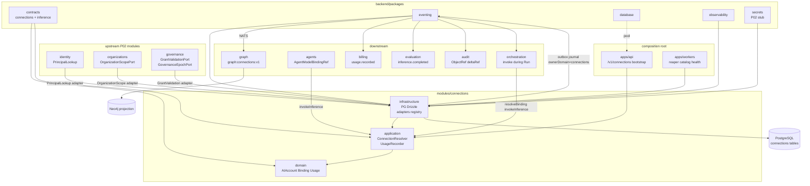

# R06 — Dependências: `modules/connections`

**Módulo:** connections (P05 Connections)  
**Rodada:** R6 — Upstream, packages, downstream e wiring no composition root  
**Pacote SDD:** P05  
**Data:** 2026-09-08  
**Issue debate:** ANX-83 · contrato P05: ANX-62 · gate implementação: ANX-36 · graph consumer: ANX-32

## Participantes

| Papel | Agente |
| --- | --- |
| Orquestrador | CTO orchestrator |
| Arquiteto | architect |
| Executor | code-architect |
| Crítico | critic-reviewer |
| Security | security-reviewer |
| Code Review | code-reviewer |

Roster obrigatório: [DEBATE-ROSTER.md](../../DEBATE-ROSTER.md).

## Objetivo da rodada

Fechar o mapa de dependências de **connections** após [R05-storage-pg.md](./R05-storage-pg.md): upstream P02 (identity, organizations, governance), packages compartilhados (`contracts`, `eventing`, `secrets`), downstream (billing, graph, orchestration, agents), ordem de bootstrap no composition root, interface e wiring de `GrantValidationPort`, registro do consumer `graph:connections:v1` (gate ANX-32) e resolução das perguntas abertas de R05.

## Fontes aplicadas

| Fonte | Uso em R6 |
| --- | --- |
| [R01-context.md](./R01-context.md) | Upstream/downstream inventário inicial |
| [R02-boundaries.md](./R02-boundaries.md) | Fronteiras, CX-R02-INV-*, CX-R02-SEC-* |
| [R03-domain-sketch.md](./R03-domain-sketch.md) | Ports `ConnectionResolver`, `GrantValidationPort`, `GovernanceEpochPort` |
| [R04-contracts-events.md](./R04-contracts-events.md) | CX-R04-05 GrantValidation in-process; HTTP mapa |
| [R05-storage-pg.md](./R05-storage-pg.md) | Bootstrap order proposta; perguntas abertas R06 |
| [identity/R06-dependencies.md](../identity/R06-dependencies.md) | Padrão upstream packages + bootstrap |
| [organizations/R06-dependencies.md](../organizations/R06-dependencies.md) | PrincipalLookup, consumer graph pattern |
| [agents/R06-dependencies.md](../../structure-debate/agents/R06-dependencies.md) | `ModelBindingPort`; invoke via connections |
| [orchestration/R06-dependencies.md](../../structure-debate/orchestration/R06-dependencies.md) | `taskId`/`runId`; inferência durante Run |
| `backend/modules/graph/src/domain/projections/constants.ts` | Padrão `graph:{domain}:v1` |
| `brain/project-docs/specs/005-connections-integration/spec.md` | Fairness, scopes, adapters |

## Debate R6 (diálogo atribuído)

**Arquiteto:** connections é **downstream de P02** e **upstream de billing/graph/orchestration/agents**. Resolve binding, invoke e usage — não grants, não Run, não invoice. Toda validação institucional passa por ports read-only (`GrantValidationPort`, `GovernanceEpochPort`, `OrganizationScopePort`, `PrincipalLookup`).

**Executor:** Bootstrap após governance: `ensureConnectionsSchema` só quando `packages/secrets` stub existir (P02) ou adapter opera sem secret material em SIMULATED. Composition root monta plugin `/v1/connections/*` e injeta adapters governance in-process (CX-R04-05 reafirmado).

**Security:** `SecretPort` resolve material **apenas** no boundary `infrastructure/adapters/*` após grant+epoch validados. `GrantValidationPort` nunca retorna payload de grant com segredos — só `valid`, `epoch`, `capabilities`.

**Crítico:** Neo4j e billing **não** são chamados síncronamente por connections — somente eventos outbox. `graph:connections:v1` é contrato para graph P03; implementação bloqueada em ANX-32 G2 até S9+ incluir consumer connections.

**Code Review:** `GrantValidationPort` interface vive em `connections/domain/ports/`; adapter em `connections/infrastructure/adapters/governance-grant-validation.ts` importa **apenas** exports públicos de `@anxionos/governance` (`isGrantActive`, `AuthorityEpochStore`) — nunca `governance/infrastructure/persistence/**`.

**Síntese Orquestrador:** Mapa v1 fechado; perguntas R05 resolvidas; handoff R07 riscos adversariais (SSRF, quota race, UNKNOWN).

---

## Decisões-chave de dependência

| ID | Decisão | Direção | Evidência / nota |
| --- | --- | --- | --- |
| **CX-R06-01** | connections **não** importa `agents`, `orchestration`, `billing`, `graph` repositories | boundary | ADR0002 regra 4 |
| **CX-R06-02** | `GrantValidationPort` + `GovernanceEpochPort` — adapters in-process `@anxionos/governance` v1 | upstream governance | CX-R04-05 reafirmado; HTTP interno **deferido** multi-processo |
| **CX-R06-03** | `OrganizationScopePort` valida tenancy e membership titular antes de mutação/invoke | upstream organizations | Paridade orchestration ORCH-R06-02 |
| **CX-R06-04** | `PrincipalLookup` valida `ownerPrincipalId` / `consumerPrincipalId` em RegisterAIAccount | upstream identity | Via adapter organizations pattern |
| **CX-R06-05** | `SecretPort` de `@anxionos/secrets` — injetado só em adapters; stub P02 aceitável para SIMULATED | package secrets | Sem valor em domain/DTO/evento |
| **CX-R06-06** | Journal/outbox via `@anxionos/eventing` na mesma transação UoW | package | CX-R05-04 |
| **CX-R06-07** | Projector Neo4j no **graph** — consumer `graph:connections:v1` | downstream graph | ANX-32; constante a adicionar em graph `constants.ts` |
| **CX-R06-08** | billing consome `connections.usage.recorded.v1` — **não** chama connections síncrono | downstream billing | R02 billing boundary |
| **CX-R06-09** | orchestration/agents chamam `resolveBinding` / `invokeInference` via `@anxionos/connections` index | downstream sync | CX-R03-02 |
| **CX-R06-10** | Bootstrap: eventing → identity → organizations → governance → **secrets stub** → connections | composition root | Pós-governance; ver seção bootstrap |
| **CX-R06-11** | `deltaRef` stream chunks — dono **audit** (ObjectRef); connections emite referência apenas | downstream audit | Resolve R05 Q4 |
| **CX-R06-12** | RLS PostgreSQL **não** obrigatório v1 — application + api scope | adiado R07 | Paridade organizations P-R5-03 |

---

## Upstream — `modules/identity`

### O que connections **chama**

| Necessidade | Mecanismo | Camada |
| --- | --- | --- |
| Validar `ownerPrincipalId` em `RegisterAIAccount` | Port `PrincipalLookup.exists(id)` | application → infrastructure |
| Validar `consumerPrincipalId` em usage PLATFORM | `PrincipalLookup.exists(id)` | application |
| Bootstrap schema compartilhado | `ensureIdentitySchema(pool)` no composition root | apps/api — **antes** de connections |

### Port `PrincipalLookup` (reuso)

```typescript
/** connections/domain/ports/principal-lookup.ts */
export interface PrincipalLookup {
  exists(principalId: string): Promise<boolean>;
}
```

| Aspecto | Decisão |
| --- | --- |
| Adapter | `createIdentityPrincipalLookup(pool)` reutilizado de **organizations** (D-R6-IDN-06) |
| Wiring | Composition root injeta mesmo adapter que organizations/governance |
| Fail-closed | `RegisterAIAccount` / invoke com principal inválido → `CX_GRANT_INVALID` ou `404` |

### Proibido

| Import | Motivo |
| --- | --- |
| `identity/infrastructure/**` | Repositório privado |
| `better-auth` | Composition root only |
| `registerPrincipal` | Registro ocorre no fluxo auth |

---

## Upstream — `modules/organizations`

### O que connections **chama**

| Necessidade | Mecanismo |
| --- | --- |
| Validar `organizationId` ativo e caller autorizado | Port `OrganizationScopePort` |
| Derivar scopes visibility/consumption/funding | Leitura membership + agency policy (fail-closed) |
| Tenancy em comandos HTTP | `organizationId` da sessão — nunca header cliente como prova |

### Port `OrganizationScopePort`

```typescript
/** connections/domain/ports/organization-scope.ts */
export interface OrganizationScopePort {
  assertActiveOrganization(organizationId: string): Promise<void>;
  assertCallerMayAdminConnections(
    organizationId: string,
    principalId: string,
  ): Promise<void>;
  assertCallerMayConsume(
    organizationId: string,
    principalId: string,
    consumerKind: "OWNER" | "AGENCY" | "PLATFORM",
  ): Promise<void>;
}
```

| Aspecto | Decisão |
| --- | --- |
| Adapter | `OrganizationsScopeAdapter` em `connections/infrastructure/adapters/` |
| Implementação | Delega a exports públicos `@anxionos/organizations` (queries scope) — **não** repositório privado |
| Degradação | organizations indisponível em mutação → `503` `CX_ORG_SCOPE_UNAVAILABLE` |

### Eventos consumidos (assíncrono — opcional v1)

| Evento | Uso |
| --- | --- |
| `organizations.agency.status_changed.v1` | Suspender bindings ACTIVE da agency (worker deferido R09) |
| `organizations.membership.revoked.v1` | Invalidar consumo AGENCY — epoch local + fail-closed resolve |

connections **não** subscreve membership v1 no hot path de invoke — validação síncrona via port + snapshot `grantRef` na ativação.

---

## Upstream — `modules/governance`

### O que connections **chama** (read-only)

| Necessidade | Mecanismo |
| --- | --- |
| Validar grant antes de ativar binding / invoke | `GrantValidationPort.validate(input)` |
| Ler `authorityEpoch` atual por scope | `GovernanceEpochPort.getCurrentEpoch(scopeRef)` |
| T01 em rotas HTTP sensíveis (admin/platform) | **Não** no módulo connections v1 — validado na api via governance plugin existente |

### Port `GrantValidationPort` — interface v1 (R06 fecha R04/R05)

```typescript
/** connections/domain/ports/grant-validation.ts */
export interface GrantValidationInput {
  grantId: string;
  expectedEpoch: number;
  principalId: string;
  organizationId: string;
  requiredCapabilities: readonly string[];
  operation: string;
}

export interface GrantValidationResult {
  valid: true;
  grantId: string;
  epoch: number;
  capabilities: readonly string[];
}

export interface GrantValidationPort {
  validate(input: GrantValidationInput): Promise<GrantValidationResult>;
}
```

### Port `GovernanceEpochPort`

```typescript
/** connections/domain/ports/governance-epoch.ts */
export interface GovernanceEpochPort {
  getCurrentEpoch(organizationId: string, principalId: string): Promise<number>;
}
```

### Adapter proposto

```text
modules/connections/src/infrastructure/adapters/governance-grant-validation.ts
```

| Aspecto | Decisão |
| --- | --- |
| Implementação | Usa `@anxionos/governance`: `isGrantActive(grant, epoch)`, `AuthorityEpochStore` injetado |
| Export governance futuro | Propor `validateGrantForConsumer(input)` em `governance/index.ts` (ANX-36 slice) — adapter encapsula até existir |
| Timeout | 2s por validate; falha → `CX_GRANT_INVALID` ou `503 CX_GOVERNANCE_UNAVAILABLE` |
| Cache | **Proibido** cache cross-request de grant válido — epoch pode mudar a qualquer revoke |
| In-process vs HTTP | ✅ **In-process v1** (CX-R04-05); HTTP `/v1/governance/grants:validate` ⏳ **deferido** até multi-VM |

### Decisão CX-R06-02a — in-process vs HTTP (fecha debate R04)

| Opção | Veredito | Racional |
| --- | --- | --- |
| **A — In-process `@anxionos/governance` query port** | ✅ **Adotado v1** | Monólito modular ADR0002; consistência epoch; latência invoke |
| B — HTTP interno loopback | ⏳ Deferido | Multi-processo / service mesh futuro |
| C — Duplicar regra grant em connections | ❌ | Viola R02 — governance dono |

### Eventos publicados que governance consome

| eventType | Uso governance |
| --- | --- |
| `connections.binding.created.v1` | Auditoria; ChangeProposal futuro |
| `connections.binding.activated.v1` | Correlacionar grantRef |
| `connections.binding.revoked.v1` | Fechar casos derivados |
| `connections.ai_account.authorized.v1` | Linhagem secret ref (id only) |

Governance **não** é chamado síncronamente para emitir grant durante invoke — binding já carrega `grantRef` snapshot na ativação.

---

## Packages compartilhados

### `@anxionos/contracts`

| Uso | Artefato |
| --- | --- |
| Envelope institucional | `domainEventEnvelopeSchema`, `schemaVersion` 0.1.0 |
| Domínio connections | `packages/contracts/src/connections/*` (G1 ANX-36) |
| Inferência compartilhada | `packages/contracts/src/inference/requirements.ts` (CX-R04-02) |
| Agents cross-ref | `AgentModelBindingRef` em `contracts/agents` |

**Regra:** `contracts` não importa `modules/*`.

### `@anxionos/eventing`

| Função | Uso em connections |
| --- | --- |
| `ensureEventingSchema` | Bootstrap **primeiro** no composition root |
| `appendJournal` + `enqueueOutbox` | Dentro de `ConnectionsUnitOfWork` |
| `processWithInbox` | **Não** usado por connections — reservado ao consumer graph |

### `@anxionos/secrets` (P02 — stub aceitável para debate G0)

| Aspecto | Decisão |
| --- | --- |
| Port | `SecretPort.getMaterial(secretRef): Promise<SecretMaterial>` |
| Wiring | Composition root após `ensureGovernanceSchema`; antes de rotas invoke |
| v1 SIMULATED | Stub retorna fixture nomeada em testes; prod exige package real |
| Domain | **Nunca** importa secrets — só adapters |

**Decisão CX-R06-10a:** `ensureConnectionsSchema` roda após governance; rotas `inference:invoke` exigem `SecretPort` registrado — SIMULATED adapters podem usar stub até P02 secrets G1.

### `@anxionos/database` / `@anxionos/observability`

| Package | Uso |
| --- | --- |
| `database` | Pool `pg.Pool` injetado em `createConnectionsDb(pool)` |
| `observability` | `createLogger({ category: "connections" })`; redact `secret_id`, tokens |

### O que connections **nunca** chama diretamente

| Proibido | Motivo |
| --- | --- |
| `neo4j-driver` | Projeção via eventos → graph |
| Tabelas `billing_*`, `orchestration_*`, `agents_*` | ADR0002 |
| `governance/infrastructure/**`, `organizations/infrastructure/**` | Repositório privado |
| NATS consumer inbox | Dono graph workers |

---

## Downstream — `modules/billing` (P07)

| Aspecto | Decisão |
| --- | --- |
| Relação | **Assíncrona** — billing subscreve `connections.usage.recorded.v1` |
| Fonte autoritativa | PG `connections_usage_records` — billing agrega período; não duplica usage |
| Chamada síncrona | **Nenhuma** v1 |
| Idempotência consumer | `(usageRecordId)` ou `(organizationId, idempotencyKey)` |
| Invoice plataforma | **Não** é connections — `ProviderSubscription` permanece em connections |

```typescript
/** Contrato consumer billing (especificação — impl P07) */
export const BILLING_CONNECTIONS_USAGE_EVENT =
  "connections.usage.recorded.v1" as const;
```

---

## Downstream — `modules/graph` (P03 — ANX-32)

| Aspecto | Decisão |
| --- | --- |
| Owner projeção | Módulo **graph** (`application/projections/connections/`) |
| Consumer inbox | `graph:connections:v1` |
| Registro | Adicionar `GRAPH_CONNECTIONS_CONSUMER_NAME` em `graph/src/domain/projections/constants.ts` |
| Gate | ANX-32 G2 — consumer implementado em slice **S9+** após `graph:organizations:v1` estável |
| connections → graph | **Somente eventos** `ownerDomain: "connections"` |

### Contrato consumer (especificação para graph P03)

```typescript
export const CONNECTIONS_GRAPH_CONSUMER = "graph:connections:v1" as const;

export const CONNECTIONS_GRAPH_EVENT_TYPES = [
  "connections.ai_account.registered.v1",
  "connections.ai_account.authorized.v1",
  "connections.binding.created.v1",
  "connections.binding.activated.v1",
  "connections.binding.suspended.v1",
  "connections.binding.revoked.v1",
  "connections.usage.recorded.v1",
  "connections.health.changed.v1",
  "connections.quota.exceeded.v1",
] as const;
```

| eventType | Projeção | Modo |
| --- | --- | --- |
| `binding.activated` / `binding.revoked` | `:ConnectionBinding` status | async inbox |
| `usage.recorded` | `:UsageRecord` + T16/T17 edges | async inbox |
| `ai_account.*` | `:AIAccount`, `SUBSCRIBES_TO` | async inbox |
| `inference.stream.v1` | **Não projetar** v1 | CX-R05-05 |

Idempotência: `processWithInbox(eventId, "graph:connections:v1")` — paridade [R05](./R05-storage-pg.md).

**Decisão CX-R06-07a:** Registro do consumer no graph module é **pré-requisito G2** de ANX-32 para connections G1; debate connections não bloqueia em PG autoritativo se projector atrasar.

---

## Downstream — `modules/orchestration` (P04)

| Aspecto | Decisão |
| --- | --- |
| Relação | **Síncrona** — `invokeInference`, `resolveBinding` durante Run |
| Correlação | `taskId`, `runId`, `idempotencyKey` em `RecordUsageInput` |
| WAITING_HUMAN_INPUT | Adapter TASKBOARD/MODEL — orchestration mantém estado Run; connections executa adapter |
| Subscrição eventos | `connections.inference.failed.v1`, `connections.quota.exceeded.v1` (retry/degrade Run) |
| Import | `@anxionos/connections` exports públicos apenas |

```typescript
// orchestration application — padrão
import { invokeInference, resolveBinding } from "@anxionos/connections";
```

orchestration **não** importa `connections/infrastructure/**` nem resolve secrets.

---

## Downstream — `modules/agents` (P04)

| Aspecto | Decisão |
| --- | --- |
| Declaração binding | **agents** dono — `AgentModelBindingRef` em AgentVersion |
| Invoke | **connections** dono — agents passa ref + `InferenceRequirements` |
| Port agents → connections | `ModelBindingPort` opcional v1 (metadata read); invoke via `invokeInference` |
| Subscrição | `connections.binding.activated.v1` — invalidar cache elegibilidade (async, R09) |
| Secrets | **Proibido** em agents — AGT-R06-09 |

**Decisão CX-R06-09a:** agents chama `invokeInference` com `agentModelBindingRef` — connections valida offering/operation/grant/quota (CX-R03-04).

---

## Downstream — outros consumidores assíncronos

| Módulo | Evento | Uso |
| --- | --- | --- |
| **evaluation** (P08) | `connections.inference.completed.v1` | Certificação modelo |
| **audit** (P06) | todos `connections.*.v1` | Flight recorder; `deltaRef` ObjectRef owner |
| **knowledge** (P04) | — | Embedding via binding MODEL; não subscreve connections v1 |
| **market-data** (P06) | `connections.market_data.observed.v1` | Feed normalizado (futuro) |
| **operations** (P07) | `connections.health.changed.v1`, `quota.exceeded` | Dashboards |

---

## Composition root — bootstrap e wiring (`apps/api`)

### Ordem de startup (pós-governance)

```text
1. ensureEventingSchema(pool)
2. ensureIdentitySchema(pool)
3. ensureOrganizationsSchema(pool)
4. ensureGovernanceSchema(pool)
5. registerSecretPort(stub | @anxionos/secrets)     # P02 gate
6. ensureConnectionsSchema(pool)                     # slices S1→Sn incremental
7. bootstrapConnectionsRuntime(deps)               # repos, UoW, adapters, ports
8. registerConnectionsPlugin(app, deps)              # /v1/connections/*
9. registerGraphConsumers incl. graph:connections:v1  # ANX-32 worker/inbox
```

| Passo | Gate ANX-36 | Notas |
| --- | --- | --- |
| 1–4 | Pré-requisito P02 | Já wired em organizations/governance bootstrap |
| 5 | P02 secrets stub | Invoke SIMULATED pode usar adapter mock sem cofre real |
| 6–8 | connections S1+ | Debate G0; código após greenlight |
| 9 | ANX-32 G2 | Consumer pode land depois de PG+outbox connections |

### Pseudocódigo `bootstrapConnectionsRuntime`

```typescript
/** apps/api/src/connections/bootstrap.ts (proposto) */
export function bootstrapConnectionsRuntime(deps: {
  pool: pg.Pool;
  principalLookup: PrincipalLookup;
  organizationScope: OrganizationScopePort;
  grantValidation: GrantValidationPort;
  governanceEpoch: GovernanceEpochPort;
  secretPort: SecretPort;
}) {
  const db = createConnectionsDb(deps.pool);
  const uow = createConnectionsUnitOfWork(db);
  const resolver = createConnectionResolver({
    ...deps,
    uow,
    adapterRegistry: createAdapterRegistry(deps.secretPort),
  });
  return {
    resolveBinding: resolver.resolve.bind(resolver),
    explainRouting: resolver.explainRouting.bind(resolver),
    invokeInference: createInvokeInferenceHandler({ resolver, uow, ...deps }),
    recordUsage: createUsageRecorder({ uow }),
    ensureConnectionsSchema: () => ensureConnectionsSchema(deps.pool),
  };
}
```

### Adapters no composition root

| Port | Adapter | Fonte |
| --- | --- | --- |
| `PrincipalLookup` | `createIdentityPrincipalLookup(pool)` | organizations reexport |
| `OrganizationScopePort` | `createOrganizationsScopeAdapter(pool)` | organizations public API |
| `GrantValidationPort` | `createGovernanceGrantValidationAdapter(governanceDeps)` | governance public API |
| `GovernanceEpochPort` | `createGovernanceEpochAdapter(epochStore)` | governance |
| `SecretPort` | `createSecretsPort()` ou stub test | packages/secrets |

### Workers (`apps/workers` — deferido R09)

| Worker | Responsabilidade |
| --- | --- |
| `connections-catalog-watcher` | Bump catalog generation; invalida SQLite cache |
| `connections-lease-reaper` | Expira `connections_quota_leases` |
| `connections-credential-refresh` | Rotação secret via SecretPort |
| `connections-usage-reconciler` | UNKNOWN → `connections.reconciled.v1` |
| `connections-health-prober` | Emite `connections.health.changed.v1` |

---

## Exports públicos — `modules/connections/index.ts`

| Exportar | Não exportar |
| --- | --- |
| `resolveBinding`, `explainRouting`, `invokeInference`, `recordUsage` | `infrastructure/adapters/*` |
| Tipos ports (`ConnectionResolver`, `ResolvedBinding`, …) | Drizzle schema (exceto testes path dedicado) |
| `ensureConnectionsSchema`, `createConnectionsDb` | `ConnectionsUnitOfWork` interno |
| | `SecretPort` concreto |
| | `GrantValidationPort` adapters |

---

## Imports proibidos (checklist AR01)

| Origem proibida | Alternativa |
| --- | --- |
| `agents/**`, `orchestration/**` repositories | SDK `@anxionos/connections` inverso |
| `billing/**`, `graph/infrastructure/**` | Eventos |
| `governance/infrastructure/**` | `GrantValidationPort` adapter + exports públicos |
| `organizations/infrastructure/**` | `OrganizationScopePort` adapter |
| `neo4j-driver` | graph module |
| `better-auth` | `apps/api` only |
| Valor de secret em DTO/evento | `SecretPort` boundary |

### Matriz compile-time

| De → Para | contracts | eventing | database | observability | secrets | governance | organizations | identity |
| --- | ---: | ---: | ---: | ---: | ---: | ---: | ---: | ---: |
| connections `domain` | tipos | — | — | — | port type | — | — | port type |
| connections `application` | schemas | — | — | — | — | — | — | — |
| connections `infrastructure` | schemas | sim | pool | sim | adapter | adapter | adapter | adapter |
| `apps/api` | sim | sim | sim | sim | sim | sim | sim | sim |

---

## Diagrama de dependências



---

## Resolução perguntas abertas — R05

| # | Pergunta R05 | Decisão R06 | ID |
| --- | --- | --- | --- |
| 1 | Ordem bootstrap vs `packages/secrets` stub | eventing → identity → org → governance → **secrets stub** → connections schema → plugin | **CX-R06-10** |
| 2 | `GrantValidationPort` interface + wiring in-process | Interface em `connections/domain/ports/`; adapter governance in-process; timeout 2s; sem cache grant | **CX-R06-02**, **CX-R06-02a** |
| 3 | Registro `graph:connections:v1` | Constante + event types documentados; impl graph ANX-32 G2 slice S9+; não bloqueia PG | **CX-R06-07**, **CX-R06-07a** |
| 4 | Object store `deltaRef` stream chunks | Dono **audit** (P06); connections emite `deltaRef` ObjectRef apenas; sem texto modelo em outbox | **CX-R06-11** |
| 5 | Retenção `connections_command_journal` / stream journal | command_journal: **90 dias** hot PG + archival job R09; stream events: journal TTL **30 dias** — terminal+usage permanecem em PG | **CX-R06-13** |
| 6 | RLS PostgreSQL vs application-only | v1 **application + api** (paridade organizations); RLS item risco R07 | **CX-R06-12** |

---

## Alternativas consideradas

| ID | Alternativa | Veredito | Racional |
| --- | --- | --- | --- |
| **ALT-CX-R06-01** | billing lê usage via API síncrona connections | ❌ | R02 — evento idempotente; desacoplamento |
| **ALT-CX-R06-02** | Graph write síncrono pré-invoke para T16 | ❌ | CX-R05-07; latência + dual write |
| **ALT-CX-R06-03** | GrantValidation HTTP desde v1 | ❌ v1 | CX-R04-05 monólito modular |
| **ALT-CX-R06-04** | connections importa `governance/infrastructure/grant-repository` | ❌ | ADR0002 |
| **ALT-CX-R06-05** | orchestration resolve provider diretamente | ❌ | R02/R03 — invoke único entry connections |
| **ALT-CX-R06-06** | Consumer graph no módulo connections | ❌ | Padrão graph owns projection |

---

## Riscos (preview — detalhe R07)

| ID | Risco | Sev | Mitigação R06 |
| --- | --- | --- | --- |
| **RK-CX-R06-01** | Governance indisponível durante invoke → falso negativo grant | Alta | Fail-closed `503`; não cache; teste integração |
| **RK-CX-R06-02** | Epoch stale não detectado — binding ACTIVE após revoke | Alta | `GovernanceEpochPort` + snapshot `grant_epoch` na resolução |
| **RK-CX-R06-03** | graph:connections:v1 atrasado — traverse T16 stale | Média | PG autoritativo; graph eventual; documentar lag |
| **RK-CX-R06-04** | SecretPort stub em prod por engano | Crítica | Gate ANX-36 — health check `secrets.ready` |
| **RK-CX-R06-05** | billing duplica usage se consumer não idempotente | Alta | `usageRecordId` unique consumer key |
| **RK-CX-R06-06** | Header spoof `consumerKind` | Alta | Derivar sessão/grant — CX-R04-03 |

---

## Perguntas abertas → R07 (riscos)

1. SSRF via `EndpointPolicy` e adapters MODEL — matriz de ameaça completa.
2. Race quota PLATFORM + dispatch sequence — cenários adversariais e testes DL-CX2.
3. Estado UNKNOWN / `connections.call.unknown.v1` — política reconcile e timeout invoke.
4. WAITING_HUMAN_INPUT TASKBOARD adapter — idempotência mirror orchestration sob falha parcial.
5. Degradação cascata: governance + organizations down simultâneo — circuit breaker connections.
6. RLS defense-in-depth vs application-only (CX-R06-12) — decisão segurança formal.

---

## Relação taskboard e gates

| Issue | Relação | Notas |
| --- | --- | --- |
| **ANX-83** | Debate R06 entregue | Este artefato |
| **ANX-62** | Contrato P05 | Alinhado exports/eventos R04 |
| **ANX-36** | Gate implementação Wave 4 | G1 bloqueado até P02 upstream + greenlight |
| **ANX-32** | graph P03 G2 | Consumer `graph:connections:v1` registro + impl |
| **ANX-28** | identity G7 done | PrincipalLookup disponível |
| **ANX-29** | organizations | OrganizationScope adapter |
| **ANX-60** | governance in_review | GrantValidation adapter |

### Pré-requisitos G1 connections (ANX-36)

| Pré-requisito | Status debate | Bloqueio código |
| --- | --- | --- |
| P02 identity G7 | ✅ | — |
| P02 organizations scope port | ✅ debate | wiring |
| P02 governance grant query | ✅ debate | export `validateGrant` opcional |
| P02 secrets stub | ⏳ package | SIMULATED adapters only |
| P03 graph consumer contrato | ✅ debate | impl ANX-32 |
| `@anxionos/contracts/connections` | ✅ R04 | implementação G1 |

---

## Critérios de aceite — R06

| # | Critério | Status |
| --- | --- | --- |
| AC-R06-01 | Upstream identity, organizations, governance documentados (ports + adapters) | ✅ |
| AC-R06-02 | Packages contracts, eventing, secrets, observability mapeados | ✅ |
| AC-R06-03 | Downstream billing, graph, orchestration, agents documentados | ✅ |
| AC-R06-04 | Bootstrap order pós-governance com secrets stub | ✅ |
| AC-R06-05 | `GrantValidationPort` interface + decisão in-process vs HTTP | ✅ |
| AC-R06-06 | Consumer `graph:connections:v1` + event types + gate ANX-32 | ✅ |
| AC-R06-07 | Seis perguntas R05 resolvidas com IDs CX-R06-* | ✅ |
| AC-R06-08 | Exports index.ts e imports proibidos | ✅ |
| AC-R06-09 | Diagrama mermaid dependências | ✅ |
| AC-R06-10 | Riscos preview e perguntas encaminhadas R07 | ✅ |
| AC-R06-11 | Gates ANX-36 pré-requisitos listados | ✅ |

---

## Saída R6

✅ Mapa de dependências aprovado para **R07 — Riscos** ([R07-risks.md](./R07-risks.md)).

**Próximo:** SSRF, quota race, UNKNOWN reconcile, WAITING_HUMAN_INPUT, degradação upstream, matriz de ameaças e disposições de teste adversarial.
