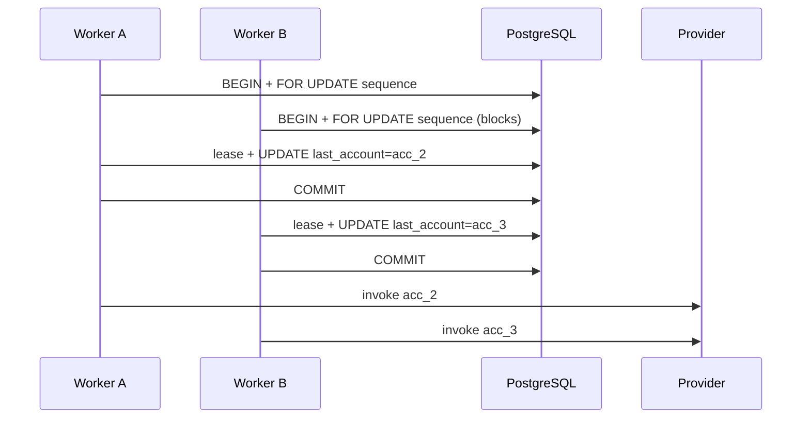
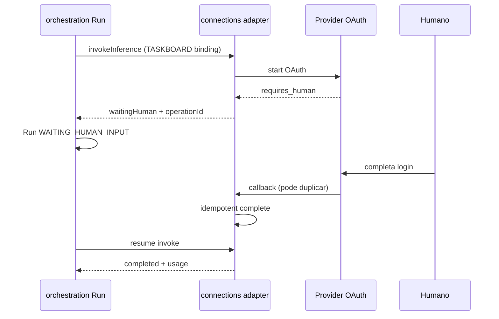

# R07 — Riscos: `modules/connections`

**Módulo:** connections (P05 Connections)  
**Rodada:** R7 — Registro de riscos, cenários adversariais e preparação G4/G5  
**Pacote SDD:** P05  
**Data:** 2026-09-08  
**Issues:** ANX-83 · contrato P05: ANX-62 · gate implementação: ANX-36 · graph consumer: ANX-32  
**Pré-requisito:** [R06-dependencies.md](./R06-dependencies.md) · [R05-storage-pg.md](./R05-storage-pg.md) · `brain/project-docs/specs/005-connections-integration/spec.md`

## Participantes

| Papel | Agente |
| --- | --- |
| Orquestrador | CTO orchestrator |
| Arquiteto | architect |
| Executor | code-architect |
| Crítico | critic-reviewer |
| Code Review | code-reviewer |
| QA | QA |
| Security | security-reviewer |
| Red Team | Red Team (Ryn) |

Roster obrigatório: [DEBATE-ROSTER.md](../../DEBATE-ROSTER.md).

## Objetivo da rodada

Fechar o registro de riscos de **connections** após [R06-dependencies.md](./R06-dependencies.md): matriz de ameaças (likelihood × impact), controles **SSRF/EndpointPolicy**, corrida de quota **PLATFORM** (DL-CX2), estado **UNKNOWN** e reconciliação, **WAITING_HUMAN_INPUT** com integração taskboard/orchestration, vetores de vazamento de secret, cross-tenant e privilege escalation, degradação cascata upstream (governance + organizations), mitigações mapeadas a testes **G4/G5**, top 5 riscos residuais e handoff **R08**.

## Fontes aplicadas

| Fonte | Uso em R7 |
| --- | --- |
| [R06-dependencies.md](./R06-dependencies.md) | RK-CX-R06-*, perguntas abertas R07, ports upstream |
| [R05-storage-pg.md](./R05-storage-pg.md) | `connections_reconciliation_cases`, dispatch sequence, quota leases |
| [R04-contracts-events.md](./R04-contracts-events.md) | `CX_INFERENCE_TIMEOUT`, `connections.call.unknown.v1`, consumerKind |
| [R03-domain-sketch.md](./R03-domain-sketch.md) | CX-R03-06 fairness, ports, invariantes |
| [R02-boundaries.md](./R02-boundaries.md) | CX-R02-SEC-*, RK-CX-01/02, EndpointPolicy |
| [orchestration/R07-risks.md](../../structure-debate/orchestration/R07-risks.md) | Formato registro L×I, checklist G5, mirror taskboard |
| [agents/R07-risks.md](../../structure-debate/agents/R07-risks.md) | Top 5, controles G5 numerados |
| [organizations/R07-risks.md](../organizations/R07-risks.md) | Cross-tenant, RLS P-R5-03, fail-closed upstream |
| `brain/project-docs/specs/005-connections-integration/spec.md` | EndpointPolicy, DL-CX2, CX04, fairness PLATFORM |
| `brain/project-docs/specs/002-agents-knowledge/spec.md` | AP04 WAITING_HUMAN_INPUT |

## Debate R7 (diálogo atribuído)

**Security:** O vetor crítico v1 é **SSRF via adapter MODEL/OAuth** — `EndpointPolicy` deve resolver DNS, bloquear metadata/private ranges e nunca seguir redirect com credential para host não aprovado (spec 005). HealthProbe com budget mínimo; sem pull implícito de pesos.

**Red Team:** Segundo vetor: **race quota PLATFORM** — dois workers lendo `last_ai_account_id` stale antes do commit da sequência global escolhem a mesma conta. DL-CX2 exige UPDATE `connections_platform_dispatch_sequences` + INSERT lease na **mesma transação** com `SELECT … FOR UPDATE`.

**Crítico:** Terceiro: **UNKNOWN** após timeout — invoke incerto não pode fechar billing nem liberar lease silenciosamente. `connections.call.unknown.v1` abre caso reconcile; worker fecha com `connections.reconciled.v1` ou void usage.

**Arquiteto:** **WAITING_HUMAN_INPUT** (AP04): orchestration mantém estado Run; connections executa adapter TASKBOARD/MODEL — idempotência por `issueIdentifier` + `idempotencyKey`, espelhando padrão mirror orchestration (ORCH-R07-01). connections **não** move issue no board.

**Executor:** **SecretPort stub** em prod é RK crítico — gate ANX-36 exige health `secrets.ready` antes de rotas invoke. Valor de credencial só em boundary `infrastructure/adapters/*` após grant+epoch.

**Síntese Orquestrador:** Registro R-CX-* fechado; decisões CX-R07-01..10; handoff R08 decision-log.

---

## Registro de riscos

Severidade = likelihood × impact (escala 1–5). **Top 5** na seção dedicada.

| ID | Risco | L | I | Sev | Mitigação (resumo) | Gate |
| --- | --- | ---: | ---: | ---: | --- | --- |
| **R-CX-01** | SSRF via adapter MODEL/OAuth — URL interna, metadata, redirect malicioso | 4 | 5 | **20** | EndpointPolicy: DNS resolve, blocklist RFC1918/link-local, redirect sem credential | G4, G5 |
| **R-CX-02** | Race quota PLATFORM — dois dispatches na mesma conta (DL-CX2) | 4 | 4 | **16** | TX única: `FOR UPDATE` sequence + lease + `last_account_id` | G3, G5 |
| **R-CX-03** | SecretPort stub em produção — credencial fixture vaza | 3 | 5 | **15** | Gate `secrets.ready`; startup fail se stub em `NODE_ENV=production` | G4, G5 |
| **R-CX-04** | Invoke UNKNOWN — billing/usage gap ou dupla cobrança | 3 | 5 | **15** | `connections.call.unknown.v1` + reconcile worker; usage ESTIMATED até resolved | G3, G5 |
| **R-CX-05** | Cross-tenant: `organizationId` ou `bindingId` de outra org | 3 | 5 | **15** | `OrganizationScopePort`; filtro obrigatório em repositórios | G4, G5 |
| **R-CX-06** | Header spoof `consumerKind=PLATFORM` sem grant | 3 | 5 | **15** | Derivar sessão/grant — CX-R04-03; nunca header cliente | G4, G5 |
| **R-CX-07** | Grant/epoch stale — binding ACTIVE após revoke | 3 | 4 | **12** | `GrantValidationPort` sem cache; `GovernanceEpochPort` em resolve | G4 |
| **R-CX-08** | Governance + organizations down simultâneo — invoke fail-open | 3 | 4 | **12** | Fail-closed `503`; circuit breaker; sem cache grant | G4, G5 |
| **R-CX-09** | Secret leak em evento/DTO/log/stream | 3 | 5 | **15** | CX-R02-SEC-*; `deltaRef` ObjectRef; redact observability | G4 |
| **R-CX-10** | Privilege escalation — invoke sem T01/capability | 3 | 5 | **15** | GrantValidation antes invoke; fail-closed | G4, G5 |
| **R-CX-11** | WAITING_HUMAN_INPUT duplicado — callback/taskboard replay | 3 | 3 | **9** | Idempotência `issueIdentifier` + `idempotencyKey`; orchestration dono Run | G3, G5 |
| **R-CX-12** | Quota lease stale — worker reaper libera lease ativo | 2 | 4 | **8** | Fencing token CX04; reaper só `expires_at < now()` | G3 |
| **R-CX-13** | billing duplica usage — consumer não idempotente | 2 | 4 | **8** | `usageRecordId` unique; evento idempotente | G3 |
| **R-CX-14** | graph:connections:v1 atrasado — traverse T16 stale | 3 | 3 | **9** | PG autoritativo; lag métrica; não dual-write | G3 |
| **R-CX-15** | Adapter registry aceita `LIVE_TRADING` / REAL_EXECUTION | 2 | 5 | **10** | Enum fechado + teste CX-R02-INV-01..03 | G4 |
| **R-CX-16** | HealthProbe DoS — pull modelo gigante | 2 | 3 | **6** | Budget/quota probe; sem download implícito | G4 |
| **R-CX-17** | OAuth credential segue redirect host não aprovado | 3 | 5 | **15** | CX-R02-SEC-05; EndpointPolicy redirect chain | G4, G5 |
| **R-CX-18** | Inference stream vaza prompt/transcript | 3 | 4 | **12** | `deltaRef` only; scan CI payloads | G4 |
| **R-CX-19** | AGENCY pool cursor race (owner-provider-pools) | 2 | 3 | **6** | Row lock + revision check; paridade PLATFORM | G3 |
| **R-CX-20** | UoW rollback — PG commit sem outbox | 2 | 5 | **10** | Transação única eventing; teste AR01 | G3 |

**Legenda:** L = likelihood, I = impact, Sev = L×I.

### Top 5 riscos (prioridade G5 → R08)

| Rank | ID | Sev | Tema |
| ---: | --- | ---: | --- |
| 1 | **R-CX-01** | 20 | SSRF / EndpointPolicy |
| 2 | **R-CX-02** | 16 | Quota race PLATFORM (DL-CX2) |
| 3 | **R-CX-03** | 15 | SecretPort stub em prod |
| 4 | **R-CX-04** | 15 | UNKNOWN invoke / reconcile |
| 5 | **R-CX-05** | 15 | Cross-tenant binding access |

---

## Matriz de ameaças (likelihood × impact)

| Impact → | 1 Negligível | 2 Baixo | 3 Médio | 4 Alto | 5 Crítico |
| --- | --- | --- | --- | --- | --- |
| **L5 Quase certo** | — | — | — | — | — |
| **L4 Provável** | — | — | — | R-CX-14 | **R-CX-01** |
| **L4 Provável** | — | — | R-CX-02 | — | — |
| **L3 Possível** | — | R-CX-11 | R-CX-07, R-CX-08 | R-CX-18 | R-CX-03,04,05,06,09,10,17 |
| **L2 Improvável** | — | R-CX-16 | R-CX-19 | R-CX-12,13 | R-CX-15,20 |
| **L1 Raro** | — | — | — | — | — |

**Zonas:**

- **Vermelho (Sev ≥ 15):** tratamento obrigatório antes G1 — R-CX-01..06, 09, 10, 17.
- **Amarelo (Sev 9–14):** controles documentados + testes G4; G5 para cenários adversariais.
- **Verde (Sev ≤ 8):** monitorar; testes G3 suficientes v1.

---

## Decisões-chave de risco

| ID | Decisão | Direção | Evidência / nota |
| --- | --- | --- | --- |
| **CX-R07-01** | `EndpointPolicy` obrigatório em todo adapter HTTP/OAuth/MODEL — resolve DNS, valida cert, blocklist metadata/private | fail-closed network | spec 005; R-CX-01 |
| **CX-R07-02** | Fairness PLATFORM: UPDATE `connections_platform_dispatch_sequences` + INSERT `connections_quota_leases` na **mesma transação** com row lock | atomic DL-CX2 | CX-R03-06, CX-R05-03 |
| **CX-R07-03** | Timeout invoke → status `unknown` + `connections.call.unknown.v1` — **não** emitir `completed` nem void usage sem reconcile | UNKNOWN policy | R-CX-04; CX-R04-03 |
| **CX-R07-04** | Reconcile worker: política 24h SLA; resoluções `succeeded` \| `failed` \| `void_usage` → `connections.reconciled.v1` | ops | R09 worker |
| **CX-R07-05** | WAITING_HUMAN_INPUT: connections adapter retorna `waitingHuman` + `operationId`; orchestration persiste Run; sync TASKBOARD por `issueIdentifier` idempotente | boundary AP04 | não move board |
| **CX-R07-06** | `consumerKind` derivado de grant/sessão — header `X-Consumer-Kind` **ignorado** | anti-spoof | CX-R04-03 |
| **CX-R07-07** | Governance **ou** organizations indisponível em mutação/invoke → `503` fail-closed — sem modo degradado | cascade | R-CX-08 |
| **CX-R07-08** | SecretPort stub permitido **somente** `NODE_ENV !== production` e `ALLOW_SECRETS_STUB=true` documentado | gate ANX-36 | R-CX-03 |
| **CX-R07-09** | RLS PostgreSQL v1 **não** obrigatório — compensação application guards + G5 cross-tenant (paridade CX-R06-12) | adiado R08 | organizations P-R5-03 |
| **CX-R07-10** | Checklist G5 abaixo é **gate obrigatório** pré-G1 connections | G5 prep | sandbox local |

---

## Deep dive — SSRF e EndpointPolicy (R-CX-01, R-CX-17)

**Risco:** Adapter MODEL, OAuth ou health probe aceita URL controlada pelo atacante (`169.254.169.254`, `10.0.0.1`, redirect chain) e exfiltra metadata ou credential.

**Controles propostos (spec 005 §EndpointPolicy):**

| Camada | Controle |
| --- | --- |
| Resolve | DNS lookup antes de connect; rejeitar múltiplos A records suspeitos |
| Protocolo | HTTPS only em prod; `http://` só SIMULATED com allowlist explícita |
| Rede | Blocklist RFC1918, link-local, metadata IPs; private range só com admin allowlist versionada |
| Redirect | Máx 3 hops; **credential strip** em redirect; re-validar EndpointPolicy em cada hop |
| Certificado | Pin ou CA bundle configurado; não `rejectUnauthorized: false` em prod |
| HealthProbe | Budget/quota dedicado; timeout 5s; sem download de artefato > threshold |
| Adapter registry | `effect_class` allowlist — sem endpoint arbitrary em `READ_ONLY` sem policy |

```typescript
/** domain/ports/endpoint-policy.ts (proposto) */
export interface EndpointPolicyPort {
  assertAllowedUrl(url: string, context: EndpointContext): Promise<ResolvedEndpoint>;
  assertRedirectAllowed(from: string, to: string, context: EndpointContext): Promise<void>;
}
```

**Cenário G5 — SSRF:**

| Passo | Ação adversária | Resultado esperado |
| --- | --- | --- |
| 1 | Binding MODEL com baseUrl `http://169.254.169.254/` | `CX_ENDPOINT_DENIED` na ativação ou invoke |
| 2 | Redirect 302 para host interno após OAuth | Credential **não** enviada; redirect rejeitado |
| 3 | DNS rebinding (dois resolves) | Policy re-resolve no connect |

---

## Deep dive — Quota race PLATFORM (DL-CX2) (R-CX-02)

**Risco:** Dois workers PLATFORM simultâneos leem `last_ai_account_id` e `sequence` antes do commit — ambos despacham para a mesma conta, violando alternância e possivelmente excedendo quota.

**Controles (CX-R07-02):**

| Passo | Operação | Lock |
| --- | --- | --- |
| 1 | `SELECT … FROM connections_platform_dispatch_sequences WHERE id = 'platform_global' FOR UPDATE` | row lock |
| 2 | Filtrar contas elegíveis; excluir `last_ai_account_id`; LRU + desempate estável por ID | — |
| 3 | `INSERT connections_quota_leases` com `fencing_token` | mesma TX |
| 4 | `UPDATE sequence = sequence + 1, last_ai_account_id = :chosen` | mesma TX |
| 5 | COMMIT antes de HTTP invoke ao provider | — |

**Anti-padrão proibido:** ler sequence em TX separada do lease; cache SQLite para fairness (CX-R05-06).

**Teste G5 — DL-CX2:**

- 20 invokes PLATFORM paralelos, 3 contas elegíveis → nenhum par escolhe mesma conta no mesmo `sequence` tick; `last_ai_account_id` alterna conforme política.
- Replay idempotente mesmo `idempotencyKey` → mesma conta, sem segundo lease.



---

## Deep dive — UNKNOWN e reconciliação (R-CX-04)

**Risco:** Timeout, reset TCP ou resposta parcial deixa invoke em estado incerto — billing não fecha, lease não libera, ou dupla cobrança em retry.

**Política v1 (CX-R07-03, CX-R07-04):**

| Estado | Trigger | Ação |
| --- | --- | --- |
| `pending` → `streaming` | Invoke iniciado | Lease ativo |
| `streaming` → `completed` | Terminal sucesso | `usage.recorded` RECONCILED |
| `streaming` → `failed` | Terminal erro | `inference.failed`; lease release |
| `*` → `unknown` | Timeout, incerteza adapter | `connections.call.unknown.v1`; INSERT `connections_reconciliation_cases` |
| `unknown` → resolved | Reconcile worker | Provider poll / idempotency provider / void → `connections.reconciled.v1` |

**Reconcile worker (`connections-usage-reconciler`):**

| Resolução | Efeito |
| --- | --- |
| `succeeded` | Completar request; emitir `completed` + usage se ausente |
| `failed` | `inference.failed`; release lease |
| `void_usage` | VOID usage ESTIMATED; release lease |
| SLA | Alerta se caso `open` > 24h |

**Retry antes de envio** não avança sequence PLATFORM (spec 005). **Envio incerto** conta como despachado — exige UNKNOWN, não retry silencioso.

---

## Deep dive — WAITING_HUMAN_INPUT e taskboard (R-CX-11)

**Risco (AP04):** Provider exige login humano; callback duplicado ou falha parcial espelha taskboard/orchestration — double resume ou Run stuck.

**Fronteira:**

| Responsável | Papel |
| --- | --- |
| **orchestration** | Estado Run `WAITING_HUMAN_INPUT`; correlação `taskId`/`runId` |
| **connections** | Adapter TASKBOARD/MODEL executa sync; retorna `waitingHuman: true` + `operationId` |
| **Dashi taskboard** | Issue `in_progress` / comentários humanos — orchestration mirror (ORCH-R07-01) |

**Controles (CX-R07-05):**

| Controle | Detalhe |
| --- | --- |
| Idempotência | `(organizationId, issueIdentifier, idempotencyKey)` em adapter TASKBOARD |
| connections | **Não** chama `taskctl move` — apenas lê status via port ou callback OAuth |
| Callback duplicado | Segundo callback com mesmo `operationId` → replay sem segundo side effect |
| Secret | Nunca solicitar senha no prompt; humano completa via UI provider segura |
| Resume | orchestration re-invoca `invokeInference` com mesmo `idempotencyKey` ou chave derivada documentada |



---

## Deep dive — Secret leak, cross-tenant, privilege escalation

### Vetores de vazamento de secret (R-CX-03, R-CX-09)

| Vetor | Mitigação | Teste |
| --- | --- | --- |
| DTO/evento `apiKey`, `token` | CX-R02-SEC-01..02; Zod strip | G4 contract snapshot |
| Log/trace observability | Redact `secret_id`, tokens; category `connections` | G4 log scan |
| `connections_command_journal.response_snapshot` | Sem secret value | G4 |
| Stream `inference.stream.v1` | `deltaRef` ObjectRef — audit dono | G4 |
| Neo4j projeção | Sem secret em nó — CX-R02-SEC-03 | graph G2 |
| Error message provider | Sanitize adapter `classifyError` | G5 |
| SecretPort stub prod | CX-R07-08 startup gate | G5 |

### Cross-tenant (R-CX-05, R-CX-06)

| Vetor | Controle |
| --- | --- |
| `bindingId` de outra org | `OrganizationScopePort.assertActiveOrganization` + repo `WHERE organization_id = :sessionOrg` |
| List bindings sem filtro | Proibido `findAll`; queries sempre scoped |
| `consumerKind=PLATFORM` via header | Ignorar header; derivar grant |
| Admin route sem T01 | `connections.platform_admin` + governance plugin na api |

### Privilege escalation (R-CX-07, R-CX-10)

| Vetor | Controle |
| --- | --- |
| Invoke com binding ACTIVE mas grant revogado | `GrantValidationPort` + epoch em **cada** resolve — sem cache |
| Ativar binding sem capability | `requiredCapabilities` no validate |
| Bypass governance via import infra | AR01 — adapter só exports públicos |
| SIMULATED adapter em org sem entitlement | OrganizationScope + offering readiness |

---

## Deep dive — Degradação cascata upstream (R-CX-08)

**Risco:** Governance timeout + organizations 503 simultâneo — implementação incorreta poderia usar binding cache ou último epoch conhecido (fail-open).

| Upstream | Invoke | Mutação binding |
| --- | --- | --- |
| governance down | `503 CX_GOVERNANCE_UNAVAILABLE` | `503` — não ativar |
| organizations down | `503 CX_ORG_SCOPE_UNAVAILABLE` | `503` |
| identity down (RegisterAIAccount) | `503` ou `CX_GRANT_INVALID` se principal | `503` |
| Ambos down | `503` — circuit breaker opcional R09 | `503` |

**Métricas obrigatórias G1:** `cx_grant_validation_duration_ms`, `cx_upstream_unavailable_count{source}`.

**Decisão CX-R07-07:** nenhum fallback “último grant válido” entre requests.

---

## Mitigações mapeadas a testes (G4 / G5)

### G4 — Security Team

| ID teste | Risco | Comando / artefato | Assert |
| --- | --- | --- | --- |
| **G4-CX-01** | R-CX-01 | `connections-contracts.test.ts` EndpointPolicy unit | metadata URL denied |
| **G4-CX-02** | R-CX-09 | Snapshot todos `connectionsEventPayloadSchema` | sem chaves proibidas |
| **G4-CX-03** | R-CX-15 | `effectClassSchema` | `LIVE_TRADING` reject |
| **G4-CX-04** | R-CX-05 | Integration scope adapter | cross-org → 403 |
| **G4-CX-05** | R-CX-07 | Grant validate mock revoke | `CX_EPOCH_STALE` |
| **G4-CX-06** | R-CX-03 | Composition bootstrap test | prod + stub → startup fail |
| **G4-CX-07** | R-CX-06 | HTTP invoke header spoof | `consumerKind` ignored |
| **G4-CX-08** | AR01 | dependency-cruiser connections | sem `governance/infrastructure` |

### G5 — Red Team (sandbox local)

| ID cenário | Risco | Passos | Esperado |
| --- | --- | --- | --- |
| **G5-CX-01** | R-CX-01 | Invoke MODEL URL metadata | `CX_ENDPOINT_DENIED` |
| **G5-CX-02** | R-CX-02 | 20 parallel PLATFORM dispatch | DL-CX2 alternância |
| **G5-CX-03** | R-CX-04 | Kill adapter mid-stream | `unknown` + reconcile case |
| **G5-CX-04** | R-CX-05 | Cross-tenant GET binding | 403 `CX_SCOPE_DENIED` |
| **G5-CX-05** | R-CX-10 | Invoke pós-revoke grant | `CX_GRANT_INVALID` |
| **G5-CX-06** | R-CX-17 | OAuth redirect internal | credential não vaza |
| **G5-CX-07** | R-CX-11 | Duplicate human callback | single resume |
| **G5-CX-08** | R-CX-08 | Mock governance 503 | invoke fail-closed |
| **G5-CX-09** | R-CX-03 | Assert stub blocked prod profile | startup error |
| **G5-CX-10** | R-CX-02 | Idempotent replay invoke | mesmo `inferenceRequestId` |

---

## Resolução pendências R06

| # | Assunto R06 | Status R7 |
| --- | --- | --- |
| 1 | SSRF EndpointPolicy matriz | ✅ **R-CX-01**, CX-R07-01, §SSRF |
| 2 | Race quota PLATFORM DL-CX2 | ✅ **R-CX-02**, CX-R07-02, §quota |
| 3 | UNKNOWN / reconcile | ✅ **R-CX-04**, CX-R07-03/04 |
| 4 | WAITING_HUMAN_INPUT taskboard | ✅ **R-CX-11**, CX-R07-05 |
| 5 | Degradação cascata upstream | ✅ **R-CX-08**, CX-R07-07 |
| 6 | RLS vs application-only | ⏳ **CX-R07-09** — decisão formal R08 |

---

## Perguntas abertas → R08

| ID | Assunto | Notas |
| --- | --- | --- |
| **P-R7-01** | SLA reconcile UNKNOWN (24h proposto) — aceitar ou ajustar por kind | operations input |
| **P-R7-02** | Circuit breaker upstream — thresholds e half-open | R09 composition |
| **P-R7-03** | RLS defense-in-depth — reabrir CX-R06-12 com evidência G5 | paridade organizations |
| **P-R7-04** | EndpointPolicy admin allowlist — quem pode editar (platform_admin only?) | governance |
| **P-R7-05** | WAITING_HUMAN_INPUT — chave idempotência resume exata | orchestration sync |
| **P-R7-06** | Testes G5 automatizados CI sandbox | R09 dev-plan |
| **P-R7-07** | SINGLE_ACCOUNT_WAIT behavior sob deadline — erro vs queue | spec 005 edge |

---

## Critérios de aceite — R07

| # | Critério | Status |
| --- | --- | --- |
| AC-R07-01 | Registro R-CX-* com L/I/mitigação/gate | ✅ |
| AC-R07-02 | Matriz de ameaças likelihood × impact | ✅ |
| AC-R07-03 | Deep dive SSRF/EndpointPolicy | ✅ |
| AC-R07-04 | Deep dive quota PLATFORM DL-CX2 | ✅ |
| AC-R07-05 | Deep dive UNKNOWN + reconcile | ✅ |
| AC-R07-06 | Deep dive WAITING_HUMAN_INPUT + taskboard | ✅ |
| AC-R07-07 | Secret leak, cross-tenant, privilege escalation | ✅ |
| AC-R07-08 | Degradação cascata upstream | ✅ |
| AC-R07-09 | Mitigações mapeadas G4/G5 | ✅ |
| AC-R07-10 | Top 5 riscos + decisões CX-R07-* + perguntas R08 | ✅ |
| AC-R07-11 | Resolução seis perguntas abertas R06 | ✅ |

---

## Saída R7

✅ Registro de riscos v1 **aprovado** documentalmente para **R08 — Decision log** ([R08-decision-log.md](./R08-decision-log.md)).

**Próximo:** síntese CX-R01..R07, resolução P-R7-*, decisão formal RLS (P-R7-03), consolidação RB-D* numerados, gates ANX-36 pré-G1.

**Veredito R07:** checklist G4/G5 pronto para execução em sandbox pré-G1 — sem código `modules/connections` nesta rodada.
