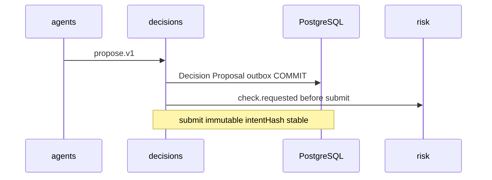

# R05 — Armazenamento: `modules/decisions`

**Rodada:** R5  
**Data:** 2026-09-11  
**Issues:** ANX-389 · ANX-97  
**Callers:** [R04-contracts-events.md](./R04-contracts-events.md) · [R06-dependencies.md](./R06-dependencies.md).  
ADR0004: PG autoritativo; Neo4j projector; SQLite rascunho **sem efeito**. ST08 **0/23**. **Sem migration.** Nomes de tabela documentais (alvo G1).

## In / Out (R5)

**In:** PG `decisions_*`, journal/outbox, grafo só ids.

**Out:** pasta `approvals/` (`governance`). SQLite com efeito. Migration live (ST08 0/23).

## Non-goals

Não spec `accepted`. Não ST08 live. Não ANX-389 `done`. Sem código de produto.

## Ownership

| Superfície | Dono |
| --- | --- |
| Store `decisions_*` | **decisions** |
| adapter-gateway | **KEEP** |

## Princípios

PG `decisions_*` verdade; journal/outbox mesma UoW; TradeIntent append-only pós-submit; grafo `graph:decisions:v1` só ids. Approvals institucionais permanecem em **governance** — este módulo não cria pasta `approvals/`.



## Tabelas (alvo G1)

| Tabela | Propósito |
| --- | --- |
| `decisions_records` | DecisionRecord; UNIQUE (org_id, decision_id) |
| `decisions_proposals` | Proposal vinculada; imutável pós-lock |
| `decisions_trade_intents` | TradeIntent append-only pós-submit; UNIQUE (org_id, intent_hash) |
| `decisions_dispositions` | Disposition + evidence hashes |
| `decisions_authority_refs` | grant/epoch refs (não duplica governance) |
| `decisions_command_journal` | command_id PK; owner_domain=decisions |

## Schema sketch (Drizzle v1)

```
decisions_records (id, org_id, status, authority_epoch, risk_epoch, idempotency_key, ...)
decisions_proposals (id, decision_id, org_id, proposer_principal, payload_hash, ...)
decisions_trade_intents (id, org_id, decision_id, intent_hash, status, reservation_ref, ...)
decisions_dispositions (id, intent_id, disposition_kind, evidence_manifest_hash, ...)
decisions_authority_refs (id, decision_id, grant_id, epoch, ...)
```

## Invariantes storage (`DC-R05-*`)

| ID | Regra |
| --- | --- |
| DC-R05-01 | Nenhum Decision/Intent autoritativo fora PostgreSQL |
| DC-R05-02 | Mutação + outbox mesma transação |
| DC-R05-03 | idempotency_key único por org |
| DC-R05-04 | TradeIntent append-only pós-submit |
| DC-R05-05 | SQLite rejeitado em CI |
| DC-R05-06 | owner_domain = decisions |
| DC-R05-07 | RLS defer P09 |

## Neo4j

propose → Agent-EVIDENCE-DECISION-INTENT (ids). Sem segundo writer.

## Alternativas rejeitadas

Decision em SQLite; intent só no grafo; pasta `approvals/`; FK que escreve `risk_permits`.

## Saída R5

Modelo v1 nomeado. Nenhuma migration. D-GOV-010 = risk P06.
