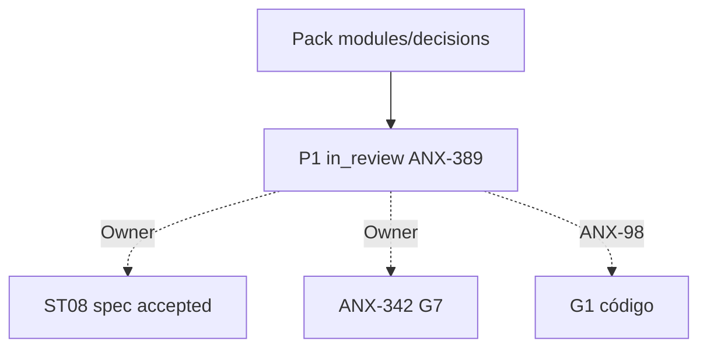

# R10 — Pacote G0 (handoff): `modules/decisions`

**Rodada:** R10  
**Data:** 2026-09-11  
**Issues:** ANX-389 (pack P1) · ANX-97 (debate histórico) · **ANX-98** (impl — **não** executada neste pack)  
**Callers:** [R09-dev-plan.md](./R09-dev-plan.md) · [ROUNDS.md](./ROUNDS.md). Sem código de produto. Specs 001–005 **draft**. ANX-342 permanece `todo`. D-GOV-010 = **risk P06**.

## Classificação epistemológica

| Afirmação | Status |
| --- | --- |
| Debate R01–R10 neste dir | fechado P1 documental |
| Specs 001–005 | **draft** (ST08 0/23) |
| ANX-342 | **todo** — não hijack |
| D-GOV-010 | **risk P06** — fora |
| Pasta approvals/policies | **não criar** — approvals vivem em governance |
| Código `backend/modules/decisions` | pack ≠ G1/G7 |

## In scope documental

| Área | Entrega |
| --- | --- |
| Domínio | DecisionRecord, Proposal, TradeIntent, Disposition, AuthorityRef |
| Contratos | `@anxionos/contracts/decisions/*` + eventos R04 |
| Persistência nomeada | PostgreSQL `decisions_records`, `decisions_proposals`, `decisions_trade_intents` append-only pós-submit, `decisions_dispositions`, `decisions_authority_refs`, `decisions_command_journal` UNIQUE (org_id, idempotency_key) |
| Grafo | projector `graph:decisions:v1` — agente→evidência→decisão→intent |
| API | `/v1/decisions` esboço R04 |
| Testes | G3-DC-* / G5-DC-* abaixo |

## Out of scope

| Item | Destino |
| --- | --- |
| Order / Fill | execution |
| RiskPermit / LimitPolicy | risk |
| Grant / ChangeProposal | governance |
| Neo4j driver | graph |
| D-GOV-010 | risk P06 |
| Spec accepted | Owner + checklist |
| ANX-342 G7 | Owner |
| G1 código ANX-98 | issue distinta |

## Non-goals

- Nenhuma migration ST08 neste pack.
- SQLite rascunho **sem efeito** — não é Decision autoritativa (DC-R05-01).
- Decisions **não** envia ordem nem reserva capital; só emite intent após precondições.
- Sem pasta `approvals/` / `policies/`.
- Submit sem risk/capital → reject (G3-DC-S2-06/07).

## Oráculos G3 / G5 (fecho do pack)

| ID | Gate | Esperado |
| --- | --- | --- |
| G3-DC-S2-01 | G3 | propose cria Decision |
| G3-DC-S2-02 | G3 | submit imutabilidade |
| G3-DC-S2-03 | G3 | cross-tenant reject |
| G3-DC-S2-04 | G3 | stale epoch reject |
| G3-DC-S2-05 | G3 | independent approver |
| G3-DC-S2-06 | G3 | premature submit sem risk → DC_SUBMIT_PRECONDITION |
| G3-DC-S2-07 | G3 | submit sem capital reservation → reject |
| G5-DC-01 | G5 | principal org-A referencia portfolio org-B → DC_CROSS_TENANT |
| G5-DC-02 | G5 | mesmo agente propõe e aprova → DC_INDEPENDENT_APPROVER_REQUIRED |
| G5-DC-03 | G5 | epoch bumped pós-APPROVED → DC_AUTHORITY_STALE |

## Critérios de aceite **deste** pack (P1 documental)

| # | Critério |
| --- | --- |
| AC-P1-01 | In/out/non-goals explícitos |
| AC-P1-02 | Oráculos G3/G5 nomeados |
| AC-P1-03 | Tabelas PG nomeadas em R05 + R10 |
| AC-P1-04 | Decision log R08 com P1-DC-* |
| AC-P1-05 | R09 **sem** greenlight G1 |

**Veredito P1:** G0 documental completo. **Não** autoriza G1. Próximo serial: [execution](../execution/ROUNDS.md).

## Saída R10

G0 debate P1 fechado. ANX-389 evidência — não G7. ANX-342 `todo`. Specs 001–005 **draft**.
