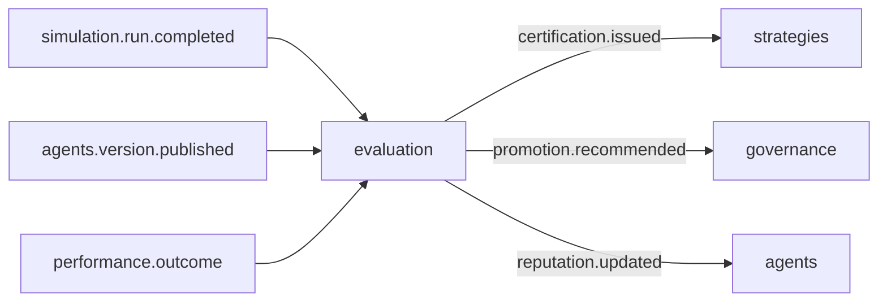

# R01 — Contexto: `modules/evaluation`

**Componente:** modules/evaluation  
**Rodada:** R1 — Inventário documental  
**Pacote SDD:** P08  
**Data:** 2026-09-11  
**Issue pack:** ANX-389 · debate módulo **ANX-109** · impl futura **ANX-110** (não neste pack)  
**Callers:** [R02-boundaries.md](./R02-boundaries.md) · [R10-g0-handoff.md](./R10-g0-handoff.md) · [ROUNDS.md](./ROUNDS.md). Sem API runtime.  
**Fonte PC 15:** `brain/notes/anxionos-pc15-testing-debate.md` (OpenKnowledge).  
**Storage:** `brain/notes/anxionos-storage-ownership.md` · ADR0004.

## Objetivo da rodada

Inventariar o bounded context de **avaliação, certificação, reputação e recomendação de promoção**. Fechar que CERTIFIED é o único caminho de promoção para strategies (D-ST-003). Specs 001–005 permanecem **draft**. ST08 **0/23** — não homologar engines neste pack. Não stamp `accepted`. Não G1.

## Propósito

Evaluation **pontua evidência** (SimulationRun completed, outcomes de performance, versões publicadas de agents) e **emite** Certification / ReputationScore / PromotionRecommendation. **Não** publica StrategyVersion, **não** corre Twin, **não** aplica ChangeProposal, **não** grava P&L.

## In / Out (R1)

**In:** eventos `simulation.run.completed.v1`, `performance.outcome.recorded.v1`, `agents.version.published.v1`; POST documental `/v1/evaluation/records` e `/v1/evaluation/certifications` (grant + T01); subject ids (StrategyVersion / AgentVersion) **sem** mutate; hashes de input; ScoringPolicy publicada.

**Out:** EvaluationRecord + Certification + ReputationScore + PromotionRecommendation em PG `evaluation_*` + journal + outbox; `evaluation.score.computed.v1`; `evaluation.certification.issued.v1` (strategies, graph, audit); `evaluation.reputation.updated.v1` (agents); `evaluation.promotion.recommended.v1` (governance). Projector `graph:evaluation:v1` (CERTIFIES).

**Não sai daqui:** `strategies.deployment.*`, apply de grant, `execution.order.*`, hypertable de P&L, dumps de Twin.

## O módulo POSSUI (estado)

ScoringPolicy, EvaluationRecord (`subjectKind` AGENT | STRATEGY), Certification (issued/revoked), ReputationScore, PromotionRecommendation (payload read-only para governance).

## O módulo NÃO POSSUI (ownership nomeado)

| Item | Dono correto |
| --- | --- |
| StrategyVersion / Deployment / Signal | **strategies** |
| SimulationRun / Twin / snapshot | **simulation** |
| Agent / AgentVersion / Skill | **agents** |
| Apply de ChangeProposal / grants | **governance** |
| P&L / attribution / Timescale | **performance** |
| Kill-switch / PolicyVersion RISK (D-GOV-010) | **risk** P06 |
| Driver Neo4j | **graph** |
| Pasta `testing/` | **proibido** — PC 15 composto |

## Non-goals

- Não auto-promote por score (só `certification.issued` → strategies consome).
- Não criar `testing/`, `approvals/`, `policies/`.
- Não SQLite autoritativo para Certification.
- Não REAL/live de trading (evaluation não emite ordem).
- Não executar migration; não fake ST08 live.
- Não done ANX-342 / ANX-389; não G1 ANX-110.

## Dependências (mapa R1)

| Direção | Componentes |
| --- | --- |
| Upstream | simulation, performance, agents (ids + eventos), identity, organizations, governance (T01), graph (TraversalEvaluator) |
| Downstream | strategies (CERTIFIED), governance (recommendation), agents (reputação), graph projector, audit |

## Armazenamento (mapa draft)

PostgreSQL autoritativo (`evaluation_*` + journal + outbox). Neo4j: **só** projeção `graph:evaluation:v1`. Object store: evidências volumosas por ObjectRef. Timescale de P&L: **não** neste módulo. SQLite: scratch local sem publicação. ST08 0/23.

## Spec / ADR

| Artefato | Papel | Status |
| --- | --- | --- |
| ADR0002 | módulo físico `evaluation/` | accepted |
| ADR0004 | PG + Neo4j; sem SQLite autoritativo | accepted |
| spec 001 envelope / tenancy | contratos institucionais | **draft** |
| spec 003 Strategy Factory / CERTIFIED | D-ST-003 | **draft** |
| spec 004 evolução / reputação | inputs | **draft** |
| PC 15 testing | composto — **sem pasta** | P1 |

## Estado do código

**Ausente** como bounded context completo. Este pack é G0 documental. ANX-110 não começa aqui.

## Oráculos (inventário R1 — não executados)

| ID | Gate | Esperado |
| --- | --- | --- |
| G3-EVL-01 | G3 | Re-score mesmo `commandId` não duplica record |
| G3-EVL-02 | G3 | Cert sem SimulationRun/subject válido → 409 EVL_SUBJECT_INVALID |
| G5-EVL-01 | G5 | Cross-tenant → 403 EVL_CROSS_TENANT |
| G5-EVL-02 | G5 | T01 DENY → 403; cert não emitida |

Evidência de engine = **não verificado** até G1 autorizado.

→ **R02** ([R02-boundaries.md](./R02-boundaries.md))
