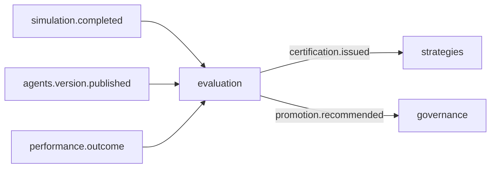

# R02 — Fronteiras: `modules/evaluation`

**Rodada:** R2 · P08 · ANX-109 · ANX-389  
**Callers:** [R01-context.md](./R01-context.md) · [R03-domain-sketch.md](./R03-domain-sketch.md). Sem API runtime. Instrução: fatten evaluation.

## POSSUI

EvaluationRecord (subjectKind AGENT|STRATEGY), Certification, ReputationScore, PromotionRecommendation (read-only p/ governance), ScoringPolicy.

## NÃO POSSUI

| Item | Dono |
| --- | --- |
| Backtest ticks / Twin | simulation |
| Strategy publish | strategies |
| Grant apply | governance |
| D-GOV-010 | risk P06 |
| Pasta testing/ | PC 15 composto |

## Non-goals

Auto-promote por score; REAL/live; pasta testing/; emitir `strategies.deployment.*`.

## Invariantes EVL-R02-INV-*

01 dono único · 02 só eventos · 03 SQLite não · 04 ownerDomain=evaluation · 05 CERTIFIED só via certification.issued · 06 recommendation ≠ apply · 07 D-GOV-010 não aqui.

→ **R03** ([R03-domain-sketch.md](./R03-domain-sketch.md))
