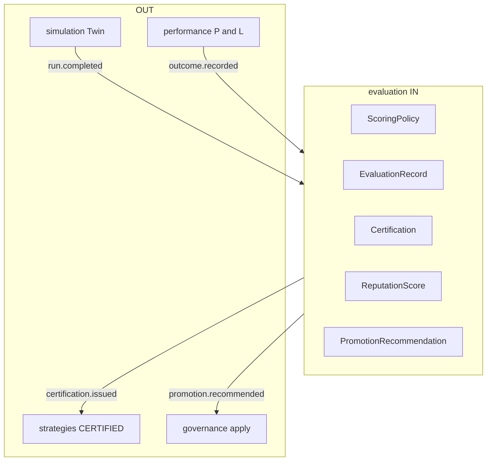

# R02 — Fronteiras: `modules/evaluation`

**Componente:** modules/evaluation  
**Rodada:** R2 — Scope boundary  
**Pacote SDD:** P08  
**Data:** 2026-09-11  
**Issue debate estrutura:** ANX-42 · debate módulo: **ANX-109** · pack: **ANX-389**  
**Callers:** [R01-context.md](./R01-context.md) · [R03-domain-sketch.md](./R03-domain-sketch.md) · [ROUNDS.md](./ROUNDS.md). Sem API runtime.

## Objetivo da rodada

Fechar **possui / não possui** entre evaluation e vizinhos (**strategies**, **simulation**, **agents**, **performance**, **governance**, **risk**, **graph**, **audit**); ratificar que score **não** promove; proibir pasta `testing/` e SQLite autoritativo.

## Fontes aplicadas

| Fonte | Uso em R2 |
| --- | --- |
| [R01-context.md](./R01-context.md) | Inventário |
| `brain/notes/anxionos-pc15-testing-debate.md` | PC 15 — sem 24º módulo |
| ADR0002 | dono físico |
| spec 003 | CERTIFIED só via certification.issued |
| ANX-109 | debate histórico |

## Debate R2 (síntese)

**Arquiteto:** evaluation é o motor de score/cert/reputação/recomendação. CERTIFIED é evento, não flag escrita em strategies.

**Crítico:** O que não entra? Twin, publish de versão, apply de ChangeProposal, P&L, D-GOV-010, pasta testing/.

**Security:** T01 em POST certificação; AgencyScope em todo comando; sem PII/secrets em eventos.

## O módulo POSSUI

EvaluationRecord, Certification, ReputationScore, PromotionRecommendation, ScoringPolicy.

## O módulo NÃO POSSUI

| Item | Dono correto |
| --- | --- |
| Backtest ticks / Twin / SimulationRun | **simulation** |
| Strategy publish / Deployment | **strategies** |
| Grant apply / ChangeProposal | **governance** |
| D-GOV-010 / kill-switch | **risk** P06 |
| P&L / hypertables | **performance** |
| Agent config | **agents** |
| Pasta testing/ | PC 15 composto — **sem pasta** |

## Non-goals

- Auto-promote por score.
- REAL/live de trading.
- Pasta `testing/`.
- Emitir `strategies.deployment.*` ou `execution.order.*`.
- Confirmar certificação em SQLite.
- D-GOV-010 neste módulo.

## In / Out (R2)

**In:** eventos de evidência (simulation completed, performance outcome, agents version published); comando score/certify com `commandId` + agency; TraversalEvaluator T01; AgencyScopePort.

**Out:** fatos `evaluation.*` no outbox; consumers strategies/governance/agents/graph/audit. **Não** mutate de estado alheio.

## Decisão: possui / não possui

| Dado / comportamento | Dono |
| --- | --- |
| ScoringPolicy, EvaluationRecord, Certification, Reputation, Recommendation | **evaluation** |
| StrategyVersion / Deployment | **strategies** |
| SimulationRun | **simulation** |
| P&L | **performance** |
| Apply de proposta | **governance** |

## Invariantes R02 (`EVL-R02-INV-*`)

| ID | Regra |
| --- | --- |
| EVL-R02-INV-01 | Dono único dos agregados R03 |
| EVL-R02-INV-02 | Cross-module só contrato/evento — sem FK cross-schema |
| EVL-R02-INV-03 | SQLite proibido para estado autoritativo |
| EVL-R02-INV-04 | `ownerDomain=evaluation` em comandos/eventos |
| EVL-R02-INV-05 | CERTIFIED só via `evaluation.certification.issued.v1` |
| EVL-R02-INV-06 | Recommendation ≠ apply |
| EVL-R02-INV-07 | D-GOV-010 **não** vive neste módulo |

## Oráculos

| ID | Gate | Esperado |
| --- | --- | --- |
| G3-EVL-04 | G3 | strategies ignora `score.computed` para promover |
| G5-EVL-03 | G5 | Recommendation não chama apply de ChangeProposal |

## Critérios de aceite — R02

| # | Critério | Status |
| --- | --- | --- |
| AC-R02-01 | Tabela possui/não possui com donos nomeados | ✅ documental |
| AC-R02-02 | CERTIFIED ≠ score-only | ✅ documental |
| AC-R02-03 | SQLite / testing/ / D-GOV-010 non-goals | ✅ documental |

→ **R03** ([R03-domain-sketch.md](./R03-domain-sketch.md))
