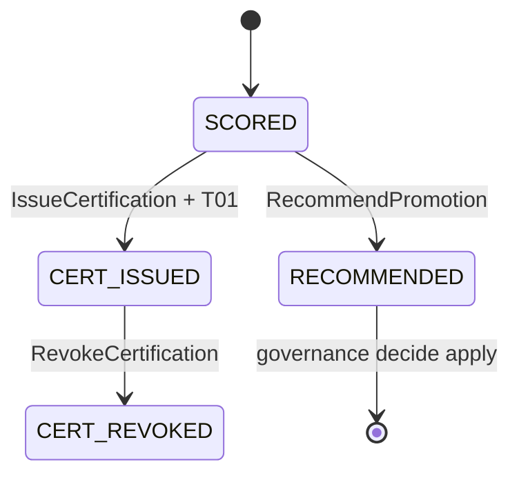

# R03 — Esboço de domínio: `modules/evaluation`

**Rodada:** R3 — Domain model  
**Data:** 2026-09-11  
**Issue pack:** ANX-389 · histórico ANX-109  
**Pré-requisito:** [R02-boundaries.md](./R02-boundaries.md) · PC 15  
**Callers:** [R04-contracts-events.md](./R04-contracts-events.md) · [ROUNDS.md](./ROUNDS.md). Sem schema de produção.

## Debate R3 (síntese atribuída)

**Arquiteto:** Cinco agregados v1 — `ScoringPolicy`, `EvaluationRecord`, `Certification`, `ReputationScore`, `PromotionRecommendation`.

**Executor:** `EvaluationUnitOfWork` (estado + journal + outbox). Consumers de simulation/performance/agents são application, não domain.

**Crítico:** PromotionRecommendation não muta strategies. Certification sem subject/run válido → rejeição. ScoringPolicy publicada é imutável (nova versão para alteração).

**Security:** T01 no certify; sem PII em ReputationScore; hashes de input, não dumps.

## In / Out (R3)

**In:** ScoringPolicy publicada (OP01–OP08); subjectKind + subjectId; hashes de SimulationRun/outcome; AgencyScopePort; TraversalEvaluator.

**Out:** EvaluationRecord persistido; Certification issued/revoked; ReputationScore versionada; PromotionRecommendation para governance. Sem Order, Grant apply, Twin mutate.

## Non-goals

- Não embutir TwinRunner neste módulo.
- Não persistir ticks nem P&L.
- Não `approvals/` como agregado.
- Não D-GOV-010.

## Agregado: ScoringPolicy

Política versionada de score (OP01–OP08). Status: draft | published | deprecated. Hash imutável após publish.

| Campo | Notas |
| --- | --- |
| id | ScoringPolicyId |
| revision | optimistic concurrency |
| policyHash | imutável após published |

**EVL-R03-00:** alterar pesos exige nova versão — não UPDATE in-place.

## Agregado: EvaluationRecord

Resultado de uma avaliação. `subjectKind` AGENT | STRATEGY. Input hashes (runId, outcomeId, versionId). UNIQUE lógica via journal `commandId`.

## Agregado: Certification

`issued | revoked`. Único caminho CERTIFIED para strategies.

**EVL-R03-01:** PromotionRecommendation não muta strategies.  
**EVL-R03-02:** Certification sem SimulationRun/agent version válida → rejeição (409 EVL_SUBJECT_INVALID).

## Agregado: ReputationScore

Versionada por subject; sem PII; não é grant.

## Agregado: PromotionRecommendation

Payload para governance. **Não** executa ChangeProposal.

## Ports (domain/)

| Port | Responsabilidade |
| --- | --- |
| EvaluationRepository | records |
| CertificationRepository | issued/revoked |
| ReputationRepository | scores versionadas |
| ScoringPolicyRepository | publish imutável |
| RecommendationRepository | recomendações |
| EvaluationUnitOfWork | estado + journal + outbox |
| AgencyScopePort | organizations |
| TraversalEvaluator | T01 `evaluation.*` |
| PrincipalLookup | identity |
| EventConsumerPort | simulation.completed, agents.version.published, performance.outcome |

## Comandos application

| Comando | Idempotência | Evento |
| --- | --- | --- |
| ScoreSubject | commandId | `evaluation.score.computed.v1` |
| IssueCertification | (subjectKind, subjectId, policyHash) | `evaluation.certification.issued.v1` |
| RevokeCertification | (certificationId, expectedRevision) | `evaluation.certification.revoked.v1` |
| UpdateReputation | (subjectId, policyHash) | `evaluation.reputation.updated.v1` |
| RecommendPromotion | commandId | `evaluation.promotion.recommended.v1` |

## Oráculos

| ID | Gate | Esperado |
| --- | --- | --- |
| G3-EVL-01 | G3 | Score idempotente (journal) |
| G3-EVL-02 | G3 | Cert sem run 409 |
| G5-EVL-02 | G5 | T01 DENY não emite cert |

## Saída R3

Modelo v1 aprovado para R4.
