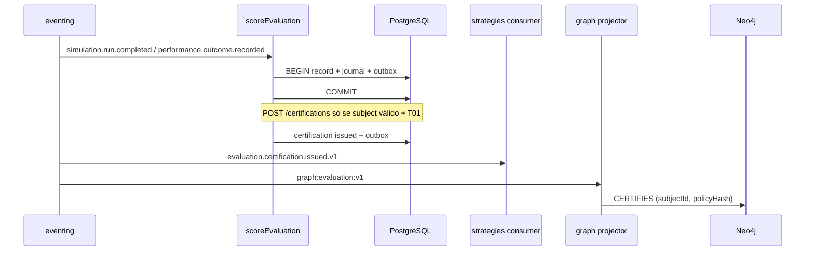

# R05 — Armazenamento: `modules/evaluation`

**Rodada:** R5 · 2026-09-11 · ANX-389 · debate ANX-109 · **não** impl ANX-110  
**Callers:** [R04-contracts-events.md](./R04-contracts-events.md) · [R06-dependencies.md](./R06-dependencies.md).  
**Fonte de engines:** `brain/notes/anxionos-storage-ownership.md` · `brain/project-docs/decisions/0004-postgresql-timescaledb-pgvector.md` · `brain/notes/anxionos-backend-structure.md` (P08).

## In scope (autoridade deste módulo)

| Engine | O que evaluation **possui** |
| --- | --- |
| PostgreSQL (OLTP) | Políticas de scoring, records, certificações, reputação versionada, recomendações de promoção, command journal |
| Journal + outbox | Mesma transação PG via `@anxionos/eventing` — fatos `evaluation.*` |
| Object store | Evidências volumosas **por ObjectRef** (não BYTEA de dumps de run) |
| Neo4j | **Só** via projector `graph:evaluation:v1` (CERTIFIES / qualidade / lineage de versão) |

## Out of scope (não gravar aqui)

| Dado | Dono |
| --- | --- |
| StrategyVersion / Deployment / hash de params | `strategies` |
| SimulationRun / snapshot / twin | `simulation` |
| P&L, outcomes, hypertables de série | `performance` (Timescale **lá**; evaluation **não** cria hypertable de P&L) |
| AgentVersion / instruction body | `agents` |
| Apply de ChangeProposal / grants | `governance` |
| Kill-switch / PolicyVersion RISK (D-GOV-010) | `risk` **P06** |
| Driver Neo4j | `graph` |
| Embeddings / pgvector | `knowledge` |

## Non-goals (P1 / este pack)

- Nenhuma **migration** executada; ST08 permanece **0/23** homologado neste mapa.
- SQLite **não** é EvaluationRecord/Certification autoritativo (só scratch local sem publicação).
- Pasta `testing/` **não** existe — 24º módulo proibido (PC 15).
- Auto-promote de StrategyVersion **proibido** (só `certification.issued` → strategies consome).
- Não stamp de spec `accepted`; não G1.

## Princípios de autoridade

| Princípio | Decisão |
| --- | --- |
| Fonte transacional | PostgreSQL `evaluation_*` |
| Grafo | Neo4j — consumer `graph:evaluation:v1`; sem métricas cruas nem P&L |
| FK cross-module | **Não** (subject ids + hashes, não FK para `strategies_*`) |
| Segredos em eventos / rows | **Proibido** |
| CERTIFIED | Somente após `evaluation.certification.issued.v1` |

## Fluxo score → certificação

## Tabelas PostgreSQL (modelo v1 — documental)

| Tabela | Propósito |
| --- | --- |
| `evaluation_policies` | ScoringPolicy versionada; hash imutável após publish |
| `evaluation_records` | EvaluationRecord; subject_kind + subject_id; UNIQUE (agency_id, command_id) via journal |
| `evaluation_certifications` | Certification; UNIQUE (subject_kind, subject_id, policy_hash) por emissão; status issued/revoked |
| `evaluation_reputation` | ReputationScore versionada por subject; não é grant |
| `evaluation_recommendations` | PromotionRecommendation; **não** aplica ChangeProposal |
| `evaluation_command_journal` | command_id PK, response_hash, idempotência HTTP |

Enums previstos: `evaluation_subject_kind` (strategy_version, agent_version, …), `evaluation_certification_status`, `evaluation_recommendation_status`.

**EVL-R05-01:** PostgreSQL é autoritativo; Timescale de P&L **não** neste módulo.  
**EVL-R05-02:** UnitOfWork = estado + journal + outbox atômicos.  
**EVL-R05-03:** RLS / isolamento AGENCY deferido P09 (contrato: AgencyScope em aplicação; não “RLS feito”).

## Neo4j (projeção)

| Evento | Nó / aresta |
| --- | --- |
| `evaluation.certification.issued.v1` | CERTIFIES (subject ids + policy hash + issuedAt) |
| `evaluation.reputation.updated.v1` | propriedades de qualidade no subject **projetado** (não ledger) |

Proibido no grafo: scores crus de tick, P&L, dumps de SimulationRun, secrets.

## Alternativas rejeitadas

Certification só no grafo; SQLite write path; hypertable `evaluation_pnl`; FK para `strategies_strategy_versions`; pasta `testing/` dona de fixtures de cert.

## Oráculos (armazenamento)

| ID | Gate | Esperado |
| --- | --- | --- |
| G3-EVL-01 | G3 | Re-score com mesmo `commandId` não duplica `evaluation_records` (journal) |
| G3-EVL-02 | G3 | Cert sem SimulationRun/subject completed → **não** INSERT em `evaluation_certifications` (409 EVL_SUBJECT_INVALID) |
| G3-EVL-03 | G3 | Crash pós-COMMIT: replay outbox não duplica CERTIFIES (dedupe projector) |
| G5-EVL-01 | G5 | Cross-tenant SELECT/INSERT → 403 EVL_CROSS_TENANT; zero row leak |
| G5-EVL-04 | G5 | Apagar SQLite local **não** altera certifications (ST04) |

## Saída R5

Modelo v1 fechado para R6. Sem migration neste pack.
