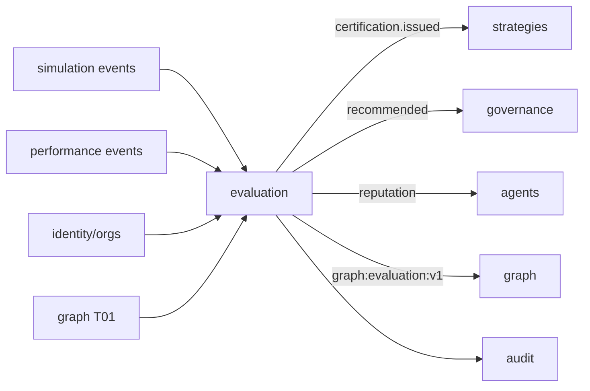

# R06 — Dependências: `modules/evaluation`

**Rodada:** R6 · 2026-09-11 · ANX-389 · ANX-109  
**Callers:** [R05-storage-pg.md](./R05-storage-pg.md) · [R07-risks.md](./R07-risks.md).  
**Fonte:** `brain/notes/anxionos-backend-structure.md` · ADR0002.

## In / Out (R6)

**In:** consumo de ids strategies/agents; eventos simulation/performance; grants para emitir cert.

**Out:** mutate StrategyVersion. Apply grant. Driver Neo4j (`graph`). Auto-promote.

## Non-goals

Não spec `accepted`. Não ST08 live. Não ANX-389 `done`. Sem código de produto.

## Ownership

| Superfície | Dono |
| --- | --- |
| Contratos evaluation.* | **evaluation** |
| adapter-gateway | **KEEP** |

## In scope (este módulo consome / emite)

| Direção | Módulo | Contrato |
| --- | --- | --- |
| Upstream ids | `strategies` | subject StrategyVersion **ids** (não mutate) |
| Upstream ids | `agents` | AgentVersion ids; reputação **evento** downstream |
| Eventos in | `simulation` | `simulation.run.completed.v1` |
| Eventos in | `performance` | `performance.outcome.recorded.v1` |
| Evidence refs | `knowledge` | ObjectRef / evidence ids |
| AuthZ | `identity` + `organizations` | PrincipalLookup, AgencyScope |
| AuthZ path | `governance` | grants para emitir cert; **não** apply |
| Traversal | `graph` | T01 no POST certificação |
| Mecanismo | `packages/eventing` | journal + outbox |

## Out of scope / imports proibidos

| Import | Motivo |
| --- | --- |
| `strategies/infrastructure/**` | ADR0002 — só contrato público / eventos |
| `simulation/infrastructure/**` | não puxar schema do twin |
| `neo4j-driver` | dono `graph` |
| `performance` schema Timescale | só evento de outcome |
| `testing/` | pasta **não existe** |

## Non-goals

- D-GOV-010 = corpo PolicyVersion em **`risk` P06**, não dependência de evaluation.
- Evaluation **não** é dono de Promotion apply (só `promotion.recommended` → governance).
- Não criar módulo `approvals/`.

## Downstream (consumidores)

| Consumidor | Evento |
| --- | --- |
| `strategies` | `evaluation.certification.issued.v1` — único caminho CERTIFIED (D-ST-003 / EVL-R04-01) |
| `governance` | `evaluation.promotion.recommended.v1` |
| `agents` | `evaluation.reputation.updated.v1` |
| `graph` | projector `graph:evaluation:v1` |
| `audit` | manifesto de certificação (cópia de evento, não segundo ledger) |

## Mapa

**EVL-R06-01:** application não importa infra alheia.  
**EVL-R06-02:** POST certificação exige T01 allow.  
**EVL-R06-03:** projector `graph:evaluation:v1` é o único writer Neo4j deste bounded context.  
**EVL-R06-04:** D-GOV-010 defer **risk P06**.  
**EVL-R06-05:** sem pasta `testing/`.

## Oráculos

| ID | Gate | Esperado |
| --- | --- | --- |
| G3-EVL-04 | G3 | Consumer strategies ignora `score.computed` para promover versão |
| G3-EVL-05 | G3 | boundaries test: import `simulation/infrastructure` falha |
| G5-EVL-02 | G5 | T01 DENY → 403; cert **não** emitida |
| G5-EVL-03 | G5 | Recommendation **não** chama apply de ChangeProposal |

## Saída R6

Mapa v1 fechado para R7.
