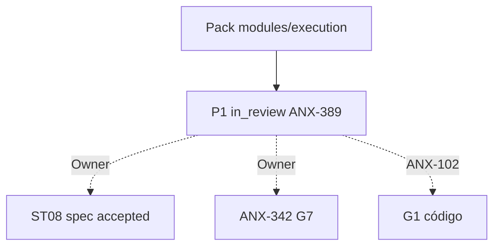

# R10 — Pacote G0 (handoff): `modules/execution`

**Rodada:** R10  
**Data:** 2026-09-11  
**Issues:** ANX-389 (pack P1) · ANX-101 (debate histórico) · **ANX-102** (impl — **não** executada neste pack)  
**Callers:** [R09-dev-plan.md](./R09-dev-plan.md) · [ROUNDS.md](./ROUNDS.md). Sem código de produto. Specs 001–005 **draft**. ANX-342 permanece `todo`. D-GOV-010 = **risk P06**.

## Classificação epistemológica

| Afirmação | Status |
| --- | --- |
| Debate R01–R10 neste dir | fechado P1 documental |
| Specs 001–005 | **draft** (ST08 0/23) |
| ANX-342 | **todo** — não hijack |
| D-GOV-010 | **risk P06** — fora |
| Pasta approvals/policies | **não criar** |
| Código `backend/modules/execution` | pack ≠ G1/G7 |

## In scope documental

| Área | Entrega |
| --- | --- |
| Domínio | ExecutionSession, Order, Fill, OrderAttempt, ReconciliationCase, VenueAdapterRef |
| Contratos | `@anxionos/contracts/execution/*` + eventos R04 |
| Persistência nomeada | PostgreSQL `execution_venue_adapter_ref` (sem secret), `execution_session`, `execution_order` UNIQUE (organization_id, client_order_id, venue_adapter_ref_id), `execution_fill` UNIQUE (organization_id, fill_id), `execution_order_attempt`, `execution_reconciliation_case`, `execution_outbox` |
| Grafo | projector `graph:execution:v1` — intent→session→order→fill |
| API | `/v1/execution` esboço R04 |
| Testes | G3-EX-* / G5-EX-* abaixo |

## Out of scope

| Item | Destino |
| --- | --- |
| Position / NAV | portfolios |
| Ledger | accounting |
| RiskPermit emissão | risk |
| Secrets de venue | connections |
| Neo4j driver | graph |
| D-GOV-010 | risk P06 |
| Spec accepted | Owner + checklist |
| ANX-342 G7 | Owner |
| G1 código ANX-102 | issue distinta |

## Non-goals

- Nenhuma migration ST08 neste pack.
- SQLite **não** é order/fill autoritativo.
- Execution **não** guarda `api_key`/`secret`/`token`.
- `executionMode=REAL` reject v1.
- Sem pasta `approvals/` / `policies/`.
- Submit sem RiskPermit → EX_PERMIT_BYPASS.

## Oráculos G3 / G5 (fecho do pack)

| ID | Gate | Esperado |
| --- | --- | --- |
| G3-EX-S2-01 | G3 | submit SIMULATED → order SUBMITTED + fill CONFIRMED |
| G3-EX-S2-02 | G3 | submit sem RiskPermit → EX_PERMIT_BYPASS |
| G3-EX-S2-03 | G3 | cross-tenant reservation → EX_CROSS_TENANT |
| G3-EX-S2-04 | G3 | duplicate clientOrderId → mesmo orderId |
| G3-EX-S2-05 | G3 | duplicate venueFillId → EX_DUPLICATE_FILL |
| G3-EX-S2-06 | G3 | executionMode REAL → EX_MODE_FORBIDDEN |
| G5-EX-01 | G5 | intent org-A + reservation org-B → EX_CROSS_TENANT |
| G5-EX-02 | G5 | RiskPermit CONSUMED replay → EX_PERMIT_BYPASS |
| G5-EX-03 | G5 | fill duplicado venueFillId |
| G5-EX-04 | G5 | Order sem ExecutionPermit → EX_PERMIT_STALE |
| G5-EX-05 | G5 | secret inline no payload → EX_CONFIG_REQUIRED |

## Critérios de aceite **deste** pack (P1 documental)

| # | Critério |
| --- | --- |
| AC-P1-01 | In/out/non-goals explícitos |
| AC-P1-02 | Oráculos G3/G5 nomeados |
| AC-P1-03 | Tabelas PG nomeadas em R05 + R10 |
| AC-P1-04 | Decision log R08 com P1-EX-* |
| AC-P1-05 | R09 **sem** greenlight G1 |

**Veredito P1:** G0 documental completo. **Não** autoriza G1. Próximo serial: [portfolios](../portfolios/ROUNDS.md).

## Saída R10

G0 debate P1 fechado. ANX-389 evidência — não G7. ANX-342 `todo`. Specs 001–005 **draft**.
