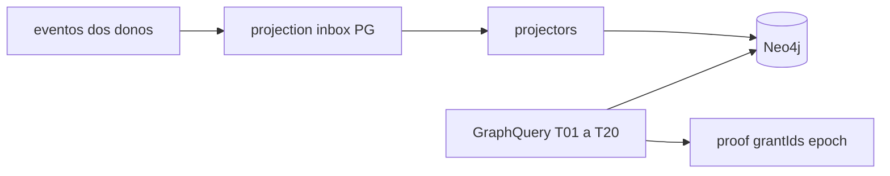

# R01 — Contexto: `modules/graph`

**Módulo:** graph (P03 Kernel)  
**Rodada:** R1  
**Data:** 2026-09-11  
**Após packs:** [agents](../agents/ROUNDS.md) · [orchestration](../orchestration/ROUNDS.md)  
**PC:** [09](../../../../notes/anxionos-pc09-graph-debate.md)  
**Histórico:** [structure R01](../../structure-debate/graph/R01-context.md)

## Objetivo

Graph Kernel projeta e consulta. **Não** é ledger. Journal permanece nos donos. ADR0004: Neo4j kernel + PG catálogo/rebuild/inbox.

## Inventário

| Fonte | Uso |
| --- | --- |
| estrutura ADR0002 | regras 1–12 Graph Kernel |
| storage map | PG catálogo; Neo4j projeção |
| spec 001 | T01–T20 |
| APIs no dir | [node.get](./node-get-neighbors-api-v1.md) · [T01-T05](./t01-t05-fixtures-v1.md) |
| ficha | [graph.md](../../system-capabilities/modules/graph.md) |

Código `backend/modules/graph` pode existir (Parcial). Pack não autoriza G1 novo.

## Saída R1

Para R2.
