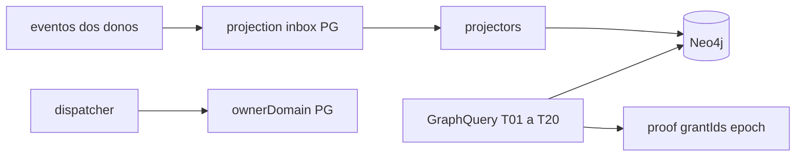

# R01 — Contexto: `modules/graph`

**Módulo:** graph (P03 Kernel)  
**Rodada:** R1 — Inventário documental  
**Data:** 2026-09-11  
**Issue pack:** ANX-389 · histórico ANX-41 / ANX-43  
**Após packs:** [agents](../agents/ROUNDS.md) · [orchestration](../orchestration/ROUNDS.md)  
**PC:** [09](../../../../notes/anxionos-pc09-graph-debate.md)  
**Histórico:** [structure R01](../../structure-debate/graph/R01-context.md)  
**Ficha:** [graph.md](../../system-capabilities/modules/graph.md)  
**Callers:** [ROUNDS.md](./ROUNDS.md) · [R02-boundaries.md](./R02-boundaries.md)

**KEEP adapter-gateway** se já exportado. Pack ANX-389 — não `done`.

## In / Out (R1)

**In:** inventário Graph Kernel (projetor + query). **Out:** contexto R2. **Não** ledger, D-GOV-010, specs accepted.

## Non-goals

Não spec `accepted`. Não ST08 live. Não ANX-389 `done`. Sem código de produto.

## Ownership

| Superfície | Dono |
| --- | --- |
| Projector / GraphQuery | **graph** |
| adapter-gateway | **KEEP** |
| Journal dos agregados | **módulo dono** |

## Objetivo

Graph Kernel **projeta e consulta**. Não é ledger. Journal permanece nos donos. ADR0004: Neo4j = kernel operacional; PostgreSQL = catálogo Txx, inbox, rebuild, DLQ. Specs 001–005 permanecem **draft** (ST08 0/23). D-GOV-010 **não** é deste módulo (risk P06). ANX-342 **não** done.

## O módulo POSSUI

- Catálogo T01–T20 e registry `nodeType`/`edgeType` versionados
- Query plane (GraphQuery) + authorization/context traversals
- Projection inbox, checkpoints, rebuild control, DLQ
- Adapter Neo4j **privado** (nós, arestas, marcadores `eventId`/`checkpoint`/`ownerDomain`)
- Dispatcher `node.create`/`node.update` — roteia ao `ownerDomain`, não persiste negócio

## O módulo NÃO POSSUI

| Item | Dono |
| --- | --- |
| Grants / authorityEpoch | governance |
| Capital / reserva | capital |
| Ordem / fill | execution |
| Goal / Task / Run | orchestration |
| AgentVersion | agents |
| Journal dos donos | cada módulo + eventing |
| Embeddings | knowledge (pgvector) |
| Credencial Neo4j para agentes | **proibido** (AR04) |

## Non-goals

- Sem pasta `approvals/` ou `policies/`
- Sem 24º módulo adapter-gateway
- Sem Cypher ad hoc em clientes ou outros módulos
- Pack documental **≠** G7 de código nem spec `accepted`

## Inventário documental

| Fonte | Uso |
| --- | --- |
| ADR0002 / estrutura | Graph Kernel, regras 1–12 |
| `brain/notes/anxionos-storage-ownership.md` | PG catálogo; Neo4j projeção; SQLite **proibido** para T01 |
| spec 001 (draft) | API Graph Kernel, T01–T20 |
| `brain/notes/anxionos-graph-schema-v1.md` | tipos, envelope, invariantes |
| `brain/notes/anxionos-graph-traversals-v1.md` | planos T01–T20 |
| APIs neste dir | [node.get](./node-get-neighbors-api-v1.md) · [T01–T05](./t01-t05-fixtures-v1.md) — **draft** |

## Inventário de código (snapshot P1)

`backend/modules/graph` pode existir (Parcial: projectors organizations/governance/agents). **Não** é DEV_READY. Este pack **não** autoriza G1 novo.

## Debate R1 (síntese)

**Arquiteto:** Kernel = projetor + query plane + dispatcher. Neo4j reconstruível a partir do journal dos donos.

**Crítico:** grafo stale nunca é ALLOW. Código existente não torna desvio padrão.

**Security:** único adapter Neo4j; agentes zero credencial.

**Orquestrador:** R1 fecha inventário. Structure-debate permanece histórico.

## Saída R1

Para [R02](./R02-boundaries.md).
