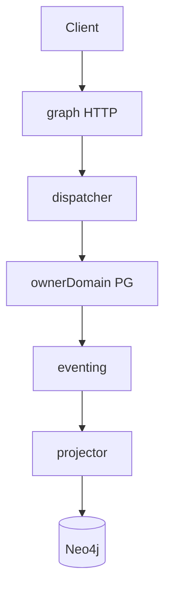

# R02 — Fronteiras: `modules/graph`

**Rodada:** R2  
**Data:** 2026-09-11  
**Issue programa:** ANX-389  
**Normativo histórico:** [structure R02](../../structure-debate/graph/R02-boundaries.md) (GK-R02-01..05)

## Debate R2

**Arquiteto:** Kernel = projetor + query plane + dispatcher. Neo4j reconstruível. PostgreSQL dos donos permanece autoritativo.

**Crítico:** grafo stale nunca é ALLOW. Cypher ad hoc proibido (GK02).

**Security:** único adapter Neo4j em `graph/infrastructure/adapters/neo4j/`. Agentes zero credencial.

## O módulo POSSUI

| Artefato | Storage |
| --- | --- |
| Catálogo T01–T20 | PG graph_traversal_catalog |
| Projection inbox | PG graph_projection_inbox |
| Rebuild jobs | PG graph_rebuild_jobs |
| Projeção nós/arestas | Neo4j adapter privado |
| Dispatcher node.create/update | roteia ao owner — não persiste negócio |
| Workers projection-consumer / rebuild | graph/workers |

Consumers: `graph:organizations:v1`, `graph:identity:v1`, `graph:governance:v1`, `graph:agents:v1`, `graph:<owner>:v1`.

## O módulo NÃO POSSUI

Grant/epoch (governance), Capital/Order (capital/execution), Goal/Run (orchestration), AgentVersion (agents), journal dos donos, Cypher livre, 24º adapter-gateway.

## Non-goals

- graph projeta; PG dos donos é ledger.
- Sem pasta approvals/policies.
- D-GOV-010 fora.

## Invariantes

1. Registry único; T01–T03 kernel puro.
2. Dispatcher rejeita nodeType não registrado.
3. Mutação sensível revalida epoch em PG.
4. Sem FK para tabelas de outros módulos.

## Saída R2

Para R3.
