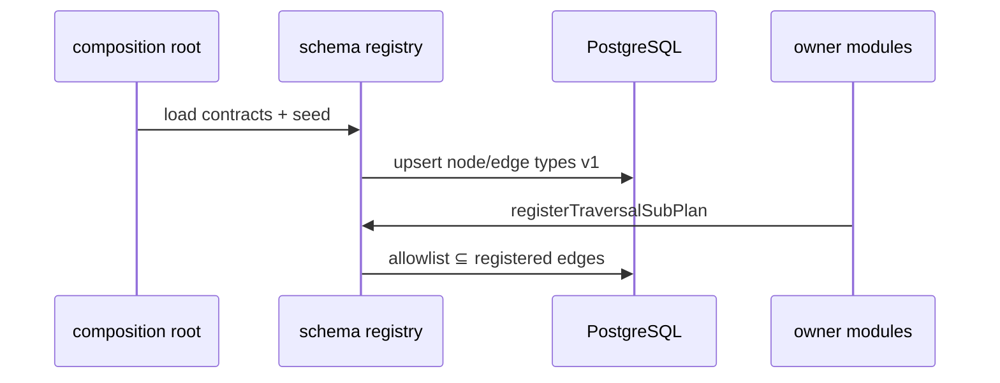

# R03 — Esboço de domínio: `modules/graph`

**Rodada:** R3 · 2026-09-11 · ANX-389  
**Callers:** [R02-boundaries.md](./R02-boundaries.md) · [R04-contracts.md](./R04-contracts.md) · [ROUNDS.md](./ROUNDS.md)  
**Histórico:** [schema registry](../../structure-debate/graph/R03-schema-registry.md)

## Objetivo

Fechar agregados **operacionais** (não ledger), classificação T01–T20, ports e invariantes. Registry híbrido: contracts + PG + runtime fail-fast. `User` no Neo4j ≠ `Principal` em identity PG.

## Agregados operacionais

| Agregado | Papel | Storage |
| --- | --- | --- |
| TraversalCatalogEntry | `traversalId`, `queryVersion`, classe kernel_puro\|composto\|híbrido | PG `graph_traversal_catalog` |
| SchemaRegistryEntry | `nodeType`/`edgeType` + `schemaVersion` + `ownerDomain` | PG `graph_schema_*` |
| ProjectionInboxRecord | `(eventId, consumerName)`, checkpoint, generation | PG `graph_projection_inbox` |
| RebuildJob | ordem `ownerDomain`, cutoff, alias Neo4j | PG `graph_rebuild_jobs` |
| ProjectionDlqRecord | poison + `payload_ref` redacted | PG `graph_projection_dlq` |
| GraphNode / GraphEdge projetados | marcadores eventId/checkpoint/ownerDomain | Neo4j adapter |

## Classificação T01–T20 (v1)

| Classe | Traversals |
| --- | --- |
| Kernel puro | T01 T02 T03 T05 T06 T09 T10 T11 T12 T13 T14 T15 T19 |
| Kernel composto | T04 T07 T17 |
| Híbrido registrado | T08 T16 T18 T20 |

Sub-planos (capital/portfolios/strategies/connections/execution) registram **edge allowlist** no bootstrap — não tipos novos sem ADR. Sem hot-reload v1.

## Ports

TraversalCatalog · ProjectionInbox · Neo4jProjectionPort · RebuildScheduler · GraphQueryDispatcher · GraphReadCache.

## Invariantes

| ID | Regra |
| --- | --- |
| INV-GRP-01 | T01 ALLOW mutável (`intentHash` ativo) **nunca** cacheado |
| INV-GRP-02 | Inbox idempotente `(eventId, consumerName)` |
| INV-GRP-03 | Rebuild **não** escreve PG dos donos |
| INV-GRP-04 | Tipos SECRET só `objectRef`/`credentialRefId` — sem payload |
| INV-GRP-05 | Um escritor por agregado via `ownerDomain` no evento |
| INV-GRP-06 | Membership E009 aponta para `User` projetado, não Principal PG |

## Non-goals

Ledger de grants/capital/ordens; Cypher string no client; D-GOV-010; spec `accepted`.

## Saída R3

Para [R04](./R04-contracts.md).
