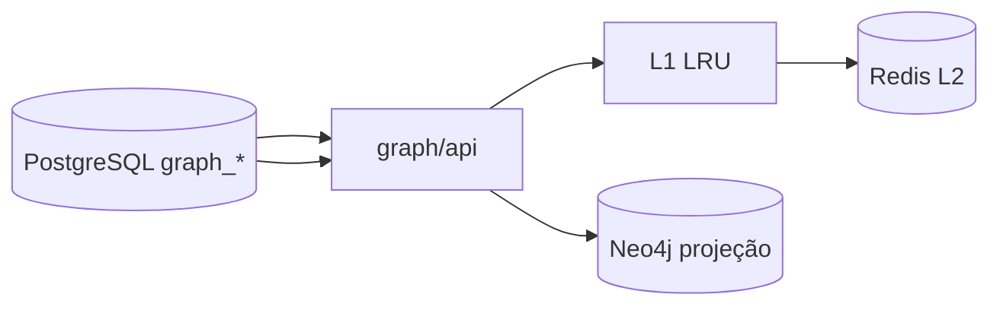

# R05 — Armazenamento: `modules/graph`

**Rodada:** R5 · 2026-09-11 · ANX-389  
**Callers:** [R04-contracts.md](./R04-contracts.md) · [R06-dependencies.md](./R06-dependencies.md) · [ROUNDS.md](./ROUNDS.md)  
**Histórico:** [cache/projection](../../structure-debate/graph/R05-cache-projection.md)  
**ADR0004:** Neo4j = kernel de grafo; PostgreSQL = catálogo Txx, inbox, rebuild, DLQ. **Não** Timescale. **Não** pgvector neste módulo (embeddings em knowledge). ST08 0/23. **Sem migration neste pack.**

## Ownership de stores

| Store | Uso | Não uso |
| --- | --- | --- |
| PostgreSQL `graph_*` | catálogo, inbox, DLQ, rebuild jobs, command journal admin, epochs de cache | ledger de grants/capital/ordens |
| Neo4j | nós/arestas projetados + marcadores | tokens, secrets, saldos |
| Redis L2 (opcional deploy) | cache de leitura epoch-aware | autoridade |
| SQLite | **proibido** para T01/grants/grafo institucional | — |

Sem FK para `organizations_*` / `governance_*` / demais donos.

## Cache (leitura, não autoridade)

Chave: `graph:cache:v1:{traversalId}:{scopeHash}:{queryHash}:ae:{authorityEpoch}:re:{riskEpoch}:cg:{catalogGeneration}`.  
T01 ALLOW + `intentHash` → **nunca** cacheável. DENY / REQUIRE_APPROVAL → TTL ≤60s. Invalidação: bump de epoch + pub/sub `graph:invalidate` pós-inbox ack.

Dev pode `GRAPH_CACHE_MODE=local-only` (L1). Multi-réplica: L2 Redis.

## Rebuild

Flush cache via `registry_generation++`. Ordem de replay: identity → organizations → governance → risk → connections → demais alfabético. Rebuild **não** escreve PG dos donos.

## Oráculos

G3-GRP-04: após revogação, chave T01 inclui novo `authorityEpoch` (ALLOW stale impossível).  
G5-GRP-03: SQLite ausente em path T01.  
AR05: projector reconstrói grafo a partir do journal.

## Non-goals

Driver Neo4j em outros módulos; Timescale de métricas (performance); ST08 stamp; spec `accepted`.

## Saída R5

Para [R06](./R06-dependencies.md).
