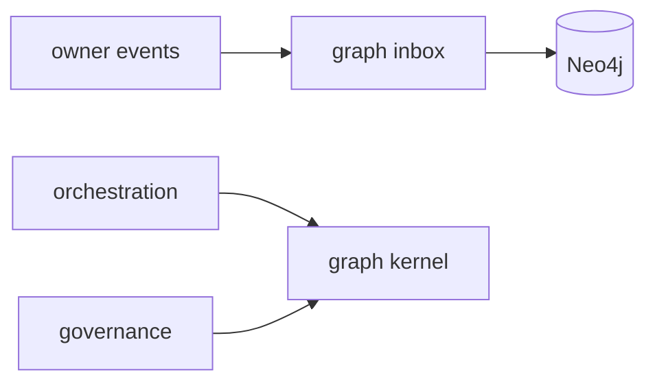

# R06 — Dependências: `modules/graph`

**Rodada:** R6  
**Data:** 2026-09-11

Upstream: eventing (inbox), contracts (GraphQuery, T01 types), secrets (adapter only), observability.

Downstream: todos os 22 outros módulos consomem `/v1/graph` ou SDK; **nunca** driver.

Sub-planos registrados no bootstrap por capital/portfolios/strategies/connections/execution — interfaces públicas, não infra.

Imports proibidos: neo4j-driver fora do adapter; repositories de donos; Cypher de apps/api.

## Saída R6

Para R7.
