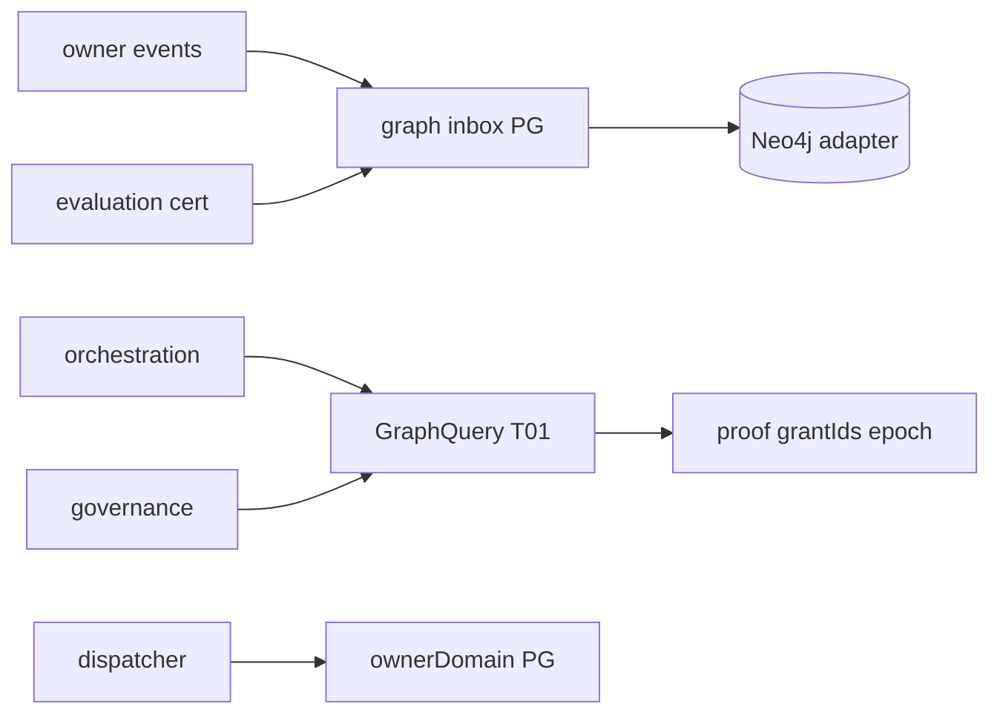

# R06 — Dependencias: `modules/graph`

**Rodada:** R6 · 2026-09-11 · pack ANX-389 · historico ANX-41/ANX-43  
**Callers:** [R05-storage.md](./R05-storage.md) · [R07-risks.md](./R07-risks.md).  
**Fonte:** `brain/notes/anxionos-backend-structure.md` · ADR0002 regras 1-12 · AR01/AR04.

**KEEP adapter-gateway** se já exportado. Pack ANX-389 — não `done`.

## In / Out (R6)

**In:** inbox de eventos dos 22 donos. **Out:** GraphQuery. Journal **não** muda de owner.

## Non-goals

Não spec `accepted`. Não ST08 live. Não ANX-389 `done`.

## Ownership

| Superfície | Dono |
| --- | --- |
| Inbox / dispatcher | **graph** |
| adapter-gateway | **KEEP** |
| Journal | **módulo dono** |

## In scope (este modulo)

| Direcao | Artefato | Contrato |
| --- | --- | --- |
| In | eventing inbox | eventos dos 22 donos; journal **nao muda de owner** |
| In | `@anxionos/contracts` | GraphQuery, T01-T20 types, proof envelope |
| In | secrets adapter | credencial Neo4j **so** no adapter graph |
| In | observability | traces de query/rebuild |
| Out | `/v1/graph` + SDK | os outros 22 consomem **somente** isto |
| Out | dispatcher | `node.create`/`node.update` roteia ao `ownerDomain` PG |

Sub-planos de projecao (interfaces publicas, nao infra): capital, portfolios, strategies, connections, execution, organizations, governance, agents, evaluation (`graph:evaluation:v1`), simulation (subgrafo isolado), operations, performance, audit, orchestration.

## Out of scope / imports proibidos

| Import | Motivo |
| --- | --- |
| `neo4j-driver` fora do adapter | AR04; apps/api e outros modulos **proibido** |
| Repositorios / schema Drizzle de donos | ADR0002 |
| Cypher em `apps/api` | so GraphQuery |
| pgvector | `knowledge` |
| Grants writer | `governance` |
| D-GOV-010 PolicyVersion | `risk` P06 |

## Non-goals

Grafo stale **nunca** ALLOW (T01). SQLite **proibido** para T01. Pack documental ≠ DEV_READY do codigo Parcial existente. Sem pasta `approvals/`.

## Oraculos G3 / G5

| ID | Gate | Esperado |
| --- | --- | --- |
| G3-GRP-01 | G3 | boundaries: `neo4j-driver` so em graph/infrastructure |
| G3-GRP-02 | G3 | replay inbox nao duplica aresta (eventId checkpoint) |
| G3-GRP-03 | G3 | dispatcher nao persiste StrategyVersion |
| G5-GRP-01 | G5 | T01 DENY se grant revogado apos leitura stale |
| G5-GRP-02 | G5 | agente institucional sem credencial Neo4j |
| G5-GRP-03 | G5 | Cypher string em HTTP body recusado |

## Saida R6

Mapa v1 para [R07](./R07-risks.md).
